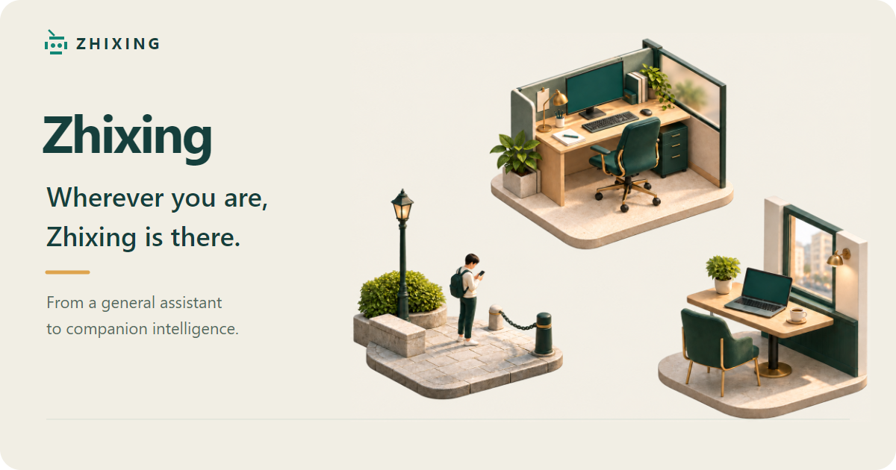

<picture>
  <source media="(prefers-reduced-motion: reduce)" srcset="assets/brand/readme-hero.en-static.png">
  
</picture>

  <a href="#getting-started">Get started</a> · <a href="docs/README.md">Docs</a> · <a href="docs/philosophy.md">Philosophy</a> · <a href="research/design/architecture/overview.md">Architecture</a> ｜ <a href="README.md">简体中文</a>

**Zhixing** is a self-hosted, general-purpose personal AI agent for life and work, evolving toward **companion intelligence** that works across your devices and stays with you wherever you go.

Zhixing can run on a single device or coordinate devices in different locations, executing tasks where the required files and tools are available. Interact through the terminal or connected messaging channels, and extend its capabilities with skills and external tools.

## Demo

To be added: a demonstration of real use and results. The illustration above presents the companion-intelligence vision, not the product interface.

## Getting started

> [!IMPORTANT]
> **The first public version has not been released.** The installable package, installation instructions and first-use guide will be added when it is published.

See the [release notes](docs/delivery/releases/0.1.0.md) for current capabilities and requirements.

## Privacy and security

Conversations and runtime state live on your devices; configured model providers and external services may still receive task data and incur charges. Zhixing can change files and run commands; permission controls are not an OS-level sandbox. See the [security policy](SECURITY.md).

A private vulnerability reporting channel has yet to be established. Do not disclose vulnerability details or sensitive information in public issues.

## Feedback and contributions

[Issues and suggestions](https://github.com/Tandem-Agents/zhixing/issues) · [Development and contributing](CONTRIBUTING.md) · [Code of conduct](CODE_OF_CONDUCT.md)

---

  Understanding informs action. Action deepens understanding. 
  <a href="LICENSE">MIT License</a> · <a href="assets/brand/readme-hero.en-static.png">Static image</a>

