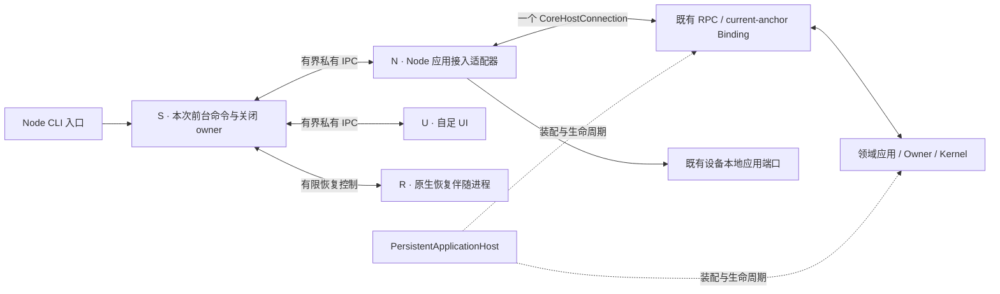

# 终端架构迁移

> 状态：产品合同已锁定，U0 有限采用已通过，完整 U1 生产迁移已放行并在实施；U1 交付验收、整个模块完成及 U4 默认切换/发行尚未完成。2026-10-04；现状基线 b9db3145。本文承接[迁移工作方案](terminal-architecture-migration-collaboration.md)，第三部分为稳定核心设计入口；当前阶段状态以本行及第三部分为准。

## 一、需求梳理

### 1. 目标与交付边界

终端是知行的一个接入面。用户应能完整使用原有功能、页面和输入方式，在长对话中可靠阅读、编辑、选择、确认与往返；调整窗口大小后历史仍能按新尺寸阅读，滚轮、右键粘贴和选择复制可以共存。新底座须证明实质改善，并达到工作方案规定的 OpenCode 架构质量目标。

业务事实、运行提交、权限和持久化的归属遵循[核心架构概述](../../research/design/architecture/overview.md)。关闭、重建或替换终端不能改变飞书、后台任务及同一会话的产品含义；终端不建立第二套业务权威。

当前范围包括全部既有功能与页面迁移、明确故障和旧底座债务清理、完成这些目标所必需的底座。独立管理命令也要保持入口、交互和错误语义，但不要求把它们改成 REPL 新页面。未来客户端、竞品点击功能、通用插件/选择工具、额外费用系统等不自动进入本次。

既有视觉与交互成果默认保留。旧实现不是全部需求：清回卷代替重排、缩放使流式输出消失、为了右键粘贴使滚轮失效，均不能固化为新产品合同。

### 2. 有效需求清单

下列编号与本轮覆盖清单一致。编号是迁移核对单位，不强制技术模块或实现单元一一对应。

| 需求 | 稳定合同 | 权威依据 |
|---|---|---|
| R01–R04 启动、首配、恢复、连接 | 首配由程序完成，缺必填才阻塞，可选项不挡使用；启动和连接失败可理解，必要时只读回看与重试；恢复实际可用对话，能力受限先知情；历史/摘要展示不额外调模型，重绘/重连不重发任务；已有领域恢复遵循权威生命周期 | [引导](../modules/secrets/onboarding.md)、[CLI 架构](../modules/cli/architecture.md)、[持久化](../modules/conversation/persistence.md) |
| R05–R07 对话管理 | 新建、命名、切换、最近历史、清空和删除保持各自语义；失败不假成功、同名不误选；清空后恢复不带回旧历史 | [持久化](../modules/conversation/persistence.md)、[命令](../modules/cli/command-system.md) |
| R08–R09 工作场景 | 选择/创建/改名/删除、辅助创建的补充与确认、失败后固定名称输入、主对话往返完整；不新增场景内直接跨场景切换 | [命令](../modules/cli/command-system.md)、[补全](../modules/cli/input-completion.md) |
| R10–R14 草稿、粘贴与材料 | 中文混排、光标、换行呈现、可恢复输入历史；完整粘贴和原子编辑；文件/图片按明确用户意图采集，提交保序保真；按下文六种结果处理草稿和反馈，不静默丢件或假称接纳 | [输入视觉](../modules/cli/input-visual.md)、[文本粘贴](../modules/cli/text-paste.md)、[材料输入](../modules/cli/material-input.md) |
| R15 鼠标共存 | 同一会话能滚轮回看、右键粘贴、选择复制；不把转义序列输入正文；粘贴未完成时 Enter 不得抢先提交 | 工作方案、[补全](../modules/cli/input-completion.md) |
| R16–R20 发现、候选与交接 | 命令帮助/补全/执行同源，保留名称/别名/前缀优先级；接受候选与执行区别明确；文件补全、候选管理与迟到结果正确；切页后草稿、光标和当前键盘消费者正确；常用频度排序不进入本次交付 | [命令](../modules/cli/command-system.md)、[补全](../modules/cli/input-completion.md) |
| R21–R25 全配置旅程 | 首次/再次配置、模型/角色/自定义模型/思考控制、受管通道、MCP 全接入链；保存、取消、已接纳待恢复、应用成功/失败明确；秘密仅专用输入，不进对话或普通日志 | [引导](../modules/secrets/onboarding.md)、[运行配置](../modules/configuration/runtime-application.md) |
| R26–R27 技能 | 列表、置顶、禁用、模式、归档及动态技能命令完整；成功后刷新，错误可恢复；退出不撤销已提交管理动作 | [命令](../modules/cli/command-system.md)、生产 [技能入口](../../packages/cli/src/skills/manager-command.ts) |
| R28 正文和过程反馈 | Markdown、代码、列表/表格、思考、工具/副作用、失败/重试/整理/完成均可读；补通有界编辑差异、子任务进度/终态、必要诊断与既有用量；流式无丢段、重复或通知覆盖 | [Markdown](../modules/cli/markdown-rendering.md)、[编辑差异](../modules/cli/edit-diff.md)、[子任务](../modules/cli/subagents.md)、[视觉语言](../modules/cli/visual-language.md) |
| R29–R31 权限、信任与选择 | 权限面只提供真实可用选项；context/global 持久授权保持身份、范围及撤销，runtime session 不延寿，once 不变持久；附言/理由可理解，取消不变默认允许；信任管理准确；选择支持详情、输入、二次确认及小屏保状态 | [信任管理](../modules/security/trust.md)、[确认](../modules/confirmation/surfaces.md)、[选择](../modules/cli/selection.md) |
| R32–R33 推进及不确定结果 | 准则查看、修改、确认、直接执行、永久取消及待确认恢复完整；自动续推来源明确；不确定运行先说明既有效果和重试风险，按用户选择处理 | [选择](../modules/cli/selection.md)、生产 [推进确认](../../packages/cli/src/runtime/advancement-contract-selection.ts)、[结果处理](../../packages/cli/src/commands/info-commands.ts) |
| R34–R36 任务、用量与通知 | 当前任务清单与定时任务不混淆；运行状态、估算、实耗、cache、压缩按真实口径呈现；当前/其他会话输入、发布与推进通知不串身份 | [用量](../modules/cli/usage-display.md)、[命令](../modules/cli/command-system.md) |
| R37 历史重排 | 已可回看的显示历史在窗口变宽、变窄、变高、变低后仍可找到并重排；正在生成的内容继续显示，草稿与交互状态保持；不能用磁盘仍保存替代屏幕历史可读 | 工作方案、[屏幕](../modules/cli/screen-rendering.md) |
| R38 中断、退出、停止 | 中止当前运行、退出场景、退出终端、停止服务含义不同；既有作用和确认保持，完成或失败后终端可继续使用 | [选择](../modules/cli/selection.md)、生产 [中断](../../packages/cli/src/interrupt/keyboard-source.ts) |
| R39–R43 独立命令与降级 | 配对、值班迁移、设备移除、备份/恢复根的输入和确认不遗漏；日志、工作区、维护、帮助/版本、隐藏服务入口保持；不支持交互时明确结果和退出码 | 生产 [完整命令树](../../packages/cli/src/index.ts)、[引导](../modules/secrets/onboarding.md) |
| R44–R45 视觉、响应与核心边界 | 保留品牌、输入/候选/历史层级和中文可读性；M1 十帧动画每帧 300ms，消息/工具静态起首标记统一菱形、颜色区分、文字表义；固定区稳定；启动、响应与长对话资源无无依据退步；显示重建不改变业务事实 | [视觉语言](../modules/cli/visual-language.md)、核心架构概述、工作方案 |

### 3. 现状差异与本轮范围裁定

已核实的必修底座差异包括：缩放清除视口和回卷且只重画欢迎；活动输出段在重建后失效；开启终端鼠标上报却只消费右键；配置输入长内容未达到共同输入布局要求。页面的长内容、缩放、异常退出及返回输入必须逐项验证，不能以某处存在通用视口或选择状态机代替。

`/stop` 的“取消工作并停止”未声明既定二次确认，需补齐原合同。`beginUserTurn` 正常返回时统一提交回显，混淆了已接纳、首次待确认、生成失败、已提交取消和继续等待旧草案；须按第二部分的六种结果修正，不能用本地历史中有文字证明核心已保存，也不能把已接纳结果回滚成未发送。

SCOPE-02 / 1 已作如下范围裁定，本稿吸收后仍待独立复验：

- **D08 纳入必要展示。** 常规 RPC 生产链尚未完整接通有界编辑差异、子任务进度/终态与必要诊断，属于既有展示义务的接入缺口；连同必要依赖交付。默认跨面过滤、模型/历史隔离和结果身份保持，不新增差异浏览器、完整子输出，也不默认向所有 Surface 广播 presentation。
- **D09 保留未来目标，本次不交付。** 常用频度排序从未在生产接受/执行链闭合，不称回归或已完成；保留原文档的有界衰减目标与未实现事实。本次保留名称/别名/前缀优先级、候选选择与执行可达性，不新增计分或持久化。
- **D10 按安全合同限定。** context/global 持久规则在实际换代后保持身份、作用域与撤销语义；兼容入口的 runtime session 仍随运行实例结束，once 不因换代变持久，恢复对话不恢复运行时授权。常规确认面不生成 allow-session；终端只展示真实请求，不从历史或显示快照重建授权。无变更/仅通道局部应用不等于 Host 换代；本次不改变核心授权寿命，也不声称广义保留已满足。
- 完整累计账单、上下文构成分析及 `/cost` 未在当前入口实现；本次不自动新增。已有用量准确性仍是范围内义务。

真实 Windows Terminal 专用夹具已成功启动，但正式电脑工具尚不能定位该任务窗口；滚轮、右键、选区、IME、缩放与页面返回仍未验证。既有平台范围保持 Node ≥24、npm 全局使用、Windows x64、macOS x64/arm64、Linux x64/arm64（glibc 2.35）；具体终端验证组合与性能阈值须在实验前明确，不能据当前取证障碍缩减支持。

## 二、产品设计

### 1. 使用面和完整旅程

| 使用面 | 必须覆盖的内容及往返 |
|---|---|
| 启动与恢复 | 启动进度、错误、必要配置、能力限制确认、最近对话尾巴；失败只读面有空态、重试及退出；分别核对展示无额外模型调用与既有领域恢复正常接续 |
| 主对话与场景 | 当前身份/模型/工作目录、历史、持续输出、有界 diff、子任务进度/终态、状态、草稿和候选；新建/切换/清空/删除后身份一致；场景退出回主对话 |
| 配置主面 | 首次缺项、基础配置、MCP 专题；进入子页、逐层返回、完成、取消、校验失败、保存失败、应用结果和返回主输入 |
| 模型配置子页 | 服务商列表、服务商配置、字段输入、模型列表、自定义模型、思考配置、自定义预算；按模型能力提供选项 |
| 通道配置子页 | 动态受管通道、字段、启停、待配置/待应用/待收发验证；不能把“字段齐全”显示为真实连接已验证 |
| MCP 子页与加载态 | 服务详情、其他输入、候选选择、秘密逐项录入、连接验证，含预设与原任务继续接入；每步能取消、失败可改；启停/删除经完成保存 |
| 技能管理 | 空/长列表与四项管理动作，退出回主输入；变更立即提交，返回刷新动态命令 |
| 候选和临时文本 | 命令、参数、会话、场景、信任、文件目录；场景新建/改名/补充输入、确认和手工退化；取消后回原交互 |
| 权限面 | 依据真实请求显示允许范围、拒绝和附言/理由，说明持久授权影响；常规面不增加 session 选项；处理竞争/失效/断线，返回可继续输入 |
| 决策面 | 通用选择、补充输入、二次确认、详情；推进准则确认、修改、直接执行、取消；首次保存与继续等待旧草案分别反馈，生成失败保本次输入；运行结果待确认与停止服务 |
| 信息结果 | 帮助、状态、模型、任务、定时任务、用量、上下文、压缩、推进、信任、安全、日志；结果/错误呈现后回主输入 |
| 独立命令 | 配对邀请和恢复码、自启与值班选择，迁移/移除确认，备份恢复保密输入；保持 shell 命令结果和原有继续/取消路径 |

这些旅程包含正常完成、用户取消、空态、校验/操作失败和再次进入。范围核对必须从 [Commander](../../packages/cli/src/index.ts)、[REPL 注册](../../packages/cli/src/repl.ts)、[配置面板分派](../../packages/cli/src/config-editor/runner.ts) 和实际临时交互调用反查，不能只审主界面截图。

### 2. 视觉与输入合同

遵循[视觉语言](../modules/cli/visual-language.md)及[输入视觉](../modules/cli/input-visual.md)：保留青绿品牌、浮灵标识、圆角编辑框、独立候选框、点阵选中态、危险操作区别和历史用户消息灰底。框体表示编辑空间，候选纹理表示选中项，历史背景表示消息归属；提交后不堆编辑框，不带输入提示符污染复制内容。

保留用户指定的 **M1 交替滚·300ms（慢探一档）**：十帧 `◇ □ ◈ ▤ ◆ ▦ ◈ ▨ ◇ ▩`，每帧 300ms、三秒一轮，按时间取帧，额外重画不加速。消息/工具起首的静态标记统一菱形 `◆`，以颜色区分，现有文字、动作与后果说明承担语义辨识；不得以“状态不能只靠颜色”为由另造图标。当前消息锚为 `◆`，工具批次仍为 `⟡`、副作用为 `✎`，后两条实际路径需对齐，不能把它们写成已满足。该要求不扩到子 Agent 装饰、品牌、材料或候选符号。验收对照消息、普通工具批次、副作用结果及完成态，核对静态形状、文字可辨性和真实动画节奏。

中文优先、混排按可见列宽排版；动作、后果和按键有可见提示。常态信息克制，运行中反馈集中，重要失败和收场结果可找到。思考显示保持现有低噪声尾部语义，不要求恢复完整内部思考全文。

输入框随内容换行，光标位置与文字布局一致，外部状态更新不能推走光标。IME 尚未提交的组合文字由终端处理，必须在真实宿主验证候选窗位置与输入不丢字。不得因文档写“多行”就宣称现状有手动换行快捷键；本基线多行来源包括粘贴和软换行。

长文本粘贴输入态可折叠，提交还原原文和空白；已有文本占位符再次粘贴时替换为新原文，保留周围文字和材料 chip。材料 chip 只显示摘要，提交按图文原序读取；草稿和反馈按下表的实际结果处理。普通文本、日志和路径混排不得自动变成读文件请求。

| 输入结果 | 草稿与用户反馈合同 |
|---|---|
| T01 本地准备、材料读取或校验失败，尚未发送 | 保留可编辑草稿与材料，说明修正方法；不显示成功交付 |
| T02 执行已 accepted，或观测到匹配 turn 的执行 delta/complete | 可以结清输入；后续模型拒绝、失败或中断另行反馈，不能逆写为从未接纳；回显不表示任务完成 |
| T03 首次 awaiting，原任务已持久保存 | 可以清输入并明确“原任务已保存，等待确认”；不强制保留重复的未发送草稿，也不表示已经执行 |
| T04 contract-failed，生成原任务草案或新修订失败，早于本次提交 | 保留本次输入供修正重试；说明生成/修改失败。本地输入历史不等于核心保存，也不表示文字永久丢失；不能假称本次任务/修订已保存，旧推进按领域结果反馈 |
| T05 取消控制已提交 | 结清该取消输入并显示真实取消结果；不把已完成取消恢复成待发送任务，不暗示原任务仍待执行 |
| T06 keep-awaiting，只返回既有 session/draft | 明确“旧任务仍待确认，本次新输入未保存”；保留本次输入供编辑或明确放弃，不能按 T03 无说明地清掉 |

六种结果沿真实 `session.send → controller → REPL` 验证，不以同名 awaiting 或返回了 turnId 推断接纳。单纯 RPC 异常不证明未接纳，已观测执行不能抹掉；不据此新增通用可靠投递/重试框架。

候选选中与命令执行是两步语义，按当前命令声明决定是否提交。管理候选的 Enter 不得触发普通发送；删除准备态必须可取消；异步候选与剪贴板结果不能覆盖更晚的输入或落入别的页面。

### 3. 滚动、缩放和页面返回

主对话中状态与输入位置稳定，长历史可回看。窗口尺寸变化重排已可回看的内容，不清除历史来伪造适配成功；当前流式输出继续，历史/摘要展示与重绘不额外调模型，不因重画/重连重发任务、不把已提交内容写入第二份事实源。已有领域恢复仍按权威生命周期接续推进，验收区分调用目的与任务身份，不以 UI 规则阻止正常恢复。此要求不等于新增全量历史搜索、跨重启恢复完整终端画面或无限驻留全部消息。

滚轮、右键粘贴、选择复制必须在同一支持环境和同次会话一起验证，不能分别切模式后宣称共存。输入态、生成态、候选态、确认态、独占页面及返回后均需检查模式交接。必要的宿主手势约定要明确；不能依赖未说明的修饰键把故障判为已修复。具体模式与实现方式由架构负责。

长列表/说明必须有可达的查看与操作方式；选中项不能在屏外而用户无法定位。决策面必须让全部行动及关键后果可见；详情可在自己的区域回看。窗口过小无法安全操作时保留当前状态、提示恢复尺寸并允许取消，恢复后继续；不得裁掉选项仍接受确认。

打开配置、技能、确认和临时输入时，当前输入交接给该面。成功、返回、取消、错误、异步完成及缩放后，原页面的有效草稿/光标/选择与显示状态能正确恢复。同一按键只交给当前交互，退出归还终端模式与光标；不得以清空主画面为切页腾位置。

### 4. 保存、取消和控制含义

| 场景 | 用户动作的含义 |
|---|---|
| 清屏/缩放/换页 | 只改变显示；不清空或删除业务历史 |
| `/clear` | 请求会话清空读取边界；成功后更新显示，失败不假清空 |
| 对话/场景候选删除 | 双次 Ctrl+D 确认该候选；切项或改输入撤销准备，失败保留真实状态 |
| 配置主面取消或 Ctrl+C | 丢弃本次未提交编辑；不撤销进入前已完成的启动恢复/迁移 |
| 配置子面 Esc | 返回上一层；局部确认仍只是编辑态，最终“完成”才保存 |
| MCP 加载 Esc / Ctrl+C | 取消异步步骤回上层 / 取消编辑器；迟到结果不写回失效页面 |
| 技能管理 Esc | 退出管理器；已成功提交的置顶/禁用/模式/归档仍有效 |
| 权限 Esc / Ctrl+C | Esc 拒绝当前授权；Ctrl+C 走取消原因；不能套成一般面板“暂时收起” |
| 通用选择 Esc | 在输入/详情/二次确认层先返回选择；选择层取消。由业务解释结果，不默认同意 |
| 推进确认 Esc | 收起，任务保持待确认；显式“取消任务”经二次确认才永久取消；“直接执行”按普通任务执行 |
| 不确定运行结束/重试 | 结束不回滚既有效果；重新执行先接受重复风险 |
| 运行中 Esc / Ctrl+C | 请求停止当前工作；已发生动作不回滚；双 Ctrl+C 按现有退出协议收尾 |
| 空闲 Ctrl+C | 有后台推进任务时先请求停止任务，否则退出当前终端；不一概定义为停止服务 |
| `/exit`、`/quit` | 场景内回主对话，主对话中关闭终端；普通退出与后台服务生命周期分开 |
| `/stop` | 说明其他接入面、工作、待投递和定时影响；等待完成或明确取消工作再停；取消工作并停遵循既定二次确认 |
| 配对/设备/备份中取消 | 按领域实际已提交阶段解释；已完成安全步骤可继续，界面退出不虚称全回滚 |

保存、已耐久接纳待恢复、已生效与应用失败分别反馈。秘密输入、恢复包输入不进入普通历史、消息或日志。无法显示确认、应答失效或外部已处理时不得替用户选择允许。

### 5. 迁移验收关系与下一步

产品以完整旅程和上述需求交付；独立验收方从真实入口反查覆盖，总控确认范围并决定阶段推进。架构方在已接受产品合同内提出方案与对标，工程方按完整旅程交付，不因技术便利删页面、缩减交互或擅改视觉。

完整发现审查未发现整类入口遗漏；本轮统一修订 RV-01/02/03 并吸收 D08/09/10 裁定，仍需独立复验本稿、覆盖清单和配置授权表述是否一致。真实 Windows Terminal/ConPTY 的 GUI 定位与交互取证障碍仍需解决；实验前须明确既有支持范围内的终端组合、基准场景及性能阈值。本轮没有运行通过证据，不作产品锁定或样机放行。

最终用户证据须来自新构建产物的真实入口，涵盖首配、日常对话、长历史、全部页面往返、确认/取消/错误及独立管理输入；截图、纯状态机测试、模拟 ANSI 或 HTML 演示不能单独证明交付。完成范围内能力与必要证据后结束，不用未来新功能抬高结束门槛。

## 三、架构设计

### 1. 采用方案与责任

本节架构已通过设计审查及 U0 有限采用，总控已放行完整 U1 实施。采用对象为固定 OpenTUI 0.5.14 / Solid 1.9.12、自足 Bun 1.4.2、Node ≥24 入口及 S/N/U/R 责任；本次放行生产迁移，不代表 U1、整个模块或五平台发行已完成，后续仍按原分期合同验收。遵循[核心架构概述](../../research/design/architecture/overview.md)及 [AE-001](../../research/design/architecture/evolutions/AE-001-companion-intelligence.md)，终端不拥有第二套领域事实、授权或运行状态机。

采用路线为 **Node 应用接入 + 自足 OpenTUI/Solid UI + 有限原生恢复**。用户继续通过 Node ≥24、npm 全局安装和 `zz` / `zhixing` 使用产品，不需另装 Bun 或在运行时补下载依赖。两条 bin 保持同一 Node JS 入口及原生 npm shim；交互入口采用下述 S/N/U/R，纯帮助、版本、非交互文本和隐藏 `serve` 沿原分派，不创建交互实例。

| 责任 | 归属与边界 |
|---|---|
| 产品事实与执行 | 领域、Owner、Kernel 继续拥有接纳、推进、确认裁决、提交、持久历史、恢复和执行；不感知终端组件与光标 |
| Host | 既有唯一组合根管理拓扑、配置冻结、开放、排空、换代与关闭；UI 不再装配一个 Host |
| S：前台命令与关闭 | 持有本次命令寿命，直接创建、登记和收束 N/U/R；对全部自有终端写者和自有 helper 在执行前建立可跨创建者死亡的显式归属，并持有有限终止与恢复前实际退出证明。外部 MCP 临时探测按本节第 5 条的可控执行范围收束，不混同自有 helper 或独立服务。操作、私有数据及正常收尾仍归原 owner。S 管理实例资源与一次关闭，只转交有界消息，不读按键、不绘图、不解释领域动作、不持秘密或另连 Host。 |
| N：Node 应用接入 | 复用 connection、conversation controller、领域 facade 和 confirmation binding，承接本机引导、配置及材料准备；一个逻辑 Surface、一条连接，不写 ANSI、不开放任意 RPC/文件代理 |
| U：自足 UI | 活动期唯一输入与画面 owner，拥有渲染根、页面栈、焦点、草稿、显示投影、阅读锚点和选择；不加载秘密仓库、模型或业务存储，不从缓存恢复授权或触发业务 |
| R：原生恢复 | 在任何 N/U/helper 终端副作用前就绪，同一进程在内存持有有效基线及有限模式登记；只在授予的阶段切屏或最终恢复，不读 stdin、不渲染、不派生进程、不监督 S，也不成为后台服务 |

保留 Node 有实际依赖依据：[CoreHostConnection](../../packages/cli/src/runtime/core-host-connection.ts)承担 Host 发现、拉起与换代，[self-exec](../../packages/cli/src/serve/self-exec.ts)依赖 Node 与 JS 入口；无本机 Host 时，[current-anchor 接入](../../packages/cli/src/runtime/surface-core-host-link.ts)仍涉及本机身份、SecretStore 和 Mesh/bootstrap。首配及配置编辑还须在 Host 不可用时调用本机 owner。这些责任保留在 N；S 隔离命令等待与执行侧故障，R 隔离最终恢复与运行时退出反写，均不扩展核心职责。N 重入保持原 argv、cwd、必要环境及同一 JS 入口，内部角色不得泄漏到后续 `serve` 自重入。

代价是交互期 S/N/U/R 四个进程、消息转交和生命周期交接。包体、完整入口启动、CPU、内存、句柄和临时盘按整个前台树及实际 helper 计量，不为新角色增加预算。源码边界拟为：入口、Host、管理命令、S 与有限 Node 适配留在 `packages/cli`，独立构建 UI 位于 `packages/terminal-ui`，R 作为匹配平台的随包原生资产；共享 DTO 引用原领域/wire 类型，页面编辑状态由终端定义，不新建中央业务协议包或通用代理服务。

### 2. 应用接入与必要合同

| 通道 | 合同 |
|---|---|
| Query | 复用历史、状态、任务、推进、信任、技能等现有 facade；保留真实 conversation/run 身份，以视图代次过滤迟到显示。历史使用 `session.history`，不以模型上下文拼接界面历史 |
| Command | UI 传递用户动作和原 DTO，Node 调原应用入口，沿用 turnId/requestId 与既有幂等规则。未知结果保持未知，不由 IPC 自动重发写动作或另建可靠投递队列 |
| Event | 保留原 conversationId、turnId/runId、已有 seq/revision 与作用域，区分已提交事实和临时进展。只对实际可查事实做 Query 校正，不以重连抹去不可重读的展示缺口 |
| 本机能力 | 首配、配置、秘密专用录入、MCP、文件材料与剪贴板由 Node 适配既有端口；离线语义保持，current-anchor 不代理设备本地方法 |

私有 IPC 使用同包版本的子进程 JSON 通道，N↔S↔U 转交既有应用 DTO，S 不复制业务解释或另连 RPC；stdin/stdout/stderr 留给终端，不另开常驻监听服务。R 使用实例绑定、协议及实际进程身份校验的有限控制通道。版本/能力及恢复准入完成后才能开放相应终端副作用；操作集合固定，消息、队列与待请求按字节和数量有界，转交两段的在途副本共同计量，不能逐跳扩倍预算。正文按帧合并相邻同身份片段，大历史分页面/片段传输；合并不能跨运行或工具边界。接纳、确认、命令结果和终态使用独立预留额度，优先于有限正文片段。IPC 与缓存回执仅表示本地关联或保留能力，不代表领域接纳；关闭控制保有有限通路，不能被正文背压或失败观测阻断。跨运行时兼容、背压与关闭语义仍按支持组合验证，不静默增加 broker。

**输入结果。** D06 沿 Advancement 应用结果 → `session.send` wire → controller 明确传回“本次输入发生了什么”，尤其区分首次持久保存待确认与 keep-awaiting 旧草案，不能从同名 awaiting、旧 turnId 或 RPC 正常返回推断保存。UI 对一次提交保有冻结草稿引用：第二部分 T01/T04/T06 保留草稿及材料，T02/T03/T05 按真实结果结清；已匹配执行 delta/complete 确立的接纳不被晚到异常撤销，结清旧提交不清除后续新草稿。不新增输入交易领域或自动重发框架。

**必要展示。** D08 在既有连接/订阅上协商有限展示能力，由同一 Server 所有的组播投影按连接生成默认/增强 payload，并贯穿 current-anchor。不能只删除现有 presentation 剥离：默认 observer、模型结果、公共事件与持久 transcript 继续不含 presentation，不另建产物查询仓库。增强投影仅接纳有界 `file-diff`、`subagent` artifact，保留生成/展示上限，另限 wire 字节与诊断长度，超限明确截断。子任务进展只投父工具 ID、child 身份、标签、状态与时长；终态提供既有用量、工具摘要及必要诊断，不投完整子输出。按 conversation/run/tool/child 身份归并，不以子 run_end 结束父运行；旧端保持默认投影，能力不足不能假称 D08 已满足。

**配置与秘密。** 复用[唯一配置保存与应用链](../modules/configuration/runtime-application.md)：Node 持有编辑基线，UI 仅接收公开字段及秘密已配置/待填写状态；专用录入的新值只在当前编辑作用域传给 owner，取消或结束释放，不进普通草稿、日志或展示缓存，不整包传 `initialCredentials`。保存失败、已耐久接纳待恢复、已保存但应用失败、已生效分别反馈；无变化、通道局部刷新和 Host 换代仍走原分支，本地 turn 等待不替代 Host 对其他入口的 drain。D10 授权寿命由安全 owner 维持，恢复对话不恢复运行时授权；D09 不新增频度计分/持久化，保留统一命令声明及动态技能刷新。

### 3. 显示投影、历史与资源

显示保存结构化内容而非 ANSI 行。用户提交、正文、工具批次/差异、子任务、结果与通知各有稳定块身份；活动块持续更新后封口，通知使用自己的块。controller 负责运行关联与订阅，展示回调携带事件原始身份，不能异步读取“当前对话”补填来源；UI 不据临时片段裁决业务完成。

持久记录以 `conversationId + shardId + runIndex` 定位，有 runId 时同时保留；实时块沿实际 turn/run/tool 身份定位。只有取得权威对应关系才归并实时块与回读历史，不按文本去重，不给旧记录虚构全局身份。既有 final/status/assignment 沿各自协议校正；没有序号的 `session.delta` 不承诺任意断点重放，未完整临时块要等待真实终态/历史校正。

阅读锚点为“块 ID + 内容内位置”。离开底部后固定阅读位置并提示新输出，主动回底部才续跟随；resize 重算布局与测量，保留草稿、选区、页面位置和活动块。只挂载视口及有限缓冲，活动块另保活，超长单块也须分段；使用高度索引和占位不等于永久挂载全部组件。先重测锚点附近，冷块高度可丢弃后按需重测。

| 资源 | 保留与回收 |
|---|---|
| 可重读历史 | 沿 `session.history` 的 limit/before、hasMore 和 clear 边界分页，以页数及字节预算限制 LRU；访问定位索引也分页计量。释放正文副本后可回读，不缩成只剩固定条数的历史 |
| 布局与解析 | Markdown/parser、块高度、组件和宽度缓存均有界；内容/宽度变更使旧测量失效，不能随 resize 无限累积 |
| 不可重读展示 | 本次已展示的 D08 artifact、临时通知保留一份实例私有规范化缓存；内存有界，冷内容分页至本机临时文件，只存必要展示块，不存逐帧/逐事件日志或秘密，不供模型、授权或领域恢复使用 |
| 实例缓存 | N 提供本实例限定的读写/释放，UI 无任意路径接口，S 承担实例准入及退出治理；磁盘计量并限额，复用既有资源治理。清空/删除成功才释放相应块，正常退出删除，异常残留按实例身份清理，不误删其他终端 |
| 草稿与输入材料 | 沿原有限输入历史和引用保活；句柄/元数据可保留，材料提交时读取，不让 N/U 长期保存图片编码；页面关闭释放可取消工作，待请求和 IPC 队列有界 |

临时展示缓存用于同时满足历史重排和非持久 artifact 回看，不是第二事实库或跨重启完整画面恢复。重启只展示权威历史实际提供的内容，不伪造历史 diff。

#### 容量失败与恢复

**先取得可保留容量，后正常展示。** Node 按规范化批次的编码字节原子预留，UI 收到缓存接纳后才纳入正常历史；完整写页前保留内存副本，部分写不算成功。正文、有限在途、控制预留分别计量，包含索引及跨进程副本峰值。初始化预留错误横幅、一个容量缺口标记、有限请求/确认槽位和活动块收场记录；正文不能借用。开启活动块或发起新提交前先取得所需收场/结果槽位。

| 状态 | 行为 |
|---|---|
| 可展示 | 原子预留后接纳；在途写入占预算。剩余额度不足下一最大合法批次及元数据，或配额/写盘失败时，由缓存 owner 原子切为展示暂停，不等队列耗尽 |
| 展示暂停：内容 | 停止新正文接纳；已预留批次可完成，写盘失败保留已计量内存副本，不累加重试副本。未接纳的 diff、正文、子任务详情和临时通知不正常显示，部分写撤销；活动块保留最后前缀并标明后续不完整。请求关闭本面增强订阅，生效前及普通输出仍有界解码/排空，不转入无限队列 |
| 展示暂停：反馈与操作 | 一个预留标记聚合缺失类别/范围，计数饱和，未知范围直说未知。固定横幅说明既有内容保留、后续未收录、后台可能继续、差异/临时通知无法重查。可回看、resize、保留和编辑草稿、查状态、处理有效确认、中止或退出；新增展示承诺在发送前拒绝，保留草稿，已发送动作仍按真实结果结清 |
| 控制不可用 | 控制槽耗尽、消息超限或通道在有界期限内不可写，显式关闭本面接入；请求按原 owner 的不可用/失联规则处理，绝不默认允许。未知结果保持未知，已知接纳不回滚；保留只读画面、草稿及退出能力 |

controller 先消费真实接纳、匹配 delta/complete 的身份、确认和父/子终态，再处理正文展示。已登记活动/请求使用预留槽保存有限身份、状态与收场摘要，缺失详情明确标记；未收到终态不能把暂停当完成。状态查询在有界当前区域显示，控制记录历史化也须占正文预算；没有槽位的新活动不显示为已接管，无法完整呈现的确认不得盲选。

本面暂停不对领域加锁或等待缓存，不主动 abort/暂停任务，不把其他 Surface 纳入背压。每条消息受 wire 上限约束，排空只用固定工作缓冲；订阅停止失败也不能扩张内存。无法继续排空或传控制时走本面失联，后续领域治理仍由原 owner 决定，不新建展示服务、持久投递或通用重试系统。

用户重试展示时做一次受限检查：释放可重读冷页/解析缓存，磁盘恢复后将预留内存页落盘；闭合缺口和收场先纳入正常预算，再归还控制预留。存储探测、控制可用及恢复水位均满足后，查询实际可得事实并恢复新内容接纳/增强订阅。**旧缺口保留；恢复展示不等于补回缺失内容，不重发任务。** 不可重读保留内容已占满预算时，重试仍暂停；用户可保留窗口回看或按既有流程退出重开，重开只恢复权威历史。仅用户原本执行的清空/删除成功才按其业务含义释放历史，不后台清空、偷增预算或强迫删除业务数据。

正常长对话仍必须满足 R28/R37，不能靠低预算、频繁暂停或要求重开通过验收；合理资源预算无法满足锁定场景时须提交成本与范围冲突，不自行缩短保留范围。实现用小预算夹具强制覆盖：已显示块、活动前缀和预留在途页后超额持续到达，写入成功/磁盘满，迟到 accepted、父/子终态、有效确认与控制槽满，resize/回看、恢复/无空间可恢复及退出。验证内容、索引、队列有界，领域不等待缓存，缺口不被假称补回。

### 4. 输入、页面与模式所有权

U 内的唯一输入 owner 承接有限模式查询、早到输入和渲染根输入交接，不能同时开放第二条按键流。活动期 UI 根独占 stdin、raw 输入、resize 和画面输出；配置、技能、选择、秘密输入共享该根，只切页面/对话框，不自行切屏、创建 readline 或直接写终端。

模式所有权按阶段交接：R 先取得 native 基线；U 只查询当前必要模式原值，登记由 R 确认；R 成对执行结构性进入/离开备屏，并确认活动模式许可，S 才授予 U 渲染和已登记模式的启用权。底层构造、迟到能力应答、focus/resume、取消和 destroy 均服从同一约束，U 销毁释放资源但不承担最后恢复。鼠标 tracking、encoding 等互相影响的模式按组取得原值、恢复整组，不能只复原最后写入的一位；未知或矛盾应答不当默认值。必要模式无法取得恢复依据时在相应副作用前失败，无当前产品依赖的未知增强不启用，不以此降格核心交互。未拥有的标题、指针或光标形状不写默认重置，不引入任意模式/嵌套栈管理平台。

页面栈保存调用者、返回位置与非秘密编辑状态，主草稿不依赖页面组件存活。一次键盘输入只交当前顶层交互及其允许的全局动作；Esc/Ctrl+C 按第二部分各面语义解释。异步候选、材料/剪贴板读取、MCP 加载绑定页面代次和输入版本；已提交业务可完成，但迟到结果不能写回失效页面，返回只恢复仍有效的焦点。

候选与长列表使用有界视口，保持选中项可见和可达；重要后果/行动无法安全呈现时禁用确认、保留取消与尺寸恢复。输入、状态和正文参加一次布局，组件不直接写屏。材料沿用[现有采集、registry 与 prepare](../modules/cli/material-input.md)：Node 管意图识别、引用校验、图文原序和提交时重新读取/大小检查，UI 管原子句柄、草稿与保活引用。粘贴完成前不提交，折叠保原文与空白，历史句柄恢复不代表文件仍可读，不新增原生剪贴板图片或文档解析。

滚轮进入所在内容/页面视口，右键沿现有文字剪贴板入口；候选选区方案为组件文本选择及明确复制动作，宿主原生手势须公开说明。三项能力必须同宿主、同模式验证，复制不带框线/提示符、不吞停止动作，不能用未说明的修饰键掩盖失败。视觉、M1 节奏及静态标记沿第二部分移植，不由框架默认样式替代。

### 5. 生命周期与发行边界

**先建立恢复责任，再开放副作用。** S 先安装普通中断、错误及单一关闭责任，创建 R；R 检查自身控制处理、有效 console/buffer 句柄和恢复必需的模式、代码页、光标基线，在内存保留原值后发 ready。S 按本次实例及实际出生身份接纳，随后才创建 N/U 和可能触碰终端的 helper；不能提前启动 Bun，再用 renderer 尚未授权声称没有副作用。基线文件只是观测副本，不是恢复源。R 在准入前失败、取消或超时则不开放执行侧；准入后失去 R 即拒新并有限失败，不在污染后另建替代恢复器。

版本握手后，U 在唯一输入通道完成有界查询，S 安排模式登记、R 进入备屏、R 确认活动模式许可，最后向 U 授权。等待和计时先于命令安装；每段准入有绝对截止，模式登记至许可确认共用截止，中间进入回执不重置或提前取消计时。超时、断连、取消或 R 退出均进入同一关闭，迟到 ready/ACK/grant 不重开；是否退屏以 R 内存中的实际副作用阶段为准，不以 S 缺少回执推断未进入。业务反馈转结构化事件，日志沿原 Recorder，N/S 不争写活动屏幕。

**责任登记先于观测，失败立即封闭准入。** 取得子进程、句柄或异步资源即登记释放责任及实际退出/排空等待，不等整个工厂返回；回调先结算真实状态，再写日志或 phase。观测失败同步拒绝新创建、业务转交和授权，保留原非零结果，只进入一次有界关闭，不等异步 catch 才封闭，也不递归调用失败日志。关闭控制、原 R 的身份与恢复授权、已登记资源释放仍可执行；记录不了结果不能跳过清理或提前结束 S。所有异步边界复核生命周期代次，迟到资源立即释放，不再交付终端。

正常退出、断线与异常共用 S 的幂等关闭：停止新输入和本地异步工作，按原协议收尾并释放 U 的 renderer/监听及 N 的 adapter、observer、本地操作；S 收束 N/U 和全部自有 helper，确认实际退出和有限管道排空。需要调用运行时的资产释放也须在最终恢复前完成，随后再次确认该集合全部退出。明确未创建、已创建未绑定及已退出：绑定回执丢失不等于未创建，非终止 error 不等于退出，身份未知的保留计量。等待与终止绑定实际进程对象/出生身份，不凭可复用的裸 PID；默认 Job 约束不替代退出证据。平台可采用 S 显式拥有、禁止自有 helper 脱离的执行侧进程归属，覆盖直接根及自有创建闭包的实际后代；S、原 R 和独立 Host 不纳入该集合。必须封闭这些创建入口、结清迟到创建并以 OS 实际退出/集合清空证据和有限排空共同证明收束，不能以默认继承、完成通知、终止请求或绑定回执代替。正常与异常仍共用原关闭总期限。

**外部 MCP 临时探测沿既有 MCP 权威能力边界收束。** 本机配置 owner 保留候选、执行前确认、秘密、临时连接与取消责任，Host 不可用时仍可进行本机配置及具备实际条件的试连；成功只更新暂存，完成编辑才保存，不将 probe 转为正式 hub 连接。S 在外部命令执行前登记并直接持有根及本次可建立归属的执行组，保有不依赖 N 存活的取消/终止责任。外部命令不继承本面控制终端或 TTY 描述符；stdin/stdout/stderr 走原 owner 的有界私有通道，不原样转发到终端。所有创建先登记后放行，取消、页面失效、N 死亡及本面关闭后拒绝迟到创建和结果。

成功、失败和取消均须关闭临时连接；在原探测/关闭截止内依次执行正常释放、必要的终止与强制终止，并取得根的实际退出、可控组的实际观测及本产品通道关闭结果，不能只等待 SDK 返回或记录 kill 成功。原 owner 释放临时秘密引用及可清零缓冲；N 死亡时 S 仍结清物理对象。清理回执明确记录控制范围，不将根/组已收束扩大为任意后代全部退出。外部程序自行脱离可控范围不构成独立服务授权；已发现的残留、拒绝退出、超时或身份/结果不明按失败或未知处理，不虚报完整取消、秘密已全部清除或资源已全部释放。未被观测到的任意脱离后代不在普通应用可保证的全树证明内。漏登记、漏传取消、漏杀可控根/组、泄漏本产品通道或 TTY 权限仍是产品缺陷，不得援引外部程序例外。此边界不删减既有命令入口、离线配置或支持平台，不增加系统权限或常驻监督层。

**原 R 是最后恢复写者。** 只有本产品控制的旧终端写者及自有 helper 全部实际退出、外部 probe 不继承本面 TTY 的准入事实有效且所有输出转交通路已关闭、必要控制通道仍可用时，S 才授权同一 R 最终恢复；R 不因中断、失联或超时自行争写。R 按实际阶段退屏一次、恢复所拥有的模式并完成安全主屏交接，再恢复 native 代码页、光标及输出模式，输入模式最后；单项失败继续可执行余项并如实返回失败。R 结果消息不等于进程退出，S 等其实际退出和有限排空后才向 shell 返回真实退出码；此后不再触碰 TTY 或创建 helper，防止运行时退出反写覆盖恢复。准入和关闭沿既定预算，自有执行侧与外部 probe 可控范围的收束、资产释放、R 恢复/退出及排空共用关闭总期限，重复中断不续期；必要条件失效或期限耗尽时有限失败，不能虚报恢复或无限等待。

Windows 主屏交接以保全已有字符和属性、让 shell 后续提示符不覆盖内容为准，不要求恢复入场坐标。R 退屏后用固定小块读取当前主屏，按最后占用行和当前光标选择内容之后的干净行；短读、未知属性或失效尺寸不当空白，定位后复核。仅当底部确无新行时允许一次普通原生换行，临时输出模式随同恢复；resize 重算受同一关闭期限约束，部分写或失败也不能重复追加换行。未进入备屏的取消不退屏、不补偿挪光标；禁止清屏、批量空行、搬格重绘或以快照回放替代保全。正常退出无成功横幅，必要错误文字也不得覆盖旧内容；用户直接继续输入、回显和历史编辑，无需手工 reset。回卷按同宿主、同容量、同等普通输出的边界验收，不承诺无限容量。

Host 断线保留显示、草稿及可用本机页面，相关业务动作说明不可用；原连接负责重连，随后重新订阅、查询真实运行/确认/配置状态并刷新投影。不重发任务，不妨碍领域既有恢复；失效或已被其他面处理的确认不能继续授权。

N/U 异常、N 真实死亡或 IPC 断开只关闭本 Surface，不自动停独立 Host。S 直接持有 N/U，不能依赖会死亡的 N 转报 U 身份；独立 Host 沿原 detached/stdio 与 self-exec 边界存活，不能被本面“全树清理”纳入。独立 Host 的 OS 创建可经既有 self-exec 接缝委托 Job 外的 S 执行固定启动；原 Host owner 继续决定拓扑、消费启动结果并建立连接。该有限机制不开放通用 spawn 或私有数据代理；已独立启动的 Host 不随本面回收，未放行的迟到创建不能在关闭后继续执行。raw 按键只由 U/原 adapter 按第二部分裁决，中止工作、双 Ctrl+C 退出、场景 `/exit` 回主对话、终端退出和 `/stop` 仍各自解释；取消工作并停需既定二次确认，退出不虚称撤销已提交动作。cooked 中断由 S 与 R 的有限控制通知汇入同一次关闭，重复中断可加速执行侧收束，不直接杀 R 跳过恢复。

保持既定有限故障模型：普通支持动作、N/U 硬退和新组件可预期失败必须有限收束；不能承诺外部专门强杀唯一 S、最后恢复中的 R，或唯一恢复责任发生不可恢复的原生致命故障后仍完成恢复，也不递归增加守护者。若现有支持的用户终止动作实际会直接杀死唯一 S，须判候选不满足该合同，不能将动作改名为排除项。窗口关闭后本面自有进程及 helper 不遗留、不新开窗口或继续输出；外部 probe 按上述可控范围完成释放、终止及真实结果结算，不能将清理不完整写成成功。自有终端已恢复与外部操作清理失败可分别成立，不能相互替代；已消失宿主的恢复与存活 shell 的可用性分别取证。

随包的 UI、R、native、parser、worker、grammar 使用锁定的匹配版本，构建并验证实际调用；恢复接合限于必要的 UI 接入与 OpenTUI JS/native 边界修正，不修改 Bun 运行时或扩成通用恢复框架。不增加安装生命周期脚本，不改 npm shim，不运行时下载/编译；平台资产按固定映射解析，其他平台分别实现并验证同一职责合同，不能机械复制 Windows API。S 统一治理实例资产，N 仍提供本实例展示缓存端口；只向 UI 提供本实例能力，不改全局环境、不开放任意路径。创建目录、锁、临时文件等任何写入前，先核对受管根、祖先及目标的真实边界，拒绝越界和重解析点；使用与清理时保持该边界，不能先产生副作用再拒绝。

POSIX 身份校验删除在完整的受管命名空间排他责任内实现：本实例 N 的活跃名字操作完整串行；S 只在写者已退出且持有清理声明时回收；全部合法创建、替换、改名和删除，包括跨会话调用，遵循同一父目录修改互斥。先取得完整物理操作容量及所属业务锁，再取得有限命名空间锁；跨父目录按稳定身份排序，持有命名空间锁期间不等待业务锁、资源配额或跨进程回调。检查真实 child 的种类、链接及预期身份后，在该排他区内按固定 parent/name 删除；身份不符、排他前提不成立或未知对象均拒绝删除并保留占用。该机制不是内核 compare-and-unlink，不保证绕过受管 owner 直接修改内部名字的并发操作；该限制不豁免入场/已发现的越界、链接、替换或未知对象。旧日志保留 writer.lock 与原回收语义，不能只给 unlink 局部加锁、用单 helper 串行冒充跨会话互斥，或先隔离改名再核身份。在所有合法入口和调用方完整接合前，POSIX expectedIdentity 删除继续明确拒绝。

交互启动在同一跨进程互斥准入中完成失效实例回收、计量及新容量预留；存活、未知、失败残留与新预留共同计入实例数和总字节预算。实例清单记录有限身份、资产及占用，不含用户正文或秘密；未完成绑定沿实际进程证据结算，不能仅因缺少回执而永久占位。身份不明、PID 复用、访问拒绝或文件锁未释放时保护原物并继续计量，不误删、不跳过预算；清理和重试有界，按保留期限治理可确认失效的残留。容量不足在交付终端前拒绝启动，不进入 raw/alt screen、不无条件新建资产。硬退出无人清理时允许留待下次启动回收，帮助/版本等纯输出入口不启动写者；提取、回收及临时盘成本计入整套指标。

**完成回执必须对应实际完成。** 首屏就绪须同时具备输入接管和当前帧输出成功；输入/resize 回执关联本次动作与递增帧身份。已验原型采用同步输出，编码有效、全部写入及必要 flush 成功后才发布 rendered/frame；入队、固定延时、局部写成功或旧帧不能充当完成。该回执证明输出调用完成，不证明宿主已显示像素。恢复 API/模式读回成功也不能代替 R/S 实际退出及随后 shell 提示符、命令、历史编辑和内容保全结果。

Windows 原型的机制、受控成本及已完成的真实交互、退出恢复和产品自身回收证据，支持本阶段 U0 有限采用，UA-01 已关闭。UA6-START-01 的真实慢启动仍纳入 U1 完整入口工程与独立验收，原因未知，不称已修复，也不据此修改原预算或样本定义。当前用户 CMD/console host 与实际交互已对应，Windows Terminal 安装版本与 GUI 独立关联证据仍分别表述，不外推所有版本；生产应用接入、整机成本及其他支持组合仍按原阶段验收。

**进程退出、真实终端恢复、残留治理分别验收。** 正常退出、IPC 失联、只终止 U、N 执行侧退出/强杀及窗口关闭按实际目标身份分别取证；存活宿主须恢复输入回显、主/备屏、光标、鼠标与粘贴模式，并能继续正常使用。允许 OS、宿主或 shell 可靠承担恢复，但须同支持组合实证；缺少 JS 清理回调既不证明恢复失败，也不证明成功。已关闭宿主核对本面进程与资产结果；有界残留由产品自身治理，不能靠测试观察者代清理。上述结果不得相互替代或单独放行采用。

外部 MCP 另核取消/正常释放、根的实际退出、归属组的终止与有限观测、本产品通道/秘密引用释放、无继承 TTY 和迟到输出隔离；报告明确可控范围及失败/未知，不以根退出或组消失宣称任意脱离后代已清空。正常合作命令遗留本次可控进程、漏取消、失去交互、污染 shell 或要求用户手动 reset 均不通过。POSIX 身份删除另核全部合法名字变更的跨会话互斥、锁顺序、异常释放和未知对象保全；静态身份替换拒绝与并发排他是两项证据，不以其中一项替代另一项。

### 6. 迁移单元、退役与采用门槛

每个单元交付完整旅程的成功、取消、错误与返回路径；以第一、二部分的范围反查，不以文件搬迁量或单张截图结单。

| 单元与依赖 | 交付与旧路径退役 |
|---|---|
| U0 采用前证伪 | 最小制品与 IPC/终端交接、长内容重排、页面返回、同宿主鼠标/IME及整套成本取得证据；候选失败先归因，必要时再裁定其他路线，不并建两套完整产品 |
| U1 首次可用，依赖 U0 | npm/bin → 首配/解锁及完整配置/MCP → 连接或只读回看 → 含材料对话、必要权限/通用选择与 D06 结果 → 退出。新根不调用旧 ScreenController/readline/自管配置 alt screen；未迁移入口只在开发期整套切换，不嵌旧 renderer |
| U2 连续工作，依赖 U1 | 长历史/流式/resize、D08、权限/推进/不确定结果、任务/通知、场景往返、对话切换/清空/删除、断线与 Host 换代，以及容量故障闭合。退役旧输出活动段、手工清屏及专用确认按键流，保留可复用纯逻辑 |
| U3 管理入口，依赖 U1 | 技能/动态命令、信息/日志/维护及独立配对、恢复包、值班迁移、设备移除、备份恢复完整往返；只替换交互端口，保留参数、错误与退出码，不强制变成 REPL 页面。退役旧 tui runner、typeahead/legacy 分叉及交接补丁 |
| U4 发行，依赖 U2/U3 | 五目标制品、Node/npm 安装与运行时自足、真实终端及性能证据闭合；全量构建后从真实入口交付。默认路由一次切换，删除开发切换、旧底座依赖和退役开关，最终只有一个写屏/输入/模式所有者，保留真实非交互文本路径 |

设计审查通过不等于采用；当前 U0 有限采用已由总控裁定，完整 U1 已放行。既有有限证据按适用范围复用，以下门槛仍按原迁移单元分期执行，不外推为整个模块或五平台发行已通过：

- 采用前锁定正常支持宿主、长历史/超长块样本、性能阈值，以及正文/在途/控制/临时盘预算、消息上限和恢复水位；实测同时核对性能与容量失败语义，不编造生产数值。
- 验证固定 Node↔自足运行时 IPC、所有权交接、父/子失联、硬退出、资产提取残留与文件锁处理；包版本不兼容须明确失败，不能运行时补下载。
- 在同一真实宿主验证滚轮、右键、选择复制、IME、resize、流式、页面返回及退出恢复，离屏或模拟输入不能代替。
- D06 六结果、D08 默认/增强隔离及 current-anchor、确认失效、安全作用域、配置换代沿真实生产链取得证据。
- Windows x64、macOS x64/arm64、Linux x64/arm64（glibc 2.35）分别验证制品、npm 全局安装/卸载、必要资产实际调用与真实入口，并核对 Node 精确 24.0 下限；其他平台尚无证据时不得缩减支持或外推通过。

实验记录、审查证据与阶段进展由迁移工作方案管理；本节维护稳定核心设计，只在根本设计变化时修订。生产迁移和发行须取得对应阶段放行，必要证据完成后结束，不追加未来功能作为门槛。
