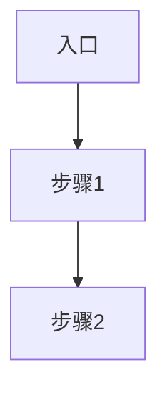

# [模块/组件名称] — 源码解析

> **所属系统**: OpenClaw / Claude Code | **分析状态**: 待分析/分析中/已完成

## 模块定位

[该模块在整体架构中的位置和职责，一两句话概括]

## 目录结构

```
src/xxx/
├── index.ts          # [说明]
├── ...
```

## 核心数据结构

[关键的类型定义、接口、数据模型]

## 核心流程

[用文字或 Mermaid 图描述主要流程]



## 关键设计模式

[该模块使用的设计模式及其意图]

## 外部依赖

[该模块依赖哪些其他模块，被哪些模块依赖]

## 值得关注的细节

[不容易注意到但重要的实现细节、边界情况处理、性能考量等]

## 引用此分析的认知问题

- [链接到 `insights/` 下引用了本分析的问题文件]
