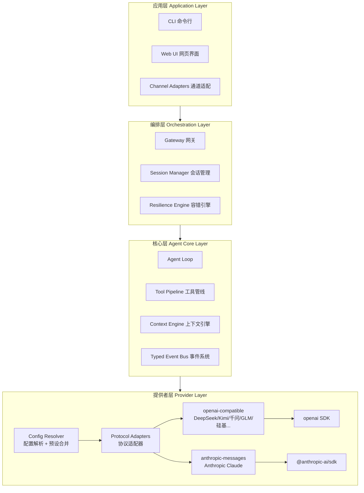

# 知行 — 架构概述

> 整体架构设计，随认知深化而持续演进

## 状态：v0.9 — 技能进化系统方案已确定（2026-04-10）

## 架构演进记录

| 版本 | 日期 | 变更说明 | 触发的认知研究 |
|------|------|---------|--------------|
| v0.9 | 2026-04-10 | 技能进化：四阶段生命周期（创生/使用/进化/治理）、反思提议（系统提示引导，零额外 LLM 成本）、使用追踪（useCount+effectiveness）、版本追踪（revisions）、内容安全扫描、Active→Stale→Archived 治理、/skills audit | [技能进化系统设计](../specifications/skills-evolution.md) |
| v0.8 | 2026-04-10 | 常驻服务：入站/调度/出站三层架构、Server/CLI 双模式、Scheduler（并发控制+优先级+Active Hours）、Delivery Pipeline（持久化+去重+免打扰）、Channel Adapter 统一接口、三级渐进 Daemon、消除 Heartbeat 依赖 | [常驻服务架构设计](../specifications/persistent-service.md) |
| v0.7 | 2026-04-08 | 容错引擎：指数退避、通用熔断器、错误分类、withRetry 包装器、可观测重试事件 | [容错引擎设计](../specifications/resilience-engine.md) |
| v0.6 | 2026-04-07 | CLI 架构：渐进式三阶段演进、单体+预留 Gateway、MVP 终端方案、系统提示策略、会话管理、命令体系 | [q06-CLI 架构](../../_private/questions/q06-cli-architecture.md) |
| v0.5 | 2026-04-07 | 工具系统：能力安全模型、隔离级别光谱、渐进信任、执行管线、协议/实现分离 | [q05-工具系统安全](../../_private/questions/q05-tool-system-security.md) |
| v0.4 | 2026-04-07 | 配置系统：多层配置加载、全局/项目/本地三级、首次自动生成 | [q04-配置系统](../../_private/questions/q04-config-system.md) |
| v0.3 | 2026-04-07 | Provider 层详细设计：Protocol 适配器、预设注册表、配置系统、API Key 管理 | [q03-Provider 架构](../../_private/questions/q03-provider-architecture.md) |
| v0.2 | 2026-04-06 | 确定 Agent Loop 模式、工具管线方案、上下文压缩策略；三个开放问题已决策 | [q02-Agent Loop 设计](../../_private/questions/q02-agent-loop-design.md) |
| v0.1 | 2026-04-06 | 确立产品定位、四层分层、技术栈、Monorepo 结构 | [q01-核心智能框架](../../_private/questions/q01-core-intelligence-framework.md) |

## 产品全貌

知行是一个**独立部署的智能体**，类似 OpenClaw。它不是一个传统意义上的"应用服务端"——它本身就是产品，对外暴露接口，各种客户端和通道连接到它。

```
┌───────────────────────────────────────────────────
│           知行 Agent（独立部署的智能体）
│
│  ├── 核心引擎（Agent Loop + 事件系统 + 工具管线）
│  ├── LLM 接入（连 Claude / GPT / DeepSeek 等）
│  ├── 内置工具（读写文件、执行命令、搜索等）
│  ├── 上下文引擎（对话压缩、记忆管理）
│  └── 网关（对外暴露 WebSocket / API 接口）
│
│  对外接口：WebSocket / HTTP API
└──┬────────┬────────┬────────┬────────┬────────┬───
   │        │        │        │        │        │
   │        │        │        │        │        │
 终端CLI    网页UI  手机App  微信Bot   钉钉Bot  其他系统
  我们的    我们的   我们的    第三方    第三方   第三方
  客户端    客户端   客户端    通道      通道    API调用
```

所有连接者（客户端和第三方通道）都在同一层级，都通过 WebSocket / API 直接连接智能体。区别只在于谁开发和维护：我们的客户端由我们开发，第三方通道由各自平台提供消息转发。

## 四层内部架构



### 各层职责

| 层 | 职责 | 对比 OpenClaw |
|----|------|-------------|
| **应用层** | 面向用户的入口：CLI、Web UI、通道适配 | OpenClaw 的 Channels + Clients |
| **编排层** | 网关路由、会话管理、容错（重试/Failover/熔断） | OpenClaw 的外层编排循环，我们将其解耦为独立层 |
| **核心层** | Agent Loop、工具管线、上下文引擎、事件系统 | OpenClaw 的 Pi Agent + Context Engine |
| **提供者层** | Protocol 适配器 + 预设注册表 + 配置解析，直连官方 SDK | OpenClaw 的 Api→Transport 分层，我们简化为 Protocol→SDK |

## 已确认的设计决策

以下是通过源码分析和竞品研究已经验证的决策：

| 决策 | 依据 | 状态 |
|------|------|------|
| 自研 Agent Loop，不用 LangGraph/LangChain | OpenClaw、Claude Code、Cursor 都选择自研 | 已确认 |
| 直连官方 LLM SDK（@anthropic-ai/sdk、openai） | 避免中间层延迟和 bug，业界最佳实践 | 已确认 |
| 内层推理循环 + 外层容错编排 分离 | OpenClaw 验证了双层关注点分离的必要性 | 已确认 |
| Typed Event Bus 作为可观测性基础设施 | OpenClaw/Claude Code 缺乏可观测性是已知痛点 | 已确认（已实现） |
| Monorepo 结构 | 见 [ADR-001](./decisions/001-monorepo-structure.md) | 已确认 |
| 按 Protocol 而非服务商组织 Provider 适配器 | OpenClaw 验证了协议-传输分层的有效性 | 已确认 |
| 内置预设注册表 + 用户配置覆盖 | 平衡零配置体验和完全可定制性 | 已确认 |
| Provider 架构 | 见 [ADR-002](./decisions/002-provider-architecture.md) | 已确认 |
| 能力安全模型（Capability-Based Security） | 比工具级 allow/deny 粒度更高，子 Agent 自动收窄 | 已确认 |
| 隔离级别光谱（6 级，trust→remote） | 工具代码与隔离无关，安全是外部包装 | 已确认 |
| 渐进式信任（per-operation, per-project） | 解决权限疲劳 vs 安全的矛盾 | 已确认 |
| 工具系统架构 | 见 [ADR-004](./decisions/004-tool-system-architecture.md) | 已确认 |
| 渐进式 CLI 架构（readline→Ink 三阶段） | OpenClaw pi-tui 闭源、Claude Code Fork Ink 工程量过大 | 已确认 |
| 单体 CLI + 预留 Gateway 接口 | 零依赖启动优先，EventBus 天然桥接 WebSocket | 已确认 |
| Commander.js 命令框架 | 两个顶级产品都选了它，行业标准 | 已确认 |
| 系统提示 static/dynamic 分离 | Claude Code 验证了 prompt cache 优化的价值 | 已确认 |
| 本地 JSONL 会话持久化 | 同 Claude Code，隐私好、离线可用 | 已确认 |
| CLI 架构 | 见 [ADR-005](./decisions/005-cli-architecture.md) | 已确认 |
| 容错通过 deps.callLLM 注入，不侵入 Agent Loop | OpenClaw/Claude Code 容错与循环深度耦合是维护噩梦 | 已确认 |
| 指数退避 + 抖动 + Retry-After | OpenClaw 无退避；Claude Code 不覆盖连接错误 | 已确认 |
| 通用 CircuitBreaker 原语 | 两者都硬编码限制，不可复用 | 已确认 |
| 连接错误（ECONNRESET 等）同等重试 | Claude Code #1 用户报告问题就是连接错误不重试 | 已确认 |
| 容错引擎架构 | 见 [容错引擎设计](../specifications/resilience-engine.md) | 已确认 |
| Server/CLI 双运行模式 | Server（独立部署 + 社交平台接入）与 CLI（终端交互）同等重要；共享同一 Agent 内核 | 已确认 |
| Server 入站/调度/出站三层分离 | 比 OpenClaw Gateway 单体更清晰，每层可独立测试和扩展 | 已确认 |
| 应用内 Scheduler（非 OS crontab） | Agent 环境感知 + 自然语言创建 + 跨平台一致性 + 高级错误处理 | 已确认 |
| 三级渐进 Daemon（前台→后台→OS 服务） | 降低门槛，每级独立有用；大部分用户停在 Level 1 | 已确认 |
| 简化的 schedule 工具（3+1 概念） | OpenClaw cron 工具 10+ 概念；知行 Task+Schedule+Action+可选 Priority | 已确认 |
| TaskAction 两种 + 可选 sessionId | agent-turn（默认独立 / 可选持续会话）+ system，覆盖 OpenClaw 4 种 sessionTarget | 已确认 |
| 不需要 Heartbeat 机制 | OpenClaw 心跳是架构产物；知行直接执行 + Active Hours + Delivery Pipeline 覆盖所有真实需求 | 已确认 |
| 独立 Delivery Pipeline | 持久化队列 + 去重 + Active Hours 过滤 + 重试；比 OpenClaw 分散投递更可靠 | 已确认 |
| Active Hours 双层过滤 | Scheduler 层（省 LLM 调用）+ Delivery 层（不打扰用户），urgent 可穿透 | 已确认 |
| Channel Adapter 独立包 | 统一接口 + 插件式加载，不污染核心包 | 已确认 |
| 常驻服务架构 | 见 [常驻服务架构设计](../specifications/persistent-service.md) | 已确认 |
| 技能反思提议而非后台静默创建 | Hermes 后台子 Agent 静默写入违反透明原则；知行通过系统提示引导在最终回复中提议，零额外 LLM 成本 | 已确认 |
| 技能使用追踪（useCount + effectiveness） | Hermes/OpenClaw/Claude Code 都不跟踪技能效果；数据驱动治理 vs 盲目累积 | 已确认 |
| 技能生命周期 Active→Stale→Archived | 无限累积降低信噪比；90 天未使用标记 stale，归档需用户确认 | 已确认 |
| 技能写入前安全扫描 | 记忆内容注入 system prompt，需防提示注入/数据外泄；声明式威胁模式 | 已确认 |
| Trigger 注入 + 领域索引优于三级渐进加载 | Trigger 被动精准注入 + 一行领域索引兜底，优于 Hermes 索引→全文→文件三级工具调用 | 已确认 |
| 技能进化系统 | 见 [技能进化系统设计](../specifications/skills-evolution.md) | 已确认 |

## 已决策的设计问题

以下问题通过深度源码分析（OpenClaw Pi-Agent-Core + Claude Code query.ts + Hermes run_agent.py）已做出决策。
详细分析见 [q02-Agent Loop 设计](../../_private/questions/q02-agent-loop-design.md)。

| 问题 | 决策 | 依据 |
|------|------|------|
| Agent Loop 采用什么模式？ | **AsyncGenerator + while(true) + 拆分辅助函数**<br>Claude Code 的设计原则 + Pi-Agent-Core 的代码组织 | Claude Code 验证了 AsyncGenerator 的背压和返回值优势；Pi 验证了核心循环只需 ~100 行；三者都否定了状态机 |
| 工具执行管线如何组织？ | **先直接函数调用，后续渐进添加中间件**<br>MVP 用简单的 for 循环 + 直接 call | Pi 用 beforeToolCall/afterToolCall 钩子已足够灵活；Claude Code 的 14 步管线是需求驱动的渐进结果 |
| 上下文压缩如何实现？ | **延后到 Phase 2，MVP 不实现**<br>循环预留压缩接入点即可 | Claude Code 的 250K API 调用事故说明过早实现压缩可能引入更大问题 |

## 多智能体支持

架构天然支持多智能体扩展，无需修改现有模块：

- **每个 Agent 是独立实例**：自己的循环 + 事件总线 + 工具管线 + 上下文
- **Agent 之间通过消息通信**，不共享 LLM 对话上下文（与 OpenClaw、Claude Code 一致）
- **未来新增模块**：AgentRegistry（管理生命周期）、AgentCoordinator（消息路由）
- **不需要重构**：现有模块都是实例级设计，不存在全局单例假设

## 技术栈

| 类别 | 选择 | 理由 |
|------|------|------|
| 语言 | TypeScript (ESM, strict) | 类型安全 + Node.js 生态 |
| 运行时 | Node.js 22+ | 最新 LTS，与 OpenClaw 对齐 |
| 包管理 | pnpm (workspace monorepo) | 见 [ADR-001](./decisions/001-monorepo-structure.md) |
| 测试 | Vitest | 快速，原生 ESM 支持 |
| 构建 | tsup | 轻量，基于 esbuild |
| LLM SDK | @anthropic-ai/sdk + openai | 直连官方 SDK，不走中间层 |
| Schema 验证 | Zod | 类型安全 + 运行时验证一体 |

## 提供者层详细设计（v0.3 新增）

> 详细调研见 [q03-Provider 架构](../../_private/questions/q03-provider-architecture.md)，决策依据见 [ADR-002](./decisions/002-provider-architecture.md)

### 核心概念

```
Protocol（协议）────→ 决定用哪个 SDK 适配器
   ↑
Provider（服务商）──→ baseUrl + apiKey + 使用哪个 Protocol
   ↑
Config（配置）────→ 用户声明要用哪些 Provider
```

### Protocol 适配器（只需两个）

| Protocol | 覆盖范围 | SDK |
|----------|---------|-----|
| `openai-compatible` | DeepSeek、MiniMax、Kimi、千问、GLM、硅基流动、OpenAI、OpenRouter 等 | `openai` |
| `anthropic-messages` | Anthropic Claude | `@anthropic-ai/sdk` |

### 预设注册表

内置常用服务商的默认配置。新增 OpenAI 兼容服务商只需加一条预设记录，零代码。

内置预设：deepseek、minimax、siliconflow、qwen、kimi、glm、anthropic、openai

### 用户配置

三种使用场景：

| 场景 | 用户需要写什么 |
|------|-------------|
| 用内置预设 | 只写 `apiKey` |
| 覆盖预设（代理/聚合平台） | 改 `baseUrl` + `apiKey` |
| 完全自定义 provider | 写 `baseUrl` + `protocol` + `apiKey` |

### API Key 管理

`apiKey` 字段支持三种格式：`"env:VAR_NAME"` / `"helper:command"` / 明文字符串

解析优先级：配置 apiKey → 预设 envKey 环境变量 → 报错提示

### Quirks 系统

同协议下不同服务商的行为差异（`max_tokens` 字段名、流式 usage 支持等），通过声明式 quirks 处理。预设中包含默认 quirks，自定义 provider 使用最保守的默认值。

## 配置系统详细设计（v0.4 新增）

> 详细调研见 [q04-配置系统](../../_private/questions/q04-config-system.md)，决策依据见 [ADR-003](./decisions/003-config-system.md)

### 设计灵感

- **借鉴 Claude Code**：项目共享 + 个人覆盖的分离；`/status` 配置来源追溯
- **借鉴 OpenClaw**：环境变量覆盖配置路径；`$include` 模块化（未来考虑）
- **超越两者**：自动生成全局配置模板；仅 3 层（vs OC 的 1 层 / CC 的 5 层）；项目配置放根目录可见

### 配置文件层级（3 层，优先级从高到低）

```
① 环境变量
   SILICONFLOW_API_KEY、ZHIXING_CONFIG_PATH 等
   ↓
② 项目级（可选）
   <project>/zhixing.config.json        ← 团队共享，可提交 Git
   <project>/.zhixing/config.local.json  ← 个人覆盖，自动 gitignore（未来）
   ↓
③ 用户全局
   ~/.zhixing/config.json               ← API Keys、默认 provider、个人偏好
```

### 合并规则

- 字段级 deep merge，不是文件级替换
- `providers` 对象按 key 合并
- 环境变量中的 API Key 优先级最高
- 缺失文件 = 跳过，不报错

### 配置文件内容

```jsonc
// ~/.zhixing/config.json
{
  "defaultProvider": "siliconflow",
  "defaultModel": "Pro/MiniMaxAI/MiniMax-M2.5",
  "providers": {
    "siliconflow": {
      "apiKey": "env:SILICONFLOW_API_KEY"
    }
  }
}
```

```jsonc
// <project>/zhixing.config.json（可选）
{
  "defaultModel": "deepseek-chat",
  "defaultProvider": "deepseek"
}
```

### 首次运行

1. 检测 `~/.zhixing/config.json` 是否存在
2. 不存在 → 自动创建带注释的模板文件
3. 检测是否有可用的 API Key（env 或 config）
4. 有 Key → 正常运行；无 Key → 提示用户配置

### 可移动性

`ZHIXING_CONFIG_PATH` 环境变量覆盖全局配置路径，适配容器/CI/自定义场景。

### 与 OpenClaw / Claude Code 的配置对比

| 维度 | OpenClaw | Claude Code | **知行** |
|------|----------|-------------|---------|
| 层级数 | 1 层 | 5 层（含企业托管） | **3 层**（够用不过度） |
| 项目级 | ✗ 无自动发现 | `.claude/` 隐藏目录 | ✓ `zhixing.config.json` 项目根可见 |
| 首次体验 | 需手动 setup | 需手动 /config | **自动生成模板** |
| Key 安全 | Auth Profile 复杂 | apiKeyHelper | `env:VAR` 引用，简洁安全 |
| 格式 | JSON5（可注释） | JSON（无注释） | JSON（MVP），未来考虑 JSONC |
| 可移动 | ✓ 环境变量 | ✗ 固定 | ✓ `ZHIXING_CONFIG_PATH` |
| 配置追溯 | ✗ | ✓ /status | 未来 `zhixing config show` |

## 工具系统详细设计（v0.5 新增）

> 详细方案见 [工具系统架构方案](../../_private/notes/tool-system-design.md)，决策依据见 [ADR-004](./decisions/004-tool-system-architecture.md)，前置研究见 [q05-工具系统安全](../../_private/questions/q05-tool-system-security.md)

### 设计灵感与超越

- **借鉴 Claude Code**：fail-closed 默认值、bypass-immune 保护区、结果大小管理
- **借鉴 OpenClaw**：容器隔离思路、工具分类管理、插件工具注册
- **超越两者**：能力授权取代工具授权、隔离光谱取代二选一、渐进信任取代静态模式

### 三个核心创新

#### 1. 能力安全模型（Capability-Based Security）

不问"能不能用 Bash"，问"有没有 `process.exec` 能力、范围是什么"。

```
工具声明需要: [process.exec:full, fs.read:./**]
运行时上下文:  [process.exec:safe, fs.read:./src/**]
判定: 工具可用，但能力被收窄 → 只能安全执行、只能读 ./src/
```

- 比 OpenClaw 的 allow/deny 粒度更高——同一工具在不同上下文获得不同权限
- 子 Agent 自动继承父级能力的子集，零配置
- Phase 2 实现。MVP 阶段直接执行，不做能力检查

#### 2. 隔离级别光谱

```
L0 trust     → 直接执行（开发调试）
L1 confirm   → 危险操作用户确认（默认）
L2 analyze   → 命令分析 + 确认
L3 process   → 进程级沙箱（seatbelt/bwrap）
L4 container → Docker 容器
L5 remote    → 远程执行环境
```

关键约束：**工具代码与隔离级别无关。** 隔离是执行管线的外部包装。OpenClaw 为每个工具单独实现沙箱版（`createSandboxedReadTool`）的做法被消除。

Phase 3 实现完整光谱。MVP 固定 L1。

#### 3. 渐进式信任

- 首次操作需确认，多次安全执行后同项目内自动批准
- 不同项目独立信任状态
- Bypass-immune 操作永远不自动批准（`.git/` 写入、项目外操作、特权命令）

Phase 2 实现。解决 Claude Code 的"频繁弹窗 vs YOLO auto"两难。

### 工具执行管线（5 阶段 15 步）

```
验证：工具查找 → 中止检查 → Schema 验证 → 语义验证
授权：能力检查 → 信任查询 → 用户确认
守卫：bypass-immune → 命令分析 → 资源限制
执行：环境选择 → tool.call()
处理：结果截断 → 信任更新 → 审计日志
```

渐进实现：
- Phase 1（MVP）：Schema 验证 + 直接执行 + 结果截断
- Phase 2：+ 能力检查 + bypass-immune + 确认
- Phase 3：+ 命令分析 + 隔离环境 + 审计

### 工具统一注册

四类工具统一注册到 `ToolRegistry`：

| 类别 | 来源 | 注册方式 |
|------|------|---------|
| 内置工具 | `@zhixing/tools-builtin` | 启动时自动注册 |
| 插件工具 | npm 包 / 本地文件 | 配置声明，启动时加载 |
| MCP 工具 | MCP 服务器 | `registerMcp()` 自动发现 |
| 动态工具 | Agent 运行时创建 | `register()` |

### 结果管理

从 Phase 1 开始：`perToolMaxChars`（默认 50,000）+ 截断提示。
Phase 2+：会话级聚合预算 + summarize/disk 溢出策略。

## CLI 架构详细设计（v0.6 新增）

> 详细调研见 [q06-CLI 架构](../../_private/questions/q06-cli-architecture.md)，决策依据见 [ADR-005](./decisions/005-cli-architecture.md)

### 设计灵感与超越

- **借鉴 Claude Code**：单体零依赖启动、JSONL 会话持久化、system prompt 缓存优化策略
- **借鉴 OpenClaw**：主题系统（深色/浅色自动检测）、工具执行三态视觉反馈
- **超越两者**：渐进式 UI 演进（不被框架锁定）、EventBus 驱动的实时可观测仪表盘、MVP 500 行以内

### 三阶段 UI 演进

| 阶段 | 技术方案 | 目标 |
|------|---------|------|
| Phase 1（MVP） | readline + chalk + marked-terminal + ora | 验证核心循环端到端可用 |
| Phase 2 | 引入 Ink（npm 原版） | 支持复杂布局、权限对话框、实时仪表盘 |
| Phase 3 | 渲染热路径优化（按需） | Claude Code 级别的渲染性能 |

### MVP 命令体系

```bash
zhixing                     # 交互模式（REPL）
zhixing -p "prompt"         # 单次模式
zhixing config              # 配置管理
```

REPL 斜杠命令（MVP 6 个）：/help, /clear, /model, /status, /config, /exit

### 系统提示策略

```
System Prompt（静态，跨用户可缓存）：
  → 角色定义 + 行为规范 + 安全约束

消息注入（动态，每次重建）：
  → 工作目录上下文
  → AGENTS.md / RULES 文件
  → 用户偏好
```

MVP 只实现静态 system prompt。动态注入 Phase 2。

### 差异化创新：EventBus 驱动的可观测性

利用 EventBus 一等公民地位，CLI 通过 `eventBus.onAny()` 实时显示：
- 模型 / Token 用量 / 轮次 / 耗时
- 工具执行状态和时长
- 上下文压缩触发情况（Phase 2）

这是 OpenClaw 和 Claude Code 都没有提供的用户可见可观测性。

### 与 OpenClaw / Claude Code 的 CLI 对比

| 维度 | OpenClaw | Claude Code | **知行** |
|------|----------|-------------|---------|
| 架构范式 | 客户端-网关分离 | 单体 CLI | **单体 + 预留 Gateway** |
| 终端 UI | pi-tui（闭源） | 深度 Fork Ink | **readline→Ink 渐进演进** |
| 命令框架 | Commander.js | Commander.js | Commander.js |
| 渲染复杂度 | 中等 | 极高（游戏引擎级） | **最小可用→按需演进** |
| 会话存储 | 服务端（Gateway） | 本地 JSONL | **本地 JSONL** |
| 系统提示 | Bootstrap 文件体系 | static/dynamic 分离 | **static/dynamic 分离** |
| 斜杠命令 | 23 个 | 100+ 个 | **6 个（MVP）→ 渐进扩展** |
| 运行时可观测 | 无 | 无 | **EventBus 实时状态** |
| MVP 代码量 | ~5000 行（TUI） | ~10000 行（REPL+渲染） | **~500 行** |

## 与 OpenClaw / Claude Code / Hermes 的已知差异

| 维度 | OpenClaw | Claude Code | Hermes | 知行 |
|------|----------|-------------|--------|------|
| 核心依赖 | Pi Agent 闭源包 | 闭源产品 | 开源（MIT） | 完全自研，100% 开源 |
| 可观测性 | 事件回调 | 内部遥测不开放 | 可选 callback | EventBus 一等公民（已实现） |
| Agent Loop | Pi 内层 ~350 行 + 外层 ~1400 行 | query() 生成器 ~1730 行 | run_conversation ~9200 行单文件 | AsyncGenerator + while(true)，核心 ~80 行 + 辅助函数 |
| 工具安全模型 | 工具级 allow/deny + 容器（可选） | 7 层权限 + ~7000 行 Bash AST | 命令审批 + 记忆安全扫描 | **能力授权** + 隔离光谱 + 渐进信任 |
| 工具隔离 | Docker or 裸奔 | seatbelt/bwrap or 无 | 6 种终端后端 | **6 级光谱**，逐级降级，全平台 |
| 权限疲劳 | 无确认机制 | 频繁弹窗 / YOLO auto | 命令审批 | **渐进信任**——越用越少问 |
| 上下文管理 | Context Engine + 压缩 | 4 层分层压缩 + 断路器 | ContextCompressor + 前缀缓存 | Token 估算 + 3 层压缩(L1/L2/L3)，已实现 |
| Provider 接入 | 复杂的 Api→Transport + Auth Profile | 只支持 Anthropic API | 18+ Provider + 3 种 API mode | Protocol 适配器 + 预设注册表 |
| 国内服务商 | 部分硬编码支持 | 不支持 | 18+ Provider 含国内 | 内置预设全覆盖 |
| 配置管理 | 散落多文件 + 生成代码 | 三个环境变量 | config.yaml + profile | JSON 配置 + 环境变量，3 层 deep merge |
| 容错位置 | 外层循环 1400 行中内联 | query.ts 1730 行中内联 | classify_api_error 内联 | **独立 resilience 模块**，通过 deps 注入 |
| 常驻架构 | Gateway 单体（~130 文件） | 无 | GatewayRunner 单体 | **入站/调度/出站三层分离**（<30 文件） |
| 定时任务创建 | cron 工具（10+ 参数概念） | 无 | cron 工具 | **schedule 工具**（3+1 概念） |
| 投递管线 | 分散多处、无持久化 | 无 | delivery.py 分散 | **独立 Delivery Pipeline**，持久化队列 |
| 通道适配 | Channel Plugin（紧耦合） | 无 | BasePlatformAdapter（18 平台） | **ChannelAdapter 独立接口**，插件式加载 |
| 运行模式 | 客户端-Gateway 分离 | 单次 CLI | CLI+Gateway+ACP | **Server/CLI 双模式**（独立部署 + 终端接入，同等重要） |
| **技能系统** | 静态 Skills 文件 | 无 | 自主进化（后台静默创建） | **进化式技能**（反思提议 + 用户确认 + 版本追踪） |
| **技能使用追踪** | 无 | 无 | 无 | **useCount + lastUsedAt + effectiveness** |
| **技能生命周期** | 无限累积 | N/A | 无限累积 | **Active → Stale → Archived**，/skills audit |
| **技能注入方式** | 全量注入 system prompt | N/A | 三级渐进加载 | **Trigger 精确注入 + 领域索引兜底** |
| **技能安全扫描** | 无 | N/A | skills_guard | **声明式威胁模式 + 不可见字符检测** |
| **技能进化透明度** | 手动（可见） | N/A | 后台静默（不可见） | **完全透明**（提议 + 确认） |
| **技能进化额外成本** | 无 | N/A | 每次 review 一次 API 调用 | **零额外成本**（复用最终回复） |
