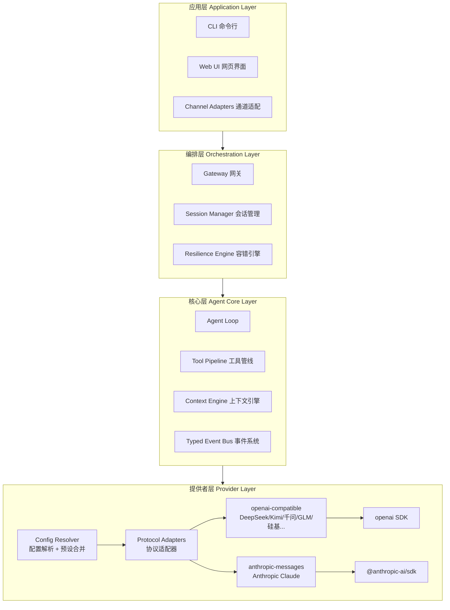

# 知行 — 架构概述

> 整体架构设计，随认知深化而持续演进

## 状态：v0.4 — 配置系统设计已确定（2026-04-07）

## 架构演进记录

| 版本 | 日期 | 变更说明 | 触发的认知研究 |
|------|------|---------|--------------|
| v0.4 | 2026-04-07 | 配置系统：多层配置加载、全局/项目/本地三级、首次自动生成 | [q04-配置系统](../../_private/questions/q04-config-system.md) |
| v0.3 | 2026-04-07 | Provider 层详细设计：Protocol 适配器、预设注册表、配置系统、API Key 管理 | [q03-Provider 架构](../../_private/questions/q03-provider-architecture.md) |
| v0.2 | 2026-04-06 | 确定 Agent Loop 模式、工具管线方案、上下文压缩策略；三个开放问题已决策 | [q02-Agent Loop 设计](../../_private/questions/q02-agent-loop-design.md) |
| v0.1 | 2026-04-06 | 确立产品定位、四层分层、技术栈、Monorepo 结构 | [q01-核心智能框架](../../_private/questions/q01-core-intelligence-framework.md) |

## 产品全貌

知行是一个**独立部署的智能体**，类似 OpenClaw。它不是一个传统意义上的"应用服务端"——它本身就是产品，对外暴露接口，各种客户端和通道连接到它。

```
┌───────────────────────────────────────────────────
│           知行 Agent（独立部署的智能体）
│
│  ├── 核心引擎（Agent Loop + 事件系统 + 工具管线）
│  ├── LLM 接入（连 Claude / GPT / DeepSeek 等）
│  ├── 内置工具（读写文件、执行命令、搜索等）
│  ├── 上下文引擎（对话压缩、记忆管理）
│  └── 网关（对外暴露 WebSocket / API 接口）
│
│  对外接口：WebSocket / HTTP API
└──┬────────┬────────┬────────┬────────┬────────┬───
   │        │        │        │        │        │
   │        │        │        │        │        │
 终端CLI    网页UI  手机App  微信Bot   钉钉Bot  其他系统
  我们的    我们的   我们的    第三方    第三方   第三方
  客户端    客户端   客户端    通道      通道    API调用
```

所有连接者（客户端和第三方通道）都在同一层级，都通过 WebSocket / API 直接连接智能体。区别只在于谁开发和维护：我们的客户端由我们开发，第三方通道由各自平台提供消息转发。

## 四层内部架构



### 各层职责

| 层 | 职责 | 对比 OpenClaw |
|----|------|-------------|
| **应用层** | 面向用户的入口：CLI、Web UI、通道适配 | OpenClaw 的 Channels + Clients |
| **编排层** | 网关路由、会话管理、容错（重试/Failover/熔断） | OpenClaw 的外层编排循环，我们将其解耦为独立层 |
| **核心层** | Agent Loop、工具管线、上下文引擎、事件系统 | OpenClaw 的 Pi Agent + Context Engine |
| **提供者层** | Protocol 适配器 + 预设注册表 + 配置解析，直连官方 SDK | OpenClaw 的 Api→Transport 分层，我们简化为 Protocol→SDK |

## 已确认的设计决策

以下是通过源码分析和竞品研究已经验证的决策：

| 决策 | 依据 | 状态 |
|------|------|------|
| 自研 Agent Loop，不用 LangGraph/LangChain | OpenClaw、Claude Code、Cursor 都选择自研 | 已确认 |
| 直连官方 LLM SDK（@anthropic-ai/sdk、openai） | 避免中间层延迟和 bug，业界最佳实践 | 已确认 |
| 内层推理循环 + 外层容错编排 分离 | OpenClaw 验证了双层关注点分离的必要性 | 已确认 |
| Typed Event Bus 作为可观测性基础设施 | OpenClaw/Claude Code 缺乏可观测性是已知痛点 | 已确认（已实现） |
| Monorepo 结构 | 见 [ADR-001](./decisions/001-monorepo-structure.md) | 已确认 |
| 按 Protocol 而非服务商组织 Provider 适配器 | OpenClaw 验证了协议-传输分层的有效性 | 已确认 |
| 内置预设注册表 + 用户配置覆盖 | 平衡零配置体验和完全可定制性 | 已确认 |
| Provider 架构 | 见 [ADR-002](./decisions/002-provider-architecture.md) | 已确认 |

## 已决策的设计问题

以下问题通过深度源码分析（OpenClaw Pi-Agent-Core + Claude Code query.ts）已做出决策。
详细分析见 [q02-Agent Loop 设计](../../_private/questions/q02-agent-loop-design.md)。

| 问题 | 决策 | 依据 |
|------|------|------|
| Agent Loop 采用什么模式？ | **AsyncGenerator + while(true) + 拆分辅助函数**<br>Claude Code 的设计原则 + Pi-Agent-Core 的代码组织 | Claude Code 验证了 AsyncGenerator 的背压和返回值优势；Pi 验证了核心循环只需 ~100 行；三者都否定了状态机 |
| 工具执行管线如何组织？ | **先直接函数调用，后续渐进添加中间件**<br>MVP 用简单的 for 循环 + 直接 call | Pi 用 beforeToolCall/afterToolCall 钩子已足够灵活；Claude Code 的 14 步管线是需求驱动的渐进结果 |
| 上下文压缩如何实现？ | **延后到 Phase 2，MVP 不实现**<br>循环预留压缩接入点即可 | Claude Code 的 250K API 调用事故说明过早实现压缩可能引入更大问题 |

## 多智能体支持

架构天然支持多智能体扩展，无需修改现有模块：

- **每个 Agent 是独立实例**：自己的循环 + 事件总线 + 工具管线 + 上下文
- **Agent 之间通过消息通信**，不共享 LLM 对话上下文（与 OpenClaw、Claude Code 一致）
- **未来新增模块**：AgentRegistry（管理生命周期）、AgentCoordinator（消息路由）
- **不需要重构**：现有模块都是实例级设计，不存在全局单例假设

## 技术栈

| 类别 | 选择 | 理由 |
|------|------|------|
| 语言 | TypeScript (ESM, strict) | 类型安全 + Node.js 生态 |
| 运行时 | Node.js 22+ | 最新 LTS，与 OpenClaw 对齐 |
| 包管理 | pnpm (workspace monorepo) | 见 [ADR-001](./decisions/001-monorepo-structure.md) |
| 测试 | Vitest | 快速，原生 ESM 支持 |
| 构建 | tsup | 轻量，基于 esbuild |
| LLM SDK | @anthropic-ai/sdk + openai | 直连官方 SDK，不走中间层 |
| Schema 验证 | Zod | 类型安全 + 运行时验证一体 |

## 提供者层详细设计（v0.3 新增）

> 详细调研见 [q03-Provider 架构](../../_private/questions/q03-provider-architecture.md)，决策依据见 [ADR-002](./decisions/002-provider-architecture.md)

### 核心概念

```
Protocol（协议）────→ 决定用哪个 SDK 适配器
   ↑
Provider（服务商）──→ baseUrl + apiKey + 使用哪个 Protocol
   ↑
Config（配置）────→ 用户声明要用哪些 Provider
```

### Protocol 适配器（只需两个）

| Protocol | 覆盖范围 | SDK |
|----------|---------|-----|
| `openai-compatible` | DeepSeek、MiniMax、Kimi、千问、GLM、硅基流动、OpenAI、OpenRouter 等 | `openai` |
| `anthropic-messages` | Anthropic Claude | `@anthropic-ai/sdk` |

### 预设注册表

内置常用服务商的默认配置。新增 OpenAI 兼容服务商只需加一条预设记录，零代码。

内置预设：deepseek、minimax、siliconflow、qwen、kimi、glm、anthropic、openai

### 用户配置

三种使用场景：

| 场景 | 用户需要写什么 |
|------|-------------|
| 用内置预设 | 只写 `apiKey` |
| 覆盖预设（代理/聚合平台） | 改 `baseUrl` + `apiKey` |
| 完全自定义 provider | 写 `baseUrl` + `protocol` + `apiKey` |

### API Key 管理

`apiKey` 字段支持三种格式：`"env:VAR_NAME"` / `"helper:command"` / 明文字符串

解析优先级：配置 apiKey → 预设 envKey 环境变量 → 报错提示

### Quirks 系统

同协议下不同服务商的行为差异（`max_tokens` 字段名、流式 usage 支持等），通过声明式 quirks 处理。预设中包含默认 quirks，自定义 provider 使用最保守的默认值。

## 配置系统详细设计（v0.4 新增）

> 详细调研见 [q04-配置系统](../../_private/questions/q04-config-system.md)，决策依据见 [ADR-003](./decisions/003-config-system.md)

### 设计灵感

- **借鉴 Claude Code**：项目共享 + 个人覆盖的分离；`/status` 配置来源追溯
- **借鉴 OpenClaw**：环境变量覆盖配置路径；`$include` 模块化（未来考虑）
- **超越两者**：自动生成全局配置模板；仅 3 层（vs OC 的 1 层 / CC 的 5 层）；项目配置放根目录可见

### 配置文件层级（3 层，优先级从高到低）

```
① 环境变量
   SILICONFLOW_API_KEY、ZHIXING_CONFIG_PATH 等
   ↓
② 项目级（可选）
   <project>/zhixing.config.json        ← 团队共享，可提交 Git
   <project>/.zhixing/config.local.json  ← 个人覆盖，自动 gitignore（未来）
   ↓
③ 用户全局
   ~/.zhixing/config.json               ← API Keys、默认 provider、个人偏好
```

### 合并规则

- 字段级 deep merge，不是文件级替换
- `providers` 对象按 key 合并
- 环境变量中的 API Key 优先级最高
- 缺失文件 = 跳过，不报错

### 配置文件内容

```jsonc
// ~/.zhixing/config.json
{
  "defaultProvider": "siliconflow",
  "defaultModel": "Pro/MiniMaxAI/MiniMax-M2.5",
  "providers": {
    "siliconflow": {
      "apiKey": "env:SILICONFLOW_API_KEY"
    }
  }
}
```

```jsonc
// <project>/zhixing.config.json（可选）
{
  "defaultModel": "deepseek-chat",
  "defaultProvider": "deepseek"
}
```

### 首次运行

1. 检测 `~/.zhixing/config.json` 是否存在
2. 不存在 → 自动创建带注释的模板文件
3. 检测是否有可用的 API Key（env 或 config）
4. 有 Key → 正常运行；无 Key → 提示用户配置

### 可移动性

`ZHIXING_CONFIG_PATH` 环境变量覆盖全局配置路径，适配容器/CI/自定义场景。

### 与 OpenClaw / Claude Code 的配置对比

| 维度 | OpenClaw | Claude Code | **知行** |
|------|----------|-------------|---------|
| 层级数 | 1 层 | 5 层（含企业托管） | **3 层**（够用不过度） |
| 项目级 | ✗ 无自动发现 | `.claude/` 隐藏目录 | ✓ `zhixing.config.json` 项目根可见 |
| 首次体验 | 需手动 setup | 需手动 /config | **自动生成模板** |
| Key 安全 | Auth Profile 复杂 | apiKeyHelper | `env:VAR` 引用，简洁安全 |
| 格式 | JSON5（可注释） | JSON（无注释） | JSON（MVP），未来考虑 JSONC |
| 可移动 | ✓ 环境变量 | ✗ 固定 | ✓ `ZHIXING_CONFIG_PATH` |
| 配置追溯 | ✗ | ✓ /status | 未来 `zhixing config show` |

## 与 OpenClaw / Claude Code 的已知差异

| 维度 | OpenClaw | Claude Code | 知行 |
|------|----------|-------------|------|
| 核心依赖 | Pi Agent 闭源包 | 闭源产品 | 完全自研，100% 开源 |
| 可观测性 | 事件回调 | 内部遥测不开放 | EventBus 一等公民（已实现） |
| Agent Loop | Pi 内层 ~350 行 + 外层 ~1400 行 | query() 生成器 ~1730 行 | AsyncGenerator + while(true)，核心 ~80 行 + 辅助函数 |
| 工具执行 | 并行/顺序 + before/after 钩子 | 14 步管线 + 投机执行 | MVP 直接调用，渐进添加管线 |
| 上下文管理 | Context Engine + 压缩 | 4 层分层压缩 + 断路器 | Phase 2 实现，预留接入点 |
| Provider 接入 | 复杂的 Api→Transport 分层 + Auth Profile 轮换 | 只支持 Anthropic API | Protocol 适配器 + 预设注册表，零代码新增服务商 |
| 国内服务商 | 部分硬编码支持 | 不支持 | 内置预设全覆盖（DeepSeek/Kimi/千问/GLM 等） |
| 配置管理 | 散落多文件 + 生成代码 | 三个环境变量（简洁但受限） | JSON 配置 + 环境变量 + CLI 参数 |
| 状态管理 | 可变（push to array） | 不可变（每次重建 state） | 不可变（借鉴 Claude Code） |
| 终止条件 | 隐式（布尔标志） | 10 种 Terminal 枚举 | 判别联合（AgentResult） |
| 可扩展性 | Hook 驱动（config 注入） | 需改 1730 行核心函数 | 辅助函数独立替换 + 渐进增强 |
