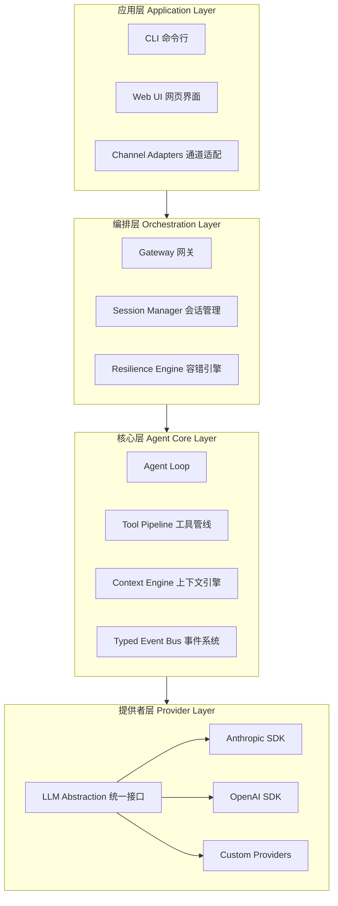

# 知行 — 架构概述

> 整体架构设计，随认知深化而持续演进

## 状态：v0.2 — Agent Loop 设计已确定（2026-04-06）

## 架构演进记录

| 版本 | 日期 | 变更说明 | 触发的认知研究 |
|------|------|---------|--------------|
| v0.2 | 2026-04-06 | 确定 Agent Loop 模式、工具管线方案、上下文压缩策略；三个开放问题已决策 | [q02-Agent Loop 设计](../../_private/questions/q02-agent-loop-design.md) |
| v0.1 | 2026-04-06 | 确立产品定位、四层分层、技术栈、Monorepo 结构 | [q01-核心智能框架](../../_private/questions/q01-core-intelligence-framework.md) |

## 产品全貌

知行是一个**独立部署的智能体**，类似 OpenClaw。它不是一个传统意义上的"应用服务端"——它本身就是产品，对外暴露接口，各种客户端和通道连接到它。

```
┌───────────────────────────────────────────────────
│           知行 Agent（独立部署的智能体）
│
│  ├── 核心引擎（Agent Loop + 事件系统 + 工具管线）
│  ├── LLM 接入（连 Claude / GPT / DeepSeek 等）
│  ├── 内置工具（读写文件、执行命令、搜索等）
│  ├── 上下文引擎（对话压缩、记忆管理）
│  └── 网关（对外暴露 WebSocket / API 接口）
│
│  对外接口：WebSocket / HTTP API
└──┬────────┬────────┬────────┬────────┬────────┬───
   │        │        │        │        │        │
   │        │        │        │        │        │
 终端CLI    网页UI  手机App  微信Bot   钉钉Bot  其他系统
  我们的    我们的   我们的    第三方    第三方   第三方
  客户端    客户端   客户端    通道      通道    API调用
```

所有连接者（客户端和第三方通道）都在同一层级，都通过 WebSocket / API 直接连接智能体。区别只在于谁开发和维护：我们的客户端由我们开发，第三方通道由各自平台提供消息转发。

## 四层内部架构



### 各层职责

| 层 | 职责 | 对比 OpenClaw |
|----|------|-------------|
| **应用层** | 面向用户的入口：CLI、Web UI、通道适配 | OpenClaw 的 Channels + Clients |
| **编排层** | 网关路由、会话管理、容错（重试/Failover/熔断） | OpenClaw 的外层编排循环，我们将其解耦为独立层 |
| **核心层** | Agent Loop、工具管线、上下文引擎、事件系统 | OpenClaw 的 Pi Agent + Context Engine |
| **提供者层** | LLM 厂商接入，薄抽象 + 直连官方 SDK | OpenClaw 的 Pi-ai 层 |

## 已确认的设计决策

以下是通过源码分析和竞品研究已经验证的决策：

| 决策 | 依据 | 状态 |
|------|------|------|
| 自研 Agent Loop，不用 LangGraph/LangChain | OpenClaw、Claude Code、Cursor 都选择自研 | 已确认 |
| 直连官方 LLM SDK（@anthropic-ai/sdk、openai） | 避免中间层延迟和 bug，业界最佳实践 | 已确认 |
| 内层推理循环 + 外层容错编排 分离 | OpenClaw 验证了双层关注点分离的必要性 | 已确认 |
| Typed Event Bus 作为可观测性基础设施 | OpenClaw/Claude Code 缺乏可观测性是已知痛点 | 已确认（已实现） |
| Monorepo 结构 | 见 [ADR-001](./decisions/001-monorepo-structure.md) | 已确认 |

## 已决策的设计问题

以下问题通过深度源码分析（OpenClaw Pi-Agent-Core + Claude Code query.ts）已做出决策。
详细分析见 [q02-Agent Loop 设计](../../_private/questions/q02-agent-loop-design.md)。

| 问题 | 决策 | 依据 |
|------|------|------|
| Agent Loop 采用什么模式？ | **AsyncGenerator + while(true) + 拆分辅助函数**<br>Claude Code 的设计原则 + Pi-Agent-Core 的代码组织 | Claude Code 验证了 AsyncGenerator 的背压和返回值优势；Pi 验证了核心循环只需 ~100 行；三者都否定了状态机 |
| 工具执行管线如何组织？ | **先直接函数调用，后续渐进添加中间件**<br>MVP 用简单的 for 循环 + 直接 call | Pi 用 beforeToolCall/afterToolCall 钩子已足够灵活；Claude Code 的 14 步管线是需求驱动的渐进结果 |
| 上下文压缩如何实现？ | **延后到 Phase 2，MVP 不实现**<br>循环预留压缩接入点即可 | Claude Code 的 250K API 调用事故说明过早实现压缩可能引入更大问题 |

## 多智能体支持

架构天然支持多智能体扩展，无需修改现有模块：

- **每个 Agent 是独立实例**：自己的循环 + 事件总线 + 工具管线 + 上下文
- **Agent 之间通过消息通信**，不共享 LLM 对话上下文（与 OpenClaw、Claude Code 一致）
- **未来新增模块**：AgentRegistry（管理生命周期）、AgentCoordinator（消息路由）
- **不需要重构**：现有模块都是实例级设计，不存在全局单例假设

## 技术栈

| 类别 | 选择 | 理由 |
|------|------|------|
| 语言 | TypeScript (ESM, strict) | 类型安全 + Node.js 生态 |
| 运行时 | Node.js 22+ | 最新 LTS，与 OpenClaw 对齐 |
| 包管理 | pnpm (workspace monorepo) | 见 [ADR-001](./decisions/001-monorepo-structure.md) |
| 测试 | Vitest | 快速，原生 ESM 支持 |
| 构建 | tsup | 轻量，基于 esbuild |
| LLM SDK | @anthropic-ai/sdk + openai | 直连官方 SDK，不走中间层 |
| Schema 验证 | Zod | 类型安全 + 运行时验证一体 |

## 与 OpenClaw / Claude Code 的已知差异

| 维度 | OpenClaw | Claude Code | 知行 |
|------|----------|-------------|------|
| 核心依赖 | Pi Agent 闭源包 | 闭源产品 | 完全自研，100% 开源 |
| 可观测性 | 事件回调 | 内部遥测不开放 | EventBus 一等公民（已实现） |
| Agent Loop | Pi 内层 ~350 行 + 外层 ~1400 行 | query() 生成器 ~1730 行 | AsyncGenerator + while(true)，核心 ~80 行 + 辅助函数 |
| 工具执行 | 并行/顺序 + before/after 钩子 | 14 步管线 + 投机执行 | MVP 直接调用，渐进添加管线 |
| 上下文管理 | Context Engine + 压缩 | 4 层分层压缩 + 断路器 | Phase 2 实现，预留接入点 |
| 状态管理 | 可变（push to array） | 不可变（每次重建 state） | 不可变（借鉴 Claude Code） |
| 终止条件 | 隐式（布尔标志） | 10 种 Terminal 枚举 | 判别联合（AgentResult） |
| 可扩展性 | Hook 驱动（config 注入） | 需改 1730 行核心函数 | 辅助函数独立替换 + 渐进增强 |
