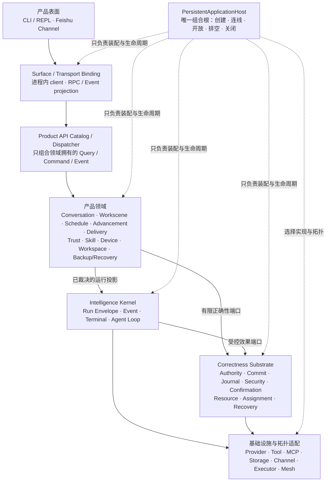

# 知行架构概述

> 本文描述当前生产架构，不是路线图。架构权威是 [AE-001：伴身智能架构演进](./evolutions/AE-001-companion-intelligence.md)；迁移与验收状态以 [AE-001 迁移任务](../../../docs/tasks/ae-001-companion-intelligence-architecture-migration.md) 为准。

## 产品与架构中心

知行是可独立部署的通用个人助手，长期方向是伴身智能。CLI、消息通道、设备协作、模型、Agent Runtime 和分布式执行都服务于这个产品，而不是产品本身。

当前架构的核心判断是：

> **知行的“一心”由唯一的产品语义、权威事实和共同应用行为构成；Intelligence Kernel 是受控的认知执行者；CLI、Channel、Server 和设备只是同一产品的表面与运行位置。**

因此，产品含义不会由某个模型、进程、Gateway、设备或物理存储定义。旧 Memory 能力已经退出当前生产基线；未来是否重建记忆能力是独立产品决策，现行架构没有把它作为已有能力或预设抽象。

## 当前责任图


```mermaid
flowchart TB
    Surface["产品表面\nCLI / REPL · Feishu Channel"]
    Binding["Surface / Transport Binding\n进程内 client · RPC / Event projection"]
    API["Product API Catalog / Dispatcher\n只组合领域拥有的 Query / Command / Event"]
    Domain["产品领域\nConversation · Workscene · Schedule · Advancement · Delivery\nTrust · Skill · Device · Workspace · Backup/Recovery"]
    Kernel["Intelligence Kernel\nRun Envelope · Event · Terminal · Agent Loop"]
    Correctness["Correctness Substrate\nAuthority · Commit · Journal · Security · Confirmation\nResource · Assignment · Recovery"]
    Edge["基础设施与拓扑适配\nProvider · Tool · MCP · Storage · Channel · Executor · Mesh"]
    Host["PersistentApplicationHost\n唯一组合根：创建 · 连线 · 开放 · 排空 · 关闭"]

    Surface --> Binding --> API --> Domain
    Domain -->|已裁决的运行投影| Kernel
    Domain -->|有限正确性端口| Correctness
    Kernel -->|受控效果端口| Correctness
    Kernel --> Edge
    Correctness --> Edge
    Host -.只负责装配与生命周期.-> Binding
    Host -.只负责装配与生命周期.-> Domain
    Host -.只负责装配与生命周期.-> Kernel
    Host -.只负责装配与生命周期.-> Correctness
    Host -.选择实现与拓扑.-> Edge
```

Host 被刻意画在产品调用主链之外：它可以看见具体实现并完成静态装配，但请求进入后只能沿领域应用端口、Kernel 合同和 Correctness 端口推进，不能回到 Host 查找服务或编排业务。

## 七类责任边界

| 责任 | 当前职责 | 明确不拥有 |
|---|---|---|
| ApplicationHost | 冻结启动输入，规划角色拓扑，装入组件，管理恢复根前置、entry-last 开放、拒新/排空、失败补偿与逆序关闭 | 产品用例、领域事实、运行期服务定位 |
| Domain | 拥有产品合同、应用决定、状态机/Reducer、事实语义以及面向 Kernel/Surface 的稳定投影 | RPC 名称、文件路径、模型 SDK、物理拓扑 |
| Product API | 以 sealed exact-set 组合领域 Query、Command 与 Event，并提供进程内或远端调用入口 | 业务 DTO 的第二定义、Reducer、写入权 |
| Intelligence Kernel | 通过有限的 Run Envelope、Run Event、Terminal/Completion 驱动模型、工具、子 Agent、上下文和本次运行资源 | Conversation、Workscene、Schedule 等产品事实；Host、Surface 或拓扑对象 |
| Correctness Substrate | 提供单写权威、耐久提交/重放、安全、确认、资源、Assignment、效果结算和恢复机制 | 领域状态分支、用户文案和产品流程 |
| Surface / Binding | 认证、连接、wire 编解码、订阅、输入、呈现和表面交互；事件缺口后重查权威 Query | 应用状态机、直接写 Authority、从瞬时事件重建事实 |
| Infrastructure / Topology | 实现 Provider、Tool、MCP、Storage、Channel、Executor、Mesh 等需求方端口 | 产品决定、第二事实源和跨层万能 Capability |

具有外部后果的动作遵循同一条责任链：

```text
用户或模型意图
  → 领域应用决定
  → Authority 耐久提交
  → 安全 / 确认 / 资源准入
  → 受控效果
  → 结果或证据提交
  → 产品事件与表面投影
```

Fact Event 只表示已经提交的事实；Progress Event 只表示带运行身份和顺序的瞬时进展。缓存、索引、spool、checkpoint、协议响应和界面状态都是投影或恢复材料，不因便于读取而成为业务 Authority。

## 真实生产入口与组合

### 进程与 Host

1. `@zhixing/cli` 的 `zz` 与 `zhixing` 两个 bin 指向同一个 Commander 入口 `packages/cli/src/index.ts`；默认交互、管理命令和内部 `serve` 都从这里分派。
2. 持久服务入口 `packages/cli/src/serve/topology-command.ts` 解析进程模式，取得 home、启动检查和秘密投影，然后只创建一个 `PersistentApplicationHost`。
3. `PersistentApplicationHost` 完成 Mesh/bootstrap maintenance、恢复根前置、容量与本机 workspace lease，再用 `planServeTopology` 选择 `anchor-host`、`executor-host` 或 disabled；Anchor+Executor 仍是同一个 Host 中的两项角色贡献，不是第二组合根。
4. Host 在任何角色副作用前装入所需模块。Anchor-only 不装入 Executor，Executor-only 不装入 Anchor；角色正常返回或失败后，外层资源都由同一个 Host 终止路径释放。

### 产品调用

- Anchor 组合根创建唯一 sealed `ProductApiDispatcher`，组合当前领域贡献。Server 接收该 dispatcher；RPC handler 只做认证、wire 校验、调用、错误映射和事件传输。
- CLI/REPL 的管理 client 与 Feishu Channel 的 conversation binding 调用同一领域应用语义，不直接读取领域日志或复制状态机。
- `@zhixing/server` 在同一已绑定 endpoint 上完成 handler、连接设施、运行期贡献和关闭责任后才从 inactive 503 激活 HTTP/REST、WebSocket 与 JSON-RPC，并随后发布发现与 ready 状态。

### 智能运行

- Conversation、scheduled ephemeral、本机 durable job 和远端 Executor assignment 都服从 `@zhixing/orchestrator/runtime` 的同一组 `KernelRunEnvelope`、`KernelRunEvent` 和 `KernelRunCompletion` 合同。
- Workscene 是 conversation 发放前形成的产品投影，不是 Kernel 或 RuntimeHost 内的第二产品分支。
- `@zhixing/runtime-host` 只消费已裁决、不可变的运行投影，装配模型、环境、工具实现、权限存储和 TurnContext providers；它不定义 Workscene、Schedule、TaskList 或 MCP 产品规则。
- 本机与远端执行只在 Host/Infrastructure 的适配选择处分叉。领域与 Kernel 不以 Anchor、epoch、Mesh、本机或远端为产品判断条件。

## 当前产品领域

领域边界主要由 `@zhixing/core` 的窄 subpath 合同及其单一应用服务表达；耐久机制和物理适配可以位于其他包。包位置不改变事实所有权。

| 领域责任 | 合同/应用主入口 | 机制与适配落点 |
|---|---|---|
| Conversation | `@zhixing/core/conversation/application` | `@zhixing/owner-kernel` 的会话 owner、运行提交与 assignment；RPC/CLI/Channel 只绑定 |
| Workspace Administration | `@zhixing/core/environment/workspace-administration` | Core 持久端口与 CLI 本机 workspace 适配 |
| Workscene | `@zhixing/core/workscene/application` | CLI Anchor 组合边界形成运行/工具投影 |
| Schedule | `@zhixing/core/scheduler/application` | `@zhixing/owner-kernel` 的调度 Authority/Job 提交与 CLI runtime effect |
| Advancement | `@zhixing/core/advancement/application` | `@zhixing/owner-services/advancement` 的 review、proxy、恢复与外部机制适配 |
| Delivery | `@zhixing/core/delivery/application` | `@zhixing/owner-kernel/delivery` 与 Channel effect 适配；Delivery 拥有义务和终态 |
| Trust Administration | `@zhixing/core/trust-administration` | Security/permission 机制执行已提交规则 |
| Skill Catalog | `@zhixing/core/skills/catalog` | Authority/CAS 与 assignment Correctness；Kernel/Executor 只消费不可变投影 |
| Device Administration | `@zhixing/core/device-administration/application` | CLI/Mesh 适配物理配对、移除和值班迁移效果 |
| Backup & Recovery Administration | `@zhixing/core/backup-recovery/application` | Mesh checkpoint/传输与 CLI 恢复适配提供机制 |

跨领域协作只能调用对方应用端口或消费已提交事件；不得直接读取对方仓库、Reducer、Authority 日志或内部状态。

## 包与模块索引

仓库由 pnpm workspace 管理。当前共有 17 个 package：16 个公开交付包，加 1 个 private 的内部测试包。它们是物理交付边界，不是一套与逻辑责任一一对应的“技术分层”。

| 包 | 当前生产责任 |
|---|---|
| `@zhixing/core` | Agent Loop 等共享原语、领域拥有的窄合同/应用 subpath，以及 Authority、持久化、安全、资源等明确 Correctness subpath；根导出不是新增责任的默认入口 |
| `@zhixing/orchestrator` | `runtime` 窄入口下的 Intelligence Kernel、AgentRuntime、Run 合同、模型/工具执行和子 Agent/编排实现 |
| `@zhixing/runtime-host` | 通用 AgentRuntime 装配、冻结运行投影和 Kernel/Conversation adapter；不实现产品领域装配 |
| `@zhixing/owner-kernel` | Conversation owner、运行/assignment 提交，以及 Schedule/Delivery 等所需的耐久 Correctness 机制 |
| `@zhixing/owner-services` | Advancement 的控制、审查、外部机制与恢复服务 |
| `@zhixing/rpc` | Product API RPC client/binding、会话 wire/stream/event 投影与确认桥；不拥有领域规则 |
| `@zhixing/server` | HTTP、WebSocket、JSON-RPC、认证、连接和订阅网关；消费注入的 Product API dispatcher |
| `@zhixing/cli` | `zz`/`zhixing` 产品表面与进程入口、唯一 ApplicationHost 组合根，以及当前 Anchor/拓扑物理适配；不拥有领域语义 |
| `@zhixing/executor` | Executor 角色、远端 assignment 执行、ledger、stream spool 与 data-plane ticket 机制 |
| `@zhixing/mesh` | 设备互认证、bootstrap/pairing、隧道、传输及 checkpoint/recovery 的物理机制 |
| `@zhixing/providers` | 模型 Provider 协议适配、预设与配置解析 |
| `@zhixing/tools-builtin` | Read、Write、Edit、Glob、Grep、Bash 等内置工具实现与薄 binding |
| `@zhixing/mcp` | 外部 MCP server 连接与工具接入机制 |
| `@zhixing/network` | SSRF 安全 fetch、URL/IP 防护与网络出口原语 |
| `@zhixing/secrets` | 设备本地平台密钥保护与加密 SecretStore |
| `@zhixing/channel-feishu` | 当前 Feishu/Lark 消息通道适配器、长连接和卡片/文本发送 |
| `@zhixing/test-utils` | private 的跨包测试基础设施；没有生产运行责任 |

正式公共面以各包 `package.json#exports` 和 CLI `bin` 为准。源码内部路径、测试入口、旧 `dist` 或目录名称不能用来推导公开合同。

## 生命周期、状态与拓扑约束

1. **单一组合根。** 每个持久进程只有一个 `PersistentApplicationHost`；Host 之外不存在第二角色组合器。
2. **依赖先启动，入口最后开放。** 组件资源一经取得即有失败补偿；正常关闭接管同一幂等 cleanup。公开 endpoint 只在必要 owner、consumer 和关闭责任成立后激活。
3. **拒新后排空。** RPC、信号、idle、trust generation 和设备移除进入同一耐久停止边界；真实 Server terminal 成立后角色才返回，随后 Host 释放外层资源。
4. **一个事实一个 owner。** 领域决定与 Reducer 在领域，串行/耐久机制在 Correctness；Product API、Server、CLI、Channel、cache 和 Mesh 不得形成第二写入口。
5. **诚实投影。** PID/port/ready/state、缓存和日志各按自己的发现、状态或诊断生命周期处理；稳定 credential、终态 state、恢复输入和 retention 数据不冒充临时 generation marker。
6. **拓扑透明。** 单设备是一等完整形态；多设备只替换 Infrastructure binding，不改变产品合同、Kernel 输入或 Surface 行为。
7. **封闭区不可插拔。** 领域事实、Agent Loop、Authority、安全、恢复、资源和终态不能被边缘扩展替换；Provider、工具、MCP、Channel、Storage 与设备适配只能实现窄端口。

## 技术与交付基线

- TypeScript、strict ESM、Node.js `>=24`，pnpm `10.8.0` workspace。
- tsup 生成各包 fresh `dist`；Vitest 承担直接与回归测试；Biome 承担格式和静态检查。
- Commander 提供 CLI；Server 使用 Node HTTP、WebSocket 与 JSON-RPC 2.0；Provider、MCP 与 Feishu 分别通过正式 SDK/协议适配。
- 持久正确性使用文件型 Authority/CAS/WAL、投影索引和恢复机制；具体物理格式不是领域合同，诊断日志也不是产品事实。
- 发布以 package manifest 的 `exports`/`files`/`bin`、fresh build、tarball 安装与 Windows x64 helper smoke 为交付边界；不能用 workspace 源码或旧 `dist` 冒充制品。

## 关键取舍

- 领域拥有合同，而不是建立中央业务模型。
- Product API 组合领域行为，但不重新定义它们；本机调用不为架构整洁强制经过网络。
- Kernel 保持强智能、薄责任：开放式推理交给模型，事实、权限、资源、效果和终态保持系统刚性。
- 采用静态、类型化、有限的生产图，不建设运行期万能插件系统、服务定位器或微服务拆分。
- 不把所有边缘统一成一个万能 Capability；不同端口允许复用实现，但责任保持分离。
- 架构演进与能力增强分开；当前架构不承诺记忆、主动触达、自修改、插件市场或其他未来能力。

## 文档关系

- [AE-001：伴身智能架构演进](./evolutions/AE-001-companion-intelligence.md)：目标架构与不变量权威。
- [AE-001 迁移任务](../../../docs/tasks/ae-001-companion-intelligence-architecture-migration.md)：阶段、证据、失效和最终验收状态权威。
- [架构决策索引](./decisions/_index.md)：历史 ADR；若与当前生产或 AE-001 冲突，以后两者为准。
- [功能规格索引](../specifications/README.md)：能力级规格；部分历史文件可能尚未同步现行物理落点。
- [验证运行手册](../workbench/verification-runbook.md)：Windows 环境下的串行、fresh build 与失效闭包规则。

本文只说明现行责任和必要边界。未来能力、候选设计与历史实现计划不能据此被解释为已经交付。
