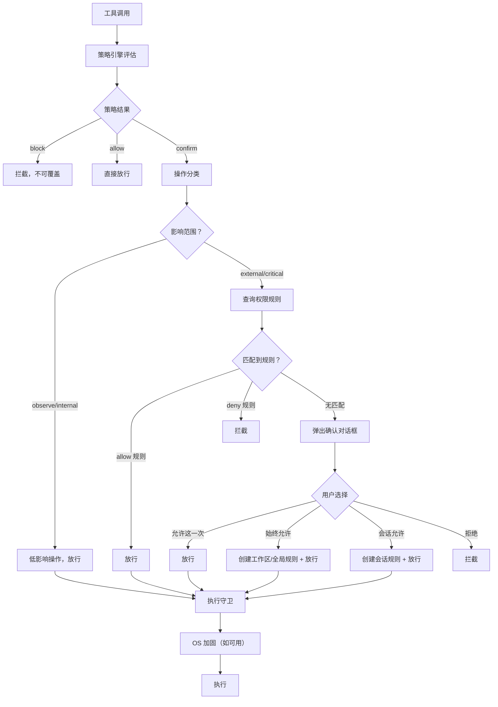

# 知行安全系统设计方案 v2.0

> **状态**: 📐 方案设计（2026-04-12）
> **前置**: ADR-004 工具系统架构 + ADR-006 安全系统架构
> **信息来源**: OpenClaw / Hermes / Claude Code 安全系统深度调研

---

## 设计哲学

### 三条原则

1. **操作按影响范围分类**。观察类操作（读取信息）自动放行；影响外部的操作（发消息、写项目外文件、调用外部 API）需要用户许可。安全系统的核心判断不是"在不在某个目录里"，而是"这个操作的影响范围多大"。
2. **每条放行都追溯到用户选择**。系统不会自己决定"这个操作可以自动放行了"。自动放行只有两种来源：操作被分类为低影响，或用户创建了明确的权限规则。
3. **平台无关**。macOS、Linux、Windows 上的安全行为完全一致——相同的规则、相同的确认、相同的体验。OS 级沙箱是静默的额外纵深，用户感知不到差异。

### 知行是个人助手，不只是编码工具

安全系统的设计必须覆盖知行的所有使用场景：

| 场景 | 典型操作 | 安全关注点 |
|------|---------|-----------|
| **编码开发** | 编辑文件、跑测试、git 操作 | 文件系统安全、命令注入 |
| **消息通讯** | 读取/发送微信、钉钉消息 | 发送对象、内容审核、频率 |
| **日程管理** | 查看/创建日程、邀请参会人 | 对外影响（邀请他人） |
| **信息检索** | 搜索、总结文档 | 数据泄露（搜索结果上传） |
| **文件管理** | 整理文档、批量重命名 | 不可逆操作 |
| **未来扩展** | 订餐、支付、智能家居 | 财务操作、物理世界影响 |

### 我们防护什么

| 威胁 | 例子 | 防护手段 |
|------|------|---------|
| 智能体误操作 | 幻觉导致删错文件、发消息给错误的人 | 策略引擎拦截 + 操作分类确认 |
| 提示注入 | 聊天记录中藏指令诱导转发敏感信息 | bypassImmune 规则绝对阻止 |
| 过度执行 | 用户让回复一条消息，智能体群发了所有联系人 | 操作分类（external/critical）+ 工具自身频率限制 |
| 环境劫持 | 通过 LD_PRELOAD 注入恶意库 | 执行守卫净化环境变量 |
| 隐私泄露 | 智能体把私人聊天内容发送到外部 API | 威胁边界拦截数据外传 |

### 我们不防护什么

- **恶意用户**：用户是主人，不是对手。安全系统保护用户免受智能体的意外伤害，不是限制用户。
- **已被入侵的环境**：如果用户的系统已经被攻破，安全系统无法提供额外保护。
- **系统级攻击**：知行不是杀毒软件，不检测恶意软件。

### 已知局限（未来探索方向）

- **多步攻击 / 操作序列关联**：当前安全评估是单次操作级别的。智能体可能先读取敏感信息（`observe`，自动放行），再通过其他通道泄露。当前的纵深防御（出站网络需确认、消息发送需确认）部分覆盖了这个威胁，但不完整。Phase 3+ 可探索"操作序列分析"或"上下文敏感度追踪"。
- **并发操作的竞态条件**：多个 Agent 同时操作时，可能出现 TOCTOU 竞态（如 Agent A 获得写确认后、Agent B 将目标替换为 symlink）。Phase 3 可在执行守卫中增加文件锁 / 原子操作保护。

---

## 架构总览

```
用户意图 → 智能体 → 工具调用 → ┌───── 安全门 ─────┐ → 执行
                                │                   │
                                │  ① 策略检查       │  "这类操作危不危险？"
                                │  ② 操作分类       │  "影响范围多大？"
                                │  ③ 权限匹配       │  "用户授权了吗？"
                                │  ④ 执行守卫       │  "净化、监控、限制"
                                │  ⑤ OS 加固        │  "内核隔离（静默增强）"
                                │                   │
                                └───────────────────┘
```

### 五个组件，每个只做一件事

| 组件 | 职责 | 数据来源 | 依赖 OS？ |
|------|------|---------|----------|
| **策略引擎** | 评估操作是否匹配已知威胁模式 | 内置 + 项目 + 用户规则集 | ❌ |
| **操作分类** | 按影响范围分类：观察/内部/外部/关键 | 操作类型 + 上下文分类器 | ❌ |
| **权限系统** | 查询用户规则，未匹配则确认 | 用户创建的权限规则 | ❌ |
| **执行守卫** | 净化环境、验证参数、频率限制、超时保护 | 应用层代码 | ❌ |
| **OS 加固** | 内核级进程/文件系统/网络隔离 | Seatbelt / bwrap | ✅ 但可选 |

**关键设计**：前四个组件都是纯应用代码，全平台一致。第五个是可选增强，有没有都不影响安全行为。

### 安全决策流程



**`audit` 规则的位置**：`audit` 不参与决策分支。匹配 `audit` 规则的操作走 `allow` 路径（继续到操作分类），但额外发射 `security:evaluation` 事件到 EventBus，用于事后审计。`audit` 不阻止也不确认，只记录。

---

## 一、策略引擎——什么是危险的

策略引擎是安全系统的大脑。它不执行安全检查，而是**评估**操作是否匹配已知威胁模式。

### 1.1 核心接口

```typescript
interface PolicyEngine {
  evaluate(request: SecurityRequest): SecurityDecision;
  loadRules(rules: SecurityRule[]): void;
  updateRule(rule: SecurityRule): void;
  getActiveRules(): SecurityRule[];
}

interface SecurityRequest {
  tool: string;
  operation: OperationType;
  arguments: Record<string, unknown>;
  context: {
    cwd: string;
    // 工作区目录：用户指定的工作目录，智能体在此范围内的文件操作视为低影响
    workspace: string | null;
    sessionType: SessionType;
  };
  resolvedAccess?: {
    paths?: string[];
    commands?: string[];
    hosts?: string[];
    envVars?: string[];
  };
}

type SessionType = 'interactive' | 'ci' | 'gateway' | 'api';

interface SecurityDecision {
  action: 'allow' | 'confirm' | 'block';
  matchedRules: SecurityRule[];
  reason: string;
  riskLevel: 'low' | 'medium' | 'high' | 'critical';
  suggestion?: string;
}
```

### 1.2 规则定义

```typescript
interface SecurityRule {
  id: string;
  name: string;
  description: string;
  enabled: boolean;

  match: MatchSpec;

  action: 'block' | 'confirm' | 'audit';
  // bypassImmune 规则不可被任何配置覆盖，包括权限规则
  bypassImmune: boolean;

  severity: 'low' | 'medium' | 'high' | 'critical';
  category: ThreatCategory;
  source: 'builtin' | 'project' | 'user' | 'community';

  message: string;
  suggestion?: string;
}

type ThreatCategory =
  | 'data_exfiltration'
  | 'privilege_escalation'
  | 'code_injection'
  | 'path_traversal'
  | 'env_manipulation'
  | 'network_abuse'
  | 'destructive_operation'
  | 'prompt_injection'
  | 'supply_chain'
  ;

type MatchSpec =
  | { type: 'command'; pattern: string; flags?: string }
  | { type: 'command_prefix'; prefixes: string[] }
  | { type: 'path'; paths: string[]; access: 'read' | 'write' | 'any' }
  | { type: 'path_outside'; anchor: string }
  | { type: 'network'; hosts?: string[]; ports?: number[]; direction?: 'inbound' | 'outbound' }
  | { type: 'env_var'; names: string[] }
  | { type: 'tool'; tools: string[] }
  | { type: 'interpreter'; languages: string[] }
  | { type: 'composite'; op: 'and' | 'or' | 'not'; specs: MatchSpec[] }
  ;
```

### 1.3 内置规则集

```typescript
const BUILTIN_RULES: SecurityRule[] = [

  // ═══ bypassImmune：绝对不可覆盖 ═══

  {
    id: 'bi-git-write',
    name: 'Git 内部文件写保护',
    match: { type: 'path', paths: ['.git/'], access: 'write' },
    action: 'block',
    bypassImmune: true,
    severity: 'critical',
    category: 'destructive_operation',
    message: '不允许直接修改 .git/ 目录内部文件',
    suggestion: '使用 git 命令操作版本控制',
  },
  {
    id: 'bi-ssh-keys',
    name: 'SSH 密钥保护',
    match: { type: 'path', paths: ['~/.ssh/'], access: 'any' },
    action: 'block',
    bypassImmune: true,
    severity: 'critical',
    category: 'data_exfiltration',
    message: '不允许访问 SSH 密钥目录',
  },
  {
    id: 'bi-env-injection',
    name: '环境变量注入防护',
    match: { type: 'env_var', names: ['LD_PRELOAD', 'LD_LIBRARY_PATH', 'DYLD_INSERT_LIBRARIES'] },
    action: 'block',
    bypassImmune: true,
    severity: 'critical',
    category: 'env_manipulation',
    message: '禁止设置可用于二进制劫持的环境变量',
  },
  {
    id: 'cf-path-override',
    name: 'PATH 修改确认',
    match: { type: 'env_var', names: ['PATH'] },
    action: 'confirm',
    bypassImmune: false,
    severity: 'high',
    category: 'env_manipulation',
    message: 'PATH 环境变量将被修改（可能导致二进制劫持）',
    suggestion: 'nvm/pyenv/conda 等工具管理器会修改 PATH，如果是这类操作可以允许',
  },

  // ═══ 需确认：默认拦截但用户可批准 ═══

  {
    id: 'cf-privilege-escalation',
    name: '权限提升命令',
    match: { type: 'command_prefix', prefixes: ['sudo', 'su', 'doas', 'pkexec'] },
    action: 'confirm',
    bypassImmune: false,
    severity: 'high',
    category: 'privilege_escalation',
    message: '此命令将以更高权限执行',
  },
  {
    id: 'cf-destructive-commands',
    name: '破坏性命令',
    match: {
      type: 'composite',
      op: 'or',
      specs: [
        { type: 'command', pattern: 'rm\\s+(-[a-zA-Z]*r[a-zA-Z]*|--recursive)', flags: 'i' },
        { type: 'command', pattern: 'mkfs|fdisk|dd\\s+', flags: 'i' },
        { type: 'command_prefix', prefixes: ['format', 'diskpart'] },
      ],
    },
    action: 'confirm',
    bypassImmune: false,
    severity: 'high',
    category: 'destructive_operation',
    message: '此命令可能导致不可逆的数据删除',
    suggestion: '建议先备份，或使用更安全的替代命令',
  },
  {
    id: 'cf-network-tools',
    name: '网络工具',
    match: { type: 'command_prefix', prefixes: ['curl', 'wget', 'nc', 'ncat', 'ssh', 'scp', 'sftp', 'ftp'] },
    action: 'confirm',
    bypassImmune: false,
    severity: 'medium',
    category: 'network_abuse',
    message: '此命令将访问网络',
  },
  {
    id: 'cf-interpreter-exec',
    name: '解释器执行',
    match: { type: 'interpreter', languages: ['python', 'node', 'ruby', 'perl', 'php'] },
    action: 'confirm',
    bypassImmune: false,
    severity: 'medium',
    category: 'code_injection',
    message: '通过解释器执行的代码可以绕过命令级安全检查',
    suggestion: '建议审查要执行的脚本内容',
  },
  {
    id: 'cf-workspace-external-write',
    name: '工作区外写操作',
    match: { type: 'path_outside', anchor: '{workspace}' },
    action: 'confirm',
    bypassImmune: false,
    severity: 'medium',
    category: 'path_traversal',
    message: '此操作将修改工作区之外的文件',
  },
  {
    id: 'cf-system-config',
    name: '系统配置修改',
    match: { type: 'path', paths: ['/etc/', '/boot/', '/usr/lib/systemd/'], access: 'write' },
    action: 'confirm',
    bypassImmune: false,
    severity: 'high',
    category: 'privilege_escalation',
    message: '此操作将修改系统配置文件',
  },

  // ═══ 审计：放行但记录（走 allow 路径，额外发事件到 EventBus） ═══
  // Phase 2 新增：MatchSpec 支持文件属性匹配后，加入大文件读取审计规则（size > 1MB）
  // Phase 1 不设 audit 规则——不加过滤的全量 read 审计会产生大量噪音，降低信噪比
];
```

### 1.4 规则扩展

```typescript
// 显式项目规则（不是启动目录配置文件自动发现）
{
  "security": {
    "rules": [
      {
        "id": "project-allow-docker",
        "match": { "type": "command_prefix", "prefixes": ["docker"] },
        "action": "allow",
        "source": "project"
      }
    ]
  }
}

// 未来：社区规则集
// npx zhixing security install @zhixing-community/rules-nodejs
// npx zhixing security install @zhixing-community/rules-devops
```

### 1.5 规则优先级

规则合并分两个阶段：

**阶段 1：来源优先级**——高优先级来源的规则**覆盖**低优先级来源的同 ID/同匹配规则：

```
bypassImmune 规则 > 用户规则 > 项目规则 > 社区规则 > 内置规则
```

用户规则可以把内置规则的 `confirm` 改为 `allow`（例如用户信任某个命令），但不能覆盖 `bypassImmune` 规则。

**阶段 2：动作严格度**——对同一操作匹配到多条**不同**规则时，取最严格的动作：

```
block > confirm > audit > allow
```

**举例**：内置规则 `cf-network-tools` 对 `curl` 设为 `confirm`，用户规则设 `curl` 为 `allow`。用户规则优先级更高，覆盖内置规则→最终 `allow`。但如果另一条 `bypassImmune` 规则也匹配了这个操作→`bypassImmune` 不可覆盖→最终 `block`。

---

## 二、威胁边界——保护资源而非限制工具

传统方式是给每个工具配权限（"Bash 需要 confirm"）。问题是：新增工具或 MCP 工具时，谁来配权限？

知行的方式：定义**需要保护的资源边界**，工具声明它会跨越哪些边界。新工具自动受既有边界保护。

> **在架构中的定位**：威胁边界是工具的**安全元数据**，不是流程中的独立检查点。策略引擎做规则匹配（"这条命令危不危险？"），操作分类器读取威胁边界声明做影响判断（"这个工具声明了什么边界跨越？影响等级多大？"）。威胁边界在流程图中不单独出现，因为它是分类器的输入数据源，类似工具的 `inputSchema` 之于输入验证。

### 2.1 边界定义

```typescript
interface ThreatBoundary {
  id: string;
  name: string;
  type: BoundaryType;
  description: string;
  scope: BoundaryScope;
  defaultPolicy: 'block' | 'confirm' | 'allow';
  bypassImmune: boolean;
  riskLevel: 'low' | 'medium' | 'high' | 'critical';
}

type BoundaryType =
  | 'filesystem'        // 文件系统
  | 'network'           // 网络
  | 'process'           // 进程
  | 'secrets'           // 敏感信息
  | 'system'            // 系统配置
  | 'messaging'         // 消息通讯（微信、钉钉、邮件）
  | 'calendar'          // 日程管理
  | 'external-service'  // 外部服务调用
  | 'financial'         // 财务操作
  ;

type BoundaryScope =
  | { type: 'path_include'; paths: string[] }
  | { type: 'path_exclude'; anchor: string }
  | { type: 'network_direction'; direction: 'inbound' | 'outbound' | 'any' }
  | { type: 'network_targets'; hosts: string[]; ports?: number[] }
  | { type: 'process_capabilities'; capabilities: string[] }
  | { type: 'env_vars'; names: string[] }
  | { type: 'action_type'; actions: string[] }         // 如 'send', 'delete', 'invite'
  | { type: 'recipient_scope'; scope: 'self' | 'individual' | 'group' | 'public' }
  ;
```

### 2.2 工具的边界声明

```typescript
interface ToolDefinition {
  name: string;
  description: string;
  inputSchema: ZodType;
  // 声明此工具可能跨越的边界
  boundaryCrossings?: BoundaryCrossing[];
}

interface BoundaryCrossing {
  boundaryType: BoundaryType;
  access: string;
  // 是否需要运行时解析（如 Bash 的路径取决于命令内容）
  dynamic: boolean;
}

// BashTool 的边界声明
const bashToolBoundaries: BoundaryCrossing[] = [
  { boundaryType: 'process',    access: 'exec',   dynamic: true },
  { boundaryType: 'filesystem', access: 'read',   dynamic: true },
  { boundaryType: 'filesystem', access: 'write',  dynamic: true },
  { boundaryType: 'network',    access: 'egress', dynamic: true },
];

// ReadTool 的边界声明
const readToolBoundaries: BoundaryCrossing[] = [
  { boundaryType: 'filesystem', access: 'read', dynamic: false },
];

// WeChatTool 的边界声明（个人助手场景）
const wechatToolBoundaries: BoundaryCrossing[] = [
  { boundaryType: 'messaging', access: 'read',  dynamic: false },
  { boundaryType: 'messaging', access: 'send',  dynamic: true },
];

// CalendarTool 的边界声明
const calendarToolBoundaries: BoundaryCrossing[] = [
  { boundaryType: 'calendar', access: 'read',   dynamic: false },
  { boundaryType: 'calendar', access: 'create', dynamic: true },
  { boundaryType: 'calendar', access: 'invite', dynamic: true },
];
```

**为什么这样设计**：新增 MCP 工具时只需声明它跨越哪些边界，不需要写安全规则。已有的边界保护自动生效。无论是编码工具、消息工具还是日程工具，同一套边界保护机制统一处理。

### 2.3 MCP 工具的信任问题

内置工具的边界声明由我们编写，可信。MCP 工具来自第三方，其声明可能不诚实（故意声明更低的影响级别以绕过安全检查）。

**应对策略**：

1. **首次注册确认**（Phase 2）：MCP 工具首次加载时，展示其边界声明让用户审查确认，而不是盲目信任
2. **运行时边界审计**（Phase 3）：安全系统在运行时独立验证工具的实际行为是否超出声明范围——例如工具声明了 `filesystem.read`，但实际执行中写了文件，触发 `security:boundary-violation` 事件并阻止
3. **未声明边界的 MCP 工具默认 `critical`**：分类器已有此保护（见 3.3 边界影响分类器）

---

## 三、操作分类——影响范围多大

操作分类决定了哪些操作自动放行，哪些需要确认。分类标准是**这个操作的影响范围**。

### 3.1 四级影响分类

| 级别 | 含义 | 安全行为 |
|------|------|---------|
| **observe** | 只读取信息，无副作用 | 自动放行 |
| **internal** | 仅影响用户本地环境 | 自动放行 |
| **external** | 影响外部系统或他人 | 需要权限规则或确认 |
| **critical** | 不可逆、涉及财务、大范围影响 | 始终确认，bypassImmune 操作直接阻止 |

```typescript
type OperationClass = 'observe' | 'internal' | 'external' | 'critical';

interface OperationClassifier {
  classify(op: ExecutionRequest): OperationClass;
}
```

### 3.2 三个区域

操作分类的核心判断可以归结为三个区域：

#### 区域 A：工作区内

工作区（workspace）是用户指定的工作目录。智能体在工作区内的文件操作被视为低影响：

| 操作 | 分类 | 行为 |
|------|------|------|
| 读取文件 | observe | 自动放行 |
| 写入 / 编辑文件 | internal | 自动放行 |
| 安全 Shell 命令（`ls`、`git status`） | observe | 自动放行 |
| 项目级 Shell 命令（`npm install`、`make`） | internal | 自动放行 |

**但策略引擎仍然生效**——以下操作即使在工作区内也会被拦截：

| 操作 | 策略规则 | 行为 |
|------|---------|------|
| 写入 `.git/` 目录 | bypassImmune | 绝对阻止 |
| `rm -rf`、`sudo` | confirm | 需要用户确认 |
| `curl`、`wget` | confirm | 需要用户确认 |
| `python -c`、`node -e` | confirm | 需要用户确认 |

这与 Cursor、Codex、Claude Code 的行为一致：没有任何产品在工作区内完全放行。

#### 区域 B：工作区外（本机其他位置）

| 操作 | 分类 | 行为 |
|------|------|------|
| 读取文件 | observe | 自动放行（读取始终安全） |
| 写入 / 编辑文件 | external | 需要权限规则或确认 |
| 修改系统配置（`/etc/`、注册表） | critical | 始终确认 |

#### 区域 C：外部系统

工具通过**威胁边界声明**告知安全系统它的操作类型，安全系统根据边界类型确定影响等级。不需要为每种业务领域编写分类器：

| 边界类型 | 读取类访问 | 写入/发送类访问 | 示例 |
|---------|-----------|----------------|------|
| `messaging` | observe | external | 读微信消息 → 放行；发消息 → 确认 |
| `calendar` | observe | external | 查日程 → 放行；邀请参会人 → 确认 |
| `external-service` | observe | external | 查询 API → 放行；调用外部服务 → 确认 |
| `financial` | observe | critical | 查余额 → 放行；转账 → 始终确认 |
| `network` | — | external | 所有出站网络请求 → 确认 |

**关键设计决策**：安全系统不包含 `MessagingClassifier`、`CalendarClassifier` 这样的业务领域分类器。"发送消息"是一种**业务行为**，不是**操作类型**——安全系统关注的是它跨越了 `messaging` 边界的 `send` 访问，等级为 `external`。新增任何业务工具（智能家居、支付、邮件）只需在工具定义中声明边界跨越，不需要修改安全系统代码。

### 3.3 分类器实现

操作分类有两种机制：

1. **上下文分类器**：用于影响等级取决于运行时上下文的操作（文件系统路径在不在工作区、Shell 命令是安全的还是危险的）
2. **边界影响分类**：用于影响等级由工具的边界声明确定的操作（所有其他工具）

```typescript
class CompositeClassifier implements OperationClassifier {
  // 需要运行时上下文分析的工具，使用专用分类器
  private contextClassifiers: Map<string, OperationClassifier> = new Map();
  // 所有其他工具，通过边界声明分类
  private boundaryClassifier: BoundaryImpactClassifier;

  classify(op: ExecutionRequest): OperationClass {
    const classifier = this.contextClassifiers.get(op.tool);
    if (classifier) return classifier.classify(op);
    return this.boundaryClassifier.classify(op);
  }
}
```

#### 文件系统分类器（上下文分类器）

文件操作的影响等级取决于目标路径是否在工作区内：

```typescript
class FileSystemClassifier implements OperationClassifier {
  constructor(private workspace: string | null) {}

  classify(op: ExecutionRequest): OperationClass {
    if (op.type === 'read') return 'observe';

    if (op.type === 'write' || op.type === 'edit') {
      if (this.workspace && this.isWithinWorkspace(op.target)) return 'internal';
      return 'external';
    }

    return 'external';
  }

  private isWithinWorkspace(targetPath: string): boolean {
    if (!this.workspace) return false;
    // 必须用 realpath 解析符号链接：防止工作区内的 symlink 指向外部敏感文件
    // 例：workspace/link → ~/.ssh/id_rsa，不解析则 link 会被误判为 internal
    try {
      const resolved = fs.realpathSync(path.resolve(targetPath));
      const workspaceReal = fs.realpathSync(this.workspace);
      return resolved.startsWith(workspaceReal + path.sep) || resolved === workspaceReal;
    } catch {
      // 路径不存在（如新建文件场景）：回退到逻辑路径判断
      const resolved = path.resolve(targetPath);
      const workspaceResolved = path.resolve(this.workspace);
      return resolved.startsWith(workspaceResolved + path.sep) || resolved === workspaceResolved;
    }
  }
}
```

> **符号链接攻击防护**：路径守卫（`PathGuard`，Phase 1）也必须对所有路径做 `realpath` 解析后再判断是否在工作区内。这是 Phase 1 的基础能力，不可延后。

#### Shell 命令分类器（上下文分类器）

Shell 命令的影响等级取决于命令内容。分类前必须先检测命令是否包含管道、重定向、链式操作符——如果包含，则不适用安全命令快捷路径：

```typescript
class ShellClassifier implements OperationClassifier {
  classify(op: ExecutionRequest): OperationClass {
    // 含管道、重定向、链式操作符、子命令替换的命令一律不走快捷路径
    if (this.hasChainOperators(op.command)) {
      if (this.isDestructive(op.command)) return 'critical';
      return 'external';
    }

    const tokens = op.command.trim().split(/\s+/);
    const executable = tokens[0];

    // 单词命令精确匹配
    if (SAFE_READ_COMMANDS.includes(executable)) return 'observe';

    // 带子命令的工具：匹配 executable + subcommand
    const subcommand = tokens[1];
    if (subcommand && SAFE_SUBCOMMANDS[executable]?.includes(subcommand)) return 'observe';

    if (this.isLocalScoped(op.command)) return 'internal';
    if (this.isDestructive(op.command)) return 'critical';
    return 'external';
  }

  // 保守的快速检测：文件名含 > | 等字符会误报，Phase 2 的 CommandAnalyzer
  // 会提供引号感知的精准链式操作符检测，此处接受误报（误报只会升级为 external，
  // 不会降级安全等级）
  private hasChainOperators(cmd: string): boolean {
    return /[|><;]|&&|\|\||\$\(|`/.test(cmd);
  }
}

// 安全只读命令：仅在无管道/重定向时生效，仅匹配可执行文件名
// 注意：echo 不在列表中——echo 可通过重定向写文件，且其参数可能包含敏感信息
const SAFE_READ_COMMANDS = [
  'ls', 'dir', 'pwd', 'wc', 'date', 'whoami', 'hostname',
  'cat', 'head', 'tail', 'less', 'file', 'stat',
];

// 带子命令的工具：executable → 安全子命令列表
const SAFE_SUBCOMMANDS: Record<string, string[]> = {
  git: ['status', 'log', 'diff', 'branch', 'show', 'remote'],
  // 未来可扩展：docker: ['ps', 'images'], npm: ['list', 'view'] 等
};
```

**为什么 `echo` 被移除**：`echo` 的副作用完全取决于上下文（`echo hello` 是安全的，`echo "..." > /etc/passwd` 不是）。虽然管道/重定向检测会拦截后者，但 `echo` 的主要用途（打印信息）在智能体场景中几乎不会独立出现，不值得为它开白名单。

**为什么 `cat` 保留**：`cat file.txt` 是纯只读操作。敏感路径（如 `~/.ssh/`）由策略引擎的 `bypassImmune` 规则拦截，在分类器之前就被阻止。`cat` 配合管道（如 `cat file | curl ...`）会被 `hasChainOperators` 捕获。

#### 边界影响分类器（通用分类器）

对没有专用上下文分类器的工具，根据其声明的边界跨越和访问模式确定影响等级：

```typescript
class BoundaryImpactClassifier implements OperationClassifier {
  constructor(private toolRegistry: ToolRegistry) {}

  classify(op: ExecutionRequest): OperationClass {
    const tool = this.toolRegistry.get(op.tool);
    // 未声明边界跨越的工具是最不可信的——你不知道它会做什么
    // 确认对话框中会特别标注"此工具未声明安全边界"
    if (!tool?.boundaryCrossings?.length) return 'critical';

    // 找到当前操作实际触发的边界跨越，取最高影响等级
    let maxImpact: OperationClass = 'observe';
    for (const crossing of this.getActiveCrossings(tool, op)) {
      const impact = this.classifyCrossing(crossing);
      maxImpact = this.max(maxImpact, impact);
    }
    return maxImpact;
  }

  private classifyCrossing(crossing: BoundaryCrossing): OperationClass {
    if (['read', 'list', 'query'].includes(crossing.access)) return 'observe';

    // 不同边界类型的默认影响等级
    switch (crossing.boundaryType) {
      case 'process':    return 'internal';
      case 'filesystem': return 'external'; // 无工作区上下文时的回退
      case 'network':    return 'external';
      case 'messaging':  return 'external';
      case 'calendar':   return 'external';
      case 'external-service': return 'external';
      case 'secrets':    return 'critical';
      case 'system':     return 'critical';
      case 'financial':  return 'critical';
      default:           return 'external';
    }
  }

  private max(a: OperationClass, b: OperationClass): OperationClass {
    const order: OperationClass[] = ['observe', 'internal', 'external', 'critical'];
    return order.indexOf(a) >= order.indexOf(b) ? a : b;
  }
}
```

**为什么这样设计**：
- 文件系统和 Shell 需要运行时分析（同一个 `write` 工具写到工作区内是 `internal`，写到外面是 `external`），所以需要专用分类器
- 消息、日程、支付等业务工具的影响等级由边界声明决定（`messaging.send` 永远是 `external`），不需要运行时分析
- 新增业务工具只需声明边界跨越，安全系统自动分类——零安全代码变更

### 3.4 工作区配置

#### 设计前提：知行是个人助手，不是开发工具

工作区是"用户信任智能体在哪里操作"的边界。这是一个**用户级偏好**——它跟着人走，不跟着某个代码仓库走。用户整理照片、管理文档、处理下载文件时都需要工作区，这些场景没有"项目"概念。

因此，**工作区的配置位置是全局配置（`~/.zhixing/config.jsonc`）**，不是启动目录或项目目录。

#### 配置 schema

```typescript
// ZhixingConfig 扩展（packages/providers/src/types.ts）
interface ZhixingConfig {
  // ...existing fields...

  workspace?: {
    /**
     * 工作区目录——智能体在此范围内的文件操作被视为低影响。
     * 必须使用绝对路径；这是安全信任边界，不能随启动 cwd 改变。
     * 未配置时：交互模式回退到 cwd，其他模式为 null。
     */
    root: string;
    /** 工作区内仍需保护的路径（追加到内置保护路径之上） */
    protectedPaths?: string[];
  };
}
```

**全局配置**（`~/.zhixing/config.jsonc`）：

```json
{
  "workspace": {
    "root": "D:\\Work"
  }
}
```

用户配一次，无论在哪里启动 zhixing、通过微信/钉钉触发、还是通过 API 调用，工作区都指向 `D:\Work`。这是大多数用户的唯一需要。

配置单一来源：知行读取用户全局配置，工作区作为个人偏好跟随用户，不随启动目录隐式切换。

#### 优先级：配置优先于运行位置

```
运行时内部显式覆盖  >  全局配置（主路径）  >  cwd 兜底
  (如工作场景 workdir)    (用户偏好)        (未配置时)
```

| 优先级 | 来源 | 说明 |
|-------|------|------|
| 1（最高） | 运行时内部显式覆盖（如工作场景 workdir） | 内部编排使用，不暴露为用户启动参数 |
| 2 | **全局 `~/.zhixing/config.jsonc` → `workspace.root`** | **主路径——用户在这里配置** |
| 3（最低） | `process.cwd()` | 兜底——仅在无配置时生效 |

**关键设计**：`cwd` 是兜底而非默认。用户在全局配置中设定了工作区后，无论在哪个目录运行 zhixing、从哪个渠道触发，工作区都指向配置的地址，不会被运行位置覆盖。

```typescript
function resolveWorkspace(
  config: ZhixingConfig,
  options: LaunchOptions,
): { path: string | null; source: WorkspaceSource } {
  // 1. 运行时内部显式覆盖
  if (options.runtimeWorkspace) {
    return { path: path.resolve(options.runtimeWorkspace), source: 'runtime' };
  }

  // 2. 全局配置文件
  if (config.workspace?.root) {
    const root = config.workspace.root;
    if (!path.isAbsolute(root)) {
      throw new Error('全局配置 workspace.root 必须是绝对路径');
    }
    return { path: root, source: 'global-config' };
  }

  // 3. 兜底：当前工作目录（仅 CLI 交互模式有意义）
  if (options.sessionType === 'interactive') {
    return { path: process.cwd(), source: 'cwd-fallback' };
  }

  // 4. 消息触发 / API 调用且无配置 → 无工作区
  return { path: null, source: 'none' };
}

type WorkspaceSource = 'runtime' | 'global-config' | 'cwd-fallback' | 'none';
```

**注意**：`resolveWorkspace` 同时返回路径和来源。来源信息用于：
- 智能体回答"我的工作区在哪"时展示来源
- 修改工作区时定位应该改哪个配置文件

#### 智能体对工作区的感知与修改

**感知**：智能体知道**当前生效的工作区**及其来源。用户问"我的工作区在哪"时，智能体回答：

> 当前工作区：D:\Work（来源：全局配置）

工作区路径和来源通过系统提示注入到智能体上下文中。

**修改**：智能体帮用户修改**全局配置**（`~/.zhixing/config.jsonc`）中的 `workspace.root` 字段。因为对个人助手来说，workspace 是用户级偏好——智能体不应该去某个随机目录创建启动目录配置文件。

此操作有特殊安全约束：

> **工作区修改是受保护操作——始终需要用户确认，不可跳过。**
>
> 工作区 = 信任边界。改变工作区等于改变"哪些操作免确认"的范围，这是安全系统最根本的参数之一。即使用户已创建"允许写入 config.jsonc"的权限规则，修改 workspace 字段仍然触发确认。

实现方式：修改工作区通过专用的命令/工具路径完成，该路径强制走确认流程，不经过通用的文件写入权限匹配。

**生效时机**：修改后下次会话启动时生效。SecurityPipeline 是会话级单例，运行时不重建。智能体修改后提示用户："已更新工作区配置，下次启动时生效。"

#### 路径解析规则

| 配置层 | 允许的路径格式 | 解析锚点 |
|-------|-------------|---------|
| **全局配置**（主路径） | 仅绝对路径 | 无锚点；配置加载与写入时校验，拒绝相对路径 |
| 运行时内部显式覆盖 | 相对路径或绝对路径 | 调用方上下文 |

路径解析后，必须经过 `PathGuard.isWithinWorkspace` 的 `realpath` 检查——防止符号链接逃逸。

#### 默认工作区

首次启动时，如果全局配置中没有 `workspace.root`，系统自动创建默认工作区并写入配置。用户零配置即可开始使用。

**默认路径（按平台）**：

```typescript
function getDefaultWorkspacePath(): string {
  const WORKSPACE_DIR_NAME = 'ZhixingWorkspace';

  if (process.platform === 'win32') {
    // Windows：优先 D 盘根目录（C 盘空间管理是常见痛点）
    // 仅在 D 盘存在时使用，否则回退到用户主目录
    if (fs.existsSync('D:\\')) {
      return path.join('D:\\', WORKSPACE_DIR_NAME);
    }
    return path.join(os.homedir(), WORKSPACE_DIR_NAME);
  }

  // macOS / Linux：用户主目录
  return path.join(os.homedir(), WORKSPACE_DIR_NAME);
}
```

| 平台 | 默认路径 | 说明 |
|------|---------|------|
| Windows（有 D 盘） | `D:\ZhixingWorkspace` | 避免占用 C 盘空间 |
| Windows（无 D 盘） | `C:\Users\<user>\ZhixingWorkspace` | 保底 |
| macOS | `~/ZhixingWorkspace` | 用户主目录 |
| Linux | `~/ZhixingWorkspace` | 用户主目录 |

**为什么这样选**：
- **可见**：不是隐藏目录，文件管理器里一眼看到——工作区是用户的空间，不是知行的内部数据
- **辨识度**：`ZhixingWorkspace` 命名明确，不会和其他文件夹混淆
- **不在 `~/.zhixing/` 里**：`~/.zhixing/` 是知行的内部数据目录（配置、权限、日志），概念不同
- **不在 Documents 里**：Documents 可能被 OneDrive/iCloud 同步，智能体频繁读写会触发大量同步

#### 启动时的工作区展示

不同启动场景下的用户提示：

**首次启动**（全局配置中无 workspace 字段）——创建目录 + 写入配置 + 解释：

```
✨ 首次启动

  工作区已创建：D:\ZhixingWorkspace
  常规文件读写在此目录内无需逐次确认，危险操作仍会询问你。

  如需修改，告诉我"把工作区改到 xxx"即可。
```

**正常启动**（工作区已配置且目录存在）——一行简要信息，不打扰：

```
  工作区：D:\ZhixingWorkspace
```

**工作区目录不存在**（配置了路径但目录被删除/移动）——警告 + 重建：

```
⚠ 工作区目录不存在：D:\ZhixingWorkspace
  已重新创建。如需更换位置，告诉我即可。
```

**全局配置存在但缺少 workspace 字段**（用户手动删除了配置项）——补上默认值 + 创建目录：

```
  工作区未配置，已设为默认：D:\ZhixingWorkspace
  如需修改，告诉我即可。
```

### 3.5 没有工作区上下文时的行为

知行不总是有工作区。当用户通过微信/钉钉对话触发智能体且未在全局配置中设定工作区时，没有任何工作区上下文。此时：

- 文件系统分类器中 `workspace = null`，所有文件写入都分类为 `external`
- Shell 分类器正常工作（安全命令仍然自动放行）
- 边界影响分类器不依赖工作区，正常工作

---

## 四、权限系统——谁来决定

当操作被分类为 `external` 或 `critical` 且没有被策略引擎直接拦截时，权限系统接管决策。

### 4.1 核心设计

权限系统只有一种数据：**权限规则**。每条规则都是用户在确认对话框中做出的明确选择。

```typescript
interface PermissionRule {
  id: string;
  // 匹配模式：工具 + 参数 glob
  // MVP 使用单一 glob 模式，覆盖大多数 Shell/文件操作场景
  // Phase 2+ 可扩展为多字段匹配（如同时匹配收件人+消息类型），当前 glob 对 MVP 足够
  pattern: {
    tool: string;       // "bash" | "write" | "edit" | ...
    argument: string;   // glob 模式，如 "npm install *" 或 "src/**"
  };
  decision: 'allow' | 'deny';
  // session: 本次会话有效
  // workspace: 当前工作区有效（持久化）
  // global: 跨所有工作区有效（如"永远不要向某人发消息"）
  scope: 'session' | 'workspace' | 'global';
  createdAt: number;
  lastMatchedAt: number;
  matchCount: number;
}
```

### 4.2 确认对话框

当没有规则匹配时，用户看到：

```
┌─ 确认 ─────────────────────────────────────┐
│                                             │
│  智能体想要执行:                             │
│  > npm install express                      │
│                                             │
│  [y] 允许这一次                              │
│  [a] 始终允许 "npm install *"（本工作区）      │
│  [g] 全局始终允许 "npm install *"             │
│  [s] 本次会话内允许 "npm *"                   │
│  [d] 查看详情                                │
│  [n] 拒绝                                   │
│                                             │
└─────────────────────────────────────────────┘
```

**选项说明**：

| 选项 | 行为 | 创建规则？ |
|------|------|----------|
| `[y]` 允许这一次 | 放行本次操作 | 不创建 |
| `[a]` 始终允许 | 放行 + 创建工作区级永久规则 | 是（scope: workspace） |
| `[g]` 全局允许 | 放行 + 创建全局永久规则（跨工作区） | 是（scope: global） |
| `[s]` 会话允许 | 放行 + 创建会话级规则 | 是（scope: session） |
| `[n]` 拒绝 | 拦截本次操作 | 不创建 |

### 4.3 模式建议生成

系统根据操作自动生成建议模式，用户选择泛化级别：

```typescript
function suggestPatterns(op: ExecutionRequest): SuggestedPattern[] {
  if (op.tool === 'bash') {
    const parts = op.command.split(' ');
    return [
      { pattern: { tool: 'bash', argument: op.command },
        label: `"${op.command}"` },
      { pattern: { tool: 'bash', argument: `${parts[0]} ${parts[1]} *` },
        label: `"${parts[0]} ${parts[1]} *"` },
      { pattern: { tool: 'bash', argument: `${parts[0]} *` },
        label: `"${parts[0]} *"` },
    ];
  }

  if (op.tool === 'write') {
    const dir = path.dirname(op.path);
    return [
      { pattern: { tool: 'write', argument: op.path },
        label: `写 "${op.path}"` },
      { pattern: { tool: 'write', argument: `${dir}/**` },
        label: `写 "${dir}/" 下任意文件` },
    ];
  }

  return [
    { pattern: { tool: op.tool, argument: '*' },
      label: `所有 ${op.tool} 操作` },
  ];
}
```

#### 例子：不同场景的确认对话框

**编码场景**——操作 `npm install express`：

```
┌─ 确认 ─────────────────────────────────────┐
│  智能体想要执行:                             │
│  > npm install express                      │
│                                             │
│  [y] 允许这一次                              │
│  [a] 始终允许 "npm install *"                │
│  [s] 本次会话内允许 "npm *"                   │
│  [d] 查看详情                                │
│  [n] 拒绝                                   │
└─────────────────────────────────────────────┘
```

**消息场景**——操作 `发送微信消息给张三`：

```
┌─ 确认 ─────────────────────────────────────┐
│  智能体想要发送消息:                         │
│  收件人: 张三                                │
│  内容: "明天下午 3 点开会，地点在 B 栋 301"   │
│                                             │
│  [y] 允许这一次                              │
│  [a] 始终允许发消息给 "张三"                  │
│  [s] 本次会话内允许发送微信消息                │
│  [d] 查看详情                                │
│  [n] 拒绝                                   │
└─────────────────────────────────────────────┘
```

**日程场景**——操作 `创建会议并邀请 5 人`：

```
┌─ 确认 ─────────────────────────────────────┐
│  智能体想要创建会议:                         │
│  标题: 项目周会                              │
│  时间: 2026-04-14 15:00                     │
│  邀请: 张三、李四、王五、赵六、孙七           │
│                                             │
│  [y] 允许这一次                              │
│  [a] 始终允许创建有邀请的会议                 │
│  [d] 查看详情                                │
│  [n] 拒绝                                   │
└─────────────────────────────────────────────┘
```

#### 规则选项的后果

选 `[y]`：放行这一次。下次类似操作还会问。
选 `[a]`：创建工作区永久规则。本工作区内匹配同一模式的操作自动放行。
选 `[g]`：创建全局永久规则。所有工作区内匹配的操作自动放行。
选 `[s]`：创建会话规则。本次会话内匹配的操作自动放行，关闭后消失。
选 `[n]`：拦截，不创建规则。

### 4.4 智能建议

系统追踪确认行为。当同一模式被手动确认 3 次以上，主动建议创建规则——但绝不自动创建。

```
┌─ 建议 ─────────────────────────────────────┐
│                                             │
│  💡 你已经批准 "git push *" 5 次了           │
│                                             │
│  [a] 设为始终允许（本项目）                   │
│  [s] 设为本会话允许                          │
│  [n] 不用，每次问我                          │
│                                             │
└─────────────────────────────────────────────┘
```

```typescript
interface ConfirmationTracker {
  // 追踪同一模式被手动确认（选 [y]）的次数
  record(pattern: string): void;

  // 是否应该建议创建规则
  shouldSuggest(pattern: string): boolean;
}

// 建议阈值与操作风险等级关联——低风险操作更快建议，高风险操作更保守
const SUGGESTION_THRESHOLDS: Record<string, number> = {
  low: 3,
  medium: 5,
  high: 10,     // 高风险操作不轻易建议自动规则
  critical: -1, // critical 操作永不建议自动规则
};
```

### 4.5 会话模式

不同运行环境下，未匹配操作的默认行为不同：

| 会话模式 | 无匹配规则时 | 可创建规则？ |
|---------|------------|------------|
| interactive | 弹出确认 | 可以（session + project） |
| ci | 直接拒绝 | 不可以 |
| gateway | 直接拒绝 | 不可以 |
| api | 直接拒绝 | 不可以 |

CI/gateway/api 模式下，所有越界操作必须有预先配置的规则才能执行。

### 4.6 规则管理

```typescript
interface PermissionStore {
  match(workspaceId: string, op: ExecutionRequest): PermissionRule | null;
  create(workspaceId: string, rule: PermissionRule): void;
  list(workspaceId: string): PermissionRule[];
  revoke(workspaceId: string, ruleId: string): void;
  reset(workspaceId: string): void;
  resetAll(): void;
}
```

存储位置：
- 工作区规则：`~/.zhixing/permissions/<workspace-hash>.json`
- 全局规则：`~/.zhixing/permissions/global.json`

格式是 JSON，用户可以手动编辑或版本控制：

```json
{
  "workspace": "/home/user/projects/zhixing",
  "rules": [
    {
      "id": "r1",
      "pattern": { "tool": "bash", "argument": "git *" },
      "decision": "allow",
      "scope": "project",
      "createdAt": 1712937600000,
      "matchCount": 12
    }
  ]
}
```

#### 命令行管理

```
/trust list                    列出当前项目所有权限规则
/trust list --all              列出所有项目的权限规则
/trust revoke <rule-id>        撤销某条规则
/trust reset                   清除当前项目所有规则
/trust reset --all             清除所有权限
```

### 4.7 规则匹配优先级

```typescript
// deny 优先于 allow，精确匹配优先于宽泛匹配
function resolveConflict(matches: PermissionRule[]): PermissionRule {
  const denyRules = matches.filter(r => r.decision === 'deny');
  if (denyRules.length > 0) return mostSpecific(denyRules);
  return mostSpecific(matches);
}

function specificity(pattern: { tool: string; argument: string }): number {
  const wildcards = (pattern.argument.match(/\*/g) || []).length;
  const depth = pattern.argument.split('/').length;
  return depth * 10 - wildcards;
}
```

---

## 五、执行守卫——如何安全执行

### 5.1 应用层守卫（全平台一致）

执行守卫是所有工具执行前的最后一道应用层检查。不同类型的工具使用不同的守卫策略。

#### Shell / 文件系统守卫

```typescript
class ShellGuard {
  guard(request: ExecutionRequest): ExecutionRequest {
    request = this.sanitizeEnv(request);      // 移除可劫持子进程的环境变量
    request = this.normalizePaths(request);    // 解析 ../ 和符号链接，防止路径遍历
    request = this.rewriteCommand(request);    // 将危险模式转为安全等价
    request = this.limitOutput(request);       // 防止子进程输出爆炸
    request = this.setTimeout(request);        // 防止子进程挂死
    return request;
  }
}
```

#### 通用守卫

```typescript
class ExecutionGuard {
  private guards: Map<string, Guard> = new Map();

  constructor() {
    this.guards.set('bash', new ShellGuard());
    this.guards.set('write', new ShellGuard());
    // 其他工具使用默认守卫（超时 + 频率限制）
  }

  execute(request: ExecutionRequest): ExecutionResult {
    const guard = this.guards.get(request.tool) ?? this.defaultGuard;
    const guarded = guard.guard(request);
    return this.run(guarded);
  }
}
```

**为什么全平台一致**：所有守卫都是 Node.js 应用代码，不使用任何 OS 特有 API。

**安全系统守卫 vs 工具自身安全**：

安全系统的执行守卫只处理**通用安全威胁**——路径遍历、环境劫持、进程失控。业务领域的安全约束（消息频率限制、收件人验证、内容审查）是**工具自身的职责**，在工具实现中处理，不在安全系统中。

| 层级 | 威胁 | 防护手段 | 谁负责 |
|------|------|---------|--------|
| 安全系统 | 路径遍历（`../../etc/passwd`） | 路径规范化 | ShellGuard |
| 安全系统 | 环境劫持（`LD_PRELOAD`） | 环境变量净化 | ShellGuard |
| 安全系统 | 命令注入（`curl ... \| bash`） | 命令改写 | ShellGuard |
| 安全系统 | 输出爆炸 / 子进程挂死 | 输出限制 + 超时 | ShellGuard |
| 安全系统 | 任何工具被无限调用 | 频率限制 | DefaultGuard |
| 安全系统 | 工具调用挂死 | 超时保护 | DefaultGuard |
| 工具自身 | 智能体群发所有联系人 | 频率限制 + 批量上限 | WeChatTool |
| 工具自身 | 发送恶意链接 | 内容审查 | WeChatTool |
| 工具自身 | 收件人验证 | 模糊匹配确认 | WeChatTool |

**为什么这样分**：安全系统是**基础设施**，它不应该知道"消息"或"日程"是什么。工具知道自己的业务领域，应该为自己的业务安全负责。安全系统负责的是所有工具共有的执行安全。

### 5.2 OS 加固（可选增强，静默生效）

OS 加固是执行守卫之上的额外纵深防御。它提供内核级的进程/文件系统隔离，防御的是"恶意子进程直接做系统调用绕过我们的应用代码"这个边缘场景。

```typescript
interface OsHardener {
  detect(): Promise<HardeningCapability>;
  wrap(request: ExecutionRequest): ExecutionRequest;
}

interface HardeningCapability {
  available: boolean;
  technology: string;
  processIsolation: boolean;
  filesystemRestriction: boolean;
  networkIsolation: boolean;
}

class AdaptiveHardener implements OsHardener {
  async detect(): Promise<HardeningCapability> {
    switch (process.platform) {
      case 'darwin':
        return {
          available: true,
          technology: 'macOS Seatbelt (sandbox-exec)',
          processIsolation: true,
          filesystemRestriction: true,
          networkIsolation: false,
        };

      case 'linux':
        if (await commandExists('bwrap')) {
          return {
            available: true,
            technology: 'bubblewrap (bwrap)',
            processIsolation: true,
            filesystemRestriction: true,
            networkIsolation: true,
          };
        }
        return { available: false, technology: 'none', processIsolation: false, filesystemRestriction: false, networkIsolation: false };

      default:
        // Windows 及其他平台：无可用 OS 级沙箱
        // Job Objects 限制 CPU/内存但不限制文件访问，对安全无意义
        // AppContainer 需要原生 C++ 插件且复杂度极高
        return { available: false, technology: 'none', processIsolation: false, filesystemRestriction: false, networkIsolation: false };
    }
  }
}
```

### 5.3 全平台行为一致——没有补偿机制

**关键设计决定：OS 加固不影响用户体验。没有"补偿机制"。**

为什么？因为在智能体场景下，执行守卫已经覆盖了 95%+ 的真实威胁：

| 威胁类型 | 占比 | 执行守卫能防？ | OS 加固额外防？ |
|---------|------|-------------|--------------|
| 智能体误操作（路径错误/命令错误） | ~60% | ✅ | 不需要 |
| 策略规则拦截的危险操作 | ~25% | ✅ | 不需要 |
| 提示注入诱导越界操作 | ~10% | ✅（操作分类 + 权限确认） | 不需要 |
| 恶意子进程绕过应用层直接系统调用 | ~5% | ❌ | ✅ |

最后 5% 的边缘场景（恶意子进程逃逸），在智能体日常使用中极少发生：
- 智能体不会下载并运行不可信二进制
- 执行的命令都是用户自己也会跑的
- 如果攻击者能做到这一步，也能社会工程用户在任何平台上批准

**所以**：macOS/Linux 上 OS 加固静默生效是锦上添花。Windows 上没有 OS 加固也不降级体验。所有平台的规则、确认、行为完全一样。

### 5.4 `/security` 命令中的展示

```
╭─ 安全状态 ─────────────────────────────────╮
│                                             │
│  安全保证: ✅ 完整保护                       │
│  执行守卫: ✅ 活跃（5 项检查全部生效）        │
│  OS 加固:  ✅ bubblewrap                    │
│                                             │
╰─────────────────────────────────────────────╯
```

Windows 上：

```
╭─ 安全状态 ─────────────────────────────────╮
│                                             │
│  安全保证: ✅ 完整保护                       │
│  执行守卫: ✅ 活跃（5 项检查全部生效）        │
│  OS 加固:  ─ 不可用                         │
│                                             │
│  💡 Windows 无可用 OS 级沙箱                 │
│     安装 WSL2 + bubblewrap 可启用            │
│     当前安全保证不受影响                      │
╰─────────────────────────────────────────────╯
```

两种情况下安全保证都是"完整保护"，因为**执行守卫才是安全保证，OS 加固是额外奖励**。

### 5.5 可选的 Docker 隔离（高安全场景）

对于需要运行不可信代码的场景（如分析恶意仓库），可选启用 Docker 容器隔离：

```typescript
// 用户配置（~/.zhixing/config.jsonc）
{
  "security": {
    "isolation": "container",
    "container": {
      "image": "node:22-slim",
      "network": false,
      "mounts": ["{workspace}:rw"]
    }
  }
}
```

这不是默认选项，而是面向特定场景的显式升级。

---

## 六、安全中间件管线

安全检查集成到 ADR-004 定义的工具执行管线中：

```typescript
interface SecurityMiddleware {
  name: string;
  phase: 'authorize' | 'guard' | 'post-execute';
  order: number;
  execute(
    ctx: ToolExecutionContext,
    next: () => Promise<ToolResult>,
  ): Promise<ToolResult>;
}
```

### Phase 1 管线（MVP）

```
输入验证 → [策略评估] → [环境净化] → [路径守卫] → 执行 → [审计记录]
```

| 阶段 | 中间件 | 职责 | 代码量 |
|------|--------|------|--------|
| authorize | `PolicyEvaluator` | 评估内置规则集 | ~200 行 |
| guard | `EnvSanitize` | 清理危险环境变量 | ~80 行 |
| guard | `PathGuard` | 路径规范化 + 边界检查 | ~150 行 |
| post-execute | `SecurityAuditor` | 发射安全事件到 EventBus | ~60 行 |

### Phase 2 管线

```
输入验证 → [策略评估] → [边界分类] → [权限匹配] → [执行守卫] → 执行 → [审计记录]
```

新增：
- `OperationClassifier`：操作影响分类（observe/internal/external/critical）
- `PermissionMatcher`：权限规则匹配与确认对话框
- `ExecutionGuard`：完整执行守卫（5 项检查）
- `ConfirmationTracker`：确认追踪与智能建议

### Phase 3 管线

新增：
- `OsHardener`：OS 自适应加固
- `ContainerIsolation`：Docker 容器隔离
- `CommunityRuleLoader`：社区规则集加载

---

## 七、安全可观测性

### 7.1 安全事件

```typescript
type SecurityEventType =
  | 'security:evaluation'          // 策略评估结果
  | 'security:decision'            // 最终安全决策
  | 'security:classified-external'  // 操作被分类为 external/critical
  | 'security:permission-created'  // 用户创建了权限规则
  | 'security:permission-matched'  // 权限规则被匹配
  | 'security:blocked'             // 操作被阻止
  | 'security:suggestion'          // 向用户弹出智能建议
  ;

interface SecurityEvent {
  type: SecurityEventType;
  timestamp: number;
  tool: string;
  operation: string;
  riskLevel: string;
  decision: string;
  matchedPolicyRules: string[];
  matchedPermissionRule: string | null;
  duration: number;
}
```

### 7.2 CLI 命令

```
/security              安全状态概览
/security rules        查看当前生效的策略规则
/security audit        查看安全决策审计日志
/trust list            查看所有权限规则
/trust revoke <id>     撤销某条权限规则
/trust reset           清除所有权限规则
```

### 7.3 安全仪表盘

```
╭─ 安全状态 ─────────────────────────────────────────╮
│                                                     │
│  会话: interactive                                  │
│  执行守卫: ✅ 活跃                                   │
│  OS 加固: ✅ bubblewrap                             │
│                                                     │
│  ── 策略规则 ──                                      │
│  活跃: 15 条 (9 内置 + 4 项目 + 2 用户)              │
│                                                     │
│  ── 权限规则 ──                                      │
│  #1  bash "git *"            永久      12次匹配     │
│  #2  bash "npm install *"    永久       8次匹配     │
│  #3  wechat "send *"         永久       5次匹配     │
│  #4  write "~/.bashrc"       本次会话   2次匹配     │
│                                                     │
│  ── 本次会话统计 ──                                  │
│  总操作: 47 次                                       │
│  observe/internal 自动放行: 38 次 (80.9%)           │
│  规则匹配放行: 7 次                                  │
│  用户确认: 2 次                                      │
│  拦截: 0 次                                          │
│                                                     │
│  ── 最近确认 ──                                      │
│  [10:32] wechat: 发送消息给 "李四"   → 确认后执行   │
│  [10:45] write: ~/.bashrc            → 用户拒绝     │
│                                                     │
╰─────────────────────────────────────────────────────╯
```

---

## 八、Shell 安全策略

### 8.1 设计原则

不走 Claude Code 7000 行 AST 之路。知行的 Shell 安全分四层：

```
L1: 声明式危险命令规则（策略引擎内置规则集）
L2: 命令参数预解析（Phase 2，提取路径/主机/环境变量）
L3: 可选外部扫描器集成（类似 Hermes Tirith 协议）
L4: 执行守卫兜底（即使 L1-L3 被绕过，守卫限制爆炸半径）
```

### 8.2 命令参数预解析器（Phase 2）

```typescript
interface CommandAnalysis {
  executable: string;
  arguments: string[];
  pipes: CommandAnalysis[];
  redirects: RedirectSpec[];
  accessedPaths: string[];
  accessedHosts: string[];
  usedEnvVars: string[];
  subcommands: string[];
  interpreterInvocation: boolean;
}

// 不做完整 AST 解析，用启发式方法：
// 1. 按 | ; && || 分割命令链
// 2. 对每个子命令提取可执行文件名和参数
// 3. 用正则从参数中提取路径和 URL
// 4. 检测 $() `` 等子命令执行
// 5. 检测 python -c / node -e 等解释器调用
//
// 目标：~300 行代码覆盖 80% 常见命令模式
// 剩余 20% 边缘情况由执行守卫兜底
```

### 8.3 外部扫描器协议（Phase 3）

```typescript
interface ExternalScanner {
  name: string;
  command: string;
  timeout: number;
  // 关键：fail-to-confirm，不是 fail-open
  failBehavior: 'confirm' | 'block';
}

// 退出码协议：
// 0 = 安全
// 1 = 阻止
// 2 = 需确认
// 其他 = 按 failBehavior 处理
```

---

## 九、渐进实现计划

### Phase 1: 最小安全基线（~500 行）

| 模块 | 内容 | 代码量 |
|------|------|--------|
| `PolicyEvaluator` | 内置规则集 + 匹配引擎 | ~200 行 |
| `EnvSanitize` | 危险环境变量清理 | ~80 行 |
| `PathGuard` | 路径规范化 + 基本边界检查 | ~150 行 |
| `SecurityAuditor` | 安全事件发射到 EventBus | ~60 行 |
| 类型定义 | SecurityRule, SecurityRequest 等 | ~100 行 |

**验证方式**：单元测试——规则匹配、环境变量清理、路径规范化

### Phase 2: 完整安全能力（~1400 行增量）

| 模块 | 内容 | 代码量 |
|------|------|--------|
| `OperationClassifier` | 操作影响分类（文件系统 / Shell 上下文分类器 + 边界影响分类器） | ~200 行 |
| `PermissionStore` + `PermissionMatcher` | 权限规则存储 + 匹配 | ~400 行 |
| `ConfirmationUI` | 确认对话框 + 智能建议 | ~300 行 |
| `ExecutionGuard` | 执行守卫（Shell 守卫 + 通用守卫） | ~250 行 |
| `CommandAnalyzer` | 命令参数预解析器 | ~300 行 |

**验证方式**：集成测试——完整安全评估流程 + 确认对话框 + 规则管理

### Phase 3: 高级安全生态（~1200 行增量）

| 模块 | 内容 | 代码量 |
|------|------|--------|
| `OsHardener` | OS 自适应加固 | ~250 行 |
| `ContainerIsolation` | Docker 容器隔离 | ~200 行 |
| `CommunityRuleLoader` | 社区规则集加载 | ~200 行 |
| `ExternalScanner` | 外部扫描器集成 | ~150 行 |
| `RuleUpdater` | 远程规则更新（`zhixing security update`），用户可关闭 | ~150 行 |
| 安全仪表盘 | /security 完整可视化 | ~200 行 |

### 总代码量对比

| 系统 | 安全代码量 | 覆盖面 |
|------|-----------|--------|
| Claude Code | ~7000+ 行 | 完整但维护成本极高 |
| OpenClaw | ~3000 行（估） | 沙箱完整，其他有限 |
| Hermes | ~2000 行（估） | 基本覆盖但有盲区 |
| **知行（全部三期）** | **~2900±500 行** | **完整覆盖 + 更好 UX** |

> **代码量说明**：命令预解析器（~300 行）使用启发式方法覆盖 ~80% 常见命令模式。未覆盖的 ~20% 边缘模式（如复杂的嵌套子 shell、heredoc、进程替换）由执行守卫兜底——这些命令会被分类为 `external`（默认分类），不会逃逸安全检查。确认 UI 在多通道适配（CLI/Web/微信/钉钉）时可能增加 100-200 行适配代码。

---

## 十、与竞品的完整对比

| 维度 | OpenClaw | Hermes | Claude Code | **知行** |
|------|----------|--------|-------------|---------|
| 安全哲学 | 信任用户 + 容器 | 上下文感知 + 扫描 | 纵深防御 + OS 沙箱 | **影响分类 + 显式规则 + 执行守卫** |
| 规则模型 | 命令式代码 | 正则 + 外部扫描 | 7000 行 AST | **声明式策略引擎（规则是 JSON 数据）** |
| 权限粒度 | 工具级 allow/deny | 命令级审批 | 工具 + 参数表达式 | **威胁边界（保护资源而非限制工具）** |
| 信任模型 | 无 | 永久白名单 | 5 种离散模式 | **显式规则（用户选粒度）+ 智能建议** |
| 隔离方案 | Docker 或裸奔 | 多后端可选 | Seatbelt/bwrap | **执行守卫（全平台一致）+ OS 加固（静默增强）** |
| 平台一致性 | ❌ 无 Docker = 裸奔 | ❌ 非交互 = 跳检 | ❌ Windows = 无沙箱 | **✅ 全平台行为一致，无补偿机制** |
| Shell 安全 | 管道解析 | 正则模式 | 7000 行 AST | **声明式规则 + 预解析 + 执行守卫兜底** |
| 可观测性 | 无 | 无 | 无 | **EventBus + /security 仪表盘** |
| 可扩展性 | 有限 | Tirith | 无 | **社区规则集 + 外部扫描器协议** |
| UX（权限疲劳） | 无缓解 | 永久白名单 | Auto(LLM 推理) | **低影响操作自动放行 + 用户主动建规则** |
| 场景覆盖 | 仅编码 | 仅编码 | 仅编码 | **域无关——通过边界声明自动覆盖任何业务场景** |
| 默认安全姿态 | fail-closed | fail-open | fail-to-prompting | **fail-to-confirm** |
| 安全代码量 | ~3000 行 | ~2000 行 | ~7000+ 行 | **~2900±500 行（含三期）** |
