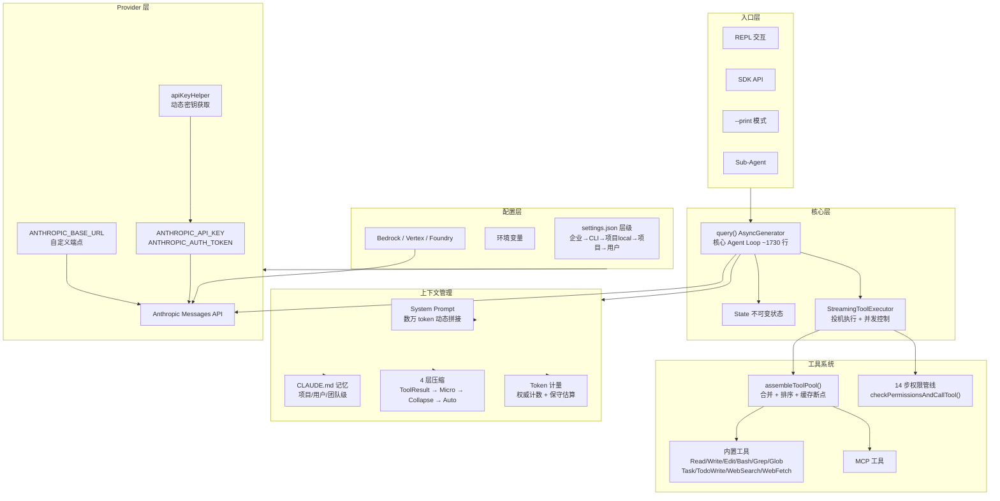

# Claude Code — 架构概述

> **所属系统**: Claude Code | **分析状态**: ✅ 核心架构已分析（2026-04-07）

## 模块定位

基于社区对泄露源码（v2.1.88，~512K 行 TypeScript）的分析，还原 Claude Code 的整体架构。

## 信息来源与可信度

| 来源 | 类型 | 可信度 |
|------|------|--------|
| [cablate/claude-code-research](https://github.com/cablate/claude-code-research) | 75 份源码分析报告 | ★★★★☆ |
| [claude-code-from-source](https://claude-code-from-source.com) | 18 章系统化架构书 | ★★★★☆ |
| [thtskaran/claude-code-analysis](https://github.com/thtskaran/claude-code-analysis) | 82 份分析文档 + 16 张架构图 | ★★★★☆ |
| [Haseeb Qureshi gist](https://gist.github.com/Haseeb-Qureshi/d0dc36844c2805236e44ec3935e9095d) | 架构分析 + Codex 对比 | ★★★★☆ |
| [Anthropic 官方文档](https://docs.anthropic.com/en/docs/claude-code) | 官方功能说明 | ★★★★★ |

> 以上一级来源均基于 2026.3.31 泄露的 v2.1.88 源码。分析结论经过作者转述，使用时需交叉验证。

## 整体架构图

## 核心组件

### 1. Agent Loop — `query()` 异步生成器

Claude Code 的心脏。所有入口（REPL、SDK、子 Agent、`--print`）都走同一条路径。

- **形式**：`async function* query()` — ~1730 行
- **循环模式**：`while(true) { callModel → 收集 tool_use → 执行工具 → 追加 tool_result → 再调模型 }`
- **终止**：`stop_reason !== tool_use` 或达到预算/轮次/中止等条件
- **终止原因**：10 种 `Terminal` 判别联合
- **状态管理**：不可变——每次迭代重建整个 State 对象
- **为什么用 AsyncGenerator**：背压控制、类型安全的 return 值、`yield*` 可组合子生成器

### 2. 工具系统

**14 步工具执行管线** (`checkPermissionsAndCallTool()`)：

1. 工具查找（含别名）
2. 中止检查
3. Zod Schema 校验
4. 语义校验（如无意义编辑）
5. Auto 模式投机分类器启动
6. Input backfill（路径展开等）
7. PreToolUse hooks
8. 权限解析（规则 + 模式 + 工具自带 `checkPermissions()`）
9. 权限拒绝时 PermissionDenied hooks
10. 执行 `call()`
11. 结果体量控制（超大结果落盘 + 摘要）
12. PostToolUse hooks
13. 注入 newMessages
14. 错误分类与遥测

**投机执行**（`StreamingToolExecutor`）：
- 模型仍在流式输出时，对声明为并发安全的工具提前启动
- `isConcurrencySafe(input)` 随输入变化（如 Bash 只读命令可并行，破坏性命令串行）
- 不安全工具排队到响应结束

**工具声明**（`buildTool()` 工厂）：
- `isParallelSafe` / `isReadOnly` 等默认 fail-closed
- `ToolResult` 可带 `newMessages`（子 Agent 转录）、`contextModifier`（切换模式等）

### 3. 上下文管理

**4 层压缩**（在每次 API 调用前按顺序尝试）：

| 层 | 名称 | 机制 |
|----|------|------|
| L0 | ToolResultBudget | 按工具单条结果字符上限裁剪 |
| L1 | MicroCompaction | 按 tool_use_id 丢弃过期大段 tool result |
| L2 | ContextCollapse | 用摘要替换早期消息片段 |
| L3 | AutoCompact | fork 子对话做重度摘要，带连续失败熔断（3 次） |

**阈值**：
- `effectiveContextWindow = contextWindow - min(modelMaxOutput, 20000)`
- Auto-compact 约在 `effectiveWindow - 13_000 tokens` 触发
- 硬阻塞约在 `effectiveWindow - 3_000`
- 与 `413 / prompt_too_long` 后的 reactive compact 配合

**Token 计量**：权威计数（最近一次 API 回报）+ 对新消息的保守估算，使 compact 略早触发而非略晚。

### 4. Provider 层 — 只支持 Anthropic

**与 OpenClaw 的根本差异**：Claude Code 只支持 Anthropic API 格式，不支持 OpenAI 兼容端点。

**配置机制**：

| 方式 | 说明 |
|------|------|
| `ANTHROPIC_API_KEY` | 作为 `X-Api-Key` 发送 |
| `ANTHROPIC_AUTH_TOKEN` | 作为 `Authorization: Bearer` 发送 |
| `ANTHROPIC_BASE_URL` | 覆盖默认 API 根地址（用于代理/网关） |
| `apiKeyHelper` | settings.json 中配置的脚本，动态获取密钥（适配 Vault 等） |
| Bedrock / Vertex / Foundry | 专用环境变量（`ANTHROPIC_BEDROCK_BASE_URL` 等） |

**限制**：
- 非 Anthropic API 格式的端点需要外部网关翻译
- `ANTHROPIC_BASE_URL` 指向非官方主机时，MCP 工具搜索默认关闭
- 社区通过 fork（如 OpenClaude）或反向代理（如 claude-code-openai-wrapper）绕过

**settings.json 层级**（高覆盖低）：
1. 企业托管策略 `managed-settings.json`
2. CLI 参数
3. 项目 `.claude/settings.local.json`
4. 项目 `.claude/settings.json`
5. 用户 `~/.claude/settings.json`

### 5. 权限系统

- **多种模式**：`default`、`plan`、`acceptEdits`、`auto`、`dontAsk`、`bypassPermissions`、子 Agent 的 `bubble`（上浮到父级）
- **Auto 模式分类器**：双阶段（快路径少量 token / 慢路径长推理 + 缓存命中）
- **Bash 安全**：手写 Bash AST（~4000 行），未知 AST 节点 fail-closed

### 6. 子 Agent

- Task 工具 = 再开一条 `query()`
- 子上下文隔离，权限可通过 `bubble` 上浮到父级
- 子 Agent 的转录通过 `ToolResult.newMessages` 传回

## 与 OpenClaw 的架构对比

| 维度 | Claude Code | OpenClaw | 启示 |
|------|------------|---------|------|
| 产品形态 | CLI 工具 | 个人助手平台（多通道） | 不同定位导致架构差异 |
| Agent Loop | 单层 ~1730 行 query() | 双层：Pi 内层 + 外层编排 | 双层分离概念更好 |
| 工具执行 | 14 步管线 + 投机执行 | 委托 Pi + before/after 钩子 | Claude Code 更成熟 |
| 上下文管理 | 4 层压缩 + 熔断器 | Context Engine + compaction | Claude Code 更精细 |
| Provider 支持 | 仅 Anthropic | 多 Provider（OpenAI、Google 等） | OpenClaw 更开放 |
| 状态管理 | 不可变 | 可变 | Claude Code 更安全 |
| 权限 | 多模式 + AST 分析 | Hook 驱动 | Claude Code 更严格 |
| 可观测性 | 内部遥测不开放 | 事件回调 | 两者都不够好 |
| 可扩展性 | 需改核心函数 | 插件 + Hook | OpenClaw 更灵活 |

## 引用此分析的认知问题

- [q01-核心智能框架](../../_private/questions/q01-core-intelligence-framework.md)
- [q02-Agent Loop 设计](../../_private/questions/q02-agent-loop-design.md)
- [q03-Provider 架构](../../_private/questions/q03-provider-architecture.md)
