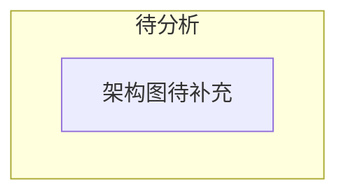

# Claude Code — 架构概述

> **所属系统**: Claude Code | **分析状态**: 待分析

## 模块定位

基于公开的架构分析和社区整理资料，还原 Claude Code 的整体架构。

## 信息来源与可信度

<!-- 每条分析结论都需标注来源 -->

| 来源 | 类型 | 可信度 |
|------|------|--------|
| — | — | — |

## 整体架构图

## 核心组件

<!-- 分析后填充 -->

## 与 OpenClaw 的架构对比

| 维度 | Claude Code | OpenClaw | 启示 |
|------|------------|---------|------|
| — | — | — | — |

## 引用此分析的认知问题

<!-- 被引用时补充链接 -->
