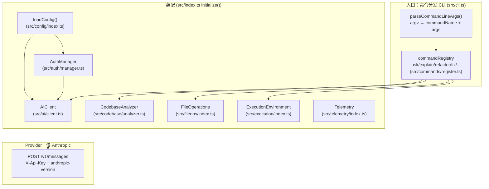

# Claude Code — 架构与方案设计总览

> **分析状态**：基于本地三件套（deobfuscation 源码 + reverse 真实 prompt/schema）重核 ｜ **更新日期 2026-05-25**

本文档**覆盖**了旧版本。旧版是基于社区博客/第三方分析仓库（自标可信度 ★★★★☆）转述写成的、针对 v2.1.88 的叙述；本次改为以本地材料为唯一事实来源，旧文结论一律重核，核到才写真实值，核不到明确标注「未在本地材料确认」。

## 1. 信息来源与可信度

| 来源 | 类型 | 它真正是什么版本 | 可信度 | 用途 |
|------|------|------|--------|------|
| `_refs/claude-code-deobfuscation/` | cleanroom 重写源码（`claude-code/src/`、`specs/`） | **早期 Research Preview。`specs/index.md`/`specs/development.md` 自述对应 v0.2.29（基于编译 bundle 分析得出），但 `package.json` 实标 `version: '0.1.0'`——两者不一致，正文以源码 `package.json` 为准；默认模型 `claude-3-opus-20240229`** | 高（真实代码，但版本旧） | 读实现 |
| `_refs/claude-code-reverse/results/` `logs/` | 抓取并存盘的真实 API 请求/响应（monkey-patch `beta.messages.create`） | **较新版本，主循环用 `claude-sonnet-4-20250514`，抓取日期 2025-07-28** | 高（模型实际收到的原文） | 看 prompt/schema |
| `_refs/claude-code-reverse/v1/` | LLM 对 minified `cli.mjs` 的猜测式还原 | 早期（2025 初） | 低（作者自述是"分析 uglify JS 的实验"，非可靠源） | 仅参考、不引为事实 |
| `_refs/claude-code-analysis/` | 源码文档索引（`DOCUMENTATION.md` + `src/` 目录清单） | 更晚的大型源码树（40+ 工具、100+ 命令、Bun、Ink、MCP、voice、plugins） | 中（导读/定位，非终极事实） | 定位模块在哪 |

### 关键前置事实（影响全文阅读）

本地三件套**不是同一个版本的 Claude Code**，必须分开看：

- **deobfuscation 是早期命令行版**：形态是 `claude-code <command>`（`ask` / `explain` / `refactor` / `fix` / `generate` 等子命令分发），不是对话式 REPL。它**没有**旧文描述的 `query()` AsyncGenerator 主循环、14 步权限管线、Bash AST、多层压缩、`settings.json` 层级、Bedrock/Vertex（见 §5 重核结论）。
- **reverse 是较新的对话式 Agent 版**：通过拦截真实 API 流量得到，能看到现代版"模型实际收到什么"，但看不到客户端内部实现（如压缩触发阈值、权限管线步数）。
- **analysis 索引的又是更晚的大树**：可用于知道现代版有哪些模块，但其细节本次不作为事实写入。

因此：现代架构的"实现细节"（管线步数、压缩层数、AST 行数等）在本地材料中**无法逐一证实**；本文把能证实的写实，把仅能定位/旁证的明确标注。

## 2. 整体架构图

下图基于 **deobfuscation 早期版的真实模块**（`src/index.ts` 的 `initialize()` 装配顺序）。现代对话式架构请见 §4（基于 reverse）。

## 3. 核心子系统（以 deobfuscation 早期版源码为准）

每条都落到具体文件。路径相对 `_refs/claude-code-deobfuscation/claude-code/`。

### 3.1 入口与生命周期
- **CLI 入口**：`src/cli.ts` — `initCLI()` 注册命令 → `authManager.initialize()` → `parseCommandLineArgs()`（`process.argv.slice(2)`，第一个 token 作命令名）→ `commandRegistry.get()` → 若 `command.requiresAuth` 则 `initAI()` → `executeCommand()`。没有"统一 query 入口"，是**命令对象分发**。
- **应用装配/主循环**：`src/index.ts` — `initialize()` 顺序构造各子系统并返回 `AppInstance`；`run()` 里 `app.commands.startCommandLoop()` 是交互循环；`shutdown()` 做清理 + 提交遥测。
- **入口分类**：本地源码只有 CLI 一种入口（命令行 + 交互命令循环）。旧文的「REPL / `--print` / SDK / sub-agent 四入口同走一条 query()」**未在 deobfuscation 确认**（该版本无 SDK/子 Agent/print 模式的实现）。

### 3.2 与模型交互（无工具循环）
- **AIClient**：`src/ai/client.ts` — `complete()` / `completeStream()` 直接 `POST {apiBaseUrl}/v1/messages`，头部 `X-Api-Key` + `anthropic-version: '2023-06-01'` + `User-Agent: 'claude-code-cli'`；`DEFAULT_CONFIG.defaultModel = 'claude-3-opus-20240229'`，`apiBaseUrl = 'https://api.anthropic.com'`；超时 60s、`withRetry` 最多 3 次。
- **关键事实**：这一版**没有** agentic 工具调用循环——`AIClient` 只做单次/流式补全，没有"收 tool_use → 执行 → 回灌 tool_result → 再调"的 while 循环，也没有 `tools` 字段。现代版的 Agent Loop 见 §4（只能从 reverse 旁证，看不到实现）。
- **prompt 模板**：`src/ai/prompts.ts` — 一组静态字符串模板（`CODE_ASSISTANT_SYSTEM_PROMPT` 等）+ `formatPrompt()` 占位符替换。与现代版动态拼接的 system prompt 完全不同。

### 3.3 工具/执行（仅 Shell 执行，无工具系统）
- **ExecutionEnvironment**：`src/execution/index.ts` — `executeCommand()` 用 Node `child_process.exec`；安全靠**正则黑名单** `DANGEROUS_COMMANDS`（6 条正则：`rm -rf /`、`dd of=/dev/...`、`mkfs`、fork bomb、覆写磁盘设备、`sudo` + 危险命令）+ 可选 `allowedCommands` 白名单；默认超时 30s、`maxBuffer` 5MB；支持后台进程 + 退出时清理。
- **关键事实**：这是**正则黑名单**，**不是** Bash AST 解析器。旧文"~4000 行 Bash AST、未知节点 fail-closed"**在 deobfuscation 未确认**（本地无 AST 代码）。
- **没有工具系统/权限管线**：本地源码无 `Read/Write/Edit/Grep/Glob/Task` 等工具实现，无 `checkPermissionsAndCallTool`、无投机执行、无 `buildTool` 工厂。旧文"14 步管线 / 投机执行 / `isConcurrencySafe`"**全部未在 deobfuscation 确认**。

### 3.4 文件操作与代码库分析
- **FileOperations**：`src/fileops/index.ts`，`src/fs/operations.ts`（`fileExists`/`readTextFile`/`findFiles`）。`config.fileOps.maxReadSizeBytes` 默认 10MB。
- **CodebaseAnalyzer**：`src/codebase/analyzer.ts` — 扫描/索引项目文件，构建 `FileInfo`/`DependencyInfo`/`ProjectStructure`；`run()` 里以**后台分析**方式启动（`startBackgroundAnalysis()`）。

### 3.5 Provider 层（仅 Anthropic）
- 事实：`src/ai/client.ts` 与 `src/config/index.ts` 都只硬编码 `https://api.anthropic.com` + Anthropic 的 `/v1/messages` 协议。**确认"仅 Anthropic 协议"这一结论**。
- 但旧文的具体机制（`ANTHROPIC_BASE_URL`、`ANTHROPIC_AUTH_TOKEN`、`apiKeyHelper`、Bedrock/Vertex/Foundry 环境变量）**在 deobfuscation 未确认**：本地这版用的是 `CLAUDE_API_KEY` / `CLAUDE_API_URL` / `CLAUDE_MODEL`（`src/config/index.ts` 的 `loadConfigFromEnv()`）、以及 `ANTHROPIC_API_KEY`（`src/commands/register.ts` 的 login 命令）。

### 3.6 认证
- **AuthManager**：`src/auth/manager.ts` — 状态机（`INITIAL/AUTHENTICATING/AUTHENTICATED/REFRESHING/FAILED`），支持 **API Key** 与 **OAuth**（`src/auth/oauth.ts`，PKCE + 本地 `http://localhost:3000/callback` 回调，端点 `auth.anthropic.com/oauth2/...`）；OAuth token 到 80% 寿命自动刷新（`scheduleTokenRefresh()`）；token 落 `TokenStorage`（`src/auth/tokens.ts`）。

### 3.7 配置系统
- **loadConfig**：`src/config/index.ts` — 单层合并：`DEFAULT_CONFIG` → 按 `CONFIG_PATHS` 顺序找到**第一个**存在的配置文件（`.claude-code.json` / `.claude-code.js` / `~/.claude-code/config.json` / `~/.claude-code.json` / XDG / Windows APPDATA）即 `break` → 叠加环境变量 → 叠加 CLI 选项 → `validateConfig()`。
- **关键事实**：这是**单文件优先 + 环境变量 + CLI** 的简单合并，**不是**旧文描述的"企业→CLI→项目local→项目→用户"五层 `settings.json` 体系，也没有 `managed-settings.json`、`.claude.json` 运行时态、`CLAUDE.md` 记忆、`/config`/`/status`。旧文整段"多层级 Settings"**未在 deobfuscation 确认**（属于更晚版本，本地仅 analysis 索引旁证其存在）。

### 3.8 子 Agent / Task
- **deobfuscation 中不存在**。Task/子 Agent 的真实证据只在 reverse（`Task.tool.yaml`）与 reverse README 的分析，见 §4.4。

## 4. 模型实际收到了什么（基于 reverse 真实抓包）

本节是亮点：以下都是**模型真实收到的原文**，引自 `_refs/claude-code-reverse/`。这是较新的对话式版本（Sonnet 4）。

### 4.1 system prompt 的真实结构（分块 + 缓存断点）
`logs/basic.log:8` 是一条完整真实请求，可见 system 是**数组分块**，且打了 `cache_control: {type:"ephemeral"}` 断点：

- 第 1 块（独立缓存）：`results/prompts/system-identity.prompt.md` 全文——`You are Claude Code, Anthropic's official CLI for Claude.`
- 第 2 块（独立缓存）：`results/prompts/system-workflow.prompt.md` 全文——交互式 CLI 的行为准则。真实片段含：
  - 防御性安全约束：`IMPORTANT: Assist with defensive security tasks only.`
  - 简洁度硬约束：`You MUST answer concisely with fewer than 4 lines ... unless user asks for detail.`
  - 代码风格：`# Code style - IMPORTANT: DO NOT ADD ***ANY*** COMMENTS unless asked`
  - 任务管理：要求频繁用 `TodoWrite`、同一时刻只一个 `in_progress`
  - 提交约束：`NEVER commit changes unless the user explicitly asks you to`
  - 代码引用格式：`file_path:line_number`
  - 末尾追加运行环境 `<env>`（cwd / git repo / Platform / OS / Today's date）与 `You are powered by the model named Sonnet 4. The exact model ID is claude-sonnet-4-20250514.` + `Assistant knowledge cutoff is January 2025.` + git status。

### 4.2 first-message 前后注入的 system-reminder
- 首条 user message **前**插入 `results/prompts/system-reminder-start.prompt.md`：`# important-instruction-reminders`（"Do what has been asked; nothing more...""NEVER create files unless..."等），并动态加载环境信息。
- 首条 user message **后**插入 `results/prompts/system-reminder-end.prompt.md`：检查/加载 `TodoWrite` 短期记忆（空时提示"todo list is currently empty... DO NOT mention this to the user"）。
- 这些 reminder 在请求里以 user 消息的多个 text block 出现（见 `logs/basic.log:8` 的 messages[0].content）。

### 4.3 工具 schema 真实字段（引 `results/tools/*.yaml`）
真实加载的工具集（来自 `logs/basic.log:8` 的 `tools` 数组，顺序即真实顺序）：`Task, Bash, Glob, Grep, LS, ExitPlanMode, Read, Edit, MultiEdit, Write, NotebookRead, NotebookEdit, WebFetch, TodoWrite, WebSearch`。要点：

- **Bash**（`Bash.tool.yaml`）：description 里把"提交/PR 流程"写死成 prompt——`git commit` 必须用 HEREDOC、消息尾部带 `🤖 Generated with [Claude Code]` + `Co-Authored-By: Claude`；强制"禁用 `find`/`grep`/`cat`，改用 Grep/Glob/Read"；超时 `max 600000ms`、默认 120000ms；输出 >30000 字符截断。入参仅 `command`(必填)/`timeout`/`description`。
- **Read**（`Read.tool.yaml`）：默认读 2000 行、>2000 字符行截断、`cat -n` 行号；声明能读图片/PDF；`file_path` 必须绝对路径。
- **Edit**（`Edit.tool.yaml`）：编辑前必须先 `Read`；`old_string` 不唯一则失败，需更多上下文或 `replace_all`。
- **Grep**（`Grep.tool.yaml`）：built on ripgrep，明确禁止直接调 `grep`/`rg`；`output_mode` ∈ content/files_with_matches/count。
- **TodoWrite**（`TodoWrite.tool.yaml`）：超长 description（含大量 when/when-not 示例）；每条 todo schema = `content`+`status(pending/in_progress/completed)`+`priority(high/medium/low)`+`id`。

### 4.4 子 Agent（Task）暴露方式的真实文本
`results/tools/Task.tool.yaml`：description 里说明唯一可选 `subagent_type: general-purpose`（Tools: `*`）；要点（原文）：每次 Task **stateless**、结果对用户不可见需主 Agent 转述、"Launch multiple agents concurrently"；执行自定义 slash command 也走 Task（`Task(prompt="/check-file ...")`）。入参 `description`/`prompt`/`subagent_type` 三者必填。reverse README 进一步说明：子 Agent 把脏上下文隔离在子上下文、只把最终结果作为 tool result 回灌主上下文。

### 4.5 多模型分工（真实证据，引 `logs/`）
`logs/basic.log` / `compact.log` 里同一会话出现两种模型：
- **`claude-3-5-haiku-20241022`**：启动配额探测（`max_tokens:1`，content `"quota"`）、新话题判定（`check-new-topic.prompt.md`，`temperature:0`）、git 高频文件挑选（`check-active-git-files.prompt.md`）、历史摘要（`summarize-previous-conversation.prompt.md`，"under 50 characters"）。
- **`claude-sonnet-4-20250514`**：主 Agent 循环、上下文压缩（`compact.prompt.md` + system `system-compact.prompt.md`）。主循环请求 `temperature:1`、`max_tokens:32000`、`betas:[claude-code-20250219, oauth-2025-04-20, interleaved-thinking-2025-05-14, fine-grained-tool-streaming-2025-05-14]`。

### 4.6 上下文压缩的真实 prompt
- `results/prompts/compact.prompt.md`：要求模型在 `<analysis>` 标签内逐条复盘后产出 8 段式结构化摘要（Primary Request / Key Technical Concepts / Files and Code Sections / Errors and fixes / Problem Solving / All user messages / Pending Tasks / Current Work / Optional Next Step）。
- `results/prompts/system-compact.prompt.md`：压缩时 system 仅一句 `You are a helpful AI assistant tasked with summarizing conversations.`
- 压缩**触发阈值/层数**：API 流量看不到（属客户端内部），**未在本地材料确认**。reverse README 仅定性说明"手动或上下文不足时触发，把上下文压成一段文本作为下次会话起点"。

## 5. 关键方案抉择与取舍（每条标注证据层）

1. **仅支持 Anthropic 协议**（deobf `src/ai/client.ts` + reverse `logs/*` 全部走 `/v1/messages` / `beta.messages.create`）。为什么：与自家模型/beta 头（`claude-code-20250219` 等）深度耦合，可用最新能力（interleaved-thinking、fine-grained-tool-streaming）。代价：换 provider 需外部网关翻译；多 provider 灵活性让位于深度集成。

2. **system prompt 分块 + ephemeral 缓存断点**（reverse `logs/basic.log:8`）。怎么做：把"身份句""大段 workflow""最后一条带 env 的 user 块"分别打 `cache_control:ephemeral`。为什么：每轮都带巨大公共前缀，缓存断点让前缀命中缓存、只对增量计费/计算。代价：prompt 结构必须保持稳定前缀，改动靠前内容会让缓存失效。

3. **轻重模型分工**（reverse `logs/basic.log`、`compact.log`：Haiku 3.5 跑配额/话题/摘要/选文件，Sonnet 4 跑主循环/压缩）。为什么：高频低价值的边角判断用便宜快模型，省成本省延迟。代价：多一层模型编排与一致性管理。

4. **子任务用 stateless 子 Agent 隔离脏上下文**（reverse `Task.tool.yaml` + README §Task/Sub Agent）。怎么做：从主上下文抽出独立任务作为子上下文初始 prompt，结果以 tool result 回灌主上下文。为什么：把"搜了一堆无关文件"这类中间过程留在子上下文、用完即弃，主上下文只留结论。代价：子 Agent 无状态、不能多轮追问，prompt 必须一次写全。

5. **把"工程纪律"写死进 prompt/工具 description 而非靠模型自觉**（reverse `system-workflow.prompt.md`、`Bash.tool.yaml`、`Edit.tool.yaml`）。怎么做：提交流程/PR 流程/"先 Read 再 Edit"/"禁用 find|grep 改用工具"/"不许加注释"全部硬写。为什么：用确定性文本约束高频出错行为，降低不稳定。代价：prompt 体积膨胀、行为僵硬、改流程要改 prompt。

6. **早期版命令安全用正则黑名单 + 可选白名单**（deobf `src/execution/index.ts` 的 `DANGEROUS_COMMANDS`）。为什么：实现简单、拦住最典型的破坏性命令。代价：正则黑名单覆盖有限、易绕过——这正解释了为何更晚版本改走更复杂的权限/解析路径（本地无该实现，仅能推断动机）。

7. **早期版配置走"首个命中文件 + env + CLI"单层合并**（deobf `src/config/index.ts`）。为什么：对单用户 CLI 足够、零仪式。代价：无团队/企业/项目分层，无法做组织级护栏——更晚版本的多层 `settings.json`（analysis 索引旁证）是对此的演进。

8. **OAuth + API Key 双认证 + 自动刷新**（deobf `src/auth/manager.ts` + `oauth.ts`，PKCE/本地回调/80% 寿命刷新）。为什么：兼顾交互登录与脚本化（env key）。代价：本地回调端口（`localhost:3000`）在受限环境可能不可用。

## 6. 技术栈

- **deobfuscation 早期版**（`specs/architecture.md` + 源码）：TypeScript、Node.js ≥18、`child_process`、`fetch`、Sentry（`src/errors/sentry.ts`）、`open`（OAuth 拉浏览器）、Commander 风格命令注册。`specs/architecture.md` 自述"webpack/CommonJS"，但 `src/index.ts` 用 ESM `import ... .js`——**两处自相矛盾，未能在本地材料判定最终打包方式**。
- **reverse 抓到的较新版**：`@anthropic-ai/sdk`（`beta.messages.create`）、OAuth beta（`oauth-2025-04-20`）、ripgrep（Grep 工具）。reverse README 还提到该 `cli.mjs` 打包进 React/Ink/Yoga/Sentry/aws-sdk/zod/commander 等。
- **analysis 索引的更晚大树**（`DOCUMENTATION.md`，仅导读）：声称 Bun 打包、React+Ink、`@anthropic-ai/sdk`、`@modelcontextprotocol/sdk`、Zod v4、Chalk——**本次未在 deobfuscation/reverse 逐项证实**。

## 7. 设计评价（事实与评价分开）

事实（引路径）：
- 早期版是单 provider、命令分发、正则黑名单、单层配置、无工具循环（deobf `src/`）。
- 较新版把大量纪律硬编码进 prompt/工具 description，用缓存断点压成本，用轻重模型分工，用 stateless 子 Agent 隔离上下文（reverse `results/`、`logs/`）。

评价（标注为评价，非事实）：
- 〔评价〕"纪律硬写进 prompt"是用确定性文本压住 LLM 不稳定的典型工程取舍：可靠但僵硬、prompt 难维护。
- 〔评价〕轻重模型分工 + 缓存断点是成本/延迟导向的成熟做法，代价是编排复杂度上移。
- 〔评价〕从早期版（正则黑名单、单层配置）到更晚版（多层 settings、更复杂权限）的演进方向，与"单用户工具 → 团队/企业可治理工具"的产品阶段一致。

---

### 附：本文相较旧文的逐项重核结论

| 旧文论断 | 重核结论 |
|------|------|
| `query()` AsyncGenerator ~1730 行、十种 Terminal、不可变 State | **未在 deobfuscation 确认**（该版无此循环）；reverse 只能旁证存在 agent 循环，看不到行数/实现 |
| 14 步权限管线 `checkPermissionsAndCallTool()` | **未在本地材料确认**（deobf 无；reverse 看不到客户端内部步数） |
| 投机执行 / `isConcurrencySafe` / `StreamingToolExecutor` | **未在本地材料确认** |
| 4 层压缩（ToolResult/Micro/Collapse/Auto）+ 具体 token 阈值 | **层数与阈值均未确认**；reverse 仅有压缩 prompt 原文，触发逻辑看不到 |
| ~4000 行 Bash AST、未知节点 fail-closed | **未确认**；deobf 实为 6 条正则黑名单（`src/execution/index.ts`） |
| settings.json 五层级 + managed-settings + `/config`/`/status` | **未在 deobf 确认**；deobf 为单层合并（`.claude-code.json`+env+CLI）；五层级仅 analysis 索引旁证 |
| `ANTHROPIC_BASE_URL`/`AUTH_TOKEN`/`apiKeyHelper`/Bedrock/Vertex | **未在本地材料确认**；deobf 用 `CLAUDE_API_KEY`/`CLAUDE_API_URL`/`CLAUDE_MODEL` 与 `ANTHROPIC_API_KEY` |
| 四入口（REPL/print/SDK/sub-agent）统一走 query() | **未确认**；deobf 仅命令行 CLI |
| 仅支持 Anthropic 协议 | **确认**（deobf `src/ai/client.ts` + reverse 全部走 `/v1/messages`） |
| 子 Agent 隔离上下文、结果回灌 | **确认（现代版）**，证据为 reverse `Task.tool.yaml` + README |
