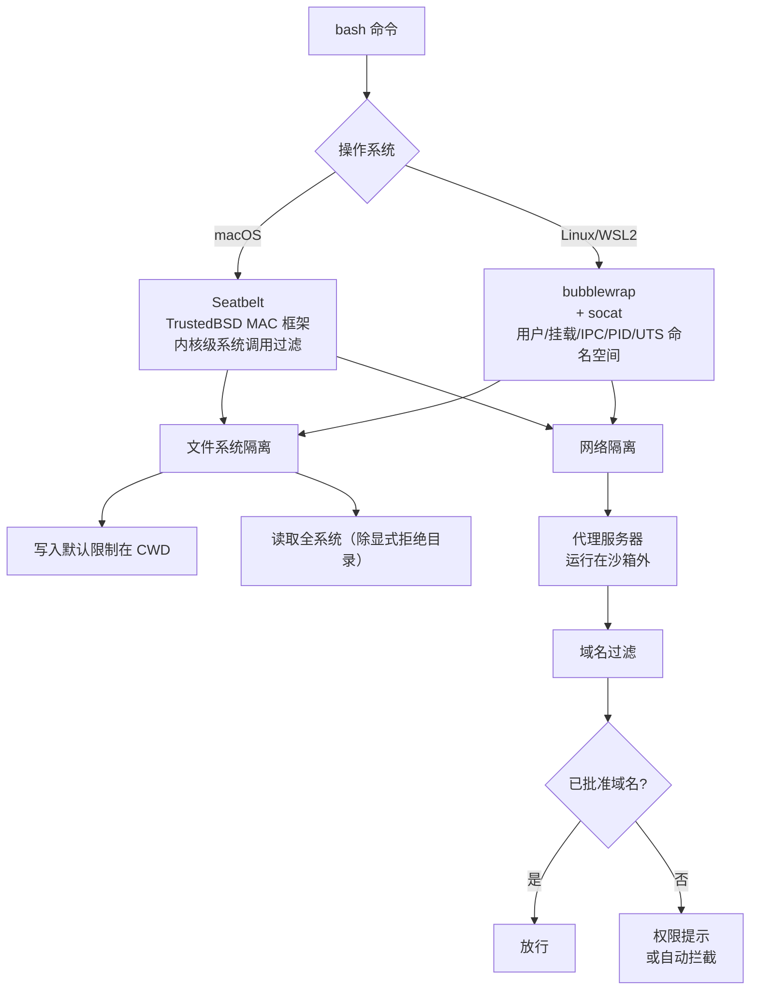
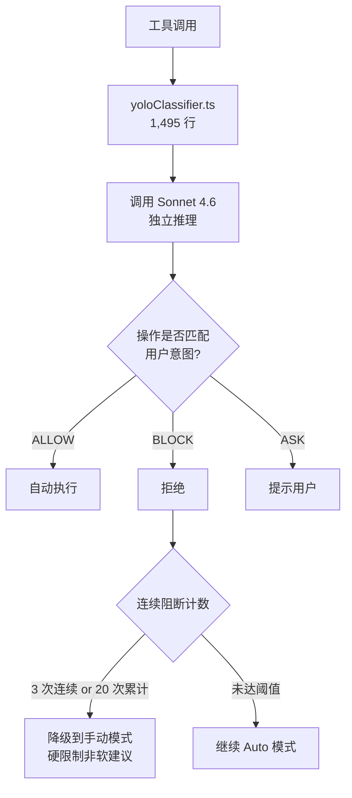

# Claude Code 安全系统 — 源码解析

> **所属系统**: Claude Code | **分析状态**: 已完成
> **信息来源**: 2026 年 3 月 npm source map 泄露 + 官方文档 + 社区分析

## 模块定位

Claude Code 的安全系统是整个产品中最复杂的子系统之一。它采用 **8 层纵深防御** 架构，从构建时消除到运行时 OS 级沙箱，形成了当前智能体产品中最完整的安全实现。权限系统代码量达 52K+，Bash 安全模块 2,592 行含 23 项编号检查。

## 模块结构

```
src/
├── permissions.ts              # 权限系统核心（52K）
├── tools/
│   └── BashTool/
│       └── bashSecurity.ts     # Bash 安全校验（2,592 行，23 项检查）
├── yoloClassifier.ts           # Auto 模式分类器（1,495 行）
├── sandbox/                    # OS 级沙箱运行时
├── bypassPermissionsKillswitch.ts  # 服务端权限绕过紧急开关
├── promptCacheBreakDetection.ts    # 缓存断裂检测
├── undercover.ts               # 内部代号隐藏
└── SystemPromptBuilder.ts      # 系统提示构建（含安全指令层）
```

## 核心数据结构

### 权限模式

```typescript
type PermissionMode =
  | "default"           // 写入/bash/MCP 需确认
  | "acceptEdits"       // 文件编辑自动批准，bash 仍需确认
  | "dontAsk"           // 全部自动批准
  | "bypassPermissions" // 跳过所有检查（--dangerously-skip-permissions）
  | "auto";             // 分类器逐操作决策
```

### 权限规则（8 源合并）

```typescript
type PermissionRule = {
  source: PermissionRuleSource;  // 8 种来源之一
  ruleBehavior: 'allow' | 'deny' | 'ask';
  ruleValue: {
    toolName: string;     // "Bash", "FileEdit", etc.
    expression?: string;  // 可选过滤表达式
  };
};

// 权限上下文（深度不可变）
type ToolPermissionContext = DeepImmutable<{
  mode: PermissionMode;
  alwaysAllowRules: ToolPermissionRulesBySource;
  alwaysDenyRules: ToolPermissionRulesBySource;
  alwaysAskRules: ToolPermissionRulesBySource;
  isBypassPermissionsModeAvailable: boolean;
  strippedDangerousRules?: ToolPermissionRulesBySource;
  shouldAvoidPermissionPrompts?: boolean;  // 后台智能体
}>;
```

### 工具权限分级

```typescript
// 19 个工具分三级权限
type ToolPermissionLevel = "ReadOnly" | "WorkspaceWrite" | "DangerFullAccess";

// ReadOnly: read_file, glob_search, grep_search, WebFetch, WebSearch, Skill, ToolSearch, Sleep
// WorkspaceWrite: write_file, edit_file, TodoWrite, NotebookEdit, Config
// DangerFullAccess: bash, Agent, REPL, PowerShell
```

## 核心流程

### 8 层纵深防御架构

```mermaid
flowchart TD
    A[工具调用请求] --> L1
    subgraph L1[Layer 1: 构建时消除]
        B1[feature() 函数<br/>Bun bundler DCE<br/>内部代码物理不存在于外部构建]
    end
    L1 --> L2
    subgraph L2[Layer 2: 功能开关紧急关闭]
        B2[GrowthBook 服务端 Feature Flags<br/>tengu_bypass_permissions_disabled<br/>tengu_auto_mode_config.enabled<br/>零延迟全球生效]
    end
    L2 --> L3
    subgraph L3[Layer 3: 配置规则合并]
        B3[8 源优先级合并<br/>allow / deny / ask 规则<br/>DeepImmutable 类型保护]
    end
    L3 --> L4
    subgraph L4[Layer 4: Auto 模式分类器]
        B4[yoloClassifier.ts<br/>Sonnet 4.6 独立推理<br/>判断操作是否匹配用户意图<br/>3 次连续阻断 → 降级手动]
    end
    L4 --> L5
    subgraph L5[Layer 5: 危险模式检测]
        B5[bashSecurity.ts<br/>23 项编号安全检查<br/>Zsh 扩展 / Heredoc / ANSI-C<br/>Unicode 零宽字符 / ztcp]
    end
    L5 --> L6
    subgraph L6[Layer 6: 文件系统权限验证]
        B6[62K 权限代码<br/>绝对路径规范化<br/>符号链接逃逸防护<br/>受保护路径 bypass-immune]
    end
    L6 --> L7
    subgraph L7[Layer 7: 信任对话框]
        B7[首次运行项目<br/>显示 .claude/ 配置内容<br/>MCP / Hook / Bash 规则<br/>获取用户显式同意]
    end
    L7 --> L8
    subgraph L8[Layer 8: 绕过模式紧急开关]
        B8[bypassPermissionsKillswitch.ts<br/>服务端即时禁用 bypass 模式<br/>强制回退到之前的权限模式]
    end
    L8 --> EXEC[安全执行]
```

### Bash 安全 23 项检查详情

| # | 攻击向量 | 防御手段 |
|---|---------|---------|
| 1-3 | Zsh `=cmd` 扩展 | 拦截 `=curl`, `=wget`, `=bash` 模式 |
| 4-6 | `zmodload` 内核模块加载 | 拦截 18 种 Zsh 内建命令 |
| 7-9 | Heredoc 注入 | 逐行内容匹配注入载荷 |
| 10-12 | ANSI-C 引用 (`$'\x41'`) | 混淆命令模式检测 |
| 13-15 | 进程替换 (`<()`, `>()`) | 在非信任上下文中拦截 |
| 16-18 | Unicode 零宽空格 | 不可见字符注入检测 |
| 19-21 | `ztcp` 网络原语 | 拦截 Zsh 网络外传 |
| 22-23 | 复合攻击 | 跨向量交叉校验 |

### OS 级沙箱实现



**关键设计**：
- **沙箱运行时已开源**：`@anthropic-ai/sandbox-runtime` npm 包
- **bubblewrap 网络隔离**：`--unshare-net` 阻断外部通信，通过 socat 将 localhost 流量转发到宿主机代理服务器进行域名过滤
- **子进程继承**：所有子进程（kubectl、terraform、npm 等）继承相同安全边界
- **逃逸舱口**：`dangerouslyDisableSandbox` 参数允许命令在沙箱外运行，但走正常权限流程
- **可关闭逃逸**：`allowUnsandboxedCommands: false` 完全禁用逃逸

### Auto 模式分类器



**关键设计**：
- **每次工具调用一次独立推理**：不是提示指令，而是真实的模型 API 调用
- **意图匹配而非安全判断**：分类器判断的是"操作是否符合用户当前请求的意图"
- **熔断机制**：3 次连续或 20 次累计阻断后降级到手动，防止误判循环
- **Fail-open 到人**：分类器 API 失败时降级到用户确认，而非自动拒绝

## 关键设计模式

### 1. 纵深防御（Defense in Depth）

8 层中任何一层被突破，后续层仍能拦截。Layer 1（构建时消除）被突破时 Layer 4（分类器）补位，Layer 4 被突破时 Layer 5（模式检测）补位。无单点故障。

### 2. 代码物理消除（Code Elimination）

`feature()` 在构建时让 Bun bundler 做死代码消除。`false` 分支中的 `require()` 被完全移除，不是运行时条件判断而是构建时物理删除。内部工具代码不存在于外部构建中。

### 3. 服务端即时控制

GrowthBook Feature Flags 实现零延迟全球功能开关。安全事件发生时无需客户端更新即可禁用功能，响应时间接近零。

### 4. 类型级安全（Type-Level Safety）

`DeepImmutable<>` 递归锁定权限上下文所有嵌套属性。权限规则构成安全边界，类型系统阻止代码中任何位置的意外修改。

### 5. 权限提示疲劳解决

沙箱模式 + Auto 分类器双重机制：沙箱提供 OS 级边界减少提示需求，Auto 分类器在边界内做智能判断。解决了"安全 vs 可用性"的核心矛盾。

## 值得关注的细节

1. **23 项 Bash 检查来自真实攻击**：每项编号检查背后都有真实的漏洞利用事件
2. **Zsh 特异性**：macOS 默认 shell 是 Zsh（Catalina 起），Zsh 的 `=cmd` 扩展等行为与 Bash 不同，多数安全工具只防 Bash
3. **反蒸馏防御**：`ANTI_DISTILLATION_CC` 注入假工具定义污染训练数据
4. **Undercover 模块**：隐藏内部代号（Capybara、Tengu），无 force-off 开关
5. **挫败感检测**：`userPromptKeywords.ts` 用正则（非 LLM）检测用户不满，调整行为
6. **Companion Pet 系统**：基于用户 ID 哈希的确定性宠物系统（Mulberry32），5 属性 + 5 稀有度，ASCII 渲染零开销
7. **250K API 调用/天浪费**：自动压缩失败循环导致，修复仅 3 行（`MAX_CONSECUTIVE_AUTOCOMPACT_FAILURES = 3`）

## 安全模型总评

| 维度 | 评价 |
|------|------|
| **沙箱隔离** | ✅✅ OS 级沙箱（Seatbelt/bubblewrap）；文件+网络双隔离；子进程继承 |
| **权限控制** | ✅✅ 8 层纵深防御；5 种权限模式；8 源规则合并；Auto 分类器 |
| **工具安全** | ✅✅ 23 项 Bash AST 检查；危险模式检测；解释器拦截 |
| **配置安全** | ✅✅ 信任对话框；服务端紧急开关；构建时代码消除 |
| **不足** | ⚠️ ~7000 行 Bash 安全代码维护成本极高；Auto 模式每次工具调用加一次推理（延迟+成本）；macOS 沙箱弱于 Linux |

## 引用此分析的认知问题

- [05-安全模型](../../insights/05-security-model/_overview.md)
