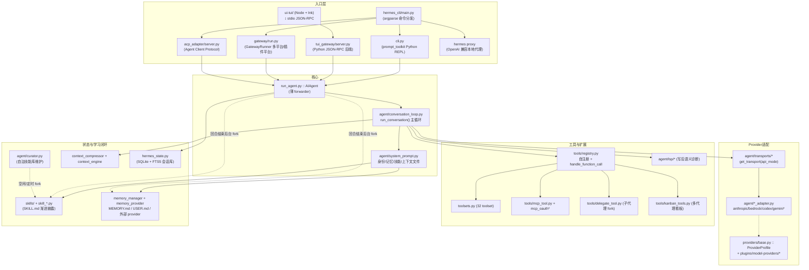
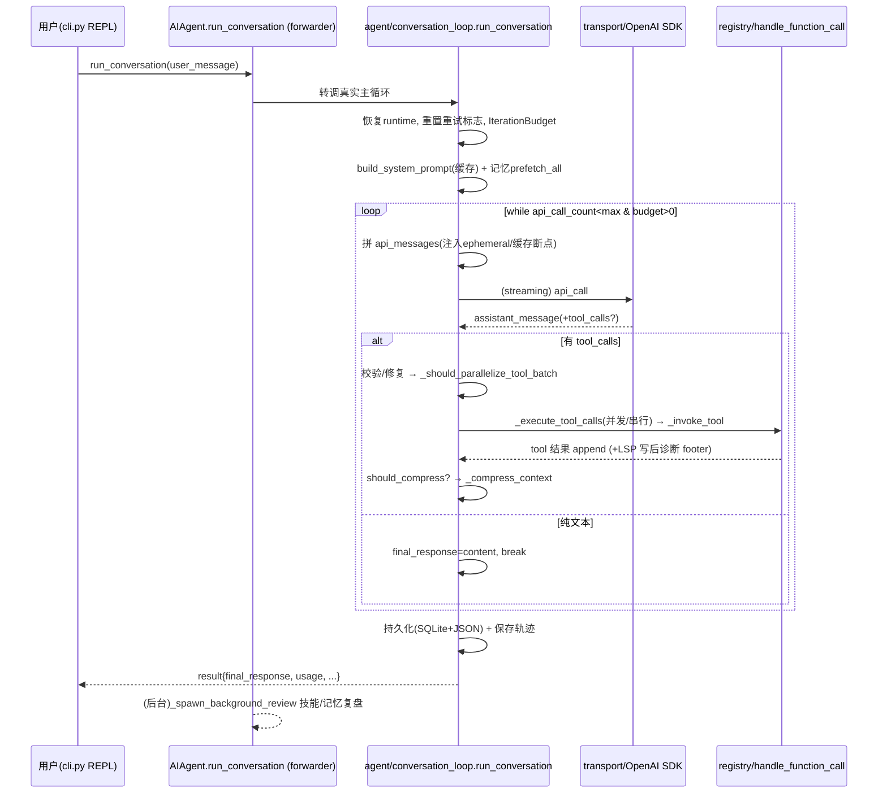

# Hermes Agent 架构与方案设计总览

> **分析状态** 基于真实源码通读（重点段落逐行核对，`run_agent.py` 仅读关键段；本轮为 0.11.0 → 0.14.0 版本对照重核）  **仓库** github.com/NousResearch/hermes-agent  **本地** `_refs/hermes-agent-main`  **版本** pyproject 标注 `0.14.0`（跳过 0.12/0.13）  **更新日期 2026-05-25**

一句话定性：Hermes Agent 是一个以 **`AIAgent`（`run_agent.py`）主循环为核心、绝大部分运行期逻辑已下沉到 `agent/*.py` 子模块** 的 Python 智能体框架；它外挂多入口前端（Python TUI / Node Ink TUI / 多平台消息网关 / ACP），通过 **provider transport 抽象 + 自注册工具 registry + 文件系统化技能/记忆** 实现"自我改进"闭环。0.12 起新增 **自治 Curator（技能库维护）**，0.13 起 **provider 与 gateway 平台都改成插件（plugins/）架构**、新增 **多代理 Kanban**，0.14 起新增 **LSP 写后诊断、Codex app-server runtime、`hermes proxy` OpenAI 兼容本地代理** 等架构级子系统。

> **本轮版本对照的结构性发现（重要）**：旧文把 `AIAgent` 描述为"单体巨型 ~13441 行类，几乎全部运行期复杂度收敛在一个类里"。**该论断在 0.14.0 已不成立**。`run_agent.py` 现为 **4410 行**（193,926 字节，单行极长 + 大量 docstring），其中 `AIAgent` 的几乎所有重逻辑方法（`run_conversation` / `__init__` / `_build_system_prompt` / `_spawn_background_review` / `_anthropic_prompt_cache_policy` / codex runtime 等）已变成 **薄 forwarder**，真正实现迁移到 `agent/` 目录下的 ~70 个模块（`agent/conversation_loop.py`、`agent/agent_init.py`、`agent/system_prompt.py`、`agent/tool_executor.py`、`agent/tool_dispatch_helpers.py`、`agent/background_review.py`、`agent/agent_runtime_helpers.py`、`agent/curator.py` 等）。下文论断已据此重定位行号/路径。

---

## 1. 整体架构图

---

## 2. 核心子系统

### 2.1 入口层

- **CLI 命令分发** — `hermes_cli/main.py`。基于 `argparse`（非 fire），`cmd_chat`/`cmd_gateway`/`cmd_setup`/`cmd_proxy` 等函数对应子命令；`hermes` 默认进交互聊天。`pyproject.toml:209-212` 声明三个 console script：`hermes=hermes_cli.main:main`、`hermes-agent=run_agent:main`、`hermes-acp=acp_adapter.entry:main`。
- **Python REPL（cli.py）** — `cli.py`（约 676 KB / 14928 行，`HermesCLI` 类）。在进程内构造并驱动 `AIAgent`（`from run_agent import AIAgent` → 构造 `self.agent = AIAgent(...)` → 调 `self.agent.run_conversation(...)`），是 prompt_toolkit 交互界面。
- **Node Ink TUI** — `ui-tui/`（`package.json` name `hermes-tui`），TypeScript + Ink；它不直接持有 Python，而是 spawn `tui_gateway/server.py`，二者通过 **换行分隔的 stdio JSON-RPC** 通信（`AGENTS.md:192-209` 确认）。`tui_gateway` 进程内才持有 `AIAgent + tools + sessions`。0.14 起 wheel 直接打包 Ink TUI 与 shell launcher（`pyproject.toml:218` 的 `tui_dist/**/*`、`web_dist/**/*`）。
- **消息网关** — `gateway/run.py` 的 `GatewayRunner` / `start_gateway()`。每会话一个 `AIAgent`，受 LRU 上限约束：`_AGENT_CACHE_MAX_SIZE = 128`、`_AGENT_CACHE_IDLE_TTL_SECS = 3600.0`（`gateway/run.py:64-65`）。**核心平台适配器** 约 30 个 `.py`（`gateway/platforms/`，`base.py` 为基类）；**0.12/0.13 起 gateway 成为插件宿主**，第三方平台改放 `plugins/platforms/`（当前含 discord/google_chat/irc/line/mattermost/ntfy/simplex/teams 等，见 §3(8)）。网关进程内 cron ticker 每 tick 还顺带 `cron/scheduler.py` 到期任务与 **Curator**（`gateway/run.py:17957`，见 2.5）。
- **ACP 适配** — `acp_adapter/server.py`（依赖 `agent-client-protocol`），把 Hermes 暴露为 ACP server 供编辑器集成；0.13 起支持 `/steer`、`/queue`，0.14 起进入 Zed ACP Registry（`uvx` 安装）。
- **OpenAI 兼容本地代理（0.14 新增）** — `hermes proxy`（`hermes_cli/main.py:1823 cmd_proxy` → `hermes_cli/proxy/cli.py`）起一个本地 `http://localhost:port` 端点，说 OpenAI API 但后端是某个 OAuth 订阅（Claude Pro / ChatGPT Pro / SuperGrok），让任意 OpenAI 兼容工具复用订阅（RELEASE_v0.14.0 Highlights）。

### 2.2 AIAgent 主循环（核心）

- 真实类：`class AIAgent`（`run_agent.py:327`），自述 "AI Agent with tool calling capabilities … manages the conversation flow, tool execution, and response handling"。`__init__`（`run_agent.py:350`）参数约 64 个（凭证、路由、约 15 个回调、failover、checkpoint 等），**本体是 forwarder**：`from agent.agent_init import init_agent; init_agent(self, ...)`（`run_agent.py:417-419`）；`AGENTS.md:85` 仍标 "~60 parameters"。
- 主循环方法：`run_conversation()`（`run_agent.py:4154`）为 forwarder → 真实实现 `agent/conversation_loop.py:232 run_conversation(...)`（该文件 **4259 行**，是真正的主循环载体）。公开便捷封装 `chat()`（`run_agent.py:4167`）只是取 `run_conversation(...)["final_response"]`。循环 **完全同步**（`AGENTS.md:121` "entirely synchronous"）。
- 真实主循环 `while`（`agent/conversation_loop.py:644`）：
  `while (api_call_count < agent.max_iterations and agent.iteration_budget.remaining > 0) or agent._budget_grace_call:`
  每次迭代：新回合 checkpoint dedup → 检查 `_interrupt_requested` → 消费 `IterationBudget`（类已迁至 `agent/iteration_budget.py:17`，父子代理共享）→ `step_callback` → 技能 nudge 计数 → 拼 `api_messages`（注入 ephemeral 系统提示、记忆 prefetch、插件 `pre_llm_call` context、Anthropic 缓存断点）→ API 调用 → 解析响应；有 `tool_calls` 则校验/修复 → 执行 → 按需压缩 → 继续；纯文本即 `final_response` 并退出。`max_iterations` 默认 90（`run_agent.py:361`）。
- 工具分发：`_invoke_tool`（`run_agent.py:4107` forwarder）→ `agent/tool_executor.py` / `agent/tool_dispatch_helpers.py`。`todo`/`memory`/`session_search`/`clarify`/`delegate_task` 等由 agent 层 **拦截直处理**（agent-level tools，`AGENTS.md:307` 确认 todo/memory），其余落到 `handle_function_call(...)`（`model_tools.py`）走 registry。
- 并发/串行决策：`_should_parallelize_tool_batch`（`agent/tool_dispatch_helpers.py:103`）——含 `_NEVER_PARALLEL_TOOLS`（`tool_dispatch_helpers.py:41`，当前 `frozenset({"clarify"})`）一律串行；路径型工具 `_PATH_SCOPED_TOOLS`（`:59`，`{"read_file","write_file","patch"}`）需路径不重叠才并发；只读型在 `_PARALLEL_SAFE_TOOLS`（`:44`）白名单内方可并发，否则串行。`_execute_tool_calls`（`run_agent.py:4065` forwarder）分派到 `_execute_tool_calls_concurrent`（`run_agent.py:4139`）或 `_execute_tool_calls_sequential`（`run_agent.py:4144`）。
- 终止/收尾：`_handle_max_iterations`（`run_agent.py:4149` forwarder）在预算耗尽时去工具再请求一次让模型总结（调用点 `agent/conversation_loop.py:3969`）；循环后统一持久化与诊断日志（"Turn ended: reason=…"）。

### 2.3 Provider 适配层

- **transport 抽象**：`agent/transports/`。`ProviderTransport`(ABC) 定义 `convert_messages / convert_tools / build_kwargs / normalize_response`（`agent/transports/base.py`），并显式声明它 **不** 拥有 client 构造、流式、凭证刷新、prompt caching、interrupt、retry——"Those stay on AIAgent"。注册表 `register_transport`/`get_transport(api_mode)`（`agent/transports/__init__.py:21/26`），按需 `_discover_transports`（`:49`）懒导入 anthropic/codex/chat_completions/bedrock。`AIAgent._get_transport`（`run_agent.py:3429`）做 per-api_mode 缓存。transport 模块当前包含：`anthropic.py`、`bedrock.py`、`chat_completions.py`、`codex.py`、`codex_app_server.py`、`codex_app_server_session.py`、`codex_event_projector.py`、`hermes_tools_mcp_server.py`（**0.14 新增 codex app-server 系列**，见 §3）。
- **api_mode 取值**（源码实测引用）：`chat_completions`、`anthropic_messages`、`codex_responses`、`bedrock_converse`。模型→api_mode 判定见 `_model_requires_responses_api`（`run_agent.py:998`，对 `gpt-5*` 走 Responses API）与 `_provider_model_requires_responses_api`（`run_agent.py:1013`）。
- **provider 适配器**：`agent/*_adapter.py` 共 6 个——`anthropic_adapter.py`、`azure_identity_adapter.py`（**新增**，Azure 身份/凭证）、`bedrock_adapter.py`、`codex_responses_adapter.py`、`gemini_native_adapter.py`、`gemini_cloudcode_adapter.py`。Gemini 两个适配器是"OpenAI 兼容外观"，对 `chat_completions` 路径做 shim（原生路径"avoids the OpenAI-compat layer entirely"，因兼容端点对多轮工具循环"brittle"）。
- **provider 插件化（0.13 架构级新增）**：`providers/base.py:39 class ProviderProfile` 为 provider ABC，第三方 provider 改放 `plugins/model-providers/<name>/`（当前含 ai-gateway/alibaba/anthropic/arcee/azure-foundry/bedrock/copilot 等大量目录 + `README.md`），"Drop in third-party providers without touching core"（RELEASE_v0.13.0）。0.12-0.14 还新增大量内置/插件 provider：LM Studio 升为一等公民、GMI Cloud、Azure AI Foundry、MiniMax OAuth、Tencent Tokenhub、NovitaAI、xAI SuperGrok OAuth、Alibaba Cloud 改名 Qwen Cloud 等。
- **统一方式（分析）**：源码未把所有 provider 统一成单一 transport——而是 **双层**：标准走 OpenAI SDK 的 `chat_completions`（含 OpenRouter / 各家 OpenAI 兼容端点），少数协议差异大的（Anthropic、Bedrock、Codex Responses、原生 Gemini）才用独立 transport/adapter；provider 的"身份/路由/能力"元数据则收敛到 `ProviderProfile` + `plugins/model-providers/`。

### 2.4 工具系统与 toolsets

- **自注册 registry**：`tools/registry.py`。每个工具文件在模块顶层 `registry.register(...)`（`tools/registry.py:234 def register`）。`discover_builtin_tools`（`:57`）用 **AST 解析**（`_module_registers_tools` `:42`、`_is_registry_register_call` `:29`）判断模块体内是否真有 `registry.register(...)` 调用再导入，避免误导入 helper。`register` 拒绝跨 toolset 同名 shadowing；`deregister`（`:307`）供 MCP `tools/list_changed` 时 nuke-and-repave。
- **toolsets**：`toolsets.py`，`TOOLSETS` 字典 **32 个 toolset**（`toolsets.py:88` 起；旧文标 ~52，**已据当前源码改正为 32**）。当前键（实测全量）：`web, search, x_search, vision, video, image_gen, video_gen, computer_use, terminal, moa, skills, browser, cronjob, messaging, file, tts, todo, memory, session_search, clarify, code_execution, delegation, homeassistant, kanban, discord, discord_admin, yuanbao, feishu_doc, feishu_drive, spotify, debugging, safe`。`_HERMES_CORE_TOOLS`（`toolsets.py:31`）是 CLI 与所有平台共享的核心工具清单。相对 0.11，可见的新 toolset 含 `x_search`（0.14 一等 X 搜索）、`kanban`（0.13 多代理看板）、`spotify`（0.12 原生）、`debugging` 等。
- **工具数量**：`tools/*.py` 当前 **78 个文件**（旧文标"约 60+"），覆盖 file/patch/search、terminal/process、code_execution、browser_*、image/vision/video/tts/transcription、send_message、cronjob、homeassistant、feishu/discord/yuanbao、delegate、kanban、memory/todo/session_search、skills_*、mcp_* 等。
- **agent-level vs registry tools**：`memory`/`todo`/`session_search`/`clarify`/`delegate_task` 不进 registry handler，由 agent 层 `_invoke_tool` 直接处理（见 2.2）。

### 2.5 Skills 系统（程序性记忆 + 自主进化）

- **磁盘结构**：`skills/<category>/<skill-name>/SKILL.md`，YAML frontmatter（`name`/`description`/`version`/`metadata.hermes.tags`/`related_skills`），正文含 `## When to Use` 等。内置技能按类别分目录。用户技能在 `~/.hermes/skills/`，外部目录经 `skills.external_dirs` 配置（`agent/prompt_builder.py:1010-1018` 确认 external_dirs 处理）。
- **渐进披露（progressive disclosure）**：系统提示只放 **紧凑技能索引**（name+description，按类别），由 `build_skills_system_prompt`（`agent/prompt_builder.py:997`）生成，带缓存（进程内 + 磁盘快照）。完整 SKILL.md 仅在 `skill_view` 时按需读取。
- **SKILL.md 预处理**：`agent/skill_preprocessing.py` 支持模板替换与内联 shell。`agent/skill_commands.py` 让 CLI 与 gateway 都能用 `/<skill-name>` 触发。0.12 还加入 `/reload-skills`、`skill_manage` 可编辑 `external_dirs`、直链安装等。
- **回合后台自我复盘（学习闭环核心）**：回合结束后由 `_spawn_background_review`（`run_agent.py:1174` forwarder）在 **daemon 线程**里跑技能/记忆复盘——真实实现 `agent/background_review.py:spawn_background_review_thread`，**fork 一个独立受限 `AIAgent`**（`quiet_mode=True`、运行时线程级工具白名单仅 `enabled_toolsets=["memory","skills"]`，见 `agent/background_review.py:462`），继承父运行时凭证甚至直接复用父的 `_cached_system_prompt`/`session_start`/`session_id` 以命中前缀缓存（`background_review.py:440-451`，注释称 ~26% 端到端成本下降）。复盘提示有三套：`_MEMORY_REVIEW_PROMPT` / `_SKILL_REVIEW_PROMPT` / `_COMBINED_REVIEW_PROMPT`（`agent/background_review.py:45,...`，经 `run_agent.py:1159-1164` 导回类）。0.12 把该 fork 升级为"类优先、active-update 偏置、能处理 `references/`/`templates/` 子文件"。
- **自治 Curator（0.12 架构级新增）**：`agent/curator.py`（1781 行）+ `agent/curator_backup.py`。**辅助模型（auxiliary client）后台任务**，周期性 review agent 自建技能并维护技能库：自动迁移生命周期状态、pin/archive/consolidate/patch（经 `skill_manage`）、写每轮报告（`logs/curator/...`）。强不变量（`curator.py:1-21` 头注释）：只动 agent 自建技能、**从不自动删除只 archive（可恢复）**、pinned 技能跳过、用 auxiliary client 永不碰主会话 prompt cache。触发双路：（a）CLI/空闲触发——`maybe_run_curator()` 在 agent 空闲且距上次运行超过 `interval_hours`（默认 7 天，`curator.py:154/209`）时 fork；（b）gateway cron ticker 顺带轮询（`gateway/run.py:17957 maybe_run_curator(idle_for_seconds=inf, ...)`，内部仍按 interval 闸门）。CLI 子命令 `hermes curator`（`status`/`run`/`archive`/`prune`/`list-archived`，0.13 起 `run` 同步出结果）。

### 2.6 记忆系统（分层）

- **内置记忆**：`tools/memory_tool.py` 的 `MemoryStore`（`memory_tool.py:182`）读写 `~/.hermes/...MEMORY.md`（agent 自身观察）与 `USER.md`（对用户的认知），`format_for_system_prompt`（`memory_tool.py:454`）注入系统提示。
- **MemoryManager 编排**：`agent/memory_manager.py`。始终先注册 `BuiltinMemoryProvider` 且不可移除；**最多一个**外部 provider（Honcho/Hindsight/Mem0 等，超出则拒绝并告警）。`AIAgent` 中单一集成点：`build_system_prompt` / `prefetch_all` / `on_turn_start` / `sync_all` / `queue_prefetch_all`。
- **provider 抽象**：`agent/memory_provider.py` 定义生命周期 `initialize/system_prompt_block/prefetch/sync_turn/get_tool_schemas/handle_tool_call/shutdown` + 可选钩子。外部 provider 以 `plugins/memory/<name>/` 形式发布（`plugins/memory/` 确认存在），由 `memory.provider` 配置激活。0.13 起 API server 经 `X-Hermes-Session-Key` 头给 provider 稳定 session 标识。
- **跨会话召回**：`hermes_state.py`（SQLite + **FTS5** 全文检索，`hermes_state.py:256 CREATE VIRTUAL TABLE ... USING fts5`；WAL 并发），`session_search` 工具查历史会话。periodic 记忆 nudge 由计数器驱动（实现已下沉到 `agent/conversation_loop.py`）。

### 2.7 上下文管理

- **system prompt 组装**：`_build_system_prompt`（`run_agent.py:2307` forwarder）→ `agent/system_prompt.py:321 build_system_prompt`（分块版 `build_system_prompt_parts` `:60`）。按层拼：身份 → 工具行为指引（memory/session_search/skills GUIDANCE）→ 工具使用强制 → 用户/网关 system → 内置记忆 + 外部记忆块 → 技能索引 → 上下文文件（AGENTS.md/.cursorrules）→ 冻结时间戳/模型/会话 → 环境提示 → 平台格式提示。**每会话只构建一次并缓存**（`_cached_system_prompt`），仅压缩后重建——刻意为 Anthropic 前缀缓存保稳定。`agent/prompt_builder.py` 为无状态拼装函数集。
- **上下文压缩**：`agent/context_compressor.py`（`ContextEngine` 子类，`agent/context_engine.py:32 class ContextEngine(ABC)`，可被 `plugins/context_engine/<name>/` 替换，由 `context.engine` 配置选择）。默认阈值 `threshold_percent=0.50`（`context_compressor.py:515` 构造默认）；保护 head + 按 token 预算 `tail_token_budget` 保护 tail，用 auxiliary 廉价模型对中段做结构化摘要。`should_compress`（`context_compressor.py:614`）/`compress` 决策与执行；主循环用真实 prompt tokens 触发（多处 `_compress_context`，如 `agent/conversation_loop.py:504/2428/2595`）。0.13 起 status bar 有 context-compression counter，提供 `transform_llm_output` 插件钩子可做上下文缩减。
- **前缀缓存**：`agent/prompt_caching.py` 当前为 **单一断点布局 `system_and_3`**——system + 最后 3 条非 system 消息共 **4 个 `cache_control` 断点**，同 TTL（5m 或 1h）（`prompt_caching.py:1-6` 头注释）。**是否启用 + 用 native 还是 envelope 标记布局** 仍按端点决策——`anthropic_prompt_cache_policy`（实现已迁至 `agent/agent_runtime_helpers.py:1102`，经 `run_agent.py:985 _anthropic_prompt_cache_policy` forwarder 调用），返回 `(should_cache, use_native_layout)`：原生 Anthropic→`(True, True)` native 布局；OpenRouter/Nous Portal + Claude→`(True, False)` envelope；第三方 Anthropic-wire→native；Nous Portal Qwen 及 Qwen/Alibaba 系（opencode/alibaba/DashScope）→envelope（注释引 pi-mono #3392/#3393）。0.12 起 `prompt_caching.cache_ttl` 可配，0.14 起对 Claude（Anthropic/OpenRouter/Nous Portal）做 **跨会话 1 小时缓存**，背景记忆复盘也命中（RELEASE_v0.14.0）。

### 2.8 MCP

- `tools/mcp_tool.py`：连接外部 MCP server（stdio 或 HTTP/StreamableHTTP，0.13 起含 **SSE transport + OAuth 转发 + stale-pipe 重试 + keepalive**），发现其工具并 `registry.register` 进统一 registry，模型可像内置工具一样调用。配置读 `~/.hermes/config.yaml` 的 `mcp_servers`。`mcp` Python 包可选。0.13 起 MCP 图片结果以 MEDIA tag 透出。
- `tools/mcp_oauth.py` + `tools/mcp_oauth_manager.py`：MCP server 的 OAuth 流程与令牌管理（0.13 收紧 TOCTOU 窗口）。`mcp_serve.py`（仓库根）反向把 Hermes 暴露为 MCP server；transport 侧另有 `agent/transports/hermes_tools_mcp_server.py`。

### 2.9 写后代码诊断（0.14 架构级新增）

- `agent/lsp/`（独立包：`client.py`/`manager.py`/`protocol.py`/`servers.py`/`workspace.py`/`install.py`/`reporter.py`/`range_shift.py`/`eventlog.py`/`cli.py`）：每次 `write_file`/`patch` 后跑真实 language server 对被改文件做 **语义诊断**（类型错误、未定义符号、缺失 import），结果在下一回合前回灌给模型。这是对 0.13 "基础 Python/JSON/YAML/TOML 语法 lint" 的语义级升级（RELEASE_v0.14.0）。0.14 另有"每回合 file-mutation verifier footer"（写后向模型汇报磁盘上实际改了哪些文件/行数/delta）。

---

## 3. 关键方案抉择与取舍

**(1) `AIAgent` 从单体巨类拆为"薄 forwarder + `agent/` 子模块"（0.12-0.14 的结构性重构）**
- 怎么做：`run_agent.py`（4410 行）保留 `AIAgent` 的 public surface 与若干轻量方法，重逻辑（init/主循环/系统提示/工具执行/缓存策略/codex runtime/后台复盘）逐一变 forwarder 转调 `agent/conversation_loop.py`、`agent/agent_init.py`、`agent/system_prompt.py`、`agent/tool_executor.py`、`agent/agent_runtime_helpers.py`、`agent/background_review.py`、`agent/codex_runtime.py` 等 ~70 个模块。
- 为什么：源码未给统一明文动机（分析：拆分降低单文件可读性/合并冲突压力，并支持 0.14 cold-start 的懒导入——重模块只在用到时 import）；可观测事实是 forwarder 注释多处提到"keep existing tests patching `run_agent.*` working"，即 **保 public surface 不破测试** 是显式约束之一。
- 代价：调用链多一跳 forwarder；`AGENTS.md:24` 仍把 `run_agent.py` 标 "~12k LOC"（**已与实际 4410 行不符，AGENTS.md 此处过时**）；运行期状态仍以 `agent` 实例为中心在跨模块函数间传递（`run_xxx(agent, ...)`）。

**(2) 学习闭环用"回合后台 fork 子 Agent" + 独立"自治 Curator"双轨**
- 怎么做：回合后 `_spawn_background_review`（`run_agent.py:1174` → `agent/background_review.py`）在 daemon 线程跑即时复盘；另有 `agent/curator.py` 周期性（默认 7 天）维护整个技能库（grade/consolidate/prune-as-archive）。
- 为什么：注释强调复盘"runs AFTER the response is delivered so it never competes with the user's task"；Curator 强不变量"never auto-deletes — only archives"、"only touches agent-created skills"、"uses the auxiliary client; never touches the main session's prompt cache"。
- 代价：额外模型调用与 token 成本；后台线程要自带工具白名单与 auto-deny 防与父 TUI 死锁；Curator 的生命周期/防误删依赖大量 best-effort 守卫。

**(3) Provider 适配三层：OpenAI-wire 为主 + 少数原生 transport + ProviderProfile 插件**
- 怎么做：`chat_completions` 走 OpenAI SDK 覆盖绝大多数家；Anthropic/Bedrock/Codex Responses/原生 Gemini 才独立 transport/adapter；provider 身份/路由/能力元数据收敛到 `providers/base.py:ProviderProfile` + `plugins/model-providers/`，第三方 provider 不改 core 即可接入（0.13）。
- 为什么：兼容端点对多轮工具循环"brittle"故保留原生路径；插件化是为了让新 provider 与 core 解耦（生态爆炸式增长，0.12-0.14 新增近十家）。
- 代价：transport 抽象只接管格式转换，运行期 per-provider 逻辑仍散在 `agent/*`；缓存 layout 等仍按 base_url/model 名硬编码匹配（见 (5)）。

**(4) 系统提示一次构建并冻结，上下文注入走 user 消息**
- 怎么做：system prompt 缓存于 `_cached_system_prompt`（`agent/system_prompt.py` 构建），记忆 prefetch / 插件 context 注入到当前 user 消息而非 system（`agent/conversation_loop.py`）。续接会话甚至从 session DB 读回存储的 system prompt 避免重建。
- 为什么：保 Anthropic 前缀缓存稳定——"system prompt modifications break the prompt cache prefix"。
- 代价：记忆/技能的磁盘变更在同会话内不即时进 system（要等压缩重建）；为缓存稳定牺牲部分新鲜度。

**(5) Anthropic 前缀缓存：固定 4 断点 + 按端点选 native/envelope 标记，并扩展到非 Anthropic 家**
- 怎么做：断点布局固定为 `system_and_3`（4 个 `cache_control`，`agent/prompt_caching.py`）；标记放 inner content（native）还是 envelope 由 `anthropic_prompt_cache_policy`（`agent/agent_runtime_helpers.py:1102`）按 provider/base_url/model 决策，覆盖 OpenRouter/Nous Portal/第三方 Anthropic-wire/Qwen-on-Alibaba。
- 为什么：注释给出实证——这些网关认 Anthropic 风格 marker 且回真实 cache hit，否则每轮重计费（引 pi-mono #3392/#3393）。0.14 进一步把 Claude 缓存做成跨会话 1 小时。
- 代价：策略硬编码 provider/base_url/model 名匹配，新端点要手工加分支。

**(6) 工具 registry 自注册 + AST 守门 + 反 shadowing**
- 怎么做：模块顶层 `registry.register`，`_module_registers_tools` 用 AST 只认模块体内的注册调用（`tools/registry.py:29-57`），跨 toolset 同名注册被拒。
- 为什么：import chain circular-safe，且 `model_tools.py` 查 registry 而非维护平行结构。
- 代价：动态发现 + AST 解析有启动开销；MCP 动态增删需 `deregister` 维护一致性。

**(7) 子代理（delegate_task）= fork 受限 `AIAgent`，并升级为多代理 Kanban（0.13）**
- 怎么做：`tools/delegate_tool.py` 起子 `AIAgent`（新对话、独立 task_id/终端、受限 toolset、聚焦 system prompt），父阻塞至子完成，父上下文只见调用与摘要；父子共享 `IterationBudget`。0.13 新增 `tools/kanban_tools.py` + `kanban` toolset + `plugins/kanban/`：持久看板、多 worker 领单/交接/关单，带心跳/reclaim/zombie 检测/retry budget/幻觉门。
- 为什么：以零上下文成本折叠多步流水线；Kanban 把"一次性 fork"扩展为"可持久、多代理协作"。
- 代价：子代理崩溃/超时与共享预算挤占；Kanban 引入分布式协调复杂度（心跳/重领）。

**(8) Gateway 从硬编码平台改为插件宿主（0.12/0.13）**
- 怎么做：核心平台仍在 `gateway/platforms/`（~30 个 .py），第三方/新平台改放 `plugins/platforms/<name>/`（discord/google_chat/irc/line/mattermost/ntfy/simplex/teams 等），经通用平台插件钩子接入"without touching core"。
- 为什么：消息平台数量持续增长（0.12 第 18 个元宝 + Teams 插件，0.13 第 20 个 Google Chat，0.14 第 22 个 LINE/SimpleX），插件化避免 core 膨胀。
- 代价：平台能力分散在 core 与 plugins 两处；媒体/审批 UX 的"平台对齐"要逐平台补（如 0.14 Telegram/Discord 的 clarify 原生按钮）。

---

## 4. 关键数据流

### 4.1 CLI 一次问答（含工具调用）

### 4.2 网关消息（Telegram 等）
平台适配器（`gateway/platforms/*` 或 `plugins/platforms/*`，核心基类 `base.py`）收消息 → `GatewayRunner`（`gateway/run.py`）按 session key 从 LRU（上限 128 / 闲置 1h 逐出，`gateway/run.py:64-65`）取/建 `AIAgent` → 注入 `platform`/`user_id`/`chat_id` 等 → `run_conversation` → 结果经 `gateway/delivery.py` 投递回平台。网关 cron ticker 每 tick 跑到期定时任务（`cron/scheduler.py`），并按 `CURATOR_EVERY` 轮询 `maybe_run_curator`（`gateway/run.py:17957`，内部 7 天闸门）。

---

## 5. 技术栈（核实自 `pyproject.toml`，version `0.14.0`）

- **语言/运行时**：`requires-python = ">=3.11"`（`pyproject.toml:10`，**未升至 3.13**；`3.13` 仅出现在 `[tool.ty.environment] python-version = "3.13"`（`pyproject.toml:243`，类型检查器目标）与 `main()` docstring 示例文案）。
- **依赖策略**：所有直接依赖 **精确 pin 到 `==X.Y.Z`**（无 range），注释明说为防供应链投毒（2026-05-12 Mini Shai-Hulud worm 命中 mistralai）。provider 专属包（anthropic/firecrawl-py/exa-py/fal-client/edge-tts/parallel-web 等）移出 `dependencies`，改为 extra + `tools/lazy_deps.py` 按需懒装（0.14 "Debloating wave"）。
- **核心依赖（精确 pin）**：`openai==2.24.0`、`python-dotenv==1.2.2`、`fire==0.7.1`、`httpx[socks]==0.28.1`、`rich==14.3.3`、`tenacity==9.1.4`、`pyyaml==6.0.3`、`ruamel.yaml==0.18.17`、`requests==2.33.0`、`jinja2==3.1.6`、`pydantic==2.13.4`、`prompt_toolkit==3.0.52`、`croniter==6.0.0`、`PyJWT[crypto]==2.12.1`、`tzdata==2025.3; win32`。（注：`anthropic` 已从核心依赖移出到 extra/lazy-deps。）
- **可选 extras**：`messaging`、`slack`、`matrix`、`mcp`、`acp`、`honcho`、`voice`、`bedrock`、`mistral`、`google`、`web`、`homeassistant`、`sms`、`rl`、`modal`/`daytona`、`termux` 等；`[all]` 现仅覆盖 lazy-deps 之外的部分。
- **持久化**：SQLite + FTS5（`hermes_state.py`，标准库 `sqlite3`，WAL）。Checkpoints v2（0.13 重写，真实 pruning + 磁盘 guardrail）。
- **前端 TUI**：Node + Ink（`ui-tui/`，TypeScript/tsx/vitest），与 Python `tui_gateway` 走 stdio JSON-RPC；0.14 起随 PyPI wheel 打包。
- **打包/平台**：0.14 起 `pip install hermes-agent` 为真实 PyPI 包；新增原生 Windows 支持（cmd.exe/PowerShell 免 WSL，PowerShell 安装器）。
- **测试**：pytest，`addopts = "-m 'not integration' --timeout=30 --timeout-method=signal"`（`pyproject.toml:240`），按文件并行隔离（`scripts/run_tests_parallel.py`）。

---

## 6. 设计评价（事实与评价分开）

**事实**
- 入口多样（Python REPL / Node TUI+sidecar / 多平台网关 / ACP / 本地 OpenAI 代理），全部最终收敛到同一个 `AIAgent.run_conversation`（其真实实现在 `agent/conversation_loop.py`）。
- 运行期复杂度 **不再集中在单个 `run_agent.py` 类体**，而是经 forwarder 下沉到 `agent/` ~70 个模块；`AIAgent` 实例仍是贯穿这些函数的中心状态对象。
- 学习闭环（回合后台复盘 fork + 自治 Curator + 记忆 nudge + FTS5 会话召回 + 外部 provider）是显式实现且接入主循环/网关 ticker，非死代码。
- 解耦边界进一步插件化：provider（`ProviderProfile`+`plugins/model-providers/`）、gateway 平台（`plugins/platforms/`）、记忆/上下文引擎/浏览器/图像/视频/TTS provider 均有 `plugins/<kind>/` 目录与 registry/ABC。
- 大量针对真实 provider 怪癖的防御性分支（缓存 layout、auth refresh、空响应/截断/思考-only 恢复、tool-call 修复）依旧存在，只是分布到 `agent/*` 子模块。
- 0.14 新增写后 LSP 语义诊断（`agent/lsp/`）与 file-mutation verifier footer，把"模型自查写盘结果"做成回合内反馈。

**评价（分析，非源码断言）**
- 优点：0.12-0.14 的模块化拆分 + 插件化显著缓解了旧版"单体巨类"的可维护性/可测性压力；技能/记忆文件系统化 + 渐进披露 + Curator 自治维护构成较完整的"自我改进"闭环；前缀缓存覆盖到非 Anthropic 家、跨会话缓存是少见的工程深度。
- 风险：forwarder 多跳 + 以 `agent` 实例为中心传递状态，逻辑虽分文件但耦合度仍高（跨模块函数都吃同一个胖对象）；provider/缓存特例硬编码随生态增长持续膨胀；"系统提示冻结换缓存"对同会话记忆新鲜度仍有牺牲；后台 fork 复盘 + Curator 的成本与并发安全依赖大量 best-effort try/except；插件面（plugins/* + providers）扩大了信任边界（0.13/0.14 多个安全波修补 P0 即为佐证）。

---

### 附：本文中属"推断"而非源码直证的部分
正文凡标注「分析」字样处即为推断（非源码断言），主要集中在：模块拆分的统一动机（§3(1)，源码仅给"保测试 public surface"这一条明文）、provider「以 `chat_completions` 覆盖绝大多数家」的归纳（§2.3，未逐一统计每家走哪条路）、§4.2 网关 delivery 投递与 cron/curator tick 的串联（cron 串联与 curator tick 已在 `gateway/run.py:17957` 确认，delivery 细节据 README/模块名推断未逐行追 `GatewayRunner`）、Node TUI ↔ `tui_gateway` 的 sidecar 关系（据 `AGENTS.md:192-209` 与文件头注释，未跟踪 Node 端 spawn Python 的代码）、以及 §6 全部「评价」段。

> **未在源码逐字确认（供抽查）**：(a) `TOOLSETS` 旧值"~52"无法在当前源码复核——当前实测为 32，旧 52 是否对应 0.11 真实值未回溯旧版；(b) Curator 报告路径 `logs/curator/run.json` + `REPORT.md` 取自 RELEASE_v0.12.0，源码侧仅确认 `curator.py` 写报告/状态但未逐行核对文件名；(c) 0.14 跨会话 1h 缓存、TTL 可配等取自 RELEASE 文案 + `prompt_caching.py` 头注释提及 "5m or 1h"，未逐行追配置读取；(d) 各 provider 走 native 还是 chat_completions 的完整映射未穷举。其余论断均落到具体路径/行号且亲自读到。
