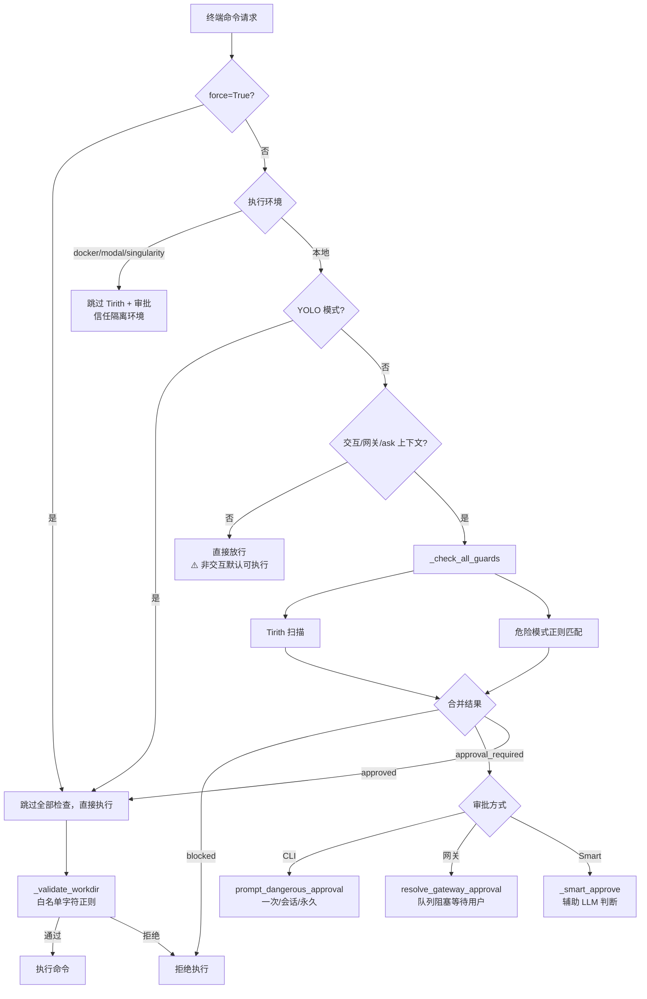
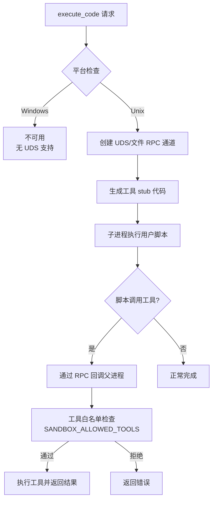
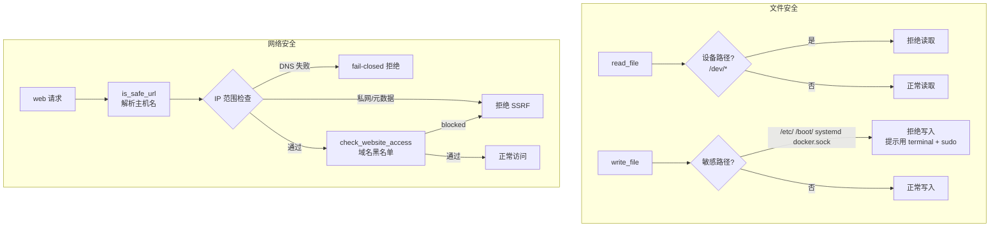

# Hermes Agent 安全系统 — 源码解析

> **所属系统**: Hermes Agent | **分析状态**: 已完成

## 模块定位

Hermes 的安全体系以「前置扫描 + 人工/网关审批 + 工具侧约束」为主，整体设计比 OpenClaw 更轻量。安全机制覆盖终端执行、文件操作、网络访问和 Skills 安装四个维度。

## 目录结构

```
tools/
├── approval.py              # 危险命令检测 + 审批合并逻辑（核心）
├── tirith_security.py       # Tirith 外部安全扫描器封装
├── terminal_tool.py         # 终端执行工具（预检 + workdir 校验）
├── code_execution_tool.py   # 代码执行沙箱（UDS RPC + 工具白名单）
├── file_tools.py            # 文件读写安全（敏感路径拦截）
├── url_safety.py            # URL SSRF 预检
├── website_policy.py        # 网站域名黑名单策略
├── web_tools.py             # Web 工具（调用 url_safety + website_policy）
├── skills_guard.py          # Skills 安装前静态扫描
└── interrupt/               # 中断机制

acp_adapter/
└── permissions.py           # ACP 权限桥接

hermes_cli/
└── config.py                # 默认安全配置
```

## 核心数据结构

### 审批模式

```python
# 审批配置
"approvals": {
    "mode": "manual",     # manual | off (YOLO)
    "timeout": 60,
}
```

### 安全配置

```python
"security": {
    "redact_secrets": True,          # 日志脱敏
    "tirith_enabled": True,          # Tirith 扫描开关
    "tirith_path": "tirith",         # Tirith 二进制路径
    "tirith_timeout": 5,             # 扫描超时（秒）
    "tirith_fail_open": True,        # ⚠️ 故障时放行
    "website_blocklist": {
        "enabled": False,
        "domains": [],
        "shared_files": [],
    },
}
```

### 代码执行沙箱配置

```python
SANDBOX_ALLOWED_TOOLS = frozenset([
    "web_search", "web_extract", "read_file",
    "write_file", "search_files", "patch", "terminal",
])
DEFAULT_TIMEOUT = 300        # 5 分钟超时
DEFAULT_MAX_TOOL_CALLS = 50  # 最多 50 次工具调用
```

## 核心流程

### 1. 终端命令执行安全流程



**关键设计**：
- **三层上下文分流**：容器环境跳检 → YOLO/非交互跳检 → 交互式全检
- **ANSI + Unicode 预处理**：检测前对命令做 ANSI 剥离、Unicode 规范化，降低混淆绕过
- **审批粒度**：一次 / 本会话 / 永久（`command_allowlist`）；含 Tirith 结果时禁止选「永久」
- **workdir 注入防护**：`_WORKDIR_SAFE_RE` 白名单字符正则，防止路径中的 shell 元字符

### 2. 代码执行沙箱（PTC）



**关键设计**：
- **工具白名单**：仅 7 个工具可在沙箱内使用
- **参数过滤**：`terminal` 工具的 RPC 参数会去掉 `background` 等（`_TERMINAL_BLOCKED_PARAMS`）
- **超时 + 调用次数限制**：5 分钟超时，最多 50 次工具调用

### 3. 文件与网络安全



## 关键设计模式

### 1. 上下文感知的安全策略

安全检查不是一刀切，而是根据执行上下文（交互/非交互/容器/网关）动态调整。这是 Hermes 安全设计最核心的理念——对隔离环境降低检查力度，对裸金属提高检查力度。

### 2. 外部扫描器集成（Tirith）

通过子进程调用外部安全扫描器，退出码协议（0=放行、1=拦截、2=警告），可替换可扩展。但 `tirith_fail_open: True` 的默认值意味着扫描器故障时倾向放行。

### 3. Smart 审批（LLM 辅助）

`_smart_approve` 调用辅助 LLM 对命令+上下文做 APPROVE/DENY/ESCALATE 判断，融合了 AI 判断能力但存在模型误判风险。

### 4. 网关队列阻塞

`resolve_gateway_approval` 通过 `threading.Event` 阻塞代理线程，直到用户在网关 UI 做出审批决策，实现同步审批语义。

## 外部依赖

- **Tirith**：外部安全扫描二进制
- **Docker / Modal / Singularity / Daytona**：可选隔离运行时
- **ACP SDK**：权限桥接

## 值得关注的细节

1. **非交互路径无前置扫描**：自动化场景若未设 `HERMES_INTERACTIVE` / `HERMES_GATEWAY_SESSION` / `HERMES_EXEC_ASK`，终端命令不跑 Tirith/危险检测
2. **容器后端完全跳检**：Docker/Modal/Singularity 环境不执行 Tirith 和危险命令审批
3. **`force=True` 绕过**：需确保仅来自可信 UI/确认路径
4. **Windows 不支持 PTC**：`SANDBOX_AVAILABLE = sys.platform != "win32"`
5. **DNS 重绑定风险**：`url_safety.py` 注释承认 TOCTOU 限制
6. **MCP 工具无统一前置扫描**：与终端工具不同级的安全覆盖

## 安全模型总评

| 维度 | 评价 |
|------|------|
| **执行隔离** | ⚠️ 本地默认无内核级沙箱；依赖可选容器部署 |
| **权限控制** | ✅ 多级审批（一次/会话/永久）+ 网关队列 + ACP 桥接 |
| **工具安全** | ✅ 终端 Tirith + 正则；文件敏感路径；SSRF 预检 |
| **配置安全** | ⚠️ `tirith_fail_open: True` 默认放行；非交互无检查 |
| **不足** | ⚠️ 非交互/容器路径安全降级；Smart 审批有 LLM 误判风险 |

## 引用此分析的认知问题

- [05-安全模型](../../insights/05-security-model/_overview.md)
