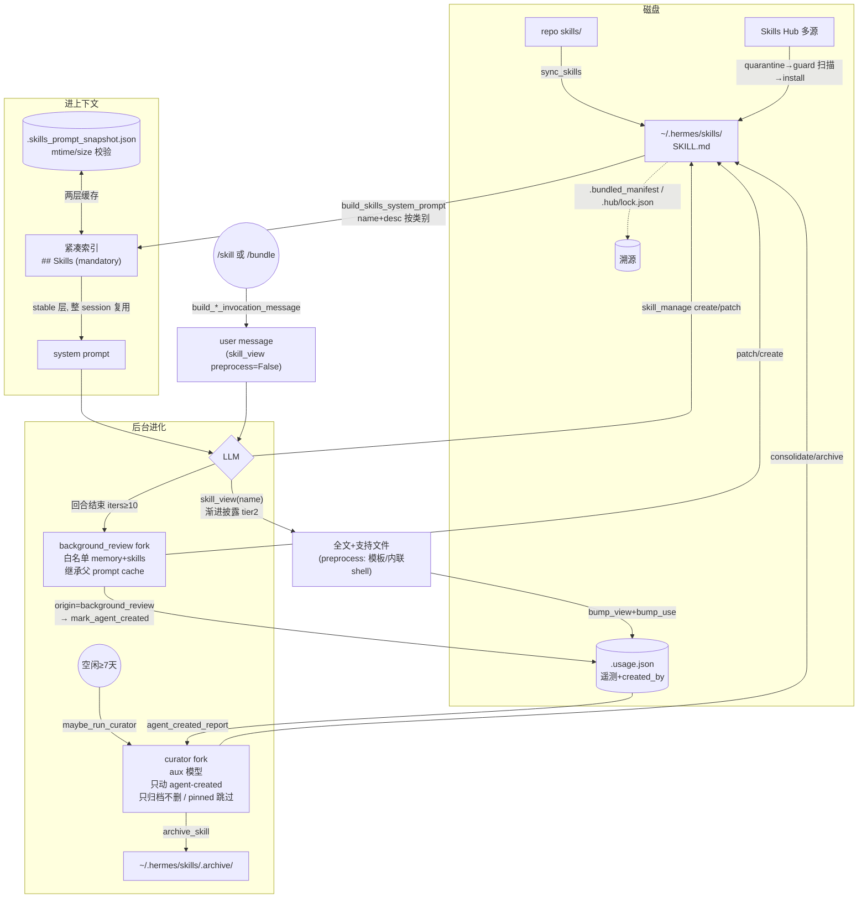

# Hermes Agent Skill（技能）子系统

> 源码 v0.14.0 / 2026-05-25。源码位置 `E:\Dev\longxia\_refs\hermes-agent-main`（Python）。路径相对仓库根，行号为调研时所见。纯事实记录，事实与评价分开，不含对知行的设计建议。

## 模块定位

Skill 是 Hermes 的"程序性记忆"（procedural memory）：把成功的工作流/工具用法/用户偏好沉淀成磁盘上的 `SKILL.md`，以"**紧凑索引进 system prompt + 渐进披露按需读全文**"的方式注入 LLM 上下文。它和 memory（陈述性事实）正交：memory 说"用户是谁、当前状态"，skill 说"这类任务该怎么做"（`agent/background_review.py:107-112`）。

子系统横跨三个进程角色：
- **前台 agent**：在 system prompt 看到技能索引，用 `skill_view` 按需加载全文，用 `skill_manage` 创建/修改。
- **回合后台复盘 fork**（`background_review.py`）：每回合结束后台 fork 一个受限 AIAgent 复盘本回合，决定是否新增/补丁技能。
- **自治 curator**（`curator.py`）：长周期（默认 7 天）空闲触发，对**自建**技能做泛化/合并/归档的库级维护。

关键区分：技能有三种来源 —— bundled（随 Hermes 出厂）、hub-installed（从 Hub 安装）、agent-created/user（本地创建）。**只有"由后台复盘 fork 创建"的技能才被标记为 agent-created，curator 只动这一类**（见第 6 节，这是整个治理闭环的信任锚点）。

## 目录与文件地图

磁盘布局（运行时，`HERMES_HOME` 默认 `~/.hermes`）：

| 路径 | 含义 | 来源 |
|---|---|---|
| `~/.hermes/skills/<category>/<skill>/SKILL.md` | 用户/同步后的技能本体 | `get_skills_dir()` `hermes_constants.py:379` |
| `~/.hermes/skills/<category>/DESCRIPTION.md` | 类别级描述 | 进索引用 |
| `~/.hermes/skills/.bundled_manifest` | bundled 技能清单 `name:hash` | `skills_sync.py:39` |
| `~/.hermes/skills/.hub/lock.json` | hub 安装溯源锁 | `skills_hub.py:2761 HubLockFile` |
| `~/.hermes/skills/.hub/quarantine/` | 安装前隔离区（扫描用） | `skills_hub.py:53` |
| `~/.hermes/skills/.archive/<skill>/` | curator 归档区（可恢复） | `skill_usage.py:103` |
| `~/.hermes/skills/.usage.json` | 使用遥测 + 自建标记 sidecar | `skill_usage.py:64` |
| `~/.hermes/skills/.curator_state` | curator 调度状态 | `curator.py:67` |
| `~/.hermes/.skills_prompt_snapshot.json` | 技能索引磁盘快照（冷启动加速） | `prompt_builder.py:849` |
| `~/.hermes/skill-bundles/*.yaml` | skill bundle 定义 | `skill_bundles.py:75` |
| `<repo>/skills/` | 出厂内置技能源 | `get_bundled_skills_dir()` `hermes_constants.py:177` |
| `<repo>/optional-skills/` | 可选内置技能（Hub `official` 源） | `build_skills_index.py:257` |
| `<repo>/skills/index-cache/*.json` | 外部 Hub 索引缓存（lobehub 等） | — |
| `skills.external_dirs`（config.yaml） | 外部只读技能目录 | `skill_utils.py:241` |

源码文件地图：

| 文件 | 职责 |
|---|---|
| `agent/skill_utils.py` | 轻量元数据工具：frontmatter 解析、平台匹配、disabled 列表、外部目录、条件激活、config 变量、文件遍历、命名空间 |
| `agent/prompt_builder.py:997 build_skills_system_prompt` | **生成进 system prompt 的紧凑索引**（两层缓存） |
| `agent/system_prompt.py:169-185` | 把索引注入 system prompt 的 stable 层 |
| `tools/skills_tool.py` | `skills_list` / `skill_view`（**渐进披露的按需全文加载**）/ `check_skills_requirements` |
| `agent/skill_commands.py` | `/<skill-name>` 斜杠命令、技能消息构造、CLI 预加载 |
| `agent/skill_bundles.py` | bundle（一条命令加载多个技能） |
| `agent/skill_preprocessing.py` | `${HERMES_SKILL_DIR}` 模板替换 + `` !`cmd` `` 内联 shell |
| `tools/skill_manager_tool.py` | `skill_manage`（create/edit/patch/delete/write_file/remove_file） |
| `tools/skill_usage.py` | 使用遥测 + 自建溯源 + 生命周期状态机（active/stale/archived/pinned）+ 归档/恢复 |
| `tools/skill_provenance.py` | ContextVar 区分"后台复盘写入"vs"前台用户写入" |
| `agent/background_review.py` | 回合后台 fork 复盘 |
| `agent/curator.py` | 自治技能库维护编排器 |
| `tools/skills_hub.py` | Skills Hub（多源搜索 + GitHub App auth + 隔离/扫描/安装 + 溯源锁） |
| `tools/skills_sync.py` | bundled 技能同步进用户目录（manifest + hash） |
| `tools/skills_guard.py` | 安装前安全扫描器（正则静态分析 + 信任策略） |
| `tools/skills_ast_audit.py` | opt-in 的 Python AST 深度审计（仅诊断，非安全闸） |
| `scripts/build_skills_index.py` | 构建 Hub 中心 JSON 目录（爬多源） |

---

## 1. 磁盘格式

### SKILL.md 文件名与 frontmatter schema

技能本体固定文件名 **`SKILL.md`**（YAML frontmatter + Markdown 正文）。真实样例（`skills/software-development/test-driven-development/SKILL.md:1-12`）：

```yaml
---
name: test-driven-development
description: "TDD: enforce RED-GREEN-REFACTOR, tests before code."
version: 1.1.0
author: Hermes Agent (adapted from obra/superpowers)
license: MIT
platforms: [linux, macos, windows]
metadata:
  hermes:
    tags: [testing, tdd, development, quality, red-green-refactor]
    related_skills: [systematic-debugging, writing-plans, subagent-driven-development]
---
```

frontmatter 解析在 `skill_utils.py:88 parse_frontmatter`：以 `---` 起始、正则 `\n---\s*\n` 找结束，用 `yaml.CSafeLoader` 解析；解析失败 fallback 到简单 `key:value` 行拆分（`:114-121`）。

字段语义（已核到解析处）：

- `name`（`skills_tool.py:589`，截断 `MAX_NAME_LENGTH=64` `:94`）：技能名，索引/查找/斜杠命令的键。缺失则用目录名。
- `description`（截断 `MAX_DESCRIPTION_LENGTH=1024` `:95`；进 system prompt 索引时再截到 60 字符 `skill_utils.py:518-526`）。
- `version` / `author` / `license`：纯展示，未见进任何决策逻辑。
- `platforms`（`skill_utils.py:128 skill_matches_platform`）：`[macos, linux, windows]`，映射到 `sys.platform`（`PLATFORM_MAP` `:21`），缺失=全平台兼容；Termux/Android 特判（`:154-168`）。
- `metadata.hermes.tags` / `metadata.hermes.related_skills`（agentskills.io 约定，`skills_tool.py:1270-1280`，带顶层字段 backward-compat fallback）。
- `metadata.hermes.{fallback_for_toolsets, requires_toolsets, fallback_for_tools, requires_tools}`（`skill_utils.py:341 extract_skill_conditions`）：**条件激活** —— 控制技能是否进索引（见第 3 节 `_skill_should_show`）。
- `metadata.hermes.config`（`skill_utils.py:361 extract_skill_config_vars`）：技能声明需要的 config.yaml 设置（key/description/default/prompt），存储在 `skills.config.<key>` 下（`:462`），加载时注入 `[Skill config: ...]` 块。
- `prerequisites.commands`（样例 `skills/apple/imessage/SKILL.md:11-12`）+ `required_environment_variables` + `setup.collect_secrets`（`skills_tool.py:182 _normalize_setup_metadata` / `:227`）：声明所需命令/环境变量/密钥，`skill_view` 时检测缺失并产 setup note。
- `required_credential_files`（`skills_tool.py:1349`）：远程沙箱挂载用的凭证文件。

目录布局：**两级类别**（`<category>/<skill>/SKILL.md`），类别由相对路径推导（`prompt_builder.py:920-927 _build_snapshot_entry`：倒数第二段为 skill_name，其余为 category）。技能目录内可带支持文件，按子目录约定（`skills_tool.py:1225-1268`）：
- `references/*.md` —— 会话特定细节/知识库
- `templates/*.{md,py,yaml,...}` —— 待复制修改的脚手架
- `assets/*` —— agentskills.io 标准补充文件
- `scripts/*.{py,sh,bash,js,ts,rb}` —— 可直接运行的脚本

### 技能来源（4 类）

1. **bundled**：`<repo>/skills/` → `skills_sync.sync_skills()` 复制进 `~/.hermes/skills/`，登记 `.bundled_manifest`（`name:md5hash`）。
2. **hub-installed**：`hermes skills install` → 隔离→扫描→装入，登记 `.hub/lock.json`。
3. **agent-created / user**：本地 `skill_manage(create)` 或手写。
4. **external 只读目录**：`skills.external_dirs`（config.yaml）—— 出现在索引但**新技能永不写入**，本地同名优先（`prompt_builder.py:1010-1013`）。

来源 1、2 在 `skill_usage.py` 视为 **off-limits**（`_read_bundled_manifest_names()`+`_read_hub_installed_names()`），curator 永不触碰。

### Bundle 概念（`skill_bundles.py`）

bundle 是一个 YAML（`~/.hermes/skill-bundles/<slug>.yaml`），命名一组技能，`/<bundle-name>` 一次性把 N 个技能全文加载进**单条 user message**（`:253 build_bundle_invocation_message`）。格式：`name` / `description` / `skills:[...]` / `instruction`（可选）（`:11-22`）。冲突时 **bundle 优先于同名 skill**（斜杠分发先查 bundle，`cli.py:8538` 早于 `:8561`）。引用了未安装技能仍会加载，跳过项作 note 告知 agent（`:266`）。有内存缓存 + dir/file mtime 新鲜度校验（`:95 _max_mtime`、`:199 get_skill_bundles`）。

---

## 2. 发现与加载

### 发现目录与优先级

`skill_utils.py:327 get_all_skills_dirs()`：本地 `~/.hermes/skills/`（永远 index 0）→ 外部 `external_dirs`（config 顺序）。**本地优先**：索引/查找时 `seen_skill_names` 去重，外部同名跳过（`prompt_builder.py:1124-1153`、`skills_tool.py:564-593`）。

遍历用 `skill_utils.py:532 iter_skill_index_files`（`os.walk(followlinks=True)` + `EXCLUDED_SKILL_DIRS` 剪枝 `:27`：`.git/.hub/.archive/.venv/node_modules/__pycache__/...`），按相对路径排序产出。排除集中定义在一处，保证所有扫描点同步。

### 索引构建（注意区分两个"索引"）

- **进上下文的索引**（最关键）：`build_skills_system_prompt`（第 3 节详述），是运行时即时构建的紧凑文本。
- **Hub 中心目录索引**：`scripts/build_skills_index.py` —— 离线 CI 脚本，爬 skills.sh/GitHub/clawhub/lobehub/claude-marketplace 等多源（`:256-263`），并发抓取，按 identifier 去重排序，写 `website/static/api/skills-index.json`（`:47`）。供 `hermes skills search/install` 不打 GitHub API 即可用。**这两个索引彼此独立。**

### 同步（`skills_sync.py`）

`sync_skills()` 把 `<repo>/skills/` 复制进 `~/.hermes/skills/`，用 manifest（v2 格式 `name:md5hash`，自动迁移 v1）做"用户是否改过"判定（`:175`）：
- 新技能 → 复制，记 hash。
- manifest 中且在盘上：用户 hash==origin → bundled 变了就更新（先 `.bak` 备份再覆盖 `:266`）；用户 hash≠origin → **用户改过，跳过不覆盖**（`:255-260`）。
- manifest 中但不在盘 → 用户删了，尊重，不重加（`:288`）。
- bundled 删了 → 清 manifest（`:292`）。

冲突保护细节（`:204-226`）：新 bundled 与本地同名但内容不同时不覆盖，且**不写 manifest**（避免污染更新检测，永久误判 user-modified）。`reset_bundled_skill()` 用于破除"误判后永远跳过"的循环（`:319`）。

### 缓存/快照机制（进程内 LRU + 磁盘 snapshot）

`build_skills_system_prompt` 两层缓存（`prompt_builder.py:1003-1008`）：

1. **进程内 LRU**（`_SKILLS_PROMPT_CACHE` `:843`，`OrderedDict`+`Lock`，max=8 `:842`）。cache_key（`:1031-1038`）= (skills_dir, external_dirs, available_tools, available_toolsets, platform_hint, disabled)。命中即返回、move_to_end（`:1039-1043`）。
2. **磁盘 snapshot**（`~/.hermes/.skills_prompt_snapshot.json` `:849`）：用 `_build_skills_manifest()`（每个 SKILL.md/DESCRIPTION.md 的 `[mtime_ns, size]` 清单 `:863`）校验。`_load_skills_snapshot` 比对清单一致才用快照里预解析的元数据（`:889`）；快照含 `version` 字段（`_SKILLS_SNAPSHOT_VERSION=1` `:845`）。
3. 两层都 miss → 全盘扫描 + 写新 snapshot（`:1077-1118`）。

外部目录**不进 snapshot**（"只读且通常小"，每次直接扫 `:1120-1123`）。

另有两个小缓存：`get_external_skills_dirs` 按 config.yaml mtime_ns 缓存（`skill_utils.py:233`，避免每个技能重复 YAML 解析 15KB config —— 注释称冷启动可省 10s+）；`skill_usage.py` 的 `.usage.json` 用文件锁（fcntl/msvcrt）串行化读改写（`:67`）。

`skill_manage` 成功后会 `clear_skills_system_prompt_cache(clear_snapshot=True)`（`skill_manager_tool.py:870`），强制下次重建索引。

---

## 3. 怎么进上下文（最关键）

**确认结论：紧凑索引（按类别的 name+description）进 system prompt 的 stable 层；完整 SKILL.md 在 LLM 调 `skill_view(name)` 时按需加载（渐进披露）。** 这是核到的真实路径，逐环节给行号。

### 索引生成函数

唯一定义在 `agent/prompt_builder.py:997 build_skills_system_prompt`（全仓库仅此一处，已 grep 确认 —— 任务提到的"两处"中，`system_prompt.py` 只是**调用方**，不是定义）。签名 `(available_tools, available_toolsets)`。

流程：读 LRU → 读磁盘 snapshot → （冷路径）全盘扫描。对每个技能：平台过滤（`skill_matches_platform`）、disabled 过滤、`_skill_should_show` 条件激活过滤（`:966`：`fallback_for_*` 当主工具在场则隐藏；`requires_*` 当所需工具缺失则隐藏）。按 category 聚合 `(name, description)`，类别描述取自 `DESCRIPTION.md`（`:1100-1111`）。

最终文本（`:1192-1219`）—— 实际进 prompt 的形状：

```
## Skills (mandatory)
Before replying, scan the skills below. If a skill matches or is even partially relevant
to your task, you MUST load it with skill_view(name) and follow its instructions. ...
<available_skills>
  software-development: <类别描述>
    - test-driven-development: TDD: enforce RED-GREEN-REFACTOR, tests befor...
    - systematic-debugging: ...
  github:
    - ...
</available_skills>
Only proceed without loading a skill if genuinely none are relevant to the task.
```

提示词强制语气（"mandatory"、"you MUST load it with skill_view(name)"、"Err on the side of loading"），并专门规定涉及 Hermes 自身配置就先加载 `hermes-agent` 技能（`:1204-1208`）。

### 注入位置（system prompt，非 message）

`agent/system_prompt.py:60 build_system_prompt_parts` 把它放进 **stable 层**（`:169-185`）：仅当 `skills_list/skill_view/skill_manage` 任一在 `valid_tool_names` 中（`:169`）才生成，传入当前可用 tools/toolsets（`:171-181`）。stable 层是 prompt 缓存友好的最前部，**整段 system prompt 一次构建、整个 session 复用，只有上下文压缩才重建**（`:73-77`、`:321 build_system_prompt`、`:340 invalidate_system_prompt`），以保住上游 prefix cache 命中。

注意：进 system prompt 的索引里**只有 name+description**，无正文、无 tags、无支持文件列表 —— 这些都靠 `skill_view` 按需取。

### 完整 SKILL.md 的按需加载（渐进披露 tier 2）

工具 `tools/skills_tool.py:850 skill_view(name, file_path, task_id, preprocess)`：
- 三种查找策略（`:981-1009`）：直接路径 / 按目录名递归 / 旧式扁平 `<name>.md`；跨本地+外部目录收集所有候选，**>1 个候选则拒绝并报歧义**（`:1011-1033`，防止本地被外部同名静默 shadow）。
- 安全：信任目录外加载告警（`:1062-1089`）、`_INJECTION_PATTERNS` 提示注入告警（`:1078-1089`，见第 7 节）、平台/disabled 检查（`:1097-1119`）。
- `file_path` 子文件读取带路径穿越防护（`has_traversal_component`+`validate_within_dir` `:1122-1148`），找不到时列出 references/templates/assets/scripts 可用文件（`:1149-1193`）。
- 返回 JSON：`content`（正文）/ `tags` / `related_skills` / `skill_dir`（绝对路径，省一次往返）/ `linked_files` / `required_environment_variables` / setup note 等（`:1382-1398`）。
- 注册 handler 是 `_skill_view_with_bump`（`:1535`）：成功后 `bump_view` **且** `bump_use`（`:1549-1554` —— skill_view 即视为"使用"，curator 的 stale 计时键于 `last_used_at`）。

`skills_list`（`:675`）是 tier 1：只返回 name+description+category（最小 token），`_find_all_skills`（`:550`）只读前 4000 字节解析 frontmatter。

### 模板替换与内联 shell 的执行阶段

`agent/skill_preprocessing.py`：
- 模板 token `${HERMES_SKILL_DIR}` / `${HERMES_SESSION_ID}`（`:13` 正则）→ `substitute_template_vars`（`:37`，无值的 token 原样保留供调试）。
- 内联 shell `` !`cmd` ``（`:17` 正则）→ `expand_inline_shell`（`:101`），以 skill_dir 为 CWD 跑 `bash -c`，输出截到 `_INLINE_SHELL_MAX_OUTPUT=4000`（`:20`）。
- 统一入口 `preprocess_skill_content`（`:123`）：模板替换默认开（`template_vars` 默认 True `:134`）；**内联 shell 默认关**（`inline_shell` 默认 False `:136`，需 config 显式开启，timeout 默认 10s）。

**执行阶段**：
- `skill_view(preprocess=True)`（默认）在返回前对 `content` 做 preprocess（`skills_tool.py:1367-1380`）—— 即 LLM 主动 `skill_view` 时。
- 斜杠/bundle/预加载路径用 `skill_view(preprocess=False)`（`skill_commands.py:94`），因为它们**自己**在 `_build_skill_message`（`skill_commands.py:160`）里渲染（`:176-181` 同样的模板替换+内联 shell）。两条路径都在"加载成消息"这一步执行，不在索引阶段。

---

## 4. 触发与调用

### `/<skill-name>` 斜杠命令

`agent/skill_commands.py:263 scan_skill_commands` 扫盘建 `{"/slug": {name, description, skill_md_path, skill_dir}}`（slug 规范化：空格/下划线→连字符，剥非字母数字 `:311-313`），有 mtime + platform 缓存（`:329 get_skill_commands`）。`resolve_skill_command_key`（`:409`）把用户输入归一化（`_`↔`-` 互换，兼容 Telegram）。

CLI 分发（`cli.py:8520-8572`）顺序：plugin command → **bundle**（`:8538`）→ **skill**（`:8561`）→ 前缀匹配。命中 skill 时 `build_skill_invocation_message`（`skill_commands.py:428`）：`_load_skill_payload`（`:53`，内部调 `skill_view(preprocess=False)`）→ `bump_use`（`:456`）→ 拼 activation note "[IMPORTANT: The user has invoked the "X" skill ...]"（`:461`）→ `_build_skill_message`，把消息塞进 `_pending_input` 作为下一条 user message。

`_build_skill_message`（`:160`）产出含：activation note + 渲染后正文 + `[Skill directory: <abs>]` 提示（`:189`，让 agent 直接按绝对路径跑 scripts）+ 注入的 config 值（`:197`）+ setup note（`:199-219`）+ 支持文件清单（`:236-250`）+ 用户附加指令。

CLI `-s` 预加载：`build_preloaded_skills_prompt`（`:475`），整 session 生效，activation note 措辞为 "preloaded"。

### 模型主动调用

LLM 通过 `skill_view`（tier 2 全文加载）和 `skill_manage`（增改）两个工具直接驱动。索引里的强制提示词（"you MUST load it with skill_view(name)"）是促使模型主动调用的核心。`skills_list/skill_view/skill_manage` 注册在 `skills` toolset（`skills_tool.py:1525/1560`，`skill_manager_tool` 同）。

---

## 5. 分发与安装

### Skills Hub（`skills_hub.py`，约 128KB）

多源 `SkillSource` 适配器（抽象基类 `:295`）：`GitHubSource` `:327`、`WellKnownSkillSource` `:754`、`UrlSource` `:981`、`SkillsShSource` `:1147`、`ClawHubSource` `:1619`、`ClaudeMarketplaceSource` `:2103`、`LobeHubSource` `:2201`、`BrowseShSource` `:2361`、`OptionalSkillSource` `:2535`（内置 `optional-skills/`）。每源给 `SkillMeta`（含 `trust_level`）。`taps.json`（`TapsManager` `:2827`）支持用户自定义 GitHub repo 源。

### GitHub App / 认证（`GitHubAuth` `:172`）

token 解析优先级（`_resolve_token` `:202`）：1) `GITHUB_TOKEN`/`GH_TOKEN` 环境变量（PAT，默认）→ 2) `gh auth token` 子进程 → 3) **GitHub App JWT + installation token**（`_try_github_app` `:246`：读 `GITHUB_APP_ID`/`GITHUB_APP_PRIVATE_KEY_PATH`/`GITHUB_APP_INSTALLATION_ID`，PyJWT 用 RS256 签 JWT 换 installation token，缓存 ~58 分钟 `:227`）→ 4) 匿名（60 req/hr）。

### 安装流（隔离 → 扫描 → 装入）

1. `quarantine_bundle(bundle)`（`:2905`）：把下载的技能写进 `.hub/quarantine/<name>`，每个相对路径过 `_validate_bundle_rel_path` 防穿越（`:164`）。
2. `skills_guard.scan_skill(skill_path, source)` 扫描（第 7 节）+ `should_allow_install` 决策。
3. `install_from_quarantine`（`:2930`）：校验隔离路径在隔离根内（`:2942`）、`shutil.move` 进 `skills/<category>/<name>`、`HubLockFile.record_install` 登记溯源、`append_audit_log` 记审计（`:2986`）。`SKILL.md` >100KB 仅 warn 不 block（`:2958`）。

### Provenance 溯源（两套，关系到信任）

**(a) 安装溯源 —— `HubLockFile`（`skills_hub.py:2761`）**：`.hub/lock.json` 每条记录 `source`/`identifier`/`trust_level`/`scan_verdict`/`content_hash`/`install_path`/`files`/`metadata`/`installed_at`/`updated_at`（`:2792`）。`content_hash`（`skills_guard.py:726`）把相对路径混进 SHA-256（防换内容），需与 `skills_hub.bundle_content_hash` 对称。注意：**这是元数据记录，不是密码学签名**；未在源码确认有公钥验签机制。

**(b) 写入来源溯源 —— `skill_provenance.py`（ContextVar）**：区分"后台复盘 fork 写入"vs"前台用户写入"。`set_current_write_origin`/`get_current_write_origin`（默认 `"foreground"`，`:37`），sentinel `BACKGROUND_REVIEW="background_review"`（`:45`）。这条 ContextVar 是 curator 信任边界的实现：只有 `is_background_review()==True` 时 `skill_manage(create)` 才 `mark_agent_created`（`skill_manager_tool.py:883-885`），从而把技能纳入 curator 可管理集。

---

## 6. 进化/治理（Hermes 差异化重点）

三条闭环：(A) 回合后台复盘 → (B) 使用遥测/状态机 → (C) 自治 curator。

### (A) 回合后台复盘 fork（`background_review.py`）

**触发计数**：在 `conversation_loop.py:699-703` 每个 tool-calling 迭代 `_iters_since_skill += 1`（且 `skill_manage` 在工具集时）；回合结束 `:4205-4211` 若 `_iters_since_skill >= _skill_nudge_interval` 则 `_should_review_skills=True` 并清零。默认 `_skill_nudge_interval=10`（`agent_init.py:1179`，config `skills.creation_nudge_interval` 可覆盖 `:1182`）。回合末（响应已交付、未中断）`_spawn_background_review`（`conversation_loop.py:4222`）。memory 复盘有独立计数（`_memory_nudge_interval`），两者可合并成 combined prompt。

**fork 参数**（`_run_review_in_thread` `:327`，daemon thread `run_agent.py:1195` name="bg-review"）：fork 一个 `AIAgent`，继承父 runtime（provider/model/base_url/api_key/api_mode `:402-416`），`max_iterations=16`、`quiet_mode=True`、`skip_memory=True`。关键 cache 复用：**直接把父的 `_cached_system_prompt` 赋给 fork**（`:442`），并 pin session_start/session_id（`:450`），让 fork 的 HTTP 请求命中父预热的 prefix cache（注释引 #25322/#17276，Sonnet 4.5 端到端省 ~26% 成本）。

**写哪 + 防死锁 + 受限工具**：
- 写入：复用父 `_memory_store`（`:419`），技能写 `~/.hermes/skills/`。fork 的 `_memory_write_origin="background_review"`（`:417`），驱动 `mark_agent_created`。
- **运行时工具白名单**：`set_thread_tool_whitelist` 限定只允许 `memory`+`skills` 两个 toolset（`:459-472`），其余运行时 deny。
- 防死锁：装非交互 approval callback，危险命令一律 `"deny"`（`_bg_review_auto_deny` `:347-354`，避免 fork 触发 `input()` 与父 TUI 死锁，引 #15216）。
- 静默：`redirect_stdout/stderr` 到 devnull（`:361`）+ `suppress_status_output`（`:431`），只在末尾给用户一行 "💾 Self-improvement review: ..."（`:512-516`）。

**复盘 prompt**（`_SKILL_REVIEW_PROMPT` `:45`，~100 行）核心规则：积极更新（"most sessions produce at least one skill update"）；目标形状是 **class-level 大伞技能 + references/ 子目录**，不是一会话一窄技能；优先级 1) 补丁当前已加载技能 → 2) 补丁已有大伞 → 3) 加支持文件 → 4) 新建 class-level 大伞。**受保护技能 DO NOT edit**：bundled、hub-installed（`:115-117`）；pinned 技能可改内容但不可删（`:118-121`）。明确不要捕获的：环境依赖失败、对工具的负面断言、会话瞬态错误、一次性任务叙事（`:124-139`）—— 注释称这些会硬化成"自我施加的约束"反噬。

### (B) 使用遥测 + 生命周期状态机（`skill_usage.py`）

sidecar `.usage.json`（非 frontmatter，避免污染用户内容、避免 bundled/hub 冲突 `:8-11`），文件锁串行化。每记录字段（`_empty_record` `:307`）：`created_by`/`use_count`/`view_count`/`patch_count`/各 `last_*_at`/`created_at`/`state`/`pinned`/`archived_at`。

bump 入口：`bump_view`（skill_view）、`bump_use`（加载/调用）、`bump_patch`（skill_manage 改）。**关键护栏**：`_mutate`（`:380`）先查 `is_agent_created`（非 bundled/hub）才记，且 bundled/hub **永不**进 sidecar。

状态机：`active`/`stale`/`archived`（`:53-56`）+ 正交 `pinned` 布尔。`mark_agent_created`（`:433`）只设 `created_by="agent"` —— 这是"被 curator 管理"的唯一闸（`_is_curator_managed_record` `:296`：`created_by=="agent"` 或 `agent_created is True`）。`list_agent_created_skill_names`（`:220`）= 盘上技能 − bundled − hub，且必须 `created_by=="agent"`。`archive_skill`（`:482`）`dir.rename` 进 `.archive/`（可恢复，双重校验非 bundled/hub）；`restore_skill`（`:521`）撤回（同名 bundled/hub 已存在则拒绝以防 shadow）。

### (C) 自治 curator（`curator.py`，约 75KB / 1781 行）

**触发：空闲驱动，无 cron 守护进程**（`:4-7`）。`maybe_run_curator`（`:1763`）在 CLI session-start（`cli.py:12333`）和 gateway tick（`gateway/run.py:17957`）调用。门槛 `should_run_now`（`:199`）：`enabled`（默认 True `:151`）+ 未 paused + `last_run_at` 存在且早于 `interval_hours`（默认 **7 天** `:56`）。**首次运行不立即跑**：无 `last_run_at` 时 seed 为 now，推迟一整个 interval（`:227-242`）。另有 idle 门槛 `min_idle_hours`（默认 2h `:57`），仅当调用方给了 `idle_for_seconds` 才强制（`:1774`）。

**强不变量**（docstring `:15-19` + prompt `:344-359` + 代码）：
- 只动 agent-created（候选列表 `_render_candidate_list` `:1349` 来自 `agent_created_report`，已过滤 bundled/hub）。
- **从不真删，只归档**（`apply_automatic_transitions` 用 `archive_skill`；prompt `:347` "DO NOT delete any skill. Archiving ... is the maximum destructive action"）。
- pinned 跳过全部自动转换（`:272` `if row.get("pinned"): continue`；prompt `:350`）。
- 用 auxiliary 客户端，绝不碰主 session 的 prompt cache（`:19`）。

**自动状态转换**（纯函数无 LLM，`apply_automatic_transitions` `:256`）：anchor = `last_activity_at` 或 fallback `created_at`；anchor ≤ archive_cutoff（默认 90 天 `:59`）→ archive；≤ stale_cutoff（默认 30 天 `:58`）且 active → stale；> stale_cutoff 且 stale → 重新 active。

**LLM 复盘 pass**（`run_curator_review` `:1369` → `_run_llm_review` `:1622`）：先 `curator_backup.snapshot_skills`（`:1413` 运行前快照）+ 自动转换 → 渲染候选列表 → fork `AIAgent` 跑 `CURATOR_REVIEW_PROMPT`。
- **模型**：`_resolve_review_runtime`（`:1557`）优先 `auxiliary.curator.{provider,model}`（标准辅助任务槽）→ 旧式 `curator.auxiliary.*` → fallback 主聊天模型（`provider:"auto"` + 空 model 即"用主模型"）。即**可配廉价辅助模型，默认回落主模型**。
- fork 参数（`:1691`）：`max_iterations=9999`（"50-100 次 API 调用扫数百候选" `:1697`）、`platform="curator"`、`skip_context_files=True`、`skip_memory=True`、禁递归 nudge（`:1709-1710`）、stdout/stderr→devnull。
- **注意**：curator fork **未见**安装 `set_thread_tool_whitelist`（不同于 background_review）—— 它靠 prompt 硬规则 + `_pinned_guard`/`is_agent_created` 代码护栏约束，而非运行时工具白名单。（已核到 `_run_llm_review` 全函数，无白名单调用。）

**它具体做什么**（`CURATOR_REVIEW_PROMPT` `:330`，"伞建设合并 pass，非去重器"）：找 prefix cluster（`hermes-config-*` 等，预期 10-25 个 `:361-365`）→ 每簇问"维护者会写成 N 个独立技能还是一个带 N 个小节的伞？"→ 三种合并：(a) 并入已有伞 (b) 新建伞 SKILL.md (c) 降级为 references/templates/scripts 子文件，然后归档旧兄弟。删除时 `skill_manage(action=delete, absorbed_into=<伞>)` 声明意图（`:408`）。要求一 pass 至少 10 个归档否则"停太早"（`:420`）。产结构化 YAML 块（`consolidations`/`prunings` `:427-436`）供下游分类（`_classify_removed_skills` `:492` / `_reconcile_classification` `:749` 融合启发式与模型声明）。dry-run 模式（`CURATOR_DRY_RUN_BANNER` `:303`）只报告不变更。

**删除真相**：curator prompt 禁止 delete 只许 archive；但 `skill_manage(action=delete)` 的底层 `_delete_skill`（`skill_manager_tool.py:660`）实际是 `shutil.rmtree`（`:700`，真删！）。约束 delete 不被滥用的是：prompt 硬规则 + `_pinned_guard`（`:137`，pinned 拒删 `:676`）+ delete 后 `forget` 清遥测（`:889`）。即 curator 的"只归档"是 **prompt 级约束 + 自动转换用 archive_skill**，而非 delete 工具本身被禁。

---

## 7. 安全

### Skills Guard（`skills_guard.py`，安装前安全闸）

**扫什么**：`THREAT_PATTERNS`（`:86` 起，正则 + (pattern_id, severity, category, description)）覆盖：
- **exfiltration**：`curl/wget/fetch/httpx/requests` 插值 `*KEY/TOKEN/SECRET/PASSWORD*`（`:87-102`）；读 `~/.aws/credentials`、`.env`/`.netrc`/`.pgpass`/`.npmrc`、Hermes secrets 文件（`:104-128`）；`os.getenv`/Ruby `ENV[]` 读密钥（`:137-145`）。
- **injection**：ignore previous instructions / role hijack / system prompt override / HTML 注释注入 / 隐藏 div（`:163-198`）。
- 另有 destructive / persistence / network / obfuscation 类（`Finding.category` 注释 `:64`）。
- **结构检查**（`_check_structure` `:757`）：文件数/总大小/单文件过大、二进制/可执行扩展名（`SUSPICIOUS_BINARY_EXTENSIONS` `:503`）、**符号链接逃逸**（resolve 不在技能目录内 → critical `symlink_escape` `:782`）。
- **不可见 Unicode**（`INVISIBLE_CHARS` `:509`：零宽空格、BOM、双向覆盖 U+202E 等）逐行扫，命中 high `invisible_unicode`（`:580-594`）—— 防文本隐藏注入。
- 扫描文件类型：`SCANNABLE_EXTENSIONS`（`:496`，`.md/.py/.sh/.js/...`）+ 永远扫 `SKILL.md`（`:548`）。

**block 还是 warn / verdict**：`_determine_verdict`（`:932`）：有 critical → `dangerous`；有 high → `caution`；只有 medium/low → `safe`（informational 不阻断）。`should_allow_install`（`:646`）查 `INSTALL_POLICY`（`:41`，按 trust×verdict）：
- `builtin`：全 allow（**从不扫描** `:12`）。
- `trusted`（仅 `openai/skills`、`anthropics/skills`、`huggingface/skills` `:39`）：safe/caution allow，dangerous block。
- `community`：safe allow，caution/dangerous block。
- `agent-created`：safe/caution allow，dangerous → `ask`（返回 `None`）。
- `--force` 可越 caution，但 **community/trusted 的 dangerous 不可越**（`:679-683`）。

**在写入前还是加载前**：**安装/写入前**。Hub 路径在 `quarantine`（写隔离区）后、`install_from_quarantine`（装进 skills/）前扫描。agent 自建路径在 `skill_manage` 写盘后立即扫、block 则回滚（`_create_skill` 写 SKILL.md → `_security_scan_skill` → block 则 `shutil.rmtree` `skill_manager_tool.py:510-516`；edit/patch/write_file 同理 `:553/:649/:754`）。**但 agent-created 扫描默认关**：`_guard_agent_created_enabled`（`:59`，config `skills.guard_agent_created` 默认 False `:64`），即默认前台/复盘自建技能不扫。

**加载时（非安装）**：`skill_view` 不做 guard 扫描，只做轻量 `_INJECTION_PATTERNS`（9 个子串 `skills_tool.py:134`）和"信任目录外"检测，**仅 warn 不 block**（`:1083-1089`）。

### AST 深度审计（`skills_ast_audit.py`，opt-in 诊断，非安全闸）

明确定位为"诊断提示而非安全裁决"（`:7-9`，CLI `hermes skills audit --deep`）。`ast.parse` 扫 Python：`importlib.import_module`、计算式 `__import__`、计算式 `getattr`、`__dict__[<computed>]`、`import importlib`（`:34-73`）。每条都注明"有合法用途，供人审"（`:132`）。不参与 install 决策。

SECURITY.md §2.4 把 Skills Guard 定位为"in-process heuristics（有用 —— 非边界）"（`skills_ast_audit.py:6` 引用）。

---

## 关键数据流（磁盘 → 进上下文 → 被调用 → 后台进化）



技能"生效"的真实链路（已核调用方，非死代码）：磁盘 SKILL.md → `build_skills_system_prompt`（被 `system_prompt.py:178` 真实调用，仅当 skills 工具在场）→ 进 stable 层 system prompt → LLM 见索引 → `skill_view` 真实注册为工具 handler（`skills_tool.py:1560`）且 bump 遥测 → `skill_manage` 真实注册 → 回合计数真实驱动 `_spawn_background_review`（`conversation_loop.py:4224`）→ curator 真实由 `maybe_run_curator` 在 CLI/gateway 调用。

---

## 设计评价（事实与评价分开）

**事实回顾**：
1. 上下文策略 = 紧凑索引（name+desc/类别）进缓存友好的 stable 层 + `skill_view` 渐进披露全文；两层缓存（进程 LRU + mtime/size 磁盘快照）。
2. 三层进化：回合后台复盘（高频、白名单受限、复用父 prompt cache）→ 遥测状态机 → 长周期 curator（空闲触发、aux 模型、只动自建、只归档）。
3. 信任锚点 = ContextVar 写入来源 → `mark_agent_created`：唯有后台复盘 fork 建的技能才被 curator 管理；bundled/hub 全程 off-limits。
4. 安全分层：Hub 安装前 guard 静态扫 + 信任×verdict 策略（block/ask/allow）；agent 自建扫描默认关；加载时只 warn。

**评价（明确标注为主观判断）**：
- 进化闭环的"信任分层"是该子系统最有设计密度的部分：用 ContextVar 把"谁写的"做成运行时事实，再用它当 curator 的唯一授权边界，避免了误删用户技能。
- background_review 用运行时工具白名单（强约束）而 curator 仅用 prompt 硬规则（软约束）—— 二者约束强度不对称；curator fork 仍能调 `terminal`/`skill_manage(delete)`（真删），其"只归档"靠 prompt + pinned_guard，存在 LLM 不遵从的残余风险（事实层面已核 `_run_llm_review` 无白名单）。
- "整 session 一次构建 system prompt + 复用 prompt cache"与"`skill_manage` 改完清缓存"组合：技能内容变更要到下次 system prompt 重建（压缩边界或新 session）才反映进索引（评价：对长 session 有可见性延迟，但这是为 prefix cache 命中刻意付的代价，源码注释多处明说）。

## 靠推断 / 未 100% 确认的清单（供抽验）

1. **(第 1 节) `version`/`author`/`license` 字段"纯展示、不进决策"** —— 基于 grep 未见这些字段进逻辑分支，但未穷举全仓库每个引用，属"未见"而非"确证无用"。
2. **(第 5 节) HubLockFile 的 `content_hash` 不是密码学签名验签** —— 已核 `record_install` 只存 hash 字符串、`scan_skill`/`install_from_quarantine` 未见验签步骤；但未读 CLI 安装命令全链路（`hermes_cli/skills_hub.py`、`hermes_cli/skills_config.py` 未深读），是否别处有签名校验未确认。
3. **(第 6C 节) curator fork 无运行时工具白名单** —— 已核 `_run_llm_review`（`:1622-1756`）全函数无 `set_thread_tool_whitelist`；但 `AIAgent.__init__` 是否因 `platform="curator"` 内部自带工具裁剪未深入 agent_init 全路径确认。
4. **(第 6A 节) 内联 shell 默认关、模板替换默认开** —— 核到 `preprocess_skill_content` 的 `cfg.get(..., default)`，但 config.yaml 是否在别处改默认未全查。
5. **(第 3 节) "system prompt 整 session 复用、仅压缩重建"** —— 据 `system_prompt.py` docstring 与 `invalidate_system_prompt` 推断；具体哪些事件触发 invalidate 未在 conversation_loop 中逐一核（只确认了 compression 注释）。
6. **(第 6B 节) `bump_use` 在斜杠/bundle/预加载/skill_view 四处调用** —— 已核这四处；是否还有其他 `bump_use` 调用点未全 grep 列举。
7. **(第 2 节) skills 目录 profile 隔离**（`~/.hermes/profiles/<name>/skills/`）—— system_prompt.py:209-240 提到 profile 隔离，但 `get_skills_dir()`（`hermes_constants.py:379`）直接返回 `HERMES_HOME/skills`，profile 切换如何改 HERMES_HOME 未深核（推断由 HERMES_HOME 重定向实现）。
8. **(第 5 节) Hub 安装的 CLI 入口完整流程** —— `skills_hub.py` 的库函数已核，但把它们串起来的 CLI 命令（搜索→选择→下载 bundle→隔离→扫描→装入的用户交互层）未读。

## 关键文件清单（供抽查）

1. `agent/prompt_builder.py:997` —— `build_skills_system_prompt`（**进上下文的索引生成 + 两层缓存**，全仓库唯一定义）。
2. `agent/system_prompt.py:169-185` —— 索引注入 system prompt stable 层（含 `has_skills_tools` 门控）。
3. `tools/skills_tool.py:850` —— `skill_view`（**渐进披露按需全文加载** + 歧义拒绝 + 注入告警）；`:1535` `_skill_view_with_bump`（bump_view+bump_use）。
4. `agent/skill_commands.py:160` —— `_build_skill_message`（斜杠/bundle/预加载共用的消息构造）；`:428` invocation。
5. `agent/skill_preprocessing.py:123` —— `preprocess_skill_content`（模板替换默认开 / 内联 shell 默认关）。
6. `agent/background_review.py:327` —— `_run_review_in_thread`（fork 参数 + 工具白名单 `:459` + prompt cache 复用 `:442` + auto-deny `:347`）；触发在 `conversation_loop.py:4205-4228`。
7. `agent/curator.py:199` `should_run_now`（7 天 interval 触发门） / `:256` `apply_automatic_transitions`（纯函数状态转换） / `:330` `CURATOR_REVIEW_PROMPT`（伞建设 + 不变量） / `:1557` `_resolve_review_runtime`（aux 模型选择） / `:1691` curator fork 参数。
8. `tools/skill_usage.py:220` `list_agent_created_skill_names`（curator 候选闸） / `:296` `_is_curator_managed_record` / `:433` `mark_agent_created` / `:482` `archive_skill`。
9. `tools/skill_provenance.py:37-78` —— 写入来源 ContextVar（curator 信任边界实现）。
10. `tools/skill_manager_tool.py:868-891` —— `skill_manage` dispatch 收尾（清缓存 + 据 `is_background_review` 标记自建 + delete 用 `shutil.rmtree`）；`:476` create / `:660` delete / `:137` `_pinned_guard`。
11. `tools/skills_guard.py:41` `INSTALL_POLICY`（信任×verdict） / `:534` `scan_file` / `:646` `should_allow_install` / `:932` `_determine_verdict`。
12. `tools/skills_sync.py:175` `sync_skills`（manifest+hash 同步） / `tools/skills_hub.py:172` `GitHubAuth`（含 GitHub App `:246`） / `:2761` `HubLockFile` / `:2930` `install_from_quarantine`。
