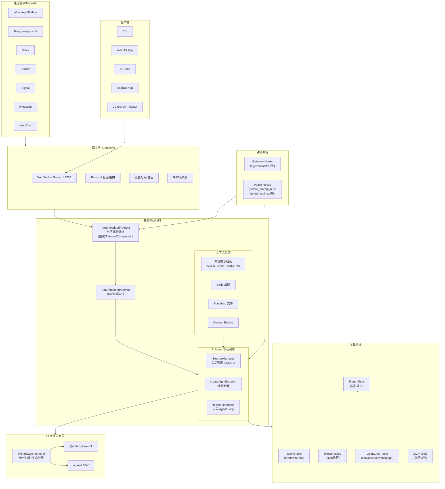

# OpenClaw — 架构概述

> **分析状态**: ✅ 核心架构 + Provider 层 + 配置系统已分析（2026-04-07 更新）

## 模块定位

OpenClaw 整体系统的架构鸟瞰，涵盖所有核心子系统及其关系。

## 整体架构图



## 核心子系统

### 1. 网关层 (Gateway)
- **技术**：Express + Hono + WebSocket
- **职责**：设备配对、协议验证、事件路由、Canvas 托管
- **入口**：`src/gateway/`

### 2. 通道层 (Channels)
- **职责**：适配多种消息通道（WhatsApp、Telegram、Slack、Discord 等）
- **模式**：统一通道抽象，各通道通过 extensions 实现
- **入口**：`src/channels/` + `extensions/`

### 3. 智能体运行时 (Agent Runtime)
- **外层循环**：`runEmbeddedPiAgent` — 容错编排（重试、Failover、Compaction）
- **内层引擎**：`@mariozechner/pi-coding-agent` — 推理 + 工具执行循环
- **入口**：`src/agents/pi-embedded-runner/`

### 4. 工具系统 (Tools)
- **内置工具**：read、write、edit、exec、process（来自 pi-coding-agent）
- **OpenClaw 扩展工具**：canvas、cron、web_search、web_fetch、image、tts 等
- **插件工具**：通过 Plugin SDK 注册的第三方工具
- **MCP 工具**：通过 Model Context Protocol 接入的外部工具
- **入口**：`src/agents/pi-tools.ts` + `src/agents/openclaw-tools.ts`

### 5. 上下文系统 (Context)
- **系统提示**：AGENTS.md + SOUL.md + TOOLS.md + IDENTITY.md + USER.md
- **Skills**：多层级加载（workspace → project → personal → managed → bundled）
- **Context Engine**：动态上下文注入和组装
- **入口**：`src/context-engine/`

### 6. 插件系统 (Plugins)
- **Plugin SDK**：对外暴露的开发者 API
- **钩子点**：before_model_resolve → before_prompt_build → before_tool_call → agent_end 等
- **工具注册**：`registerTool` API
- **入口**：`src/plugins/` + `src/plugin-sdk/`

### 7. 会话与记忆
- **持久化**：JSONL 格式存储于 `~/.openclaw/agents/<agentId>/sessions/`
- **Compaction**：长对话自动摘要压缩
- **记忆引擎**：`packages/memory-host-sdk/` + `extensions/memory-core/`

## 8. LLM Provider/Transport 层

> 2026-04-07 补充分析

### 三层概念模型

OpenClaw 的 LLM 接入不是按"服务商"组织的，而是分三层：

```
Provider（配置层）→ Api（协议层）→ Transport（实现层）
```

| 概念 | 含义 | 举例 |
|------|------|------|
| **Provider** | 配置中的逻辑 ID，包含 baseUrl + apiKey + models[] | `deepseek`、`moonshot`、`openai` |
| **Api** | 协议族，决定 HTTP 请求/响应的格式 | `openai-completions`、`openai-responses`、`anthropic-messages`、`google-generative-ai` |
| **Transport** | 按 Api 分支到具体的流式客户端实现 | `openai-transport-stream.ts`、`anthropic-transport-stream.ts` |

关键：**不是每个服务商一个 transport**。所有 OpenAI 兼容服务商（DeepSeek、Moonshot、DashScope 等）共用同一个 `openai-completions` transport，通过不同的 `baseUrl` 区分。

### Transport 路由

`provider-transport-stream.ts` 按 Api 分支到具体实现：

```typescript
// src/agents/provider-transport-stream.ts
function createSupportedTransportStreamFn(api: Api): StreamFn | undefined {
  switch (api) {
    case "openai-responses":
    case "openai-codex-responses":
      return createOpenAIResponsesTransportStreamFn();
    case "openai-completions":
      return createOpenAICompletionsTransportStreamFn();
    case "anthropic-messages":
      return createAnthropicMessagesTransportStreamFn();
    case "google-generative-ai":
      return createGoogleGenerativeAiTransportStreamFn();
  }
}
```

### Provider 配置结构

```typescript
// src/config/types.models.ts
type ModelProviderConfig = {
  baseUrl: string;
  apiKey?: SecretInput;
  auth?: ModelProviderAuthMode;
  api?: ModelApi;                    // 覆盖协议（否则按 provider 推断）
  headers?: Record<string, SecretInput>;
  request?: ConfiguredModelProviderRequest;  // 代理/TLS/超时等
  models: ModelDefinitionConfig[];
};
```

### 兼容层与 Quirks

`openai-completions-compat.ts` 处理同一协议下不同服务商的差异：

- `max_tokens` vs `max_completion_tokens`
- `thinkingFormat`（openai / openrouter / zai）
- 是否支持流式 usage、strict mode、developer role 等
- 按 `endpointClass` / `knownProviderFamily` / `provider` 做条件分支

`provider-attribution.ts` 根据 hostname 归类服务商（含国内厂商）：

```typescript
const MOONSHOT_NATIVE_BASE_URLS = new Set([
  "https://api.moonshot.ai/v1",
  "https://api.moonshot.cn/v1",
]);
const MODELSTUDIO_NATIVE_BASE_URLS = new Set([
  "https://coding-intl.dashscope.aliyuncs.com/v1",
  "https://dashscope.aliyuncs.com/compatible-mode/v1",
  // ...
]);
```

### API Key 管理

多层解析机制：

1. **配置内联**：`ModelProviderConfig.apiKey`
2. **环境变量**：每个 provider 有预设的候选变量列表（生成文件 `bundled-provider-auth-env-vars.generated.ts`）
3. **Auth Profile Store**：持久化的认证配置（`auth-profiles/store.ts`），支持 `api_key` / `token` / `oauth` 类型
4. **Profile 轮换**：外层循环中 key 失效时切换到下一个 auth profile

```typescript
// src/agents/model-auth-env.ts
export function resolveEnvApiKey(provider: string, env = process.env): EnvApiKeyResult | null {
  const candidates = PROVIDER_ENV_API_KEY_CANDIDATES[normalizeProviderIdForAuth(provider)];
  for (const envVar of candidates) {
    const value = env[envVar];
    if (value) return { envVar, value };
  }
  return null;
}
```

### 关键入口文件

| 文件 | 职责 |
|------|------|
| `src/agents/provider-transport-stream.ts` | 按 Api 选择 transport 实现 |
| `src/agents/openai-transport-stream.ts` | OpenAI Chat Completions + Responses 流式客户端 |
| `src/agents/anthropic-transport-stream.ts` | Anthropic Messages 流式客户端 |
| `src/agents/google-transport-stream.ts` | Google Generative AI 流式客户端 |
| `src/agents/provider-request-config.ts` | baseUrl / 鉴权 / 代理 / TLS 配置解析 |
| `src/agents/provider-attribution.ts` | 端点归类、合规 header、能力推断 |
| `src/agents/openai-completions-compat.ts` | OpenAI 兼容模式 quirks 矩阵 |
| `src/agents/custom-api-registry.ts` | 向 pi-ai 注册自定义 API 流 |
| `src/agents/models-config.ts` | 生成/合并 models.json |
| `src/config/types.models.ts` | Provider/Model 配置类型定义 |
| `src/agents/model-auth-env.ts` | 环境变量 API Key 解析 |
| `src/agents/auth-profiles/*.ts` | Auth Profile 持久化与轮换 |

### 设计评价

| 维度 | 评价 |
|------|------|
| **协议抽象** | 优秀。Api 概念将"协议"和"服务商"解耦，新增 OpenAI 兼容服务商零代码 |
| **灵活性** | 高。自定义 baseUrl + 自定义 headers + 自定义 TLS/代理 |
| **复杂度** | 过高。Auth Profile 轮换、生成的 env var 映射、provider discovery 等对个人部署产品不必要 |
| **国内服务商** | 有考虑（Moonshot、DashScope），但需要在 `provider-attribution.ts` 硬编码 URL |

## 9. 配置系统

> 2026-04-07 补充分析

### 配置文件

- **文件名**: `openclaw.json`（常量 `CONFIG_FILENAME`），支持 JSON5 格式（可写注释）
- **旧文件名**: `clawdbot.json`（自动迁移）
- **默认位置**: `~/.openclaw/openclaw.json`
- **可移动**: 通过 `OPENCLAW_CONFIG_PATH` 或 `OPENCLAW_STATE_DIR` 环境变量

### 路径发现（优先级）

1. `OPENCLAW_CONFIG_PATH` 环境变量（最高，显式指定文件路径）
2. `OPENCLAW_STATE_DIR/openclaw.json`（状态目录下查找）
3. `~/.openclaw/openclaw.json`（默认）
4. `~/.clawdbot/clawdbot.json`（legacy 兼容）

```typescript
// src/config/paths.ts
export function resolveConfigPath(
  env: NodeJS.ProcessEnv = process.env,
  stateDir: string = resolveStateDir(env),
): string {
  const override = env.OPENCLAW_CONFIG_PATH?.trim();
  if (override) return resolveUserPath(override, env, homedir);
  // 依次查找 openclaw.json → clawdbot.json
  const candidates = [
    path.join(stateDir, CONFIG_FILENAME),
    ...LEGACY_CONFIG_FILENAMES.map(name => path.join(stateDir, name)),
  ];
  return candidates.find(fs.existsSync) ?? path.join(stateDir, CONFIG_FILENAME);
}
```

### 首次运行

- **无 init 子命令**，有 `setup` 和 `onboard`（向导）
- `setup`：检测配置是否存在，不存在则创建最小配置（workspace + gateway mode）
- `onboard`：完整的引导流程（`wizard/setup.ts` 中多步 `writeConfigFile`）
- **缺失文件 = 空配置 `{}`**，不会自动创建

### 配置内容（`OpenClawConfig` 类型）

```typescript
// src/config/types.openclaw.ts — 字段极多
type OpenClawConfig = {
  meta?, auth?, acp?, env?, wizard?, diagnostics?, logging?, cli?,
  update?, browser?, ui?, secrets?, skills?, plugins?, models?,
  nodeHost?, agents?, tools?, bindings?, broadcast?, audio?, media?,
  messages?, commands?, approvals?, session?, web?, channels?, cron?,
  hooks?, discovery?, canvasHost?, talk?, gateway?, memory?, mcp?,
};
```

### 模块化配置（`$include`）

支持在主配置中引用其他 JSON/JSON5 文件，deep merge：

```json5
{
  "$include": ["./base.json5", "./models.json5"],
  "gateway": { "mode": "local" }
}
```

### 项目级配置

**不存在**。OpenClaw 是「单一活动配置文件路径」模型，没有自动发现当前项目目录下配置的机制。要实现项目级差异需要：
- 手动设置 `OPENCLAW_CONFIG_PATH` 指向项目内文件
- 或在主配置中用 `$include` 引入项目片段

### 设计评价

| 维度 | 评价 |
|------|------|
| **灵活性** | 高。`OPENCLAW_CONFIG_PATH` + `$include` + JSON5 |
| **项目级** | ❌ 缺失。单一路径模型不适合多项目场景 |
| **首次体验** | ⚠️ 需手动运行 setup/onboard |
| **配置形状** | ❌ 过大。30+ 顶层字段，学习曲线陡峭 |
| **安全** | ⚠️ `env.vars` 可内联明文密钥 |

## 技术栈

| 类别 | 技术 |
|------|------|
| 语言 | TypeScript (ESM) |
| 运行时 | Node.js 22+ |
| 包管理 | pnpm (monorepo) |
| 测试 | Vitest |
| 构建 | tsdown |
| UI | Vite + Lit (Control UI) |
| 移动端 | Swift (iOS/macOS) + Kotlin (Android) |
| LLM SDK | @anthropic-ai/sdk, openai |
| 协议 | WebSocket (JSON text frames) |
| 数据库 | SQLite (sqlite-vec 向量搜索) |
| 容器化 | Docker |

## 关键设计模式

1. **双层循环**：外层容错编排 + 内层推理循环
2. **插件一切**：通道、工具、上下文都可通过插件扩展
3. **钩子管道**：生命周期的每个阶段都可拦截
4. **流式优先**：全链路流式（LLM 流式 → 事件流 → WebSocket 推送）
5. **会话串行**：同一 session 的运行严格串行，防止竞争

## 引用此分析的认知问题

<!-- 待 insights 正式发布后补充链接 -->
