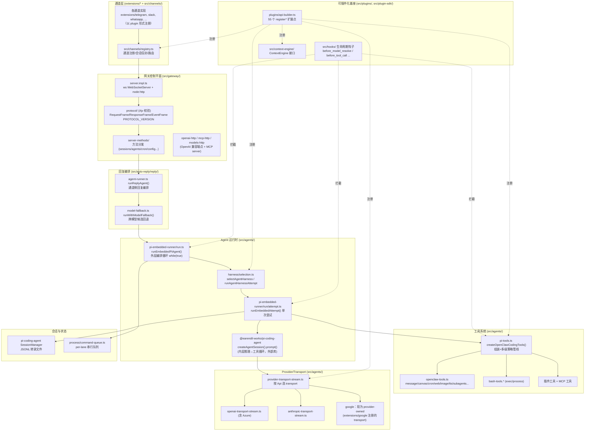

# OpenClaw — 架构与方案设计总览

> **分析状态**：基于当前真实源码全量重新核实（已对照 `2026.5.25` 新源码逐条复核行号/路径/结论；上一次基线为 `2026.4.27`）
> **源码版本依据**：`E:\Dev\longxia\_refs\openclaw-main`，`package.json` version `2026.5.25`，`packageManager pnpm@11.2.2`，`engines.node >=22.19.0`
> **更新日期**：2026-05-25

一句话定性：OpenClaw 是一个**自托管、单用户的"个人 AI 助手"**——它在用户已有的消息通道（WhatsApp/Telegram/Slack/Discord/iMessage 等）上回应，内置一个 Gateway 作为控制平面，把多通道消息汇聚到一个可插件化扩展（通道/工具/Provider/Agent 引擎/上下文引擎全可注册）的 Agent 运行时（README.md 原文："OpenClaw is a personal AI assistant you run on your own devices... The Gateway is just the control plane — the product is the assistant"）。

---

## 1. 整体架构图

> 仅画源码中实际存在的模块；函数/类型名取自真实文件。



---

## 2. 核心子系统

### 2.1 网关 / 控制平面（Gateway）
- **职责**：单一 WebSocket 控制平面，承载会话、Agent、cron、配置、设备配对、节点(mobile node)、技能、模型目录等所有 RPC；并额外暴露 OpenAI 兼容 HTTP 端点与一个 MCP server。
- **真实入口**：`src/gateway/server.ts`（懒加载壳）→ `src/gateway/server.impl.ts`（`startGatewayServer`）；连接处理 `src/gateway/server/ws-connection.ts`。
- **传输事实**：使用 `ws` 库的 `WebSocketServer` + Node 内置 `node:http`（`src/gateway/server/ws-connection.ts:3` `import type { RawData, WebSocket, WebSocketServer } from "ws"`；`server/http-listen.ts:1` `import type { Server as HttpServer } from "node:http"`；`startGatewayServer` 在 `server.impl.ts:538`）。**网关本身未使用 express / hono**：`src/gateway/` 与 `src/` 核心代码无任何 `from "hono"`/`@hono`/`from "express"` 直接 import（核实通过全 `src/` grep）。
  - 新版变化：`express@5.2.1` 现已是 `package.json` 直接 `dependencies`（不再仅是 override），但**使用方是 `extensions/`（如 `extensions/browser` 的 bridge-server、`extensions/line`/`extensions/msteams` 的 webhook server）而非 gateway 核心**——gateway 控制平面仍是纯 `ws`+`node:http`。`hono` 与 `@anthropic-ai/sdk` 在新版 `package.json` 中已**完全消失**（既不在 deps 也不在 overrides）。旧文档"Express + Hono"结论对 gateway 仍不成立；但"直接 deps 无 express"已不再准确。
- **协议**：`src/gateway/protocol/index.ts`（现 1242 行）+ `protocol/schema/*`（26 个 schema 文件）。请求/响应/事件为带类型的 JSON 帧（`RequestFrame`/`ResponseFrame`/`EventFrame`/`GatewayFrame`），用 **Ajv** 编译 schema 校验（`import AjvPkg from "ajv"`，`const AjvCtor = AjvPkg as ...`、`ajv ??= new AjvCtor({...})`，导出 156 个 `validate*Params`/`validate*Result`），有 `PROTOCOL_VERSION`/`MIN_CLIENT_PROTOCOL_VERSION`/`MIN_PROBE_PROTOCOL_VERSION` 常量。
- **方法分发**：`src/gateway/server-methods.ts` + `src/gateway/server-methods/`（agent/agents/sessions/cron/config/...）。

### 2.2 通道层（Channels）
- **职责**：把各 IM 平台适配成统一的入站信封/出站回复抽象。
- **真实入口**：共享逻辑在 `src/channels/`（`registry.ts` 通道注册、`session-envelope.ts`、`conversation-resolution.ts` 等）；**具体通道实现都在 `extensions/`**（如 `extensions/telegram`、`extensions/slack`、`extensions/whatsapp`、`extensions/discord`、`extensions/imessage`、`extensions/signal`、`extensions/feishu`、`extensions/qqbot` 等），以 plugin 形式经 `registerChannel` 注册（见 2.6）。
- **关键事实**：通道不是核心硬编码，而是 bundled plugin；`src/channels/registry.ts` 维护注册表，`extensions/` 目录下现有约 **130 个**扩展（通道/Provider/记忆/工具/技能等，旧文档"50+"已偏低）。Telegram 通道现基于 `grammy` SDK（`grammy`+`@grammyjs/runner` 为直接 dep）。

### 2.3 Agent 运行时——外层编排 vs 内层推理
这是 OpenClaw 最核心的结构，**实际存在三层**（比旧文档"双层"更细）：

1. **回复编排层**：`src/auto-reply/reply/agent-runner.ts` 的 `runReplyAgent()`（通道侧入口，`agent-runner.ts:1021`）→ 经 `src/agents/model-fallback.ts` 的 `runWithModelFallback()`（`model-fallback.ts:1019`）做**跨模型候选回退**（多个 provider/model 候选依次尝试）。
2. **外层编排循环**：`src/agents/pi-embedded-runner/run.ts`（现 3410 行）的 `runEmbeddedPiAgent()`（`run.ts:406`）。内部是一个 `while (true)`（`run.ts:1286`，上限 `MAX_RUN_LOOP_ITERATIONS`，`run.ts:1024`）：负责 session lane 串行入队、workspace 解析、插件加载（`ensureRuntimePluginsLoaded`，`run.ts:541`）、生命周期钩子、harness 选择、模型解析、**auth profile 轮换**（`createEmbeddedRunAuthController`，`run.ts:905`，鉴权失效切下一 profile）、**溢出/超时压缩重试**（`MAX_OVERFLOW_COMPACTION_ATTEMPTS`=3 / `MAX_TIMEOUT_COMPACTION_ATTEMPTS`=2，`run.ts:1022-1023`）。每轮调用 `runEmbeddedAttemptWithBackend()`（`run.ts:1403`）。
3. **单次尝试 + 内层推理循环**：`run/backend.ts` 的 `runEmbeddedAttemptWithBackend()` → `harness/selection.ts` 的 `runAgentHarnessAttempt()`（`selection.ts:230`，旧版名为 `runAgentHarnessAttemptWithFallback`，已重命名）→ 选中 harness 的 `runAttempt`。默认 "pi" harness（`harness/builtin-pi.ts`，现已精简为 13 行工厂 `createPiAgentHarness()`）的 `runAttempt = runEmbeddedAttempt`（`run/attempt.ts`，现 5043 行）。**真正的"LLM ↔ 工具"推理循环不在 OpenClaw 代码里**，而是委托给外部库 `@earendil-works/pi-coding-agent` 的 `createAgentSession(...)` 后 `session.prompt(...)`（`run/attempt.ts:2393-2396` 创建、`:3250` 调用）。
- **关键类型/函数**：`runEmbeddedPiAgent`、`runEmbeddedAttempt`（`run/attempt.ts:1180`）、`runAgentHarnessAttempt`、`selectAgentHarness`（`selection.ts:115`）、`createEmbeddedRunAuthController`、`createAgentSession().prompt()`（外部库）。

### 2.4 工具系统
- **职责**：把内置编码工具 + OpenClaw 专有工具 + 通道工具 + 插件工具汇总，并按多层策略裁剪后交给推理循环。
- **真实入口**：`src/agents/pi-tools.ts` 的 `createOpenClawCodingTools()`（定义在 `pi-tools.ts:346`，在 `run/attempt.ts:1410` 调用）。
- **组装来源**（pi-tools.ts:669-913 区段）：
  - `createCodingTools()` / `createReadTool()`（来自 `@earendil-works/pi-coding-agent`）提供 read/write/edit，OpenClaw 用 host/sandbox 版本替换包装（`createHostWorkspaceWriteTool`、`createSandboxedReadTool` 等，pi-tools.ts:669-709）。
  - `exec` / `process`（`bash-tools.js`，懒加载 `createExecTool`/`createProcessTool`，pi-tools.ts:154/165/191）。
  - `apply_patch`（仅 OpenAI 系，`createApplyPatchTool`，pi-tools.ts:785；启用条件 `isOpenAIProvider(modelProvider)`，pi-tools.ts:654）。
  - 通道工具 `listChannelAgentTools()`。
  - OpenClaw 专有工具 `createOpenClawTools()`（`openclaw-tools.ts`）：`message`、`canvas`、`cron`、`web_search`、`web_fetch`、`image`/`image_generate`/`video_generate`/`music_generate`、`pdf`、`tts`、`nodes`、`gateway`、`agents_list`、`subagents`、`sessions_list/history/send/spawn/yield`、`update_plan` 等。
- **多级策略管线**（关键设计）：工具经 profile / provider-profile / global / agent / group / sandbox / subagent 等多层 allow/deny 策略合并（`resolveEffectiveToolPolicy`（pi-tools.policy.ts:444）、`applyToolPolicyPipeline`（pi-tools.ts:1023）、`resolveProviderToolPolicy`/`resolveGroupToolPolicy`/`resolveTrustedGroupId` + 插件可注册 `registerTrustedToolPolicy`），再 `normalizeToolParameters`（pi-tools.schema.ts，按 provider 清洗 JSON Schema，Gemini 去约束词、OpenAI 拒绝 root union），最后 `wrapToolWithBeforeToolCallHook`（注入 `before_tool_call` 钩子+循环检测）和 `wrapToolWithAbortSignal`。
  - 新版变化：旧的 **"sender-owner / owner-only 默认隐藏 + opt-in" 工具门禁路径已被移除**（CHANGELOG 2026.5.25："remove the old sender-owner tool gating path so configured tools stay visible for trusted sessions"）。`applyOwnerOnlyToolPolicy` 这一标识符在新源码中已不存在；`senderIsOwner` 仅保留为通道动作鉴权位（pi-tools.ts:462/964），不再作为工具可见性默认门禁。受信任会话的工具默认可见，命令/通道动作仍携带真实 sender 身份。

### 2.5 上下文系统
- **系统提示**：`src/agents/pi-embedded-runner/system-prompt.ts` 的 `buildEmbeddedSystemPrompt()`（`:18`）→ `src/agents/system-prompt.ts` 的 `buildAgentSystemPrompt()`（`:671`），组合 workspace、技能提示、运行时信息（host/os/model/channel/channelActions）、时区/时间、记忆段、沙箱信息、额外系统提示、provider 贡献等。
- **Context Engine（可插件化上下文管理）**：`src/context-engine/types.ts` 定义 `ContextEngine` 接口（`interface ContextEngine` 在 `types.ts:233`）——`bootstrap?`(`:240`)/`ingest`(`:262`)/`ingestBatch?`(`:273`)/`assemble`(`:307`)/`compact`(`:333`)/`maintain?`(`:252`)/`afterTurn?`(`:286`)/`prepareSubagentSpawn?`(`:361`) 等生命周期方法，支持 `ownsCompaction?`(`:106`)、安全转录改写 `rewriteTranscriptEntries?`(`:216`)。引擎可由插件经 `registerContextEngine` 注册（如记忆引擎）。注册/委托：`src/context-engine/registry.ts`、`delegate.ts`。
- **Skills**：`src/agents/skills/`。技能为带 `SKILL.md` frontmatter 的目录（`local-loader.ts` `loadSkillsFromDirSafe`），有 source 维度（`skill-contract.ts`：`SourceScope = "user" | "project" | "temporary"`，并保留 legacy `source` 字符串字段）。插件也可贡献技能（`plugin-skills.ts`）。
  - 注意：旧文档“workspace → project → personal → managed → bundled 五层”未在当前 `skill-contract.ts`/`source.ts` 直接确认（完整聚合顺序需读 `skills/workspace.ts`/`refresh.ts` 全文，本次未逐行追完，标为存疑）。

### 2.6 插件 / Hook 系统（"一切皆插件"）
- **职责**：把通道、工具、Provider、Agent 引擎、上下文引擎、记忆、命令、HTTP 路由、CLI 等几乎所有能力做成可注册扩展点。
- **真实入口**：`src/plugins/api-builder.ts` 暴露 `OpenClawPluginApi`，实测含 **55 个 `register*` 方法**（grep 去重计数）。一组代表性扩展点：`registerTool`/`registerToolMetadata`/`registerAgentToolResultMiddleware`、`registerHook`、`registerChannel`、`registerProvider`、`registerAgentHarness`、`registerContextEngine`、`registerCompactionProvider`、`registerHttpRoute`、`registerGatewayMethod`、`registerCli`/`registerCliBackend`、`registerCommand`、`registerSpeechProvider`/`registerImageGenerationProvider`/`registerVideoGenerationProvider`/`registerMusicGenerationProvider`/`registerWebSearchProvider`/`registerWebFetchProvider`/`registerMediaUnderstandingProvider`、`registerMemoryRuntime`/`registerMemoryCapability`/`registerMemoryEmbeddingProvider`、`registerSessionExtension`/`registerSessionAction`/`registerSessionSchedulerJob`、`registerTrustedToolPolicy`、`registerModelCatalogProvider`。
  - 新版相对旧基线新增/显化的扩展点：`registerEmbeddingProvider`（通用嵌入提供方契约，从 memory 专用适配器中抽出，CHANGELOG 2026.5.x "embeddings can become a reusable provider surface"）、`registerRealtimeVoiceProvider`/`registerRealtimeTranscriptionProvider`（实时语音/Talk）、`registerMeetingNotesSourceProvider`（会议记录 source-only 插件契约）、`registerCodexAppServerExtensionFactory`（Codex app-server 扩展）、`registerHostedMediaResolver`、`registerSecurityAuditCollector`、`registerControlUiDescriptor` 等。
- **Hook 生命周期点**（真实 phase 名，定义在 `src/plugins/hook-types.ts` 的字面量联合；旧文档误指 `src/hooks/types.ts`）：`before_model_resolve`、`before_prompt_build`、`before_agent_start`、`before_agent_run`、`before_agent_reply`（`run.ts:574` cron 触发可短路，对应 `runBeforeAgentReply`）、`before_tool_call`、`after_tool_call`、`before_compaction`/`after_compaction`、`before_agent_finalize`、`before_message_write`、`before_dispatch`、`before_reset`、`before_install` 等。（注意：旧文档列出的 `before_reset_context` 不在当前规范联合中。）Hook 的 `HookSource` 现为四个带前缀值：`"openclaw-bundled" | "openclaw-managed" | "openclaw-workspace" | "openclaw-plugin"`（`src/hooks/types.ts:38`，对应 `HookSource = Hook["source"]`）。

### 2.7 会话与记忆
- **持久化**：转录文件由外部库 `@earendil-works/pi-coding-agent` 的 `SessionManager`（`SessionManager.open(sessionFile)` + `appendMessage`，JSONL，嵌入路径见 `run/attempt.ts:2133`/`:3810`，另 `cli-runner.ts:377-378`）；路径解析 `src/config/sessions/transcript.ts` `resolveSessionTranscriptFile`；agent 目录由 `resolveAgentDir(cfg, agentId)`/`resolveDefaultAgentDir(cfg)`（`src/agents/agent-scope-config.ts:195/209`）解析为 `<root>/agents/<id>/agent`（`src/config/agent-dirs.ts:78`），`DEFAULT_AGENT_ID = "main"`（`src/routing/session-key.ts:26`）；可被 `OPENCLAW_AGENT_DIR`/`PI_CODING_AGENT_DIR` 覆盖。（旧文档引用的 `src/agents/agent-paths.ts` 在新版已不存在，逻辑迁至上述文件。）
- **串行**：`src/process/command-queue.ts` 的 per-lane 串行队列（注释 `command-queue.ts:54` "Minimal in-process queue to serialize command executions."）；`pi-embedded-runner/lanes.ts` 把每个会话映射到 `session:<key>` lane（`lanes.ts:5`），外层再套 global lane（cron 用专用 `CommandLane.CronNested`，`lanes.ts:13`，避免死锁）——同一会话严格串行。
- **压缩 (compaction)**：`pi-embedded-runner/compact*.ts`，外层循环里有溢出/超时触发的压缩重试。
- **记忆**：`packages/memory-host-sdk/src/`（`engine.ts`/`engine-embeddings.ts`/`engine-storage.ts`/`engine-foundation.ts`/`engine-qmd.ts`/`query.ts` 等；新版已收进 `src/` 子目录）+ `extensions/memory-core`、`extensions/memory-lancedb`、`extensions/active-memory`；通过 `registerMemoryRuntime`/`registerMemoryEmbeddingProvider`（及新版通用的 `registerEmbeddingProvider`）接入，向量检索可用 `sqlite-vec`（现为 `optionalDependencies`）。

### 2.8 Provider / Transport 层
- **三层模型仍成立**：Provider（配置 ID + baseUrl/apiKey/models）→ Api（协议族）→ Transport（流式实现）。
- **真实入口**：`src/agents/provider-transport-stream.ts` 的 `createSupportedTransportStreamFn(model, ctx)`（`:76`）按 `Api` 分支（`:80-94`）：`openai-responses`/`openai-codex-responses` → `createOpenAIResponsesTransportStreamFn()`；`openai-completions` → `createOpenAICompletionsTransportStreamFn()`；`azure-openai-responses` → `createAzureOpenAIResponsesTransportStreamFn()`；`anthropic-messages` → `createAnthropicMessagesTransportStreamFn()`；`google-generative-ai` → `createProviderOwnedGoogleTransportStreamFn()`。
  - **新版结构变化（已确认）**：Google transport 已从核心搬到插件——核心分支现仅做 **provider-owned 委托**（`createProviderOwnedGoogleTransportStreamFn`，`provider-transport-stream.ts:39-74`，经 `resolveProviderStreamFn(...)`（`src/plugins/provider-runtime.ts:604`）向插件注册的 provider 取流）。实际 Google 流实现在 `extensions/google/transport-stream.ts`（导出 `createGoogleGenerativeAiTransportStreamFn`），由 `extensions/google` 经 `api.registerProvider(...)` 注册（依赖 `@google/genai`，现为直接 dep）。OpenAI/Azure/Anthropic transport 仍内置在核心 `src/agents/`。
- **关键文件**：`openai-transport-stream.ts`（含 Responses/Completions/Azure 三个工厂）、`anthropic-transport-stream.ts`、`custom-api-registry.ts`（向 pi-ai 注册自定义 API 流）、`auth-profiles/`（auth profile 持久化与轮换）。各服务商兼容 stream-wrappers 现集中在 `src/agents/pi-embedded-runner/`：`moonshot-stream-wrappers.ts`、`moonshot-thinking-stream-wrappers.ts`、`zai-stream-wrappers.ts`、`minimax-stream-wrappers.ts`、`google-stream-wrappers.ts`、`openai-stream-wrappers.ts`、`proxy-stream-wrappers.ts`（旧文档提到的 `openrouter-stream-wrappers.ts` 不存在；OpenRouter 改以 `openrouter-model-capabilities.ts`/extra-params 形式处理）。
- **MCP 双向**：`src/mcp/` 是 OpenClaw 作为 **MCP server** 暴露自身工具（`tools-stdio-server.ts`、`openclaw-tools-serve.ts`、`plugin-tools-serve.ts`、`channel-server.ts`，依赖 `@modelcontextprotocol/sdk`）；作为 **MCP client** 消费外部 MCP server 的代码在 `src/agents/mcp-transport.ts`/`mcp-stdio-transport.ts`/`embedded-pi-mcp.ts`/`bundle-mcp-config.ts` 等。

---

## 3. 关键方案抉择与取舍

> 每条：他们怎么做（引路径）/ 为什么（源码注释或标注分析）/ 代价。

**A. 推理循环外包给 pi-* 系列库，OpenClaw 只做"外层编排"**
- 怎么做：内层 LLM↔工具循环由 `@earendil-works/pi-coding-agent` 的 `createAgentSession().prompt()` 承担（`run/attempt.ts`）；`@earendil-works/pi-ai`/`pi-agent-core`/`pi-tui` 等也是依赖（均 `0.75.4`）。OpenClaw 自写的是外层重试/回退/压缩/鉴权轮换/工具策略/上下文装配。（注：这套 pi-* 包在新版已从 `@mariozechner/*` scope 整体改名为 `@earendil-works/*`——属发布命名迁移，非架构变化。）
- 为什么：源码未明说动机；以下为分析——把"通用 agent loop"沉到独立库，OpenClaw 专注多通道编排与策略，是一种关注点分离。
- 代价：核心推理行为受外部库版本约束；调试需跨库；OpenClaw 大量"包装/纠偏"代码（schema 清洗、tool name 重映射、stream wrappers）本质是在适配该库。

**B. 三层重试/回退而非单层**
- 怎么做：`runWithModelFallback`（跨模型候选）包住 `runEmbeddedPiAgent`（`while(true)` + auth profile 轮换 + 压缩重试），内含单次 `runEmbeddedAttempt`。
- 为什么：源码体现对 rate-limit、empty-response、incomplete-turn、context-overflow、auth 失效等失败模式分别恢复（`pi-embedded-runner/result-fallback-classifier.ts`、`pi-embedded-runner/run/incomplete-turn.ts`、`pi-embedded-runner/empty-assistant-turn.ts`、`pi-embedded-runner/run/failover-policy.ts` 与 `pi-embedded-runner/run/assistant-failover.ts`；另有顶层 `src/agents/failover-policy.ts`。新版这些分类器多已下沉到 `pi-embedded-runner/` 子树）。
- 代价：`run.ts` 单文件现 **3410 行**、`attempt.ts` 现 **5043 行**（较旧基线 2471/3324 进一步膨胀），控制流复杂度极高，理解成本大。

**C. 可插拔 Agent Harness（不止"pi"）**
- 怎么做：`harness/types.ts` 定义 `AgentHarness` 接口（`id`/`supports`/`runAttempt`/`classify?`/`compact?`/`reset?`，`types.ts:69-87`），选择逻辑在 `harness/selection.ts`（`selectAgentHarness`、`runAgentHarnessAttempt`）。"pi" 是内置 fallback（`builtin-pi.ts` 现为 13 行 `createPiAgentHarness()`，`supports: () => ({ supported: true, priority: 0 })`），插件可 `registerAgentHarness`（如 codex）。policy 决定 `runtime: "auto"|"pi"|<plugin>` 与 `fallback`。（注：旧文档引用的 builtin-pi 注释 "PI is intentionally not part of the plugin candidate list ... legacy fallback path" 在新版该文件已被删去——该文件被精简为纯工厂；"pi 为兜底"的语义改由 selection.ts 的优先级/policy 逻辑承担。）
- 为什么：源码注释——允许同进程内不同 agent 用不同严格度/不同后端。
- 代价：harness 选择 + auth 转发 + CLI runtime alias（`isCliRuntimeAlias`）叠加，分支多。

**D. WebSocket 单控制平面 + Ajv 强类型协议**
- 怎么做：`server.impl.ts`（`startGatewayServer` 在 `:538`）用 `ws` + `node:http`；`protocol/` 用 Ajv 编译每个方法的 params/result schema，带 `PROTOCOL_VERSION`。所有客户端（CLI、移动端、Control UI、节点）走同一协议。
- 为什么：源码未明说；分析——单协议便于多端一致与版本协商。
- 代价：协议面极大（`protocol/index.ts` 现 1242 行、156 种 `validate*`），新增能力需同步 schema/类型/方法三处。

**E. "一切皆插件" + bundled 扩展**
- 怎么做：55 个 `register*`（`api-builder.ts`），通道/Provider（含 Google）/记忆/上下文引擎/命令均为 `extensions/` 下 bundled plugin；`src/plugins/` 有完整的 bundle 加载/激活/能力运行时机制（`bundled-*.ts`、`activation-planner.ts`）。新版还新增了 `defineToolPlugin` 与 `openclaw plugins build/validate/init`（typed simple tool plugin，CHANGELOG 2026.5.x），降低写插件门槛。
- 为什么：源码未明说；分析——把核心收薄、把集成做成可装卸单元，利于裁剪与第三方扩展。
- 代价：插件加载/激活/运行时镜像（`bundled-runtime-*.ts`）机制本身很重；冷启动需 `ensureRuntimePluginsLoaded`（run.ts:541）。

**F. 工具多级策略 + 安全默认**
- 怎么做：`pi-tools.ts` 七八层策略合并（`resolveEffectiveToolPolicy`/`applyToolPolicyPipeline`/`resolveProviderToolPolicy`/`resolveGroupToolPolicy`）+ workspace-only fs 守卫 + sandbox 桥接 + `registerTrustedToolPolicy` 受信任策略。
- 为什么：源码强调安全默认（`apply_patch` 默认 workspace-contained，pi-tools.ts:649 注释 "Secure by default: apply_patch is workspace-contained unless explicitly disabled."）。
- 新版变化：旧的 "sender-owner / owner-only 默认隐藏 + opt-in" 门禁路径已移除（`applyOwnerOnlyToolPolicy` 不复存在，见 2.4），改为"受信任会话默认可见配置工具 + 命令/通道动作仍带真实 sender 身份"。
- 代价：单个工具最终是否暴露仍要经过长链路裁剪，可预测性下降。

**G. 会话严格串行（per-lane 队列）**
- 怎么做：`process/command-queue.ts` in-process 队列，`lanes.ts` 每会话一个 `session:<key>` lane，外层 global lane。
- 为什么：注释 "Minimal in-process queue to serialize command executions"；cron 用 `CronNested` 防死锁。
- 代价：同会话天然不能并发；跨进程不串行（队列状态挂在 `globalThis`，仅单进程内有效）。

**H. Provider→Api→Transport 解耦**
- 怎么做：`provider-transport-stream.ts` 按 Api 选 transport，OpenAI 兼容服务商共用 completions transport（仅 baseUrl 不同）；Google 现走 provider-owned 委托（见 2.8）。
- 为什么：源码未明说；分析——新增 OpenAI 兼容服务商基本零代码；provider-owned 机制让整套 Provider（如 Google）能整体迁出核心、做成插件。
- 代价：兼容差异下沉到 quirks/compat 与 stream-wrappers（`moonshot-/moonshot-thinking-/zai-/minimax-/google-/openai-/proxy-stream-wrappers.ts`，均在 `pi-embedded-runner/`），长尾分支多。

---

## 4. 关键数据流

### 场景：一条用户消息从通道到 LLM 回复
```mermaid
sequenceDiagram
    participant CH as 通道(extensions/*)
    participant GW as Gateway server.impl.ts (ws)
    participant AR as agent-runner.ts runReplyAgent
    participant MF as model-fallback runWithModelFallback
    participant OUT as run.ts runEmbeddedPiAgent
    participant SEL as harness selection
    participant ATT as run/attempt.ts runEmbeddedAttempt
    participant PI as @earendil-works/pi-coding-agent session.prompt()
    participant TX as provider-transport-stream

    CH->>GW: 入站消息 (WS RequestFrame, Ajv 校验)
    GW->>AR: 分发 (server-methods)
    AR->>MF: 选模型候选
    MF->>OUT: runEmbeddedPiAgent(params)
    Note over OUT: 入 session lane 串行队列<br/>解析 workspace/插件/auth profile
    OUT->>OUT: hook before_agent_reply / before_model_resolve
    OUT->>SEL: selectAgentHarness (auto/pi/plugin)
    SEL->>ATT: runEmbeddedAttempt (单次尝试)
    Note over ATT: createOpenClawCodingTools()<br/>多级策略裁剪 + before_tool_call 包装
    ATT->>PI: createAgentSession(); session.prompt(prompt,{images})
    loop 内层推理↔工具 (外部库)
        PI->>TX: 流式请求 (按 Api 选 transport)
        TX-->>PI: 流式 token
        PI->>ATT: 工具调用 (经包装的工具 execute)
    end
    PI-->>ATT: 最终 assistant 文本
    ATT-->>OUT: EmbeddedRunAttemptResult
    Note over OUT: 失败则分类→压缩/换 profile/重试<br/>(while 循环)
    OUT-->>AR: EmbeddedPiRunResult (payloads)
    AR-->>GW: 出站回复 (流式事件帧)
    GW-->>CH: 投递到通道
```
要点（均可落源码）：入站经 `server.impl.ts`/`protocol` 的 Ajv 校验 → `server-methods` 分发 → `runReplyAgent`(`agent-runner.ts:1021`) → `runWithModelFallback`(`model-fallback.ts:1019`) → `runEmbeddedPiAgent`(`run.ts:406`) 入 `session:<key>` lane → 钩子 → `selectAgentHarness`(`selection.ts:115`) → `runEmbeddedAttempt`(`run/attempt.ts:1180`) → `createOpenClawCodingTools` 装配工具 → `session.prompt()`(`run/attempt.ts:3250`) 跑内层循环 → 结果回流，失败由外层 `while`(`run.ts:1286`) 分类重试。

---

## 5. 技术栈（核实自 `package.json`）

| 类别 | 真实依赖/事实（核实自 `package.json` `dependencies`，除非注明） |
|------|------|
| 语言 / 模块 | TypeScript（`typescript@6.0.3`），`"type": "module"`（ESM） |
| 运行时 | Node.js `>=22.19.0`（`engines`，旧基线为 `>=22.14.0`，2026.5.19 起抬高到 22.19） |
| 包管理 | `pnpm@11.2.2`（`packageManager`，旧基线 `pnpm@10.33.0`），pnpm workspace monorepo |
| Agent 核心库 | `@earendil-works/pi-agent-core`、`@earendil-works/pi-ai`、`@earendil-works/pi-coding-agent`、`@earendil-works/pi-tui`（均 `0.75.4`）——旧基线为 `@mariozechner/pi-*`，已整体改 scope |
| LLM SDK | 直接 deps 仅 `openai@6.38.0`；新增 `@google/genai@2.5.0`（供 `extensions/google` 的 Google transport）。`@anthropic-ai/sdk` 与 `hono` 在新版 `package.json` 中**已彻底移除**（既非 deps 也非 overrides）——Anthropic 经 `@earendil-works/pi-ai` 走自有 transport，`src/` 无任何直接 import |
| HTTP（仅扩展用） | `express@5.2.1` 现为直接 dep，但仅被 `extensions/`（browser bridge、line/msteams webhook）使用；**gateway 控制平面仍是纯 `ws`+`node:http`** |
| 协议/网络 | `ws@8.20.1`（WebSocket）、`undici@8.3.0`、`web-push@3.6.7`、`@openclaw/proxyline@0.3.3`、`ipaddr.js` |
| Agent/MCP | `@modelcontextprotocol/sdk@1.29.0`、`@agentclientprotocol/sdk@0.22.1`（ACP）、`@lydell/node-pty` |
| 校验/Schema | `ajv@8.20.0`、`zod@4.4.3`、`typebox@1.1.38` |
| 配置/数据/媒体 | `json5`、`yaml`、`dotenv`、`tar`、`jszip`、`file-type`、`kysely`（SQL builder）、`pdfjs-dist`、`qrcode`、`linkedom`/`@mozilla/readability`（网页正文）、`markdown-it`、`tree-sitter-bash`/`web-tree-sitter`、`quickjs-wasi`、`tokenjuice`、`node-edge-tts`、`playwright-core`；`sqlite-vec`/`sharp` 现在 `optionalDependencies` |
| 渠道 SDK | `grammy@1.43.0` + `@grammyjs/runner`/`@grammyjs/transformer-throttler`（Telegram） |
| CLI/调度 | `commander@14.0.3`、`@clack/prompts@1.4.0`、`croner@10.0.1`（cron）、`chokidar`、`chalk`、`jiti` |
| 移动端 | `apps/ios`(Swift)、`apps/macos`(Swift)、`apps/android`(Kotlin)、`apps/macos-mlx-tts` |
| 容器 | 多个 Dockerfile（`Dockerfile.sandbox*`），`docker-compose.yml` |

---

## 6. 设计评价

> 事实见上文路径；本节为**评价**（标注）。

- **评价**：核心结构（外层编排 + harness 选择 + 外包内层推理）是一种"薄核 + 厚编排 + 可插拔后端"的取法；优点是核心可换 agent 引擎、可换 Provider、可换上下文引擎，扩展面非常宽（55 register 点 + 50+ extensions）。
- **评价**：代价是控制流极度集中且巨大——`run.ts`(3410 行) 与 `run/attempt.ts`(5043 行) 单文件承载重试/压缩/鉴权/工具/钩子多关注点，且较一个月前还在持续膨胀（旧基线 2471/3324），新人读懂成本高；大量 `*-stream-wrappers.ts`/compat 文件说明在持续追赶各服务商长尾差异。
- **评价**：协议层强类型（Ajv schema + PROTOCOL_VERSION）对多端一致性有利，但协议面随功能线性膨胀（156 个 `validate*`），是长期维护负担。
- **评价**：会话串行 + per-lane 队列对单用户助手是合理简化；但队列状态在 `globalThis`、仅单进程内有效，意味着水平扩展不是该设计目标（与 README "run on your own devices / personal single-user" 一致）。
- **评价（本次对照核实结论）**：相比上一基线，**无颠覆性架构重构**，主体仍是"WS 单控制平面 + 三层回退 + 可插拔 harness + 一切皆插件"。真实可观察到的结构性演进是：(1) Provider transport 走向"provider-owned 委托"，Google 已整体迁出核心成为 `extensions/google` 插件；(2) 工具门禁简化（移除 sender-owner/owner-only 默认隐藏路径）；(3) 新增实时语音、会议记录、通用 embedding provider 等扩展点；(4) pi-* 依赖整体改 scope 为 `@earendil-works/*`。网关**仍不用 express/hono 作为控制平面**（纯 `ws`+`node:http`），但 `express` 已成为直接 dep 供扩展使用——这是相对旧文档需修正的一处事实。

---

## 7. 关键入口文件清单

| 子系统 | 文件 |
|------|------|
| 网关服务实现 | `src/gateway/server.impl.ts`（`startGatewayServer:538`）、`src/gateway/server/ws-connection.ts` |
| 协议校验 | `src/gateway/protocol/index.ts`（1242 行）、`src/gateway/protocol/schema/*`（26 个） |
| 外层编排循环 | `src/agents/pi-embedded-runner/run.ts`（`runEmbeddedPiAgent:406`） |
| 单次尝试 + 内层调用 | `src/agents/pi-embedded-runner/run/attempt.ts`（`runEmbeddedAttempt:1180`，`session.prompt():3250`） |
| harness 抽象/选择 | `src/agents/harness/selection.ts`（`selectAgentHarness:115`、`runAgentHarnessAttempt:230`）、`src/agents/harness/builtin-pi.ts`、`src/agents/harness/types.ts`（`AgentHarness:69`） |
| 跨模型回退 | `src/agents/model-fallback.ts`（`runWithModelFallback:1019`） |
| 工具组装 | `src/agents/pi-tools.ts`（`createOpenClawCodingTools:346`）、`src/agents/openclaw-tools.ts`（`createOpenClawTools:70`），具体工具在 `src/agents/tools/` |
| 工具策略 | `src/agents/pi-tools.policy.ts`、`src/agents/pi-tools.schema.ts` |
| Provider/Transport | `src/agents/provider-transport-stream.ts`（Google 委托 → `extensions/google/transport-stream.ts`） |
| 插件 API | `src/plugins/api-builder.ts`（55 个 register*）、Hook phase 定义 `src/plugins/hook-types.ts` |
| 上下文引擎接口 | `src/context-engine/types.ts`（`ContextEngine:233`） |
| 回复编排 | `src/auto-reply/reply/agent-runner.ts`（`runReplyAgent:1021`） |
| agent 目录/会话路径 | `src/agents/agent-scope-config.ts`（`resolveAgentDir:195`）、`src/config/agent-dirs.ts:78`、`src/config/sessions/transcript.ts`、`src/routing/session-key.ts`（`DEFAULT_AGENT_ID:26`） |
