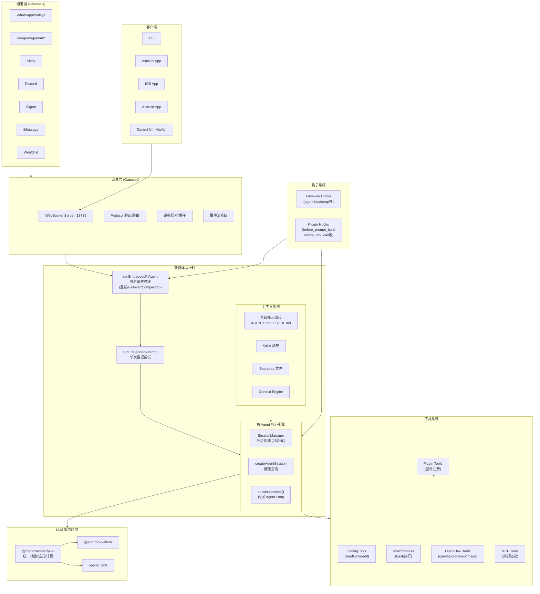

# OpenClaw — 架构概述

> **分析状态**: ✅ 核心架构已分析（2026-04-05）

## 模块定位

OpenClaw 整体系统的架构鸟瞰，涵盖所有核心子系统及其关系。

## 整体架构图

## 核心子系统

### 1. 网关层 (Gateway)
- **技术**：Express + Hono + WebSocket
- **职责**：设备配对、协议验证、事件路由、Canvas 托管
- **入口**：`src/gateway/`

### 2. 通道层 (Channels)
- **职责**：适配多种消息通道（WhatsApp、Telegram、Slack、Discord 等）
- **模式**：统一通道抽象，各通道通过 extensions 实现
- **入口**：`src/channels/` + `extensions/`

### 3. 智能体运行时 (Agent Runtime)
- **外层循环**：`runEmbeddedPiAgent` — 容错编排（重试、Failover、Compaction）
- **内层引擎**：`@mariozechner/pi-coding-agent` — 推理 + 工具执行循环
- **入口**：`src/agents/pi-embedded-runner/`

### 4. 工具系统 (Tools)
- **内置工具**：read、write、edit、exec、process（来自 pi-coding-agent）
- **OpenClaw 扩展工具**：canvas、cron、web_search、web_fetch、image、tts 等
- **插件工具**：通过 Plugin SDK 注册的第三方工具
- **MCP 工具**：通过 Model Context Protocol 接入的外部工具
- **入口**：`src/agents/pi-tools.ts` + `src/agents/openclaw-tools.ts`

### 5. 上下文系统 (Context)
- **系统提示**：AGENTS.md + SOUL.md + TOOLS.md + IDENTITY.md + USER.md
- **Skills**：多层级加载（workspace → project → personal → managed → bundled）
- **Context Engine**：动态上下文注入和组装
- **入口**：`src/context-engine/`

### 6. 插件系统 (Plugins)
- **Plugin SDK**：对外暴露的开发者 API
- **钩子点**：before_model_resolve → before_prompt_build → before_tool_call → agent_end 等
- **工具注册**：`registerTool` API
- **入口**：`src/plugins/` + `src/plugin-sdk/`

### 7. 会话与记忆
- **持久化**：JSONL 格式存储于 `~/.openclaw/agents/<agentId>/sessions/`
- **Compaction**：长对话自动摘要压缩
- **记忆引擎**：`packages/memory-host-sdk/` + `extensions/memory-core/`

## 技术栈

| 类别 | 技术 |
|------|------|
| 语言 | TypeScript (ESM) |
| 运行时 | Node.js 22+ |
| 包管理 | pnpm (monorepo) |
| 测试 | Vitest |
| 构建 | tsdown |
| UI | Vite + Lit (Control UI) |
| 移动端 | Swift (iOS/macOS) + Kotlin (Android) |
| LLM SDK | @anthropic-ai/sdk, openai |
| 协议 | WebSocket (JSON text frames) |
| 数据库 | SQLite (sqlite-vec 向量搜索) |
| 容器化 | Docker |

## 关键设计模式

1. **双层循环**：外层容错编排 + 内层推理循环
2. **插件一切**：通道、工具、上下文都可通过插件扩展
3. **钩子管道**：生命周期的每个阶段都可拦截
4. **流式优先**：全链路流式（LLM 流式 → 事件流 → WebSocket 推送）
5. **会话串行**：同一 session 的运行严格串行，防止竞争

## 引用此分析的认知问题

<!-- 待 insights 正式发布后补充链接 -->
