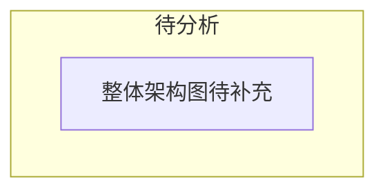

# OpenClaw — 架构概述

> **分析状态**: 待分析

<!-- 基于 _templates/source-analysis.md 模板，待研究时填充具体内容 -->

## 模块定位

OpenClaw 整体系统的架构鸟瞰，涵盖所有核心子系统及其关系。

## 整体架构图

## 核心子系统

<!-- 分析后填充 -->

## 技术栈

- **语言**: TypeScript (ESM)
- **运行时**: Node 22+ / Bun
- **包管理**: pnpm (monorepo)
- **测试**: Vitest
- **构建**: tsdown

## 引用此分析的认知问题

<!-- 被引用时补充链接 -->
