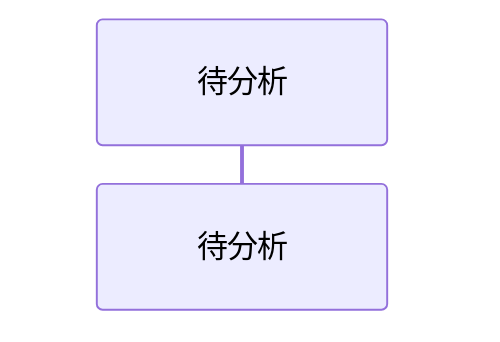

# OpenClaw — 数据流分析

> **分析状态**: 待分析

## 模块定位

核心场景下数据如何在各模块间流转，是理解系统运行时行为的关键。

## 场景一：用户发送消息到获得回复

```mermaid
sequenceDiagram
    participant 待分析
```

## 场景二：工具调用的完整生命周期

```mermaid
sequenceDiagram
    participant 待分析
```

## 场景三：多通道消息路由

```mermaid
sequenceDiagram
    participant 待分析
```

## 引用此分析的认知问题

<!-- 被引用时补充链接 -->
