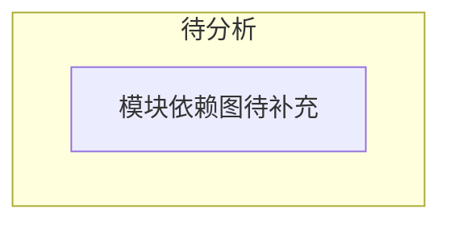

# OpenClaw — 模块地图

> **分析状态**: 待分析

## 模块定位

OpenClaw 源码 `src/` 下所有模块的职责概述与依赖关系图。

## 模块清单

<!-- 分析后填充，按职责分层 -->

### 核心层

| 模块 | 路径 | 职责 |
|------|------|------|
| — | — | — |

### 能力层

| 模块 | 路径 | 职责 |
|------|------|------|
| — | — | — |

### 接口层

| 模块 | 路径 | 职责 |
|------|------|------|
| — | — | — |

### 基础设施层

| 模块 | 路径 | 职责 |
|------|------|------|
| — | — | — |

## 依赖关系图

## 引用此分析的认知问题

<!-- 被引用时补充链接 -->
