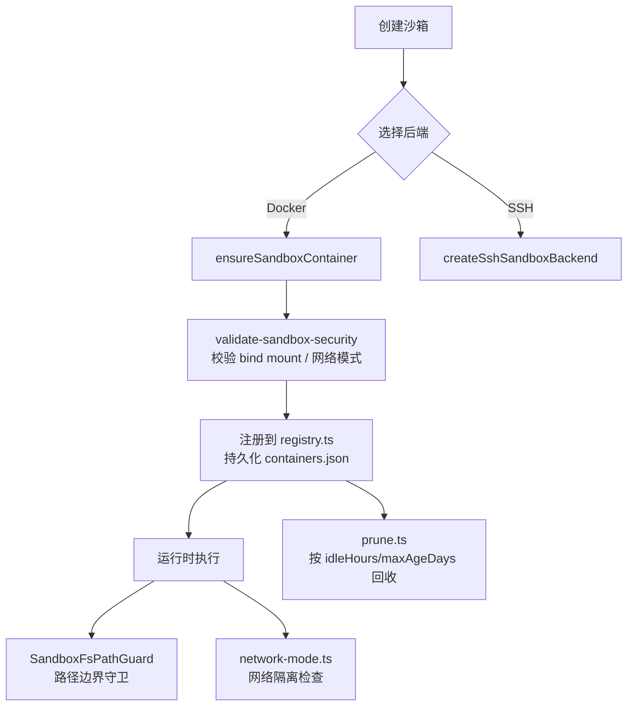
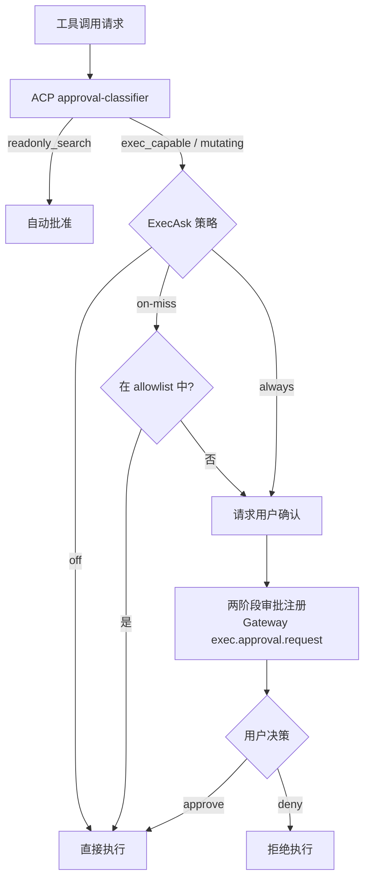
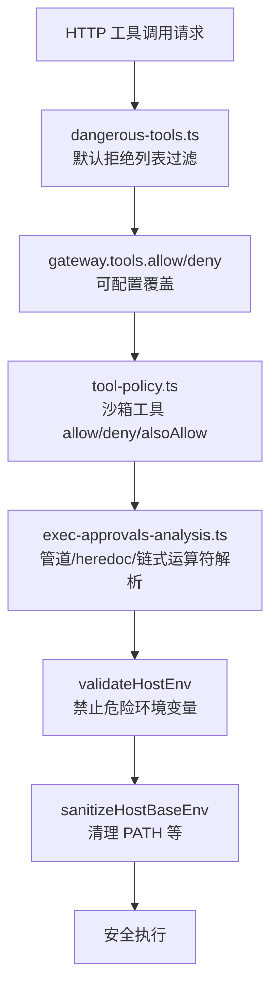

# OpenClaw 安全系统 — 源码解析

> **所属系统**: OpenClaw | **分析状态**: 已完成

## 模块定位

安全系统是 OpenClaw 的核心基础设施之一，负责在智能体拥有强大系统操作能力的前提下，通过多层防御机制确保操作安全。涵盖沙箱隔离、工具策略管线、执行审批、危险配置审计等子系统。

## 目录结构

```
src/
├── agents/sandbox/
│   ├── backend.ts               # 沙箱后端抽象与注册（Docker/SSH 可插拔）
│   ├── docker-backend.ts        # Docker 沙箱后端实现
│   ├── ssh-backend.ts           # SSH 远程沙箱后端
│   ├── constants.ts             # 默认工具 allow/deny 列表
│   ├── tool-policy.ts           # 沙箱内工具策略引擎
│   ├── registry.ts              # 容器注册表（containers.json 持久化）
│   ├── prune.ts                 # 容器生命周期回收
│   ├── manage.ts                # 容器管理操作
│   ├── fs-bridge-path-safety.ts # 文件系统路径边界守卫
│   ├── network-mode.ts          # 网络隔离策略
│   ├── validate-sandbox-security.ts  # 沙箱配置安全校验
│   └── remote-fs-bridge.ts      # 远程文件系统桥接
├── agents/bash-tools.exec-*.ts  # 执行审批与运行时安全
├── security/
│   ├── dangerous-tools.ts       # 危险工具默认拒绝列表
│   ├── dangerous-config-flags.ts # 危险配置标志收集
│   └── audit.ts                 # 安全审计报告
├── acp/
│   └── approval-classifier.ts   # ACP 工具分级与自动批准
├── gateway/
│   ├── tool-resolution.ts       # 网关工具过滤
│   └── security-path.ts         # HTTP 路径安全规范化
├── infra/
│   ├── exec-approvals.ts        # 执行权限模型定义
│   └── host-env-security.ts     # 主机环境变量安全策略
└── config/
    └── zod-schema.agent-runtime.ts  # dangerouslyAllow* 配置 schema
```

## 核心数据结构

### 执行安全模型

```typescript
// 执行安全级别
type ExecSecurity = "deny" | "allowlist" | "full";

// 执行确认策略
type ExecAsk = "off" | "on-miss" | "always";

// 执行主机类型
type ExecHost = "sandbox" | "gateway" | "node";
```

### 工具策略

```typescript
// 默认允许的工具
const DEFAULT_TOOL_ALLOW = [
  "exec", "process", "read", "write", "edit", "apply_patch", ...
];

// 默认拒绝的工具
const DEFAULT_TOOL_DENY = [
  "browser", "canvas", "nodes", "cron", "gateway", ...CHANNEL_IDS
];
```

### ACP 工具分级

```typescript
type AcpApprovalClass =
  | "readonly_search"    // 自动批准
  | "readonly_scoped"    // 工作区内读操作可自动批准
  | "exec_capable"       // 不自动批准
  | "control_plane"      // 不自动批准
  | "mutating"           // 不自动批准
  | "other"              // 不自动批准
  | "unknown";           // 不自动批准
```

## 核心流程

### 1. 沙箱隔离机制



**关键设计**：
- **可插拔后端**：通过 `registerSandboxBackend("docker" | "ssh", { factory, manager })` 注册，统一 `SandboxBackendHandle` 接口
- **配置期安全校验**：`validate-sandbox-security.ts` 在创建容器时拦截危险 bind mount（如 `/etc`、Docker socket）、危险网络模式（host / container namespace join）、缺失 seccomp/apparmor profile
- **运行时路径守卫**：`SandboxFsPathGuard` 确保所有文件操作路径落在已声明的 mount 范围内，越界即抛错
- **生命周期管理**：`registry.ts` 持久化注册表，`prune.ts` 按空闲时间和最大存活时间回收

### 2. 执行审批流程



**关键设计**：
- **两阶段防竞态**：先在 Gateway 服务端注册审批请求（获取 ID），再返回 `approval-pending` 状态，避免 `/approve` API 的竞态条件
- **ACP 分级**：`classifyAcpToolApproval` 交叉校验工具名 + meta + rawInput，降低标题伪装风险
- **ExecSecurity × ExecAsk 矩阵**：deny（完全禁止）、allowlist（白名单内放行）、full（全部放行）× off/on-miss/always 组合出完整策略空间

### 3. 工具调用安全管线



## 关键设计模式

### 1. 分层策略合并（Policy Merge）

Gateway HTTP 默认拒绝 → `gateway.tools.allow` 剔除 → `gateway.tools.deny` 追加 → 最终可用工具集。沙箱侧类似：`DEFAULT_TOOL_ALLOW/DENY` → per-agent `allow/deny/alsoAllow` → glob 匹配。策略来源可追踪（`SandboxToolPolicySource`）。

### 2. Fail-Closed 默认值

未声明安全属性的工具/操作按最危险处理。`DEFAULT_GATEWAY_HTTP_TOOL_DENY` 覆盖 exec、shell、fs 写删移、apply_patch 等高危工具。

### 3. 环境变量硬约束

`validateHostEnv` 禁止 `LD_PRELOAD`、`LD_LIBRARY_PATH` 等可用于二进制劫持的环境变量，`PATH` 自定义也被禁止。这是防止通过环境变量注入恶意二进制的关键防线。

### 4. 危险配置可观测性

`collectEnabledInsecureOrDangerousFlags` 收集所有 `dangerously*` 配置项，在启动日志中警告，用于可观测性而非静默允许。这是"break-glass"模式的配套设施。

## 外部依赖

- **Docker Engine**：沙箱容器运行时
- **SSH**：远程沙箱后端
- **Gateway**：审批请求注册与决策分发

## 值得关注的细节

1. **无 E2B 集成**：当前代码库中未发现 E2B SDK，沙箱抽象为自研可插拔架构
2. **网络模式拦截**：`host` 网络和 `container:<name>` 命名空间共享被默认拦截
3. **HTTP 路径安全**：`security-path.ts` 做多轮 URL 解码，缓解路径遍历与编码绕过
4. **Shell 解析深度**：`exec-approvals-analysis.ts` 对管道、heredoc、链式运算符有大量解析逻辑（`DISALLOWED_PIPELINE_TOKENS`），非简单正则匹配
5. **插件安全导出**：`plugin-sdk/security-runtime.ts` 让插件复用核心安全策略

## 安全模型总评

| 维度 | 评价 |
|------|------|
| **沙箱隔离** | ✅ Docker/SSH 可插拔；配置期 + 运行时双重校验 |
| **权限控制** | ✅ ExecSecurity × ExecAsk 矩阵；ACP 分级；两阶段审批 |
| **工具安全** | ✅ 默认拒绝高危工具；多层策略合并；shell 深度解析 |
| **配置安全** | ✅ break-glass 标志收集 + 启动告警 + 安全审计 |
| **不足** | ⚠️ 非沙箱模式安全保障有限；权限粒度仅到工具级 |

## 引用此分析的认知问题

- [05-安全模型](../../insights/05-security-model/_overview.md)
