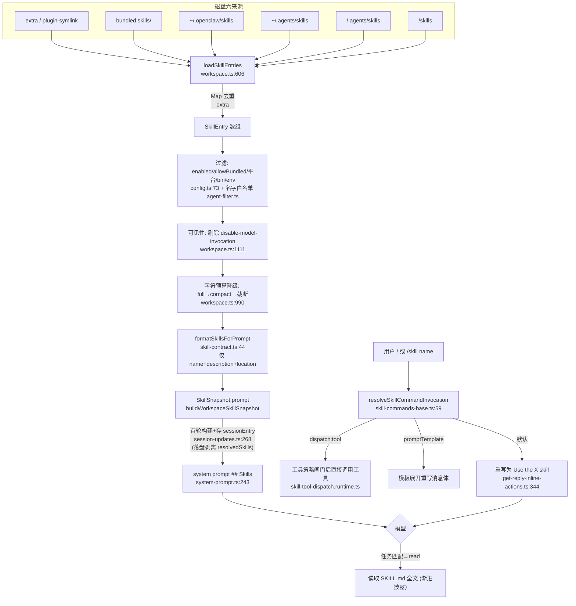

# OpenClaw Skill(技能)子系统实现级调研

> 源码 v2026.5.25 / 2026-05-25
> 唯一事实来源：`E:\Dev\longxia\_refs\openclaw-main`（pi-* 依赖已是 `@earendil-works`）。
> 本文只调研 OpenClaw 现状，不含知行自身的设计建议。每条论断尽量落到 `file:line`。
> 凡是没在源码 100% 核到的，文中明确标 **[未在源码确认]**。事实与评价分节标注。

---

## 1. 模块定位

OpenClaw 的 skill 是一种「**磁盘上的 SKILL.md + 同目录附属文件**」格式的可触发工作流。其核心机制（结论先行）：

- 技能**不把全文塞进上下文**。系统提示里只注入一段紧凑索引 `<available_skills>`（每条仅 `name` + `description` + `location` 三字段），并附一句指令让模型「任务匹配时用 read 工具读取该 SKILL.md 全文」。这是典型的**渐进披露 / 按需读取**。见 `skill-contract.ts:44` 的 `formatSkillsForPrompt` 与 `system-prompt.ts:243` 的 `buildSkillsSection`。
- 技能从**六个目录来源**聚合（不是之前存疑的「五层」），有明确优先级，按 `skill.name` 去重，高优先级覆盖低优先级。见 `workspace.ts:901`。
- 技能进上下文走「**快照（snapshot）**」机制：首轮构建一次 prompt 文本 + 轻量目录，持久化进 session entry，后续轮直接复用；只有版本号变化（文件变更被 chokidar 监听到、或过滤器变化）才重建。全文 `SKILL.md`（`resolvedSkills`）只在运行进程内当缓存，**落盘时被剥离**。见 `refresh-state.ts`、`session-updates.ts:262`、`store-load.ts:319`。

---

## 2. 目录与文件地图

### 2.1 核心库 `src/agents/skills/`（按职责分组）

| 文件 | 职责 |
| --- | --- |
| `skill-contract.ts` | 规范 Skill 类型（继承 pi `CanonicalSkill`）、`SourceScope`、**`formatSkillsForPrompt`（进上下文的 XML 索引格式）** |
| `types.ts` | OpenClaw 扩展元数据、`SkillEntry`、`SkillSnapshot`、`SkillCommandSpec`、`SkillExposure`、`SkillInvocationPolicy` 等类型 |
| `source.ts` | 把多种内部 source 字符串归一成 `bundled / workspace / unknown` 三类遥测标签 |
| `frontmatter.ts` | 解析 frontmatter；抽 `metadata.openclaw` 块（install/requires/os/always 等）；解析 `user-invocable` / `disable-model-invocation` |
| `local-loader.ts` | 安全读单个技能目录的 `SKILL.md`（边界校验、大小限制） |
| `workspace.ts` | **聚合中枢**：六来源发现、去重、过滤、压缩、构建 prompt 与 snapshot、sandbox 同步 |
| `bundled-dir.ts` / `bundled-context.ts` | 解析与缓存内置 `skills/` 目录位置 |
| `plugin-skills.ts` | 把已激活插件声明的技能目录 symlink 到 `~/.openclaw/plugin-skills/` |
| `refresh.ts` / `refresh-state.ts` | chokidar 文件监听 + 全局/按 workspace 的快照版本号 |
| `snapshot-hydration.ts` | 把落盘 snapshot 缺失的 `resolvedSkills` 重新水合 |
| `serialize.ts` | 按 key 串行化（sandbox 同步用） |
| `compact-format.test.ts` | **注意：没有 `compact-format.ts` 文件**，紧凑格式逻辑在 `workspace.ts:968`（`formatSkillsCompact`） |
| `filter.ts` / `agent-filter.ts` | 技能名白名单过滤（per-agent / defaults）；注意：**不是语义筛选**，只是名字 allowlist + 字符预算压缩 |
| `config.ts` | 技能可见性裁决（enabled、allowBundled、平台/bin/env/config 运行时资格） |
| `command-specs.ts` | 把可见技能转成 `/<skill>` slash 命令规格 + 合并 Claude bundle 命令 |
| `env-overrides.ts` | 把 `skills.entries.<key>.env / apiKey` 注入 `process.env`（带危险变量黑名单与回滚） |
| `tools-dir.ts` / `runtime-config.ts` / `gh-config-discovery.ts` | 技能工具目录解析 / 运行时 config 快照 / gh CLI 配置发现（与技能弱相关的辅助） |

### 2.2 进上下文 / 运行时
- `src/agents/system-prompt.ts:243` `buildSkillsSection` —— 实际把索引注入 system prompt 的地方。
- `src/agents/pi-embedded-runner/run/attempt.ts:1294` —— 运行时取 prompt（`resolveSkillsPromptForRun`）并装进 system prompt。
- `src/agents/pi-embedded-runner/skills-runtime.ts` —— 决定是否需要重新加载技能条目。
- `src/agents/cli-runner/claude-skills-plugin.ts` —— **兼容原生 Claude Code 插件格式**：把选中的技能物化成临时 `--plugin-dir`（含 `.claude-plugin/plugin.json`，`skills: "./skills"`）。

### 2.3 触发 / 命令
- `src/auto-reply/skill-commands.ts` / `skill-commands-base.ts` / `skill-commands.runtime.ts`
- `src/auto-reply/reply/skill-tool-dispatch.runtime.ts`（`command-dispatch: tool` 的策略闸门）
- `src/auto-reply/reply/get-reply-inline-actions.ts:265`（解析并执行 `/skill`）

### 2.4 分发 / 安装
- `src/agents/skills-install.ts`（安装技能声明的**外部依赖/工具**，非技能本体）
- `src/agents/skills-archive-install.ts`（归档 → workspace `skills/`）
- `src/agents/skills-clawhub.ts` + `src/infra/clawhub.ts`（远程 hub）
- `src/agents/skills-source-install.ts`（本地路径 / git 安装）
- `src/gateway/server-methods/skills-upload-store.ts`（网关上传 zip）

### 2.5 安全 / 治理
- `src/security/skill-scanner.ts`（静态启发式代码扫描）
- `src/plugins/install-security-scan.runtime.ts:1332`（安装时调用扫描、裁决 block/warn）
- `src/security/audit-workspace-skills.ts`（workspace symlink 逃逸审计）
- `src/agents/skills-status.ts` + `src/commands/doctor-skills*.ts`（状态/可用性报告与一键禁用）

### 2.6 内置技能样例 `skills/`（顶层）
~60 个目录（`canvas`、`github`、`slack`、`skill-creator` 等），每个含 `SKILL.md`。`pyproject.toml` 也在该目录下。

---

## 3. 七个维度逐节

### 维度 1：磁盘格式

**目录布局**：每个技能是一个目录，目录内必须有 `SKILL.md`（大小写在归档安装时放宽到 `SKILL.md/skill.md/skills.md/SKILL.MD`，见 `skills-archive-install.ts:15`；本地发现严格用 `SKILL.md`，见 `local-loader.ts:41`）。`skill-creator` 推荐的目录约定：`scripts/`（脚本）、`references/`（按需文档）、`assets/`（资源）、`agents/`（UI 元数据），见 `skills/skill-creator/SKILL.md:22`。

**frontmatter schema**：YAML frontmatter（`---` 包裹）。解析器 `src/markdown/frontmatter.ts:195` `parseFrontmatterBlock`：同时跑「YAML 解析」和「逐行解析」再合并；对象类型值（如 `metadata`）会被 `JSON.stringify` 成字符串存进扁平 map（`frontmatter.ts:42-51`），后续再二次解析。

必需字段（缺一即丢弃该技能）：`name`、`description`，见 `local-loader.ts:59-63`（`name` 缺省回退到目录名）。

OpenClaw 识别的字段：
- `name`, `description`（必需）
- `user-invocable`（默认 true）、`disable-model-invocation`（默认 false）—— `frontmatter.ts:209-219`
- `command-dispatch` / `command-tool` / `command-arg-mode`（让 `/<skill>` 直接派发成某个工具调用）—— `command-specs.ts:120-155`
- `metadata.openclaw.{ always, skillKey, primaryEnv, emoji, homepage, os, requires{bins,anyBins,env,config}, install[] }` —— 类型见 `types.ts:19-33`，解析见 `frontmatter.ts:187-207`
- `install[]` 每项 `kind: brew|node|go|uv|download`，外加 formula/package/module/url/archive 等，并做严格正则白名单校验（防命令注入），见 `frontmatter.ts:112-185`

真实样例 `skills/canvas/SKILL.md:1-5`：
```yaml
---
name: canvas
description: "Present HTML on connected OpenClaw node canvases, navigate/eval/snapshot, and debug canvas host URLs."
metadata: { "openclaw": { "emoji": "🖼️" } }
---
```

**source / scope 维度**：`skill-contract.ts:3` 定义 `SourceScope = "user" | "project" | "temporary"`、`SourceOrigin = "package" | "top-level"`。本地加载的技能默认 `scope: "project", origin: "top-level"`（`local-loader.ts:75-80`）。`scope/origin` 来自上游 pi 的 `SourceInfo` 结构，OpenClaw 自己更看重内部 `source` 字符串（如 `openclaw-bundled`/`openclaw-workspace`/`agents-skills-project` 等），用于优先级与遥测归类（`source.ts:21-37`）。
**[未在源码确认]** `scope`/`origin` 在 OpenClaw 业务逻辑里几乎没被实际分支使用（仅透传），优先级判断走的是 `source` 字符串而非 `scope`。

---

### 维度 2：发现与加载

**六个来源 + 优先级**（彻底核实，结论在 `workspace.ts:844-919`）。`loadSkillEntries` 把六类目录各自加载成记录，然后按下面顺序写进一个 `Map<skill.name, record>`，**后写覆盖先写**，所以越靠后优先级越高：

```
extra(extraDirs + 插件 symlink)  <  bundled  <  managed  <  agents-personal  <  agents-project  <  workspace
```
对应代码 `workspace.ts:901-919`（注释原文：`Precedence: extra < bundled < managed < agents-skills-personal < agents-skills-project < workspace`）。

各来源路径（`workspace.ts:844-898`）：
| 优先级（低→高） | source 标签 | 路径 |
| --- | --- | --- |
| 1 | `openclaw-extra` | `config.skills.load.extraDirs[]` + 插件技能 symlink 集中目录 `~/.openclaw/plugin-skills/` |
| 2 | `openclaw-bundled` | 内置 `skills/`（`resolveBundledSkillsDir`，可被 `OPENCLAW_BUNDLED_SKILLS_DIR` 覆盖） |
| 3 | `openclaw-managed` | `~/.openclaw/skills/`（`CONFIG_DIR/skills`） |
| 4 | `agents-skills-personal` | `~/.agents/skills/` |
| 5 | `agents-skills-project` | `<workspace>/.agents/skills/` |
| 6 | `openclaw-workspace` | `<workspace>/skills/` |

发现细节：
- 每个 root 先看自身是否就是技能目录（root 下直接有 `SKILL.md`），否则扫描直接子目录；子目录若无 `SKILL.md` 再向下探一层（支持 `coze/koze-retrieval/SKILL.md` 这种分组），见 `workspace.ts:740-828`。也支持 `root/skills/*/SKILL.md` 的嵌套根（`resolveNestedSkillsRoot`，`workspace.ts:340-367`）。
- 配额上限（防爆扫）：每 root 候选目录 300、每 source 加载 200、SKILL.md 单文件 256KB，见 `workspace.ts:138-142`。

**加载校验**：`local-loader.ts` 用 `openRootFileSync`（boundary-file-read）做根目录边界读取，校验 realpath 在 root 内、限制字节数；`workspace.ts` 还做大量符号链接逃逸防护（见维度 7）。

**缓存 / 快照机制**（关键）：
- 版本号在内存里维护：`refresh-state.ts` 有全局 `globalVersion` 和 `Map<workspaceDir, version>`。chokidar 监听各技能目录（`refresh.ts:128`，`depth:2`，250ms 去抖），文件 add/change/unlink 时 `bumpSkillsSnapshotVersion`（`refresh.ts:154`）。
- `SkillSnapshot`（`types.ts:101`）= `{ prompt, skills[{name,primaryEnv,requiredEnv}], skillFilter?, resolvedSkills?, version? }`。`prompt` 是已渲染的 `<available_skills>` 文本，`skills` 是轻量目录，`resolvedSkills` 才是含 `SKILL.md` 全文的重量级数组。
- 首轮：`session-updates.ts:268-313` 构建 snapshot 存进 `sessionEntry.skillsSnapshot`。后续轮：`shouldRefreshSnapshotForVersion`（`refresh-state.ts:65`）+ `matchesSkillFilter` 决定是否重建，否则复用并 `hydrateResolvedSkills` 补回运行期全文。
- **落盘剥离**：`store-load.ts:319` `stripPersistedSkillsCache` 在保存 session 时把 `resolvedSkills` 删掉（注释：持久化会膨胀且过期）。重载后由 `snapshot-hydration.ts` 重新水合。
- cron 隔离 agent 走 `src/cron/isolated-agent/skills-snapshot.ts`（同样的版本号 + 过滤器比对逻辑）。

---

### 维度 3：怎么进上下文（最关键，确切结论）

**结论：只塞紧凑索引（name + description + location），不塞全文；用到时让模型用 read 工具读 SKILL.md 全文（渐进披露）。注入点是 system prompt，不是 message。**

**索引格式**（`skill-contract.ts:44-64` `formatSkillsForPrompt`，逐技能只输出三字段）：
```
The following skills provide specialized instructions for specific tasks.
Use the read tool to load a skill's file when the task matches its description.
When a skill file references a relative path, resolve it against the skill directory ... use that absolute path ...

<available_skills>
  <skill>
    <name>...</name>
    <description>...</description>
    <location>...</location>   # SKILL.md 的绝对路径，home 前缀会被压成 ~/ 省 token
  </skill>
</available_skills>
```

**注入点**（`system-prompt.ts:243-257` `buildSkillsSection`），这段以 `## Skills` 标题拼进 system prompt（`system-prompt.ts:1107` `...skillsSection`）：
```
## Skills
Scan <available_skills>. If one clearly applies, read its SKILL.md at exact <location> with `read`, then follow it.
If several apply, choose the most specific. If none clearly apply, read none.
One skill up front max. Never guess/fabricate skill paths.
External API writes: batch when safe, avoid tight loops, respect 429/Retry-After.
<available_skills>...（上面那段索引）...
```

**`agent-filter.ts` / `filter.ts` 是不是语义筛选/压缩？不是。**
- `filter.ts` / `agent-filter.ts`：只做**技能名白名单**过滤（per-agent `agents.list[].skills` 或 `agents.defaults.skills`；`undefined`=不限制、`[]`=全禁），见 `agent-filter.ts:24-36`、`workspace.ts:123-134`。没有任何语义/向量匹配。
- 「压缩」是**字符预算降级**，不是语义压缩：`workspace.ts:990-1040` `applySkillsPromptLimits`。先按 `maxSkillsInPrompt`（默认 150）截条数；若全格式超 `maxSkillsPromptChars`（默认 18000 字符）→ 降级为 `formatSkillsCompact`（`workspace.ts:968`，**去掉 description，只留 name+location**）；仍超则二分查找能塞下的最大前缀并截断。截断/降级时 prompt 顶部加 `⚠️ Skills truncated...` 提示（`workspace.ts:1126`）。

**有没有"渐进披露/按需读取全文"机制？有，而且是核心设计。** 全文不进 prompt，模型靠 `read` 工具按 `<location>` 自取。`resolvedSkills`（全文）只用于 `claude-skills-plugin.ts` 这种需要把技能物化到磁盘给子后端的场景，以及运行期缓存，不直接进对话上下文。

`disable-model-invocation: true` 的技能会从 `<available_skills>` 索引中剔除（`workspace.ts:105-113` `isSkillVisibleInAvailableSkillsPrompt` + `workspace.ts:1111`），但仍可作为 `/<skill>` 用户命令存在。

---

### 维度 4：触发与调用

**两条触发路径，都不是「让模型主动调用技能」的标准工具，而是命令重写 / 直接派发。**

**(a) 进上下文索引（被动）**：模型在 system prompt 里看到 `<available_skills>`，自行判断并 `read` 全文（见维度 3）。这是模型「主动用技能」的唯一常规途径——**没有专门的 `use_skill` 工具**。

**(b) `/<skill>` 用户 slash 命令**：
- `command-specs.ts:61` `buildWorkspaceSkillCommandSpecs` 把每个 `user-invocable` 的可见技能转成命令规格：名字 sanitize 成 `[a-z0-9_]`、≤32 字符、去重、避开保留命令名（`command-specs.ts:34-59`、`skill-commands-base.ts:8`）。还会合并 Claude bundle 命令（`command-specs.ts:166`）。
- 解析：`skill-commands-base.ts:59` `resolveSkillCommandInvocation` 支持 `/skill <name> [args]` 和直接 `/<name> [args]` 两种写法。
- 执行（`get-reply-inline-actions.ts:272-356`）有三种模式：
  1. **`command-dispatch: tool`**：直接调用某个工具（`dispatch.toolName`），原样转发 args。先经 `skill-tool-dispatch.runtime.ts` 的完整工具策略闸门（allow/deny/group/sandbox/subagent），找到工具后用合成 `toolCallId` 执行。
  2. **`promptTemplate`**（Claude bundle 命令）：用模板展开 args 重写消息体。
  3. **默认**：把用户消息体重写为 `Use the "<skillName>" skill for this request.\n\nUser input:\n<args>`（`get-reply-inline-actions.ts:344-355`）——本质是引导模型走 (a) 的索引+read 路径。

**`command-specs.ts` 的作用**：是「技能 → 可执行命令」的唯一映射层，给聊天命令系统、native slash 注册、遥测都提供 `SkillCommandSpec` 列表。

---

### 维度 5：分发与安装

四条来源，**先区分两件事**：`skills-install.ts` 的 `installSkill` 安装的是**技能声明的外部依赖/工具**（brew/node/go/uv/download），而 `skills-archive/clawhub/source-install` 安装的是**技能本体目录**到 workspace 的 `skills/`。

| 来源 | 入口 | 流程要点 |
| --- | --- | --- |
| **bundled（内置）** | `bundled-dir.ts` | 随发行版打包在 `skills/`；不"安装"，发现即用；可被 `OPENCLAW_BUNDLED_SKILLS_DIR` 覆盖 |
| **远程 hub（ClawHub）** | `skills-clawhub.ts:335` `installSkillFromClawHub` | search → fetch detail → 下载归档 → 解压（`withExtractedArchiveRoot`）→ `installExtractedSkillRoot`（**`scan:false`**，clawhub 默认不扫，`skills-clawhub.ts:239`）→ 写 `.clawhub/origin.json` + workspace `.clawhub/lock.json` 记录版本，支持 `update` |
| **归档（archive）** | `skills-archive-install.ts:193` `installSkillArchiveFromPath` | 校验 slug、必须含 `SKILL.md`、目标在 workspace `skills/<slug>` 内（`resolveSafeInstallDir` 防穿越）；`scan` 视调用方传参 |
| **本地路径 / git（source）** | `skills-source-install.ts:379` `installSkillFromSource` | `git:` → 浅克隆/按 ref detach checkout/记 commit → 导出（剔 `.git`）→ 安装；`./ ../ ~/ /abs` → 直接拷贝。**source 安装始终 `scan` 开启**（`skills-source-install.ts:217`）。写 `.openclaw/source-origin.json` |

安装外部依赖（`skills-install.ts:460` `installSkill`）：找到技能 → 选 install spec → **先扫描技能源目录**（`scanSkillInstallSource`，见维度 7）→ 非 bundled/managed/extra 来源加 WARNING → 按 `kind` 跑 brew/node/go/uv/download。安装偏好（preferBrew、nodeManager）见 `skills-status.ts:69` 的选择链。

---

### 维度 6：进化 / 治理

**有没有"自主创建/迭代技能"的闭环？没有。**（对比 hermes 的后台复盘）

- 全仓没有「后台自动生成/修订 SKILL.md」的闭环。grep `writeFile.*SKILL.md / createSkill / generateSkill / self.improv / reflect.*skill` 只命中测试、插件元数据拷贝、网关上传 store，**没有自治生成逻辑**。
- 唯一与「创建技能」相关的是**内置技能 `skill-creator`**（`skills/skill-creator/SKILL.md`），它是给模型读的**人工编写指南**（讲 SKILL.md 该怎么写、目录怎么分），由用户/模型在会话里手动驱动，不是后台 cron 复盘。
- 技能写入磁盘的途径都是显式安装（维度 5）或网关上传（`skills-upload-store.ts`），没有 agent 自发产出技能并落盘的路径。

**使用追踪 / 状态治理**：
- `skills-status.ts:267` `buildWorkspaceSkillStatus` 产出每个技能的 `eligible / modelVisible / userInvocable / commandVisible / disabled / blockedByAllowlist / blockedByAgentFilter / missing(requirements) / install[]` 等。这是「可用性/资格」报告，**不是调用次数统计**。
- `doctor-skills-core.ts:4` `collectUnavailableAgentSkills` + `disableUnavailableSkillsInConfig`：把缺依赖（不可用但未被禁/未被过滤）的技能一键写成 `skills.entries.<key>.enabled=false`。配套 `commands/doctor-skills.ts`、`onboard-skills.ts`。
- 没找到「skill 调用频次/最近使用时间」之类的运行时使用计数。**[未在源码确认]** 不存在 per-skill usage telemetry（仅有 `skillSource` 三值遥测标签 `source.ts:21`）。

---

### 维度 7：安全

**(a) 静态代码扫描 `skill-scanner.ts`**（扫技能源目录里的 `.js/.ts/.mjs/...` 文件，`skill-scanner.ts:45`）。规则（`skill-scanner.ts:161-221`）：
- `critical`：`child_process` 的 exec/spawn 系列（`dangerous-exec`）、`eval`/`new Function`（`dynamic-code-execution`）、挖矿特征 `stratum+tcp/coinhive/xmrig`（`crypto-mining`）、`process.env` + 8 行内有网络发送的**凭证外泄**（`env-harvesting`）。
- `warn`：读文件 + 网络发送的**数据外泄**（`potential-exfiltration`）、hex/大 base64 解码的**混淆**（`obfuscated-code`）、连非标准端口的 WebSocket（`suspicious-network`）。
- 扫描前会剥离注释/字符串以降误报（`stripCommentsForHeuristics`，`skill-scanner.ts:248`），有文件/目录 mtime 缓存，单文件默认 1MB 上限、最多 500 文件。

**block 还是 warn？只有 `critical` 才 block，`warn` 不阻断。** 裁决在 `install-security-scan.runtime.ts:952` `buildBlockedScanResult`：`builtinScan.critical > 0` 才返回 `blocked`（`code: security_scan_blocked`）；扫描本身出错也 block（`security_scan_failed`）。`--dangerously-force-unsafe-install` 或受信官方安装可绕过（仅记 WARNING）。调用链：`skills-install.ts:480/491`（依赖安装时）、`skills-archive-install.ts:157-171`（归档/source 安装时，clawhub 关扫）。还会经 `runBeforeInstallHook` 给插件钩子二次否决（`install-security-scan.runtime.ts:1363`）。

**(b) workspace 逃逸防护**：
- 发现期：`workspace.ts` 大量 `resolveContainedSkillPath` / `warnEscapedSkillPath`（`workspace.ts:248-338`）——技能 realpath 必须落在配置 root 内（或显式 `allowSymlinkTargets`），否则丢弃并告警，区分 `symlink-escape / bundled-root-escape / path-escape`。bundled 来源对 symlink 逃逸尤其敏感。
- 审计期：`audit-workspace-skills.ts:111` `collectWorkspaceSkillSymlinkEscapeFindings`——BFS 扫 `<workspace>/skills/**/SKILL.md`，realpath 逃出 workspace root 的报 `skills.workspace.symlink_escape`（severity `warn`），扫描超预算报 `scan_truncated`。**这是审计告警，不阻断运行**。
- 插件技能 symlink 发布也校验目标在插件 root 内（`plugin-skills.ts:98/180`）。

**(c) env 注入防护**（`env-overrides.ts`）：技能可通过 `skills.entries.<key>.env/apiKey` 注入环境变量，但：危险变量名（`isDangerousHostEnvVarName`、`OPENSSL_CONF` 等）**始终拉黑**（`env-overrides.ts:84-96`）；只有声明的 `primaryEnv`/`requires.env` 才允许注入敏感 key；外部已设置的同名变量不覆盖；运行结束有 reverter 回滚。ACP 子进程会剥离技能注入的 key 防泄漏（`env-overrides.ts:24-35`，对应 issue #36280）。

---

## 4. 关键数据流：一条技能从磁盘到进上下文 / 被调用



文字版主路径：六来源目录 → `loadSkillEntries` 加载+边界校验 → `Map<name>` 去重并按优先级覆盖 → 资格过滤（config）+ 名字白名单（agent-filter）→ 剔除 `disable-model-invocation` → 字符预算降级 → `formatSkillsForPrompt` 渲染成 `<available_skills>` 索引 → 包进 `SkillSnapshot.prompt` 首轮缓存进 session → `buildSkillsSection` 拼进 system prompt → 模型按需 `read` SKILL.md 全文。用户侧 `/<skill>` 经命令解析后走「直接派发工具 / 模板重写 / 默认重写消息体」三选一。

---

## 5. 设计评价（事实与评价分开标注）

**[事实]**
- 上下文策略是「索引 + 按需 read 全文」的渐进披露，索引每条只占三字段，再叠加条数上限、字符预算降级（含丢 description 的 compact 模式与二分截断）。
- 来源是六层 Map 覆盖式优先级（workspace 最高、extra/plugin 最低），按 `skill.name` 去重。
- 快照机制把「渲染后的 prompt + 轻量目录」缓存进 session 并落盘（剥离全文），靠 chokidar 版本号 + 过滤器比对决定重建。
- 没有语义检索：筛选只有名字白名单 + 运行时资格（平台/bin/env/config）。
- 没有技能自治进化闭环；`skill-creator` 是人工编写指南型内置技能。
- 安全：安装时静态扫描，仅 critical 阻断；发现期+审计期双重 symlink 逃逸防护；env 注入有黑名单与回滚。
- 兼容原生 Claude Code 插件格式（`claude-skills-plugin.ts` 物化成 `.claude-plugin/plugin.json` 的临时 plugin-dir）。

**[评价]**
- 「索引进上下文、全文按需 read」是把上下文成本与技能数量解耦的务实做法，代价是多一次工具往返、且依赖模型自觉只读最相关的一个（prompt 里明确写了「One skill up front max」）。
- 压缩是「机械字符预算」而非「相关性排序」，技能多到超预算时是按名字排序后截断/丢 description，而非按任务相关度保留——在大量技能场景下索引质量会线性退化。
- 六来源 + 多重 symlink 防护 + 安装扫描，体现出明显的「不信任 workspace/远程技能」的威胁模型；但 clawhub 安装默认 `scan:false` 与 source/archive 默认开扫不一致，**[评价]** 是一个值得注意的信任假设差异。
- 治理偏「资格/可用性」（doctor 一键禁用缺依赖技能），缺少运行期使用度量，难以做基于使用数据的技能淘汰/排序。

---

## 附：靠推断 / 未 100% 确认清单（供抽验）

1. **维度 1 / scope·origin 实际用途**：`SourceScope`/`SourceOrigin` 在 OpenClaw 业务里基本只透传，优先级判断走内部 `source` 字符串而非 scope。结论基于「`workspace.ts:901` 优先级用 source 字符串」+ 未见 scope 分支，但未穷尽 pi 上游对 scope 的消费。**[未在源码确认]**
2. **维度 6 / 无使用频次遥测**：基于 grep 未见 per-skill usage counter，且 `skills-status.ts` 只报资格。属「未发现」推断，非穷尽证明。**[未在源码确认]**
3. **维度 6 / 无自治进化闭环**：基于关键词 grep + `skill-creator` 内容判断，未发现后台生成技能的逻辑；但「自治」可能以其它命名存在，未做全量人工通读。**[未在源码确认（基于针对性搜索）]**
4. **`compact-format.ts` 文件不存在**：调研任务清单列了该文件，实际仓库中 `src/agents/skills/` 只有 `compact-format.test.ts`，紧凑格式实现在 `workspace.ts:968`。已确认文件清单，但「逻辑等价于一个独立 compact-format」是我的归并表述。
5. **`installSkill` 的语义边界**：判断「`skills-install.ts` 安装的是外部依赖而非技能本体」基于 `installSkill` 按 `metadata.install[].kind` 跑包管理器（`skills-install.ts:523+`）+ 技能本体安装在 archive/source/clawhub 模块。逻辑自洽但未跑通端到端。

---

## 附：关键文件清单（供抽查，均为 file:line）

1. `src/agents/skills/skill-contract.ts:44` —— `formatSkillsForPrompt`，进上下文的 XML 索引（仅 name/description/location）。
2. `src/agents/system-prompt.ts:243` —— `buildSkillsSection`，把索引注入 system prompt 的 `## Skills` 段 + read 指令。
3. `src/agents/skills/workspace.ts:901` —— 六来源优先级覆盖顺序（彻底解决「五层」存疑）。
4. `src/agents/skills/workspace.ts:990` —— `applySkillsPromptLimits`，字符预算降级（full→compact→二分截断）。
5. `src/agents/skills/workspace.ts:968` —— `formatSkillsCompact`，丢 description 的紧凑索引。
6. `src/agents/skills/refresh-state.ts:38` —— 快照版本号 bump/比对（缓存失效核心）。
7. `src/config/sessions/store-load.ts:319` —— `stripPersistedSkillsCache`，落盘剥离 `resolvedSkills` 全文。
8. `src/auto-reply/reply/get-reply-inline-actions.ts:272` —— `/<skill>` 三种执行模式（tool dispatch / template / 默认重写）。
9. `src/agents/skills/frontmatter.ts:209` —— `user-invocable` / `disable-model-invocation` 解析。
10. `src/security/skill-scanner.ts:161` —— 静态扫描规则（critical/warn 列表）。
11. `src/plugins/install-security-scan.runtime.ts:952` —— `buildBlockedScanResult`，仅 critical 阻断。
12. `src/agents/cli-runner/claude-skills-plugin.ts:78` —— 兼容原生 Claude 插件格式（物化 `.claude-plugin/plugin.json`）。
